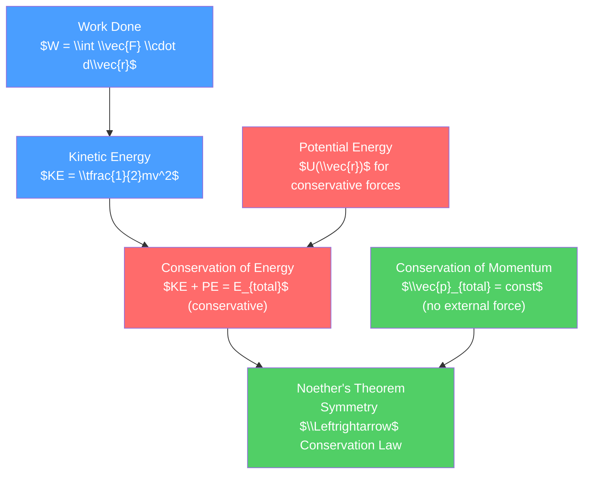

# ⚡ Work, Energy, and Conservation Laws

> [!abstract] TL;DR
> The work-energy theorem ($W_{net} = \Delta KE$) and conservation of energy are among the most powerful tools in physics — they let you answer "how fast?" without knowing the details of the trajectory. At the deepest level, Noether's theorem reveals that every conservation law is a reflection of an underlying symmetry of nature: energy conservation follows from time-translation symmetry, momentum from spatial-translation symmetry, and angular momentum from rotational symmetry.

## Intuition — analogy FIRST

Think of a roller coaster. The coaster climbs slowly to the top of the first hill — the motor does work to lift it, storing energy as gravitational potential energy. At the peak, all that energy sits there, waiting. As the coaster plunges down, potential energy converts to kinetic energy — speed increases. If the track were frictionless, the coaster would reach exactly the same height on every subsequent hill. Friction bleeds energy into heat, so the coaster can never quite reach the original height again.

This is conservation of energy: energy cannot be created or destroyed, only transformed between forms. The work the motor did at the start became the kinetic energy at the bottom of every drop.

---

## How It Works



---

## Key Concepts / Details

### Secondary Level

**Work-Energy Theorem**

Work done by the net force on an object equals its change in kinetic energy:

$$W_{net} = \Delta KE = \tfrac{1}{2}mv_f^2 - \tfrac{1}{2}mv_i^2$$

Work by a constant force: $W = Fd\cos\theta$ (only the component along displacement counts).

**Types of Energy**:
- Kinetic energy: $KE = \tfrac{1}{2}mv^2$
- Gravitational potential energy: $U_g = mgh$
- Elastic potential energy: $U_s = \tfrac{1}{2}kx^2$

**Conservation of Mechanical Energy** (no friction/air resistance):

$$E_{mech} = KE + PE = \text{constant}$$

**Momentum and Impulse**:
- Momentum: $\vec{p} = m\vec{v}$
- Impulse-momentum theorem: $\vec{J} = \vec{F}_{avg}\Delta t = \Delta\vec{p}$
- Conservation of momentum: if $\vec{F}_{ext} = 0$, then $\vec{p}_{total} = $ constant.

**Collisions**:

| Type | $\vec{p}$ conserved? | KE conserved? | Example |
|------|---------------------|---------------|---------|
| Elastic | Yes | Yes | Billiard balls (ideal) |
| Inelastic | Yes | No | Clay hitting wall |
| Perfectly inelastic | Yes | No (maximum loss) | Objects stick together |

### Undergraduate Level

**Work as a Line Integral**

For a variable force along a curved path:

$$W = \int_C \vec{F} \cdot d\vec{r} = \int_{t_1}^{t_2} \vec{F} \cdot \vec{v}\, dt$$

**Conservative vs Non-Conservative Forces**

A force is *conservative* if the work done is path-independent, equivalently:
1. $\oint_C \vec{F} \cdot d\vec{r} = 0$ for any closed path $C$
2. $\vec{F} = -\nabla U$ for some scalar potential $U(\vec{r})$
3. $\nabla \times \vec{F} = 0$

Examples: gravity, electrostatic force, spring force (conservative); friction, air drag (non-conservative).

**Energy conservation in differential form**: for conservative systems,

$$\frac{d}{dt}\left[\frac{1}{2}mv^2 + U(\vec{r})\right] = 0$$

**Center of Mass**

For a system of $N$ particles:
$$\vec{R}_{cm} = \frac{\sum_i m_i \vec{r}_i}{\sum_i m_i}, \qquad M\vec{a}_{cm} = \vec{F}_{ext}$$

The center of mass moves as if all external forces act on a single particle of mass $M$.

**Kinetic Energy Decomposition**:
$$KE_{total} = \tfrac{1}{2}MV_{cm}^2 + \sum_i \tfrac{1}{2}m_i v_i'^2$$
(CM kinetic energy + kinetic energy in CM frame)

**Elastic Collision in CM Frame**: in the center of mass frame, elastic collision just reverses all velocities. Using this, for a 1D elastic collision between $m_1$ (initial speed $v_1$) and $m_2$ (at rest):

$$v_1' = \frac{m_1 - m_2}{m_1 + m_2}v_1, \qquad v_2' = \frac{2m_1}{m_1 + m_2}v_1$$

### Graduate Level

**Noether's Theorem**

Emmy Noether's theorem (1915) is arguably the most profound result in theoretical physics:

> Every continuous symmetry of the action corresponds to a conserved quantity.

| Symmetry | Conservation Law |
|----------|-----------------|
| Time translation invariance ($t \to t + \epsilon$) | Energy |
| Spatial translation invariance ($\vec{r} \to \vec{r} + \vec{\epsilon}$) | Linear momentum |
| Rotational invariance ($\vec{r} \to R\vec{r}$) | Angular momentum |
| Phase invariance ($\psi \to e^{i\alpha}\psi$) | Electric charge (in quantum field theory) |

Formal statement: if the action $S = \int L\, dt$ is invariant under a one-parameter transformation $q_i \to q_i + \epsilon \delta q_i$, then the Noether charge:

$$Q = \sum_i \frac{\partial L}{\partial \dot{q}_i}\delta q_i$$

is conserved: $\dot{Q} = 0$.

**Virial Theorem**

For a bound system in a time-averaged steady state:

$$\langle T \rangle = -\tfrac{1}{2}\sum_i \langle \vec{F}_i \cdot \vec{r}_i \rangle$$

For a power-law potential $U \propto r^n$:
$$\langle T \rangle = \tfrac{n}{2}\langle U \rangle$$

Applications: gravitational systems ($n = -1$): $\langle T \rangle = -\tfrac{1}{2}\langle U \rangle$, so total energy $\langle E \rangle = -\langle T \rangle < 0$ (bound state). Used in stellar dynamics, cluster mass estimation, and plasma physics.

**Collision Cross-Sections**

For quantum/classical scattering, the differential cross-section:

$$\frac{d\sigma}{d\Omega} = \left|\frac{b}{\sin\theta}\frac{db}{d\theta}\right|$$

For Coulomb (Rutherford) scattering of an alpha particle off a nucleus:

$$\frac{d\sigma}{d\Omega} = \left(\frac{Z_1 Z_2 e^2}{4E}\right)^2 \frac{1}{\sin^4(\theta/2)}$$

This formula, experimentally confirmed by Geiger and Marsden (1911), proved the nuclear atom model.

```python
import numpy as np
import matplotlib.pyplot as plt

# Elastic collision: track KE vs time for spring collision simulation
m1, m2 = 1.0, 3.0  # kg
v1i, v2i = 4.0, 0.0  # m/s initial
k = 100.0  # spring constant N/m
dt = 1e-4  # time step
x1, x2 = 0.0, 1.0  # initial positions
v1, v2 = v1i, v2i
times, KE_total, PE_total = [], [], []

for _ in range(300000):
    gap = x2 - x1 - 1.0  # equilibrium separation = 1 m
    F = k * min(0, gap)   # spring force only when compressed
    v1 += F / m1 * dt
    v2 -= F / m2 * dt
    x1 += v1 * dt
    x2 += v2 * dt
    times.append(_ * dt)
    KE_total.append(0.5 * m1 * v1**2 + 0.5 * m2 * v2**2)
    PE_total.append(0.5 * k * min(0, gap)**2)

times = np.array(times)
KE_total = np.array(KE_total)
PE_total = np.array(PE_total)
# Final velocities from analytic formula
v1f = (m1 - m2) / (m1 + m2) * v1i
v2f = 2 * m1 / (m1 + m2) * v1i
print(f"Analytic: v1f={v1f:.3f}, v2f={v2f:.3f} m/s")
print(f"Numeric:  v1f={v1:.3f}, v2f={v2:.3f} m/s")
```

---

## Real-World Notes

- **Hydroelectric power**: gravitational PE of elevated water converts to KE as it falls, then to electrical energy in turbines. The conversion chain is energy conservation in action.
- **Car crashes and crumple zones**: perfectly inelastic collision analysis. Crumple zones increase collision duration, reducing peak force ($J = F_{avg}\Delta t = \Delta p$).
- **Rocket propulsion**: conservation of momentum. The rocket equation $\Delta v = v_e \ln(m_0/m_f)$ (Tsiolkovsky) comes entirely from momentum conservation.
- **Dark matter evidence**: galaxy rotation curves and cluster dynamics use the virial theorem to infer much more mass than visible matter can account for.
- **Noether in particle physics**: charge conservation (electromagnetic), baryon number, and lepton number conservation all arise from symmetries via Noether's theorem.

---

## Common Pitfalls

1. **Non-conservative forces and "conservation of energy"**: total energy (including heat from friction) is always conserved, but *mechanical* energy is not when friction acts. Be precise about which energy is conserved.
2. **Work done by normal force**: the normal force from a frictionless surface does no work because it is always perpendicular to displacement. A common source of sign errors.
3. **Potential energy is relative**: only *changes* in PE are physical. The absolute value of $U$ depends on the reference point chosen.
4. **Impulse vs force**: large forces over short times (hammer blows, explosions) are best analyzed via impulse-momentum rather than $F = ma$.
5. **Virial theorem requires time averaging**: it applies to time-averaged quantities in a bound system, not instantaneous values.

---

## Related Concepts

- [[_MOC_Classical_Mechanics|↑ Section MOC]]
- [[Newtons_Laws_and_Kinematics]] — the foundation from which work and energy emerge
- [[Rotational_Dynamics]] — angular momentum conservation is the rotational analog
- [[Lagrangian_Mechanics]] — where Noether's theorem is proved formally
- [[Oscillations_and_SHM]] — energy oscillates between kinetic and potential in SHM
- [[Classical_Statistical_Mechanics]] — energy and phase space volume connect to statistical mechanics

---

## Review Questions

1. **Secondary**: A 5 kg ball rolls off a 20 m cliff. What is its speed just before hitting the ground? (No air resistance, $g = 10$ m/s².)
2. **Undergraduate**: Using conservation laws alone (no equations of motion), derive the final velocities after a 1D elastic collision between a mass $m_1$ moving at $v_0$ and a stationary mass $m_2$.
3. **Graduate**: State and prove Noether's theorem for a Lagrangian system. Explicitly derive the conserved charge corresponding to translational invariance, and identify it as linear momentum.

---

## Sources

- Goldstein, Poole & Safko — *Classical Mechanics*, 3rd ed., Ch. 1–2
- Morin — *Introduction to Classical Mechanics*, Ch. 5–6
- Noether, E. (1918) — "Invariante Variationsprobleme" (*Invariant Variation Problems*)
- Landau & Lifshitz — *Mechanics*, §6–9

#physics #classical-mechanics #work #energy #conservation #NoethersTheorem #secondary #undergraduate #graduate
