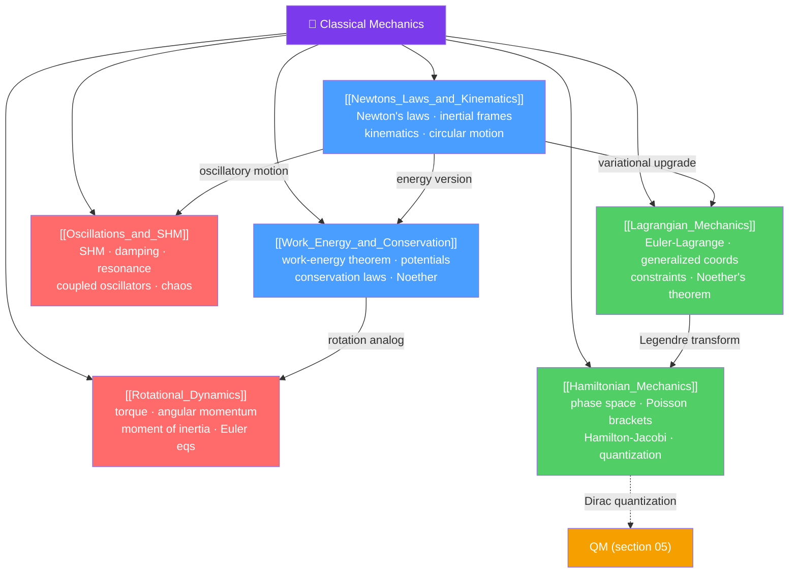

# 🔵 Classical Mechanics — Map of Content

> [!abstract] What This Section Covers
> Classical mechanics is the physics of motion for objects much larger than atoms and moving much slower than light. It spans Newton's laws through the sophisticated variational formulations of Lagrange and Hamilton that underpin quantum mechanics, field theory, and much of modern theoretical physics. This section runs from the intuitive (F = ma, projectile motion) through the powerful (conservation laws, symmetry and Noether's theorem) to the beautiful (phase space geometry, Hamilton-Jacobi theory, symplectic structure). Every topic opens at secondary level and deepens to PhD-level formalism.

## Concept Map

## Learning Path

1. [[Newtons_Laws_and_Kinematics]] — Newton's three laws, kinematics equations, projectile motion, circular motion, and non-inertial frames.
2. [[Work_Energy_and_Conservation]] — Work-energy theorem, conservative forces, conservation of energy and momentum, and Noether's theorem.
3. [[Rotational_Dynamics]] — Torque, angular momentum, moment of inertia, rolling motion, gyroscopes, and Euler's equations for rigid bodies.
4. [[Oscillations_and_SHM]] — Simple harmonic oscillator, damping, resonance, coupled oscillators, and an introduction to chaos.
5. [[Lagrangian_Mechanics]] — D'Alembert's principle, Euler-Lagrange equations, generalized coordinates, constraints, and Noether's theorem derivation.
6. [[Hamiltonian_Mechanics]] — Phase space, Hamilton's equations, Liouville's theorem, Poisson brackets, and the Hamilton-Jacobi equation.

## All Notes at a Glance

| Note | Difficulty | What You'll Learn |
|------|------------|-------------------|
| [[Newtons_Laws_and_Kinematics]] | Secondary → Graduate | Newton's laws, kinematics, non-inertial frames, Galilean relativity, connection to Lagrangian formulation |
| [[Work_Energy_and_Conservation]] | Secondary → PhD | Work-energy theorem, conservative forces, Noether's theorem, virial theorem, collision cross-sections |
| [[Rotational_Dynamics]] | Secondary → PhD | Torque, angular momentum, moment of inertia, Euler's equations, inertia tensor, nutation |
| [[Oscillations_and_SHM]] | Secondary → PhD | SHM, damping, resonance, Q factor, coupled oscillators, nonlinear dynamics, chaos |
| [[Lagrangian_Mechanics]] | Undergraduate → PhD | Euler-Lagrange equations, generalized coordinates, constraints, Noether's theorem, field theory preview |
| [[Hamiltonian_Mechanics]] | Undergraduate → PhD | Phase space, Liouville's theorem, canonical transformations, Hamilton-Jacobi, quantization connection |

## Key Questions This Section Answers

- Why does $F = ma$ break down in a rotating reference frame, and how do pseudo-forces fix the equations?
- What is the deepest reason energy is conserved — what symmetry of nature guarantees it?
- How do you set up equations of motion for a double pendulum without ever drawing a free-body diagram?
- What does it mean that phase space volume is conserved, and why does it matter for statistical mechanics?
- How does the Poisson bracket $\{q, p\} = 1$ become the commutator $[\hat{Q}, \hat{P}] = i\hbar$ in quantum mechanics?
- What is the Hamilton-Jacobi equation, and how does it encode classical mechanics as a wave equation?

## Related Sections

- [[_MOC_Physics_Master|↑ Physics Master MOC]]
- [[_MOC_Electromagnetism|→ Electromagnetism]] — E&M fields as a Lagrangian/Hamiltonian field theory
- [[_MOC_Thermodynamics|→ Thermodynamics & Stat Mech]] — Phase space and Liouville's theorem feed directly into statistical mechanics
- [[_MOC_Quantum_Mechanics|→ Quantum Mechanics]] — Hamiltonian mechanics is the direct parent of quantum mechanics

## Key References

- Goldstein, Poole & Safko — *Classical Mechanics* (3rd ed.) — the graduate standard
- Landau & Lifshitz — *Mechanics* (Course of Theoretical Physics Vol. 1) — elegant and terse
- Morin — *Introduction to Classical Mechanics* — excellent for problem-solving
- Taylor — *Classical Mechanics* — undergraduate favorite for clarity

#MOC #Physics #ClassicalMechanics
