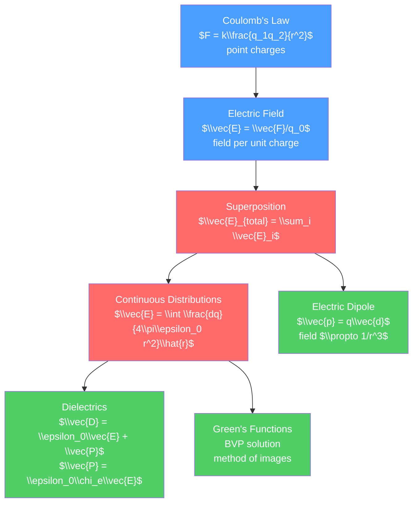

# 🔵 Electric Fields and Coulomb's Law

> [!abstract] TL;DR
> Coulomb's law gives the force between two point charges: $F = kq_1q_2/r^2$, analogous to Newton's gravity but repulsive for like charges. The electric field $\vec{E}$ is the force per unit charge that a test charge would experience, and by the superposition principle the field from many charges is just their sum. At the graduate level, continuous charge distributions are handled via Green's functions, the method of images solves bounded geometries elegantly, and dielectrics require the displacement field $\vec{D}$ and susceptibility $\chi_e$ to describe polarizable media.

## Intuition — analogy FIRST

Two magnets attract or repel each other without touching — a force acting at a distance through empty space. Electrically charged objects do the same thing: a comb rubbed through hair picks up small bits of paper, a balloon rubbed on a jumper sticks to a wall. The electric force between charges follows the same inverse-square law as gravity, but with a crucial difference: like charges repel and unlike attract.

The "field" concept is Michael Faraday's great insight: rather than action at a distance, every charge creates a field in the space around it, and other charges respond to the field they find themselves in. Field lines stream outward from positive charges and inward to negative charges, their density showing field strength.

---

## How It Works



---

## Key Concepts / Details

### Secondary Level

**Coulomb's Law**

The force between two point charges $q_1$ and $q_2$ separated by distance $r$:

$$F = k\frac{|q_1||q_2|}{r^2} = \frac{1}{4\pi\epsilon_0}\frac{|q_1||q_2|}{r^2}$$

where $k = 8.99 \times 10^9$ N·m²/C², $\epsilon_0 = 8.85 \times 10^{-12}$ C²/(N·m²) is the permittivity of free space.

Direction: along the line joining the charges. Like charges repel, opposite charges attract.

**Electric Field**

The electric field $\vec{E}$ at a point is the force per unit positive test charge:

$$\vec{E} = \frac{\vec{F}}{q_0}, \qquad |\vec{E}| = \frac{kq}{r^2}$$

Units: N/C = V/m.

**Field Lines**: start from positive charges, end at negative. Density shows field strength. Field lines never cross.

**Superposition Principle**: the total electric field from multiple charges is the vector sum of individual fields:

$$\vec{E}_{total} = \vec{E}_1 + \vec{E}_2 + \cdots$$

### Undergraduate Level

**Electric Field from Continuous Distributions**

For a charge density $\rho(\vec{r}')$:

$$\vec{E}(\vec{r}) = \frac{1}{4\pi\epsilon_0}\int \frac{\rho(\vec{r}')(\vec{r}-\vec{r}')}{|\vec{r}-\vec{r}'|^3}\, d^3r'$$

Key examples:
- Infinite line charge (linear density $\lambda$): $E = \lambda/(2\pi\epsilon_0 r)$, radially outward
- Infinite plane (surface density $\sigma$): $E = \sigma/(2\epsilon_0)$, perpendicular to plane (both sides)
- Uniformly charged sphere (outside): $E = Q/(4\pi\epsilon_0 r^2)$ (same as point charge)
- Uniformly charged sphere (inside): $E = Qr/(4\pi\epsilon_0 R^3)$, grows linearly

**Electric Dipole**

Two opposite charges $\pm q$ separated by distance $d$: dipole moment $\vec{p} = q\vec{d}$ (pointing from $-q$ to $+q$).

Far-field (dipole approximation, $r \gg d$): field falls as $1/r^3$.

$$\vec{E} = \frac{1}{4\pi\epsilon_0}\frac{1}{r^3}\left[3(\vec{p}\cdot\hat{r})\hat{r} - \vec{p}\right]$$

Torque on dipole in external field: $\vec{\tau} = \vec{p} \times \vec{E}$.

Potential energy: $U = -\vec{p}\cdot\vec{E}$.

**Multipole Expansion**

For a localized charge distribution, expand the potential in powers of $1/r$:

$$V(r) = \frac{1}{4\pi\epsilon_0}\left[\frac{Q}{r} + \frac{\vec{p}\cdot\hat{r}}{r^2} + \frac{1}{2}\sum_{ij}Q_{ij}\frac{\hat{r}_i\hat{r}_j}{r^3} + \cdots\right]$$

where $Q$ is total charge, $\vec{p}$ is dipole moment, $Q_{ij}$ is the quadrupole tensor. Each term falls off faster with distance.

### Graduate Level

**Green's Functions for Electrostatics**

Poisson's equation (see [[Gauss_Law_and_Electric_Potential]]): $\nabla^2 V = -\rho/\epsilon_0$.

The Green's function $G(\vec{r}, \vec{r}')$ satisfies $\nabla^2 G = -\delta^3(\vec{r}-\vec{r}')$. For free space:

$$G(\vec{r}, \vec{r}') = \frac{1}{4\pi|\vec{r}-\vec{r}'|}$$

Then:
$$V(\vec{r}) = \frac{1}{\epsilon_0}\int G(\vec{r},\vec{r}')\rho(\vec{r}')\,d^3r' + \text{boundary terms}$$

**Method of Images**

An elegant technique for problems with conducting planes or spheres. Replace the conductor with image charges placed outside the region of interest so the boundary condition ($V = $ const on the conductor) is satisfied.

Example: point charge $+q$ at height $d$ above a grounded infinite conducting plane.
- Image charge: $-q$ at $-d$ (mirror image below the plane)
- Force on $q$: attractive, $F = q^2/(4\pi\epsilon_0(2d)^2)$ — the image force
- The induced surface charge density: $\sigma = -qd/(2\pi(r^2 + d^2)^{3/2})$

**Dielectrics: Polarization and Displacement Field**

In a dielectric material, an applied field induces dipole moments in the medium. Polarization $\vec{P}$ = dipole moment per unit volume.

For linear isotropic dielectrics: $\vec{P} = \epsilon_0\chi_e\vec{E}$, where $\chi_e$ is the electric susceptibility.

Displacement field: $\vec{D} = \epsilon_0\vec{E} + \vec{P} = \epsilon_0(1+\chi_e)\vec{E} = \epsilon\vec{E}$ where $\epsilon = \epsilon_r\epsilon_0$.

Boundary conditions at a dielectric interface:
- Normal: $D_{1n} - D_{2n} = \sigma_f$ (free surface charge)
- Tangential: $E_{1t} = E_{2t}$

Capacitance is increased by a factor of $\epsilon_r$ when a dielectric fills a capacitor: $C = \epsilon_r C_0$.

**Capacitance from Energy**

The energy stored in the electric field:

$$U_E = \frac{\epsilon_0}{2}\int E^2\,d^3r = \frac{1}{2}CV^2$$

For a parallel plate capacitor: $U = \epsilon_0 E^2 \cdot Ad/2$ where $Ad$ is the volume between the plates.

```python
import numpy as np
import matplotlib.pyplot as plt

# Electric field from a dipole in 2D
def dipole_field(x, y, p=1.0, eps0=1.0):
    """E field of a dipole at origin, p pointing in +y direction"""
    r = np.sqrt(x**2 + y**2)
    r5 = r**5 + 1e-10  # avoid division by zero
    # Dipole in y-direction: p_x=0, p_y=p
    # E = (1/4pi eps0) [3(p.r_hat)r_hat - p] / r^3
    r_hat_x = x / (r + 1e-10)
    r_hat_y = y / (r + 1e-10)
    p_dot_r = p * r_hat_y  # p is in y direction
    Ex = (3 * p_dot_r * r_hat_x - 0) / r**3
    Ey = (3 * p_dot_r * r_hat_y - p) / r**3
    return Ex / (4 * np.pi * eps0), Ey / (4 * np.pi * eps0)

xg = np.linspace(-3, 3, 30)
yg = np.linspace(-3, 3, 30)
X, Y = np.meshgrid(xg, yg)
Ex, Ey = dipole_field(X, Y)
magnitude = np.sqrt(Ex**2 + Ey**2)

fig, ax = plt.subplots(figsize=(6, 6))
ax.streamplot(xg, yg, Ex, Ey, density=1.5, color=np.log(magnitude+0.01),
              cmap='plasma', linewidth=1)
ax.plot(0, 0.2, 'ro', ms=10, label='+q')
ax.plot(0, -0.2, 'bo', ms=10, label='-q')
ax.set_xlim(-3, 3); ax.set_ylim(-3, 3)
ax.set_aspect('equal')
ax.set_title('Electric Dipole Field Lines')
ax.legend()
plt.tight_layout()
```

---

## Real-World Notes

- **Atomic structure**: electron clouds in atoms are modeled as continuous charge distributions. The 1/r² electric field holds all atoms together.
- **Capacitors**: parallel plate, spherical, and cylindrical capacitors are continuous distribution problems. Capacitors store energy in electric fields ($U = CV^2/2$).
- **Van der Waals forces**: at the molecular level, induced-dipole–induced-dipole interactions (London dispersion) arise from multipole expansions of charge distributions.
- **Lightning rods**: the method of images predicts enhanced field near sharp conducting tips (charge accumulates at tips of conductors), explaining why lightning preferentially strikes tall metal rods.
- **Electroencephalography (EEG)**: the brain's electrical activity is modeled as an array of dipole sources; the inverse problem (inferring source locations from surface potentials) is solved using Green's functions.

---

## Common Pitfalls

1. **Coulomb's law for point charges only**: for extended charge distributions, you must integrate. The $1/r^2$ dependence only holds for the field of a point charge.
2. **Field inside a conductor is zero**: free charges in conductors redistribute to cancel all internal fields in equilibrium. This is the basis of Faraday cages and explains why the field inside a uniformly charged spherical shell is zero.
3. **Superposition requires vector addition**: add field components separately ($E_x$, $E_y$, $E_z$), not magnitudes.
4. **Sign convention for dipole moment**: $\vec{p}$ points from negative to positive charge (physics convention). Some chemistry texts use the opposite convention.
5. **Dielectric constant vs permittivity**: $\epsilon_r$ (relative permittivity or dielectric constant) is dimensionless; $\epsilon = \epsilon_r\epsilon_0$ has units of F/m. Water: $\epsilon_r \approx 80$.

---

## Related Concepts

- [[_MOC_Electromagnetism|↑ Section MOC]]
- [[Gauss_Law_and_Electric_Potential]] — more powerful approach using symmetry and potential
- [[Magnetism_and_Biot_Savart]] — magnetic analog: Biot-Savart for magnetism
- [[Maxwells_Equations]] — unification of all electric and magnetic phenomena

---

## Review Questions

1. **Secondary**: Three point charges are arranged as follows: $+3\,\mu$C at the origin, $-1\,\mu$C at (1 m, 0), and $+2\,\mu$C at (0, 1 m). Find the electric field at (1 m, 1 m).
2. **Undergraduate**: Calculate the electric field on the axis of a uniformly charged disk of radius $R$ and surface charge density $\sigma$. Show that at large distances it reduces to the point-charge result, and at the surface of an infinite plane it gives $\sigma/(2\epsilon_0)$.
3. **Graduate**: A point charge $+q$ is placed at distance $d$ from a grounded conducting sphere of radius $a < d$. Using the method of images, find the image charge and its location. Compute the induced surface charge density on the sphere and verify the total induced charge equals the image charge.

---

## Sources

- Griffiths — *Introduction to Electrodynamics*, 4th ed., Ch. 2–4
- Jackson — *Classical Electrodynamics*, 3rd ed., Ch. 1–3
- Purcell & Morin — *Electricity and Magnetism*, 3rd ed., Ch. 1–2

#physics #electromagnetism #CoulombsLaw #electricField #dipole #dielectrics #secondary #undergraduate #graduate
