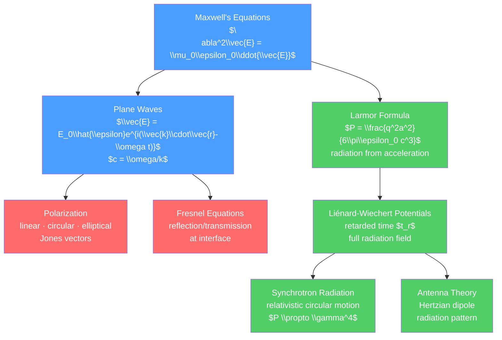

# 🌊 Electromagnetic Waves and Radiation

> [!abstract] TL;DR
> Maxwell's equations predict electromagnetic waves — self-sustaining oscillations of $\vec{E}$ and $\vec{B}$ propagating at $c = 3\times10^8$ m/s through vacuum. Plane waves, polarization, and the Fresnel equations for reflection/refraction at interfaces are the undergraduate toolkit. At the graduate level, accelerating charges radiate (Larmor formula: $P = q^2a^2/(6\pi\epsilon_0 c^3)$), retarded potentials (Jefimenko/Liénard-Wiechert) give the full radiation field, and synchrotron radiation is the workhorse of modern X-ray science.

## Intuition — analogy FIRST

Drop a stone in a still pond. Ripples spread outward, each ring expanding at the water wave speed. Shake an electric charge back and forth: ripples in the electromagnetic field spread outward at the speed of light. These are radio waves (slow shake), infrared (faster), visible light (even faster oscillation), X-rays (very fast). The "shaking" is acceleration — the key insight of the Larmor formula: only accelerating charges radiate EM energy.

A stationary charge has a static electric field. A charge moving at constant velocity has both electric and magnetic fields but doesn't radiate (its fields just move with it). Start accelerating the charge, and the kink in the field lines that propagates outward at $c$ is electromagnetic radiation.

---

## How It Works



---

## Key Concepts / Details

### Undergraduate Level

**Plane Wave Solutions**

In free space, the wave equation $\nabla^2\vec{E} = (1/c^2)\partial^2\vec{E}/\partial t^2$ has plane wave solutions:

$$\vec{E} = \vec{E}_0 e^{i(\vec{k}\cdot\vec{r}-\omega t)}, \qquad \vec{B} = \frac{1}{\omega}\vec{k}\times\vec{E} = \frac{\hat{k}}{c}\times\vec{E}$$

Key relations: $\omega = ck$ (dispersion relation in vacuum), $|\vec{B}| = |\vec{E}|/c$.

$\vec{E}$, $\vec{B}$, and $\hat{k}$ are mutually perpendicular. In a medium with refractive index $n$: $c \to c/n$, $k \to nk_0$.

**Electromagnetic Spectrum**

| Type | Frequency | Wavelength | Photon Energy |
|------|-----------|-----------|---------------|
| Radio | 3 Hz – 3 GHz | 100 mm – 100 Mm | $<10^{-5}$ eV |
| Microwave | 3–300 GHz | 1 mm – 100 mm | $10^{-5}$–$10^{-3}$ eV |
| Infrared | 300 GHz – 430 THz | 700 nm – 1 mm | $10^{-3}$–1.7 eV |
| Visible | 430–770 THz | 390–700 nm | 1.7–3.2 eV |
| Ultraviolet | 770 THz – 30 PHz | 10–390 nm | 3–120 eV |
| X-rays | 30 PHz – 30 EHz | 0.01–10 nm | 120 eV – 120 keV |
| Gamma rays | $>30$ EHz | $<0.01$ nm | $>120$ keV |

**Polarization**

The polarization of a plane wave describes the orientation of $\vec{E}$:

- **Linear**: $\vec{E}$ oscillates in a fixed plane
- **Circular**: $\vec{E}$ rotates in a circle (R or L-hand)
- **Elliptical**: most general case (superposition of two linear waves with phase difference)

**Intensity**: time-averaged Poynting vector $\langle S\rangle = \frac{1}{2}\epsilon_0 c E_0^2 = \frac{E_0^2}{2\mu_0 c}$.

**Reflection and Refraction: Fresnel Equations**

At an interface between two media ($n_1$, $n_2$), the reflection and transmission coefficients depend on polarization and angle:

For s-polarization ($\vec{E}\perp$ plane of incidence):
$$r_s = \frac{n_1\cos\theta_i - n_2\cos\theta_t}{n_1\cos\theta_i + n_2\cos\theta_t}, \quad t_s = \frac{2n_1\cos\theta_i}{n_1\cos\theta_i + n_2\cos\theta_t}$$

For p-polarization ($\vec{E}\parallel$ plane of incidence):
$$r_p = \frac{n_2\cos\theta_i - n_1\cos\theta_t}{n_2\cos\theta_i + n_1\cos\theta_t}, \quad t_p = \frac{2n_1\cos\theta_i}{n_2\cos\theta_i + n_1\cos\theta_t}$$

Snell's law: $n_1\sin\theta_i = n_2\sin\theta_t$

Brewster's angle: $r_p = 0$ when $\tan\theta_B = n_2/n_1$ — only s-polarization is reflected.

**Waveguides**

In a hollow metallic waveguide with boundary condition $E_\parallel = 0$ at the walls, only discrete modes (TE and TM) propagate. Cutoff frequency: $\omega_{mn} = c\pi\sqrt{(m/a)^2 + (n/b)^2}$ for a rectangular waveguide of dimensions $a\times b$.

### Graduate Level

**Radiation from Accelerating Charges: Larmor Formula**

A charge $q$ accelerating at $\vec{a}$ radiates power:

$$P = \frac{q^2 a^2}{6\pi\epsilon_0 c^3} = \frac{q^2 a^2}{6\pi\epsilon_0 c^3} \quad \text{(SI)}$$

Or in Gaussian units: $P = \frac{2q^2a^2}{3c^3}$.

The radiated power is proportional to $q^2$ (hence why electrons radiate much more than protons for the same acceleration) and $a^2$.

**Retarded Potentials (Jefimenko's Equations)**

For a moving charge, signals travel at finite speed $c$. The fields at time $t$ and position $\vec{r}$ depend on the charge's state at the *retarded time* $t_r = t - |\vec{r}-\vec{r}_{source}(t_r)|/c$.

The retarded potentials:
$$V(\vec{r},t) = \frac{1}{4\pi\epsilon_0}\int\frac{\rho(\vec{r}',t_r)}{|\vec{r}-\vec{r}'|}\,d^3r'$$
$$\vec{A}(\vec{r},t) = \frac{\mu_0}{4\pi}\int\frac{\vec{J}(\vec{r}',t_r)}{|\vec{r}-\vec{r}'|}\,d^3r'$$

Jefimenko's equations express $\vec{E}$ and $\vec{B}$ directly in terms of retarded sources.

**Liénard-Wiechert Potentials (Point Charge)**

For a point charge $q$ at position $\vec{r}_s(t)$ moving with velocity $\vec{v}_s$:

$$V = \frac{q}{4\pi\epsilon_0}\frac{1}{(1-\hat{n}\cdot\vec{\beta})\mathcal{R}}\bigg|_{t_r}$$
$$\vec{A} = \frac{V}{c^2}\vec{v}_s$$

where $\vec{\beta} = \vec{v}_s/c$, $\mathcal{R} = |\vec{r}-\vec{r}_s(t_r)|$, and $\hat{n} = (\vec{r}-\vec{r}_s)/\mathcal{R}$.

The fields split into a velocity field (Coulomb-like, falls as $1/r^2$) and a radiation field (falls as $1/r$, carries energy to infinity):

$$\vec{E}_{rad} = \frac{q}{4\pi\epsilon_0}\frac{\hat{n}\times\left[(\hat{n}-\vec{\beta})\times\dot{\vec{\beta}}\right]}{(1-\hat{n}\cdot\vec{\beta})^3 \mathcal{R} c}$$

**Synchrotron Radiation**

A relativistic electron ($\gamma \gg 1$) moving in a circular orbit emits synchrotron radiation. The relativistic generalization of the Larmor formula:

$$P = \frac{q^2 c}{6\pi\epsilon_0}\frac{\gamma^4 v^4}{R^2 c^4} \propto \gamma^4$$

The radiation is concentrated in a narrow cone of half-angle $\theta \approx 1/\gamma$ in the forward direction (relativistic beaming). The characteristic frequency:

$$\omega_c = \frac{3}{2}\gamma^3\frac{c}{R}$$

Synchrotron light sources (like ESRF in France, Diamond in UK) use GeV-scale electron storage rings to produce X-rays with brightness $10^{10}$ times greater than lab X-ray tubes.

**Antenna Theory: Hertzian Dipole**

An oscillating electric dipole $\vec{p}(t) = p_0\hat{z}\cos\omega t$ radiates. Far-field (radiation zone, $r \gg \lambda$):

$$\vec{E}_{rad} = \frac{\mu_0 p_0\omega^2}{4\pi c}\frac{\sin\theta}{r}\cos\omega(t-r/c)\,\hat{\theta}$$

Radiation pattern: $dP/d\Omega \propto \sin^2\theta$ — a donut-shaped pattern. Total radiated power:

$$P = \frac{\mu_0\omega^4 p_0^2}{12\pi c}$$

This is the electric dipole radiation formula. It scales as $\omega^4 \propto \lambda^{-4}$ — the same as Rayleigh scattering, explaining why the sky is blue (short-wavelength blue light scatters more than red).

```python
import numpy as np
import matplotlib.pyplot as plt

# Radiation pattern of a Hertzian dipole
theta = np.linspace(0, 2 * np.pi, 300)
r_pattern = np.sin(theta)**2  # radiation pattern

fig, ax = plt.subplots(subplot_kw={'projection': 'polar'}, figsize=(6, 6))
ax.plot(theta, r_pattern, lw=2, color='red')
ax.fill(theta, r_pattern, alpha=0.2, color='red')
ax.set_title('Hertzian Dipole Radiation Pattern\n$dP/d\\Omega \\propto \\sin^2\\theta$',
             pad=15, fontsize=11)
ax.set_rticks([0.2, 0.4, 0.6, 0.8, 1.0])

# Also show Fresnel equations
fig2, axes2 = plt.subplots(1, 2, figsize=(10, 4))
theta_i = np.linspace(0, np.pi/2, 200)
n1, n2 = 1.0, 1.5  # air to glass
theta_t = np.arcsin(n1 / n2 * np.sin(theta_i))

rs = (n1*np.cos(theta_i) - n2*np.cos(theta_t)) / (n1*np.cos(theta_i) + n2*np.cos(theta_t))
rp = (n2*np.cos(theta_i) - n1*np.cos(theta_t)) / (n2*np.cos(theta_i) + n1*np.cos(theta_t))
theta_B = np.degrees(np.arctan(n2/n1))

axes2[0].plot(np.degrees(theta_i), rs**2, label='$R_s$', lw=2)
axes2[0].plot(np.degrees(theta_i), rp**2, label='$R_p$', lw=2)
axes2[0].axvline(theta_B, color='g', linestyle='--', label=f"Brewster's {theta_B:.1f}°")
axes2[0].set_xlabel('Angle of incidence (°)')
axes2[0].set_ylabel('Reflectance R')
axes2[0].set_title('Fresnel Reflectance (air → glass, n=1.5)')
axes2[0].legend()
axes2[0].set_ylim(0, 1)
plt.tight_layout()
```

---

## Real-World Notes

- **Radio and TV broadcasting**: radio waves are generated by oscillating currents in antennas (Hertzian dipoles in concept). AM radio ~500 kHz–1600 kHz, FM ~87–108 MHz.
- **Mobile phones**: electromagnetic waves at microwave frequencies (0.7–6 GHz for 5G). Safety limits are based on specific absorption rate (SAR) using Larmor-derived power deposition.
- **Synchrotron X-ray facilities**: third-generation storage rings (ESRF, APS, Spring-8) use synchrotron radiation for protein crystallography, material science, and medical imaging.
- **Cherenkov radiation**: a charged particle moving through a medium faster than $c/n$ (speed of light in medium) emits a cone of blue light — the optical analog of a sonic boom. Used in particle detectors.
- **Free-electron laser (FEL)**: electrons wiggled by an "undulator" magnetic structure emit coherent synchrotron radiation — the world's brightest X-ray source (peak brightness $10^{33}$× thermal source).

---

## Common Pitfalls

1. **Only accelerating charges radiate**: a charge moving at constant velocity (uniform motion) does not radiate EM energy, despite having electric and magnetic fields. It's the acceleration that generates radiation.
2. **Near field vs far field**: close to an antenna, the fields are predominantly the near field (reactive, $1/r^2$ and $1/r^3$ terms). The radiation field ($1/r$ terms) dominates only in the far field ($r \gg \lambda$).
3. **Index of refraction and wave speed**: $n = c/v_{phase}$, but the group velocity $v_g = d\omega/dk$ (carrying information/energy) can differ from phase velocity in dispersive media.
4. **Brewster's angle only eliminates p-polarization**: at $\theta_B$, reflected light is completely s-polarized. This is exploited in polarizing sunglasses (blocking glare from horizontal surfaces).
5. **Synchrotron radiation is relativistic**: the $\gamma^4$ enhancement factor means a 1 GeV electron loses energy much faster than a 100 MeV electron. High-energy storage rings need powerful RF cavities to compensate.

---

## Related Concepts

- [[_MOC_Electromagnetism|↑ Section MOC]]
- [[Maxwells_Equations]] — the origin of the wave equation
- [[Wave_Motion_and_Properties]] — general wave mechanics
- [[Polarization_and_Dispersion]] — detailed treatment of polarization states and dispersive media
- [[Interference_and_Diffraction]] — wave optics using EM waves

---

## Review Questions

1. **Undergraduate**: Show that a plane EM wave in free space satisfies $|\vec{B}| = |\vec{E}|/c$ and that $\vec{E}$, $\vec{B}$, $\hat{k}$ are mutually perpendicular. Calculate the radiation pressure on a perfectly reflecting mirror.
2. **Graduate**: Derive the Larmor formula for the power radiated by a non-relativistic accelerating charge using the Liénard-Wiechert fields. Explain physically why the radiation pattern has the form $\sin^2\theta$ relative to the acceleration direction.
3. **PhD**: The relativistic Larmor formula gives $P = \frac{q^2c}{6\pi\epsilon_0}(\dot{p}_\mu\dot{p}^\mu/m^2c^2)$. For circular motion with Lorentz factor $\gamma$, derive the $\gamma^4$ scaling of synchrotron radiation power. Estimate the energy loss per revolution for a 3 GeV electron in a ring of radius $R = 10$ m.

---

## Sources

- Griffiths — *Introduction to Electrodynamics*, 4th ed., Ch. 9–11
- Jackson — *Classical Electrodynamics*, 3rd ed., Ch. 9–14
- Landau & Lifshitz — *Classical Theory of Fields*, §66–75

#physics #electromagnetism #EMwaves #Fresnel #LarmorFormula #LienardWiechert #synchrotron #radiation #undergraduate #graduate
