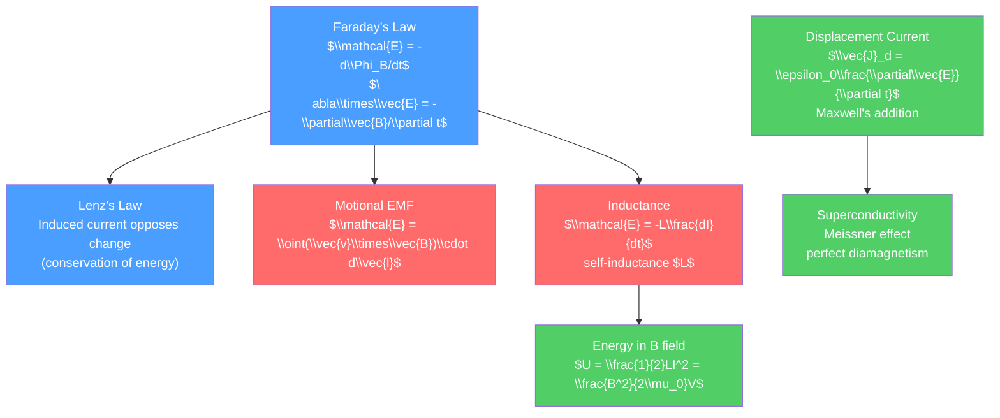

# 🔄 Faraday's Law and Electromagnetic Induction

> [!abstract] TL;DR
> Faraday's law states that a changing magnetic flux through a loop induces an EMF (electromotive force) equal to the negative rate of change of flux: $\mathcal{E} = -d\Phi_B/dt$. This law — Faraday's 1831 discovery that electricity and magnetism are dynamically linked — is the operating principle of generators, transformers, and inductors. At the graduate level, it enters Maxwell's equations as $\nabla\times\vec{E} = -\partial\vec{B}/\partial t$, and its covariant form connects to superconductivity, electromagnetic momentum, and the topology of gauge fields.

## Intuition — analogy FIRST

Push a bar magnet into a coil of wire connected to a galvanometer. The needle deflects — a current flows, with no battery. Stop the magnet, and the current stops. Pull it back out, and the current reverses. The changing magnetic field through the loop is "inducing" a current. The faster you move the magnet, the larger the current.

Lenz's law makes this intuitive: the induced current always creates a magnetic field that opposes the change causing it. Push the north pole in, and the induced current creates a field that pushes back — like a "magnetic friction." This is why generators require mechanical effort to turn: you're fighting the opposing magnetic force as you extract electrical energy.

---

## How It Works



---

## Key Concepts / Details

### Secondary Level

**Faraday's Law**

The induced EMF in a loop equals the negative rate of change of magnetic flux:

$$\mathcal{E} = -\frac{d\Phi_B}{dt}, \qquad \Phi_B = \int_S \vec{B}\cdot d\vec{A}$$

The negative sign encodes Lenz's law: the induced EMF drives a current that opposes the flux change.

**Lenz's Law**: The induced current always flows in a direction to oppose the change in flux that caused it (consistent with energy conservation — you must do work to force the change).

**Three ways to change flux**:
1. Move the source of $\vec{B}$ (moving magnet into coil)
2. Move the loop in a non-uniform $\vec{B}$ field
3. Change $\vec{B}$ itself (as in a transformer or solenoid)

**Generators**: rotating a coil in a uniform magnetic field: $\Phi_B = BA\cos(\omega t)$, so $\mathcal{E} = BA\omega\sin(\omega t)$ — sinusoidal alternating voltage.

**Transformers**: two coils wound on the same iron core. Mutual induction gives $V_s/V_p = N_s/N_p$ (turns ratio). Power is conserved: $V_p I_p = V_s I_s$ (ideal transformer).

### Undergraduate Level

**Motional EMF**

A conductor of length $L$ moving at velocity $\vec{v}$ in field $\vec{B}$: charges in the conductor experience force $q\vec{v}\times\vec{B}$, building up an EMF:

$$\mathcal{E} = \int_a^b(\vec{v}\times\vec{B})\cdot d\vec{l} = BLv \quad \text{(for } v, B, L \text{ mutually perpendicular)}$$

The universal Faraday's law combines the flux rule: $\mathcal{E} = -d\Phi_B/dt$ holds whether the loop moves, $\vec{B}$ changes, or both.

**Self-Inductance**

A coil's own changing current induces a back-EMF:

$$\mathcal{E}_{back} = -L\frac{dI}{dt}$$

where $L$ is the self-inductance (units: Henry = V·s/A). For a solenoid ($n$ turns/meter, length $\ell$, cross-section $A$):

$$L = \mu_0 n^2 \ell A$$

**RL Circuit Transient**:

$$\tau = L/R, \quad I(t) = \frac{V_0}{R}\left(1 - e^{-t/\tau}\right)$$

**Mutual Inductance**

$$M_{12} = M_{21} = \frac{\mu_0}{4\pi}\oint\oint\frac{d\vec{l}_1\cdot d\vec{l}_2}{|\vec{r}_1-\vec{r}_2|}$$

(Neumann formula). The induced EMF in coil 2 due to changing current in coil 1: $\mathcal{E}_2 = -M\,dI_1/dt$.

**Energy Stored in Magnetic Field**

$$U = \frac{1}{2}LI^2 = \frac{1}{2\mu_0}\int B^2\,d^3r$$

The magnetic energy density is $u_B = B^2/(2\mu_0)$, analogous to $u_E = \epsilon_0 E^2/2$.

**Displacement Current — Maxwell's Addition**

Ampere's law $\nabla\times\vec{B} = \mu_0\vec{J}$ is inconsistent with charge conservation for time-varying fields (failure for a charging capacitor). Maxwell added the displacement current:

$$\vec{J}_D = \epsilon_0\frac{\partial\vec{E}}{\partial t}$$

Modified Ampere's law: $\nabla\times\vec{B} = \mu_0\vec{J} + \mu_0\epsilon_0\frac{\partial\vec{E}}{\partial t}$

This crucial addition predicted electromagnetic waves propagating at $c = 1/\sqrt{\mu_0\epsilon_0}$.

**AC Circuits: Impedance**

For sinusoidal driving $V = V_0 e^{i\omega t}$:
- Resistor: $Z_R = R$
- Inductor: $Z_L = i\omega L$
- Capacitor: $Z_C = 1/(i\omega C)$

Resonance in LC circuit: $\omega_0 = 1/\sqrt{LC}$.

### Graduate Level

**Faraday's Law in Differential Form**

$$\nabla\times\vec{E} = -\frac{\partial\vec{B}}{\partial t}$$

This is the third of Maxwell's four equations. Together with $\nabla\times\vec{B} = \mu_0\vec{J} + \mu_0\epsilon_0\partial\vec{E}/\partial t$, Faraday's law forms the dynamical core of electrodynamics, predicting EM waves.

**Electromagnetic Momentum**

The electromagnetic field carries momentum. The momentum density is:

$$\vec{g} = \epsilon_0(\vec{E}\times\vec{B}) = \vec{S}/c^2$$

where $\vec{S} = \vec{E}\times\vec{H}$ is the Poynting vector. This electromagnetic momentum is observable (radiation pressure, Abraham-Minkowski debate).

**Superconductivity and Meissner Effect Preview**

In a superconductor (below critical temperature $T_c$), the resistance drops to exactly zero. But more surprisingly, magnetic fields are expelled from the interior — the Meissner effect. This is perfect diamagnetism: $\vec{B} = 0$ inside the superconductor regardless of its history.

The London equation relates the current to the vector potential in a superconductor: $\vec{J} = -\vec{A}/(\mu_0\lambda_L^2)$ (London gauge), where $\lambda_L$ is the London penetration depth. Faraday's law gives:

$$\frac{\partial\vec{B}}{\partial t} = -\nabla\times\frac{\vec{J}}{\sigma} \to \nabla^2\vec{B} = \frac{\vec{B}}{\lambda_L^2}$$

This means $\vec{B}$ decays exponentially into the superconductor over length $\lambda_L$ (typically 10–500 nm). The Meissner effect is a quantum phenomenon — the Cooper pair condensate, described by a macroscopic wavefunction, rigidly excludes flux.

```python
import numpy as np
import matplotlib.pyplot as plt

# Induced EMF in a coil as a magnet approaches
# Simple model: B at center of loop ~ mu0*m/(2*pi*(d+z)^3) as dipole
mu0 = 4 * np.pi * 1e-7
m = 1.0       # magnetic moment A*m^2
A = 0.01      # loop area m^2
N = 100       # turns
v = 0.5       # velocity m/s (approaching)

t = np.linspace(0, 2, 1000)
d0 = 1.0       # initial distance
z = d0 - v * t  # distance decreasing as magnet approaches
# B at center of loop from dipole: B = mu0/(4pi) * 2m/r^3 on axis
B = mu0 / (4 * np.pi) * 2 * m / (np.maximum(z, 0.05)**3)
Phi = N * A * B
EMF = -np.gradient(Phi, t)

fig, (ax1, ax2) = plt.subplots(2, 1, figsize=(7, 6), sharex=True)
ax1.plot(t, B * 1e6, lw=2)
ax1.set_ylabel(r'B field ($\mu$T)')
ax1.set_title('Magnet approaching a coil — Faraday induction')
ax2.plot(t, EMF * 1e3, lw=2, color='red')
ax2.set_xlabel('Time (s)')
ax2.set_ylabel('Induced EMF (mV)')
ax2.axhline(0, color='k', lw=0.5)
plt.tight_layout()
```

---

## Real-World Notes

- **Electric generators**: all power stations (coal, nuclear, hydro, wind) generate electricity through electromagnetic induction — a conductor moving in a magnetic field.
- **Wireless charging (inductive)**: Qi charging uses mutual induction between coils. The "Qi" standard (widely used for phones) is Faraday's law in a product.
- **Metal detectors**: detect changes in mutual inductance caused by nearby conductive objects.
- **Induction cooking**: alternating magnetic field from a coil induces eddy currents in the ferromagnetic pan, heating it directly.
- **Maglev trains (JR SC Maglev)**: superconducting coils in the train induce currents in track coils (Faraday's law), creating levitation and propulsion forces.

---

## Common Pitfalls

1. **The sign matters**: the negative sign in $\mathcal{E} = -d\Phi_B/dt$ is Lenz's law — always set up by opposing the change. Forgetting the negative leads to wrong current direction predictions.
2. **Flux rule for moving loops**: the full Faraday's law (flux rule) works for any motion of the loop — even if the loop changes shape — as long as you correctly evaluate $d\Phi_B/dt$.
3. **Displacement current is NOT a real current**: $\vec{J}_D = \epsilon_0\partial\vec{E}/\partial t$ is not charge flow; it has no current-carrying particles. It is a term needed for self-consistency of Maxwell's equations.
4. **Transformer efficiency**: the ideal transformer formula $V_s/V_p = N_s/N_p$ assumes zero resistive losses, perfect flux linkage, and no eddy currents. Real transformers are 95–99% efficient (losses matter at power-grid scale).
5. **Back-EMF in motors**: when a motor speeds up, the back-EMF from inductance reduces the net EMF and limits current. At stall (motor not turning), back-EMF is zero and current is maximum — why motors overheat when stalled.

---

## Related Concepts

- [[_MOC_Electromagnetism|↑ Section MOC]]
- [[Magnetism_and_Biot_Savart]] — the static magnetic field that Faraday's law shows can change
- [[Maxwells_Equations]] — Faraday's law is the third Maxwell equation
- [[Electromagnetic_Waves_and_Radiation]] — the interplay of Faraday and Maxwell's correction predicts EM waves

---

## Review Questions

1. **Secondary**: A square coil with 50 turns and area 4 cm² is placed in a uniform magnetic field $B = 0.2$ T perpendicular to the coil plane. The field decreases to zero in 0.1 s. Calculate the induced EMF.
2. **Undergraduate**: Derive the expression for self-inductance of a toroidal coil with $N$ turns, mean radius $R$, and cross-sectional radius $r \ll R$. Calculate the energy stored when current $I$ flows.
3. **Graduate**: In a superconducting ring of inductance $L$, a flux $\Phi_0$ is initially threaded. After cooling into the superconducting state, the ring is removed from the magnet. What current flows? Now slowly deform the ring to change $L$ to $2L$. What happens to the current, and why? (Hint: flux quantization gives $\Phi = LI = $ const in a superconductor.)

---

## Sources

- Griffiths — *Introduction to Electrodynamics*, 4th ed., Ch. 7
- Jackson — *Classical Electrodynamics*, 3rd ed., Ch. 6
- Tinkham — *Introduction to Superconductivity*, 2nd ed., Ch. 1–2

#physics #electromagnetism #FaradaysLaw #LenzsLaw #inductance #displacement-current #superconductivity #secondary #undergraduate #graduate
