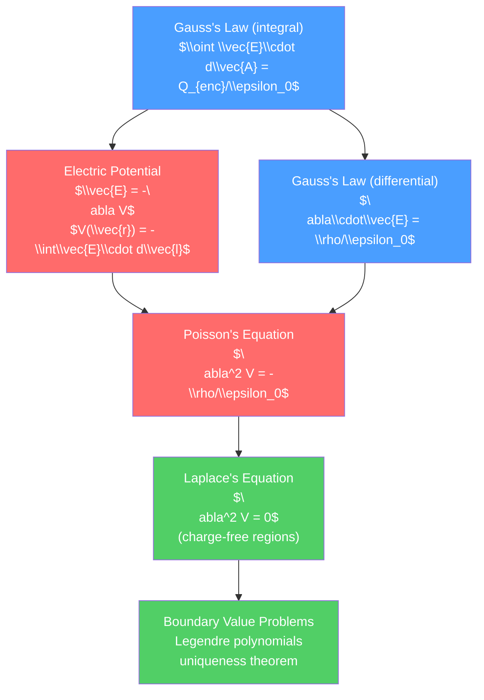

# 🔷 Gauss's Law and Electric Potential

> [!abstract] TL;DR
> Gauss's law states that the total electric flux through any closed surface equals the enclosed charge divided by $\epsilon_0$: $\oint \vec{E}\cdot d\vec{A} = Q_{enc}/\epsilon_0$. In differential form, $\nabla\cdot\vec{E} = \rho/\epsilon_0$. The electric potential $V$ encodes the field as $\vec{E} = -\nabla V$ and satisfies Poisson's equation $\nabla^2 V = -\rho/\epsilon_0$. At the graduate level, solving Laplace's equation in spherical coordinates reveals Legendre polynomials as the natural basis, and boundary value problems are solved via separation of variables and Green's functions.

## Intuition — analogy FIRST

Imagine counting the number of light rays passing through a closed surface around a lamp. No matter the shape of the surface — a sphere, a cube, a crumpled ball of paper — the same total number of rays passes through. If you put the surface around twice as bright a lamp, twice as many rays pass through. Gauss's law says the same about electric field lines: the total number of field lines (flux) passing through a closed surface depends only on the charge enclosed inside, not on the shape or size of the surface.

The electric potential is the "height" of a landscape. Just as a ball rolls from high ground to low, a positive charge moves from high potential to low potential. The electric field is the "slope" of this landscape — it points in the direction of steepest descent.

---

## How It Works



---

## Key Concepts / Details

### Secondary Level

**Gauss's Law (Integral Form)**

$$\oint_S \vec{E}\cdot d\vec{A} = \frac{Q_{enc}}{\epsilon_0}$$

Electric flux through any closed surface $S$ = (enclosed charge) / $\epsilon_0$.

**Three key applications** (use a Gaussian surface that matches the symmetry):

| Geometry | Gaussian surface | Result |
|----------|-----------------|--------|
| Point charge $Q$ | Sphere of radius $r$ | $E = Q/(4\pi\epsilon_0 r^2)$ |
| Infinite line charge $\lambda$ | Cylinder of radius $r$, length $L$ | $E = \lambda/(2\pi\epsilon_0 r)$ |
| Infinite plane $\sigma$ | Pillbox (cylinder straddling plane) | $E = \sigma/(2\epsilon_0)$ |

**Electric Potential**

$$V = \frac{W}{q_0} = -\int_{\mathcal{O}}^{P} \vec{E}\cdot d\vec{l}$$

where $\mathcal{O}$ is the reference point (usually infinity). For a point charge:

$$V = \frac{q}{4\pi\epsilon_0 r}$$

Potential is a scalar (much easier to add than vectors):

$$V_{total} = V_1 + V_2 + \cdots$$

**Relationship between $V$ and $\vec{E}$**:
$$\vec{E} = -\nabla V = -\left(\frac{\partial V}{\partial x}\hat{x} + \frac{\partial V}{\partial y}\hat{y} + \frac{\partial V}{\partial z}\hat{z}\right)$$

Equipotential surfaces are perpendicular to field lines everywhere.

### Undergraduate Level

**Gauss's Law in Differential Form**

Using the divergence theorem $\oint_S \vec{E}\cdot d\vec{A} = \int_V (\nabla\cdot\vec{E})\, dV$ and Gauss's law:

$$\boxed{\nabla\cdot\vec{E} = \frac{\rho}{\epsilon_0}}$$

This is one of Maxwell's four equations.

**Poisson's and Laplace's Equations**

Since $\vec{E} = -\nabla V$ and $\nabla\cdot\vec{E} = \rho/\epsilon_0$:

$$\nabla^2 V = -\frac{\rho}{\epsilon_0} \quad \text{(Poisson's equation)}$$

$$\nabla^2 V = 0 \quad \text{(Laplace's equation, when } \rho = 0\text{)}$$

**Energy of charge distributions**:

$$U_E = \frac{1}{2}\int \rho V\, d^3r = \frac{\epsilon_0}{2}\int E^2\, d^3r$$

**Uniqueness Theorem**: The solution to Poisson's equation with specified boundary conditions is unique (Dirichlet: $V$ specified on boundary; Neumann: $\partial V/\partial n$ specified).

**Earnshaw's Theorem**: No static charge distribution can maintain a charged particle in stable equilibrium solely by electrostatic forces (a consequence of Laplace's equation having no local minima/maxima inside a charge-free region).

### Graduate Level

**Laplace's Equation in Spherical Coordinates**

$$\nabla^2 V = \frac{1}{r^2}\frac{\partial}{\partial r}\left(r^2\frac{\partial V}{\partial r}\right) + \frac{1}{r^2\sin\theta}\frac{\partial}{\partial\theta}\left(\sin\theta\frac{\partial V}{\partial\theta}\right) + \frac{1}{r^2\sin^2\theta}\frac{\partial^2 V}{\partial\phi^2} = 0$$

Separation of variables $V = R(r)\Theta(\theta)\Phi(\phi)$ gives:

- $\Phi(\phi) = e^{\pm im\phi}$ (azimuthal)
- $\Theta(\theta) = P_l^m(\cos\theta)$ (associated Legendre polynomials)
- $R(r) = Ar^l + Br^{-(l+1)}$ (radial)

General solution (azimuthal symmetry, $m=0$):

$$V(r,\theta) = \sum_{l=0}^{\infty}\left(A_l r^l + B_l r^{-(l+1)}\right)P_l(\cos\theta)$$

**Legendre Polynomials** $P_l(\cos\theta)$:
- $P_0 = 1$, $P_1 = \cos\theta$, $P_2 = \tfrac{1}{2}(3\cos^2\theta - 1)$
- Orthogonality: $\int_{-1}^{1} P_l(x)P_{l'}(x)\,dx = \frac{2}{2l+1}\delta_{ll'}$

**Example: Uncharged Conducting Sphere in Uniform Field $E_0$**

Outside the sphere (radius $R$): $V = -E_0 r\cos\theta + E_0 R^3\cos\theta/r^2$

The second term (dipole field) is induced by the uniform external field redistributing surface charges on the sphere. The total field outside is the superposition of the uniform field plus an induced dipole.

**Green's Function in a Bounded Region**

For the Dirichlet boundary value problem:

$$V(\vec{r}) = \frac{1}{\epsilon_0}\int G(\vec{r},\vec{r}')\rho(\vec{r}')\,d^3r' - \oint_{S} V(\vec{r}')\frac{\partial G}{\partial n'}\,da'$$

The Green's function satisfies $\nabla^2 G(\vec{r},\vec{r}') = -\delta^3(\vec{r}-\vec{r}')$ with $G = 0$ on the boundary. For a sphere, $G$ can be constructed using the method of images.

```python
import numpy as np
import matplotlib.pyplot as plt

# Solve Laplace's equation numerically: 2D Poisson via finite differences
# Setup: grounded square box with a positive charge at center

N = 50  # grid points
V = np.zeros((N, N))
rho = np.zeros((N, N))
rho[N//2, N//2] = 1.0  # point charge at center
eps0 = 1.0

# Iterative relaxation (Gauss-Seidel)
for iteration in range(5000):
    V_old = V.copy()
    for i in range(1, N-1):
        for j in range(1, N-1):
            V[i, j] = 0.25 * (V[i+1,j] + V[i-1,j] + V[i,j+1] + V[i,j-1]
                               + rho[i,j] / eps0)
    # Dirichlet BCs: V=0 on boundary (already enforced by not updating boundary)
    if np.max(np.abs(V - V_old)) < 1e-5:
        print(f"Converged at iteration {iteration}")
        break

fig, axes = plt.subplots(1, 2, figsize=(10, 4))
im = axes[0].imshow(V, cmap='RdBu_r', origin='lower')
axes[0].set_title('Electric Potential V (Poisson)')
plt.colorbar(im, ax=axes[0])

# Electric field from gradient of V
Ey, Ex = np.gradient(-V)
axes[1].streamplot(np.arange(N), np.arange(N), Ex, Ey, density=1.2,
                   color=np.sqrt(Ex**2+Ey**2), cmap='plasma')
axes[1].set_title('Electric Field Lines')
plt.tight_layout()
```

---

## Real-World Notes

- **Cathode ray tubes and particle accelerators**: charged particles are deflected and focused using precisely calculated electric potentials — the design of electrodes solves Laplace's equation in 3D.
- **Semiconductor device physics**: the built-in potential and depletion regions in p-n junctions are solutions to Poisson's equation with fixed dopant charge densities.
- **Geophysics**: the gravitational potential of Earth's irregular shape is described by spherical harmonic expansion (exactly the solution to Laplace's equation) — the same Legendre polynomials.
- **Medical imaging (EEG/ECG)**: the potential distribution from neural or cardiac electrical activity is modeled by solving Poisson's equation in the (conductive) human body.
- **Antenna design**: the potential outside an antenna is calculated by solving Laplace's equation with appropriate boundary conditions on the antenna surface.

---

## Common Pitfalls

1. **Gauss's law requires symmetry**: Gauss's law always holds, but it only gives you $\vec{E}$ directly if the symmetry lets you factor it out of the flux integral (spherical, cylindrical, planar symmetry).
2. **Potential is defined up to a constant**: the choice $V(\infty) = 0$ is convenient for localized charges but is impossible for infinite distributions (line charge, infinite plane) — must choose a finite reference point.
3. **$V$ vs $\vec{E}$ inside a conductor**: in electrostatic equilibrium, $\vec{E} = 0$ inside a conductor but $V = $ const (nonzero). The conductor is an equipotential, not a zero-potential surface (unless grounded).
4. **Continuity across boundaries**: $V$ is continuous across any boundary (including conductors), but $\vec{E}$ has a discontinuity in the normal component at a surface charge: $E_{n,above} - E_{n,below} = \sigma/\epsilon_0$.
5. **Earnshaw's theorem consequence**: you cannot trap a charged particle with static electric fields alone — need dynamic fields (Paul trap), magnetic fields (Penning trap), or radiation pressure for particle trapping.

---

## Related Concepts

- [[_MOC_Electromagnetism|↑ Section MOC]]
- [[Electric_Fields_and_Coulombs_Law]] — the building block that Gauss's law organizes
- [[Magnetism_and_Biot_Savart]] — the magnetic analog: $\nabla\cdot\vec{B} = 0$
- [[Maxwells_Equations]] — Gauss's law is the first of Maxwell's four equations

---

## Review Questions

1. **Secondary**: A spherical shell of radius $R$ carries total charge $Q$ uniformly distributed. Use Gauss's law to find the electric field (a) outside the shell and (b) inside the shell.
2. **Undergraduate**: Solve Laplace's equation for the potential inside a grounded conducting sphere of radius $R$ with a point charge $+q$ placed at the center. What is the surface charge density? Verify using Gauss's law.
3. **Graduate**: A conducting sphere of radius $R$ is placed in a uniform external field $E_0\hat{z}$. Using the general solution to Laplace's equation in spherical coordinates, find the potential outside the sphere (the sphere being grounded). Then find the potential when the sphere is not grounded but carries total charge $Q$.

---

## Sources

- Griffiths — *Introduction to Electrodynamics*, 4th ed., Ch. 2–3
- Jackson — *Classical Electrodynamics*, 3rd ed., Ch. 1–2
- Landau & Lifshitz — *Classical Theory of Fields*, §1

#physics #electromagnetism #GaussLaw #ElectricPotential #Poisson #Laplace #LegendrePolynomials #secondary #undergraduate #graduate
