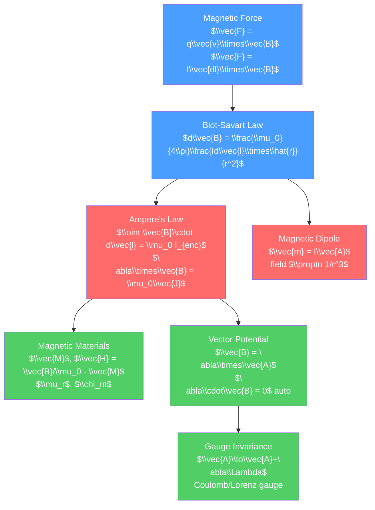

# 🧲 Magnetism and the Biot-Savart Law

> [!abstract] TL;DR
> Magnetic fields are produced by moving charges (currents) and exert forces on other moving charges. The Biot-Savart law gives the magnetic field from an arbitrary current distribution, while Ampere's law provides a simpler route for symmetric configurations. At the graduate level, the vector potential $\vec{A}$ (where $\vec{B} = \nabla\times\vec{A}$) reveals deep connections to gauge invariance — a concept that generalizes to underpin all of modern quantum field theory, including the Standard Model.

## Intuition — analogy FIRST

A compass needle aligns with Earth's magnetic field — the needle's north pole is attracted toward geographic north (Earth's magnetic south pole). Current-carrying wires also deflect compass needles, as Oersted discovered in 1820: electricity and magnetism are connected.

The key insight of magnetism: magnetic forces arise from moving charges. A current is charges in motion, so a current-carrying wire produces a magnetic field. Two parallel wires with currents in the same direction attract; opposite directions repel. This is not a coincidence — it is the same electrostatic force as seen from a moving frame. Special relativity connects electricity and magnetism (see [[_MOC_Relativity]]).

---

## How It Works



---

## Key Concepts / Details

### Secondary Level

**Magnetic Force on Moving Charges**

$$\vec{F} = q\vec{v}\times\vec{B}$$

Key features:
- Force is always perpendicular to both $\vec{v}$ and $\vec{B}$
- Magnetic force does no work ($\vec{F}\perp\vec{v}$)
- A positive charge moving right in a field pointing into the page feels an upward force

For a current-carrying conductor: $\vec{F} = I\vec{L}\times\vec{B}$

**DC Motor**: current loop in a magnetic field experiences a torque $\tau = NIAB\sin\theta$, which makes it rotate.

**Magnetic Field Sources**

| Source | Field |
|--------|-------|
| Infinite straight wire (current $I$) | $B = \mu_0 I/(2\pi r)$, circular, right-hand rule |
| Center of circular loop (radius $R$, current $I$) | $B = \mu_0 I/(2R)$ |
| Solenoid ($n$ turns/meter, current $I$) | $B = \mu_0 nI$ inside, $\approx 0$ outside |

$\mu_0 = 4\pi\times10^{-7}$ T·m/A is the permeability of free space.

### Undergraduate Level

**Biot-Savart Law**

The magnetic field from a current element $Id\vec{l}$ at position $\vec{r}'$, observed at $\vec{r}$:

$$d\vec{B} = \frac{\mu_0}{4\pi}\frac{I\,d\vec{l}\times\hat{r}}{r^2} = \frac{\mu_0}{4\pi}\frac{I\,d\vec{l}\times(\vec{r}-\vec{r}')}{|\vec{r}-\vec{r}'|^3}$$

For the full wire: $\vec{B}(\vec{r}) = \frac{\mu_0 I}{4\pi}\int\frac{d\vec{l}\times(\vec{r}-\vec{r}')}{|\vec{r}-\vec{r}'|^3}$

**Ampere's Law**

The line integral of $\vec{B}$ around any closed loop = $\mu_0$ times the enclosed current:

$$\oint_C \vec{B}\cdot d\vec{l} = \mu_0 I_{enc}$$

Differential form: $\nabla\times\vec{B} = \mu_0\vec{J}$ (valid for steady currents).

**Application: Solenoid**

Ampere's law on a rectangular Amperian loop straddling the solenoid wall: $B \cdot L = \mu_0 n L I \implies B = \mu_0 nI$ inside.

**Magnetic Dipole**

A small current loop with area $A$ and current $I$ has magnetic dipole moment $\vec{m} = I\vec{A}\hat{n}$.

Far-field dipole field (identical form to electric dipole but replacing $\vec{p}/\epsilon_0 \to \mu_0\vec{m}$):

$$\vec{B} = \frac{\mu_0}{4\pi r^3}\left[3(\vec{m}\cdot\hat{r})\hat{r} - \vec{m}\right]$$

**Magnetic Materials**

Magnetization $\vec{M}$ = magnetic dipole moment per unit volume.

- **Paramagnetic**: $\vec{M}$ parallel to $\vec{B}$, small $\chi_m > 0$ (e.g., aluminum)
- **Diamagnetic**: $\vec{M}$ anti-parallel to $\vec{B}$, small $\chi_m < 0$ (e.g., bismuth, water)
- **Ferromagnetic**: spontaneous magnetization, hysteresis, large $\mu_r$ (e.g., iron)

Auxiliary field: $\vec{H} = \vec{B}/\mu_0 - \vec{M}$, with $\vec{B} = \mu_0\mu_r\vec{H}$ for linear materials.

Ampere's law in matter: $\nabla\times\vec{H} = \vec{J}_f$ (free currents only).

Boundary conditions: $B_{1n} = B_{2n}$, $H_{1t} - H_{2t} = K_f$ (free surface current).

### Graduate Level

**Vector Potential**

Since $\nabla\cdot\vec{B} = 0$ (there are no magnetic monopoles), we can write:

$$\vec{B} = \nabla\times\vec{A}$$

where $\vec{A}$ is the magnetic vector potential. In the Coulomb gauge ($\nabla\cdot\vec{A} = 0$), the Biot-Savart law becomes:

$$\vec{A}(\vec{r}) = \frac{\mu_0}{4\pi}\int\frac{\vec{J}(\vec{r}')}{|\vec{r}-\vec{r}'|}\,d^3r'$$

analogous to the scalar potential $V = \frac{1}{4\pi\epsilon_0}\int\frac{\rho(\vec{r}')}{|\vec{r}-\vec{r}'|}\,d^3r'$.

**Gauge Invariance**

The physical fields $\vec{E}$ and $\vec{B}$ are unchanged by a gauge transformation:

$$\vec{A} \to \vec{A} + \nabla\Lambda, \qquad \phi \to \phi - \frac{\partial\Lambda}{\partial t}$$

for any scalar function $\Lambda(\vec{r},t)$. Two common gauge choices:
- **Coulomb gauge**: $\nabla\cdot\vec{A} = 0$ (convenient for static problems, non-covariant)
- **Lorenz gauge**: $\nabla\cdot\vec{A} + \partial\phi/\partial(ct) = 0$ (covariant, used for radiation problems)

Gauge invariance is not just a mathematical nicety — it is the fundamental symmetry ($U(1)$ symmetry) underlying quantum electrodynamics and, by generalization, the entire Standard Model.

**Multipole Expansion for Magnetic Fields**

For a localized current distribution, there is no magnetic monopole term. The leading term is always the magnetic dipole:

$$\vec{A}(\vec{r}) = \frac{\mu_0}{4\pi}\frac{\vec{m}\times\hat{r}}{r^2} + O(1/r^3)$$

The magnetic scalar potential $\psi$ can be used outside current-free regions: $\vec{H} = -\nabla\psi$ where $\nabla^2\psi = 0$.

**Aharonov-Bohm Effect (Preview)**

In quantum mechanics, even when $\vec{B} = 0$ in the region accessible to electrons, the vector potential $\vec{A}$ has a measurable effect: the interference pattern of electrons going around a solenoid shifts proportional to $\oint\vec{A}\cdot d\vec{l} = \Phi_B$ (the enclosed flux). This shows $\vec{A}$ is not merely a mathematical convenience in quantum mechanics.

```python
import numpy as np
import matplotlib.pyplot as plt

# Magnetic field of a finite solenoid: Biot-Savart integration
def solenoid_field(R=0.1, L=0.5, n_turns=200, I=1.0, z_pts=100):
    """Axial B field of a solenoid via Biot-Savart"""
    mu0 = 4 * np.pi * 1e-7
    dz = L / n_turns
    z_coils = np.linspace(-L/2, L/2, n_turns)
    z_obs = np.linspace(-L, L, z_pts)
    Bz = np.zeros(z_pts)
    
    for z_coil in z_coils:
        for k, z_o in enumerate(z_obs):
            z_rel = z_o - z_coil
            Bz[k] += mu0 * I * R**2 / (2 * (R**2 + z_rel**2)**1.5)
    
    Bz_ideal = mu0 * n_turns / L * I  # infinite solenoid value
    return z_obs, Bz, Bz_ideal

z, Bz, Bz_inf = solenoid_field()
plt.figure(figsize=(7, 4))
plt.plot(z * 100, Bz * 1e3, lw=2, label='Finite solenoid (Biot-Savart)')
plt.axhline(Bz_inf * 1e3, color='r', linestyle='--', label='Infinite solenoid $\\mu_0 nI$')
plt.axvspan(-25, 25, alpha=0.1, color='blue', label='Solenoid interior')
plt.xlabel('z (cm)'), plt.ylabel('B (mT)')
plt.title('Axial Magnetic Field of a Finite Solenoid')
plt.legend()
plt.tight_layout()
```

---

## Real-World Notes

- **MRI (Magnetic Resonance Imaging)**: superconducting solenoids create uniform 1.5–3 T fields. Gradient coils (Biot-Savart designed) spatially encode position for imaging.
- **Electric motors and generators**: torque on current loops (motors) and Faraday induction (generators) are both magnetic force applications.
- **Geomagnetic field**: Earth's field is approximately that of a magnetic dipole, with moment $\vec{m} \approx 8\times10^{22}$ A·m², though departing significantly from a perfect dipole.
- **Particle physics detectors**: drift chambers and time projection chambers use the Lorentz force to curve particle tracks in a magnetic field, allowing momentum measurement $p = qBr$.
- **Magnetic levitation (Maglev)**: diamagnetic levitation (superconductors) and controlled electromagnet levitation use precise magnetic field calculations.

---

## Common Pitfalls

1. **Magnetic force does no work**: $\vec{F}_{mag} = q\vec{v}\times\vec{B}$ is always perpendicular to $\vec{v}$, so the magnetic force can curve a particle's path but never speed it up or slow it down.
2. **$\nabla\times\vec{B} = \mu_0\vec{J}$ fails for time-varying fields**: Ampere's law (without displacement current) is only valid for steady (magnetostatic) situations. Maxwell added the $\partial\vec{E}/\partial t$ term — see [[Maxwells_Equations]].
3. **Gauge choice matters for $\vec{A}$**: the vector potential $\vec{A}$ is not unique — it depends on the gauge choice. Only gauge-invariant quantities (fields $\vec{E}$, $\vec{B}$) are physically observable (classically).
4. **Ferromagnetism is not linear**: $\vec{B} = \mu\vec{H}$ only holds for linear (para/dia)magnetic materials. For ferromagnets, $B$ vs $H$ is a hysteresis loop.
5. **"$\mu_r$ for vacuum is 1"**: for diamagnetic materials $\mu_r < 1$ (slightly), for paramagnetic $\mu_r > 1$ (slightly). Only superconductors have $\mu_r = 0$ (perfect diamagnets — Meissner effect).

---

## Related Concepts

- [[_MOC_Electromagnetism|↑ Section MOC]]
- [[Electric_Fields_and_Coulombs_Law]] — electric field analog
- [[Faradays_Law_and_Induction]] — magnetic fields change → induce electric fields
- [[Maxwells_Equations]] — Ampere's law (with displacement current) is one of the four

---

## Review Questions

1. **Secondary**: A long straight wire carries 10 A. What is the magnetic field 5 cm from the wire? In what direction does the field point if current flows upward (use right-hand rule)?
2. **Undergraduate**: Use the Biot-Savart law to find the magnetic field at the center of a square loop of side $a$ carrying current $I$.
3. **Graduate**: In the Coulomb gauge ($\nabla\cdot\vec{A} = 0$), the vector potential satisfies $\nabla^2\vec{A} = -\mu_0\vec{J}$. Solve this for an infinite straight wire of radius $R$ carrying uniform current density $J_0$ to find $\vec{A}$ everywhere, and verify $\vec{B} = \nabla\times\vec{A}$ gives the expected results.

---

## Sources

- Griffiths — *Introduction to Electrodynamics*, 4th ed., Ch. 5–6
- Jackson — *Classical Electrodynamics*, 3rd ed., Ch. 5
- Purcell & Morin — *Electricity and Magnetism*, 3rd ed., Ch. 6

#physics #electromagnetism #BiotSavart #AmperesLaw #magneticField #vectorPotential #gaugeInvariance #secondary #undergraduate #graduate
