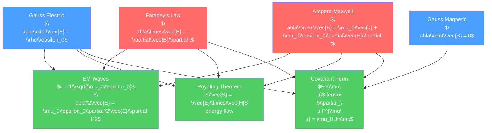

# ⚡🧲 Maxwell's Equations

> [!abstract] TL;DR
> Maxwell's four equations unify all of electricity and magnetism into a single coherent framework. They predict electromagnetic waves traveling at $c = 1/\sqrt{\mu_0\epsilon_0}$ — identifying light as an electromagnetic phenomenon. At the graduate level, the covariant formulation using the electromagnetic field tensor $F^{\mu\nu}$ reveals the deep Lorentz symmetry of electromagnetism, gauge invariance becomes the organizing principle, and electromagnetic duality (swapping $\vec{E}$ and $\vec{B}$) points toward magnetic monopoles and their role in string theory.

## Intuition — analogy FIRST

Maxwell's equations are four compact mathematical statements that encode the entire behavior of classical electromagnetism:

1. Electric field lines start and end on charges (Gauss's law for $\vec{E}$)
2. Magnetic field lines form closed loops — no magnetic monopoles (Gauss's law for $\vec{B}$)
3. Changing magnetic fields create circling electric fields (Faraday's law)
4. Currents and changing electric fields create circling magnetic fields (Ampere-Maxwell law)

The genius of Maxwell was to add the displacement current $\epsilon_0\partial\vec{E}/\partial t$ to Ampere's law. This tiny addition had an enormous consequence: equations 3 and 4 together allow $\vec{E}$ and $\vec{B}$ to sustain each other without any charges or currents — a self-propagating electromagnetic wave. Maxwell calculated its speed: $c = 3\times10^8$ m/s — exactly the speed of light. Light is an electromagnetic wave.

---

## How It Works



---

## Key Concepts / Details

### Undergraduate Level

**Maxwell's Equations — Four Forms**

| Name | Integral Form | Differential Form |
|------|--------------|-------------------|
| Gauss's law ($\vec{E}$) | $\oint\vec{E}\cdot d\vec{A} = Q_{enc}/\epsilon_0$ | $\nabla\cdot\vec{E} = \rho/\epsilon_0$ |
| Gauss's law ($\vec{B}$) | $\oint\vec{B}\cdot d\vec{A} = 0$ | $\nabla\cdot\vec{B} = 0$ |
| Faraday's law | $\oint\vec{E}\cdot d\vec{l} = -d\Phi_B/dt$ | $\nabla\times\vec{E} = -\partial\vec{B}/\partial t$ |
| Ampere-Maxwell | $\oint\vec{B}\cdot d\vec{l} = \mu_0(I_{enc}+I_D)$ | $\nabla\times\vec{B} = \mu_0\vec{J} + \mu_0\epsilon_0\partial\vec{E}/\partial t$ |

**In matter** (using $\vec{D} = \epsilon\vec{E}$ and $\vec{H} = \vec{B}/\mu$):

$$\nabla\cdot\vec{D} = \rho_f, \quad \nabla\cdot\vec{B} = 0$$
$$\nabla\times\vec{E} = -\frac{\partial\vec{B}}{\partial t}, \quad \nabla\times\vec{H} = \vec{J}_f + \frac{\partial\vec{D}}{\partial t}$$

**Deriving the Wave Equation**

Take $\nabla\times$ of Faraday's law and substitute Ampere's law (in free space, $\rho = 0$, $\vec{J} = 0$):

$$\nabla\times(\nabla\times\vec{E}) = -\frac{\partial}{\partial t}(\nabla\times\vec{B}) = -\mu_0\epsilon_0\frac{\partial^2\vec{E}}{\partial t^2}$$

Using $\nabla\times(\nabla\times\vec{E}) = \nabla(\nabla\cdot\vec{E}) - \nabla^2\vec{E} = -\nabla^2\vec{E}$ (since $\nabla\cdot\vec{E} = 0$ in free space):

$$\nabla^2\vec{E} = \mu_0\epsilon_0\frac{\partial^2\vec{E}}{\partial t^2}$$

This is the wave equation with speed $c = 1/\sqrt{\mu_0\epsilon_0} = 2.998\times10^8$ m/s — the speed of light.

**Poynting Theorem: Energy Flow**

Multiply Ampere's law by $\vec{E}$ and Faraday's law by $\vec{H}$, subtract, and use vector identities:

$$\frac{\partial u}{\partial t} + \nabla\cdot\vec{S} = -\vec{J}\cdot\vec{E}$$

where:
- $u = \tfrac{1}{2}(\epsilon_0 E^2 + B^2/\mu_0)$ = EM energy density
- $\vec{S} = \vec{E}\times\vec{H} = \tfrac{1}{\mu_0}(\vec{E}\times\vec{B})$ = Poynting vector (energy flux, W/m²)
- $\vec{J}\cdot\vec{E}$ = Ohmic dissipation (power per unit volume)

The Poynting vector points in the direction of EM energy flow. For a wire carrying current $I$: $\vec{S}$ points radially inward into the wire, carrying the electrical power that heats the wire — all the energy enters through the surface, not along the wire!

**Maxwell Stress Tensor**

The electromagnetic momentum flux is described by the Maxwell stress tensor $T_{ij}$:

$$T_{ij} = \epsilon_0\left(E_iE_j - \tfrac{1}{2}\delta_{ij}E^2\right) + \frac{1}{\mu_0}\left(B_iB_j - \tfrac{1}{2}\delta_{ij}B^2\right)$$

The force on a charge distribution in a volume $V$:

$$\vec{F} = \oint_S \mathbf{T}\cdot d\vec{A} - \epsilon_0\mu_0\frac{d}{dt}\int_V\vec{S}\,dV$$

### Graduate Level

**Covariant Formulation — The $F^{\mu\nu}$ Tensor**

In special relativity, $\vec{E}$ and $\vec{B}$ are not separate 3-vectors — they are components of the antisymmetric electromagnetic field tensor:

$$F^{\mu\nu} = \begin{pmatrix} 0 & -E_x/c & -E_y/c & -E_z/c \\ E_x/c & 0 & -B_z & B_y \\ E_y/c & B_z & 0 & -B_x \\ E_z/c & -B_y & B_x & 0 \end{pmatrix}$$

Maxwell's equations collapse into two tensor equations:

$$\partial_\nu F^{\mu\nu} = \mu_0 J^\mu \quad \text{(Gauss + Ampere-Maxwell)}$$
$$\partial_{[\lambda} F_{\mu\nu]} = 0 \quad \text{(Gauss-B + Faraday)}$$

The second equation is automatically satisfied if $F_{\mu\nu} = \partial_\mu A_\nu - \partial_\nu A_\mu$, where $A^\mu = (\phi/c, \vec{A})$ is the 4-potential.

**Gauge Invariance Revisited**

The gauge transformation:
$$A^\mu \to A^\mu + \partial^\mu\Lambda$$

leaves $F^{\mu\nu}$ invariant. In the Lorenz gauge ($\partial_\mu A^\mu = 0$):

$$\square A^\mu = \mu_0 J^\mu$$

where $\square = \partial_\mu\partial^\mu = \nabla^2 - \partial^2/c^2\partial t^2$ is the d'Alembertian.

**Electromagnetic Duality**

Under the duality transformation $\vec{E} \to c\vec{B}$, $c\vec{B} \to -\vec{E}$ (or $F^{\mu\nu} \to \tilde{F}^{\mu\nu} = \tfrac{1}{2}\epsilon^{\mu\nu\rho\sigma}F_{\rho\sigma}$), Maxwell's equations in free space are symmetric — except for the absence of magnetic monopoles.

If magnetic monopoles existed (with magnetic charge $g$), the modified Maxwell equations would be perfectly dual:

$$\nabla\cdot\vec{E} = \rho_e/\epsilon_0, \qquad \nabla\cdot\vec{B} = \mu_0\rho_m$$

Dirac showed in 1931 that the existence of even one magnetic monopole would quantize all electric charges — explaining why electric charge is quantized in nature. Monopoles appear naturally in grand unified theories and inflationary cosmology.

**Energy-Momentum Tensor**

The electromagnetic energy-momentum tensor:

$$T^{\mu\nu}_{EM} = \frac{1}{\mu_0}\left(F^{\mu\lambda}F_\lambda^\nu + \frac{1}{4}g^{\mu\nu}F_{\lambda\sigma}F^{\lambda\sigma}\right)$$

With $T^{00} = u$ (energy density), $T^{0i}/c = g^i$ (momentum density), and $T^{ij}$ the Maxwell stress tensor. Conservation: $\partial_\mu T^{\mu\nu} = -F^{\nu\mu}J_\mu$ (force density on charges).

```python
import numpy as np
import matplotlib.pyplot as plt

# Visualize EM wave: E and B fields of a linearly polarized plane wave
k = 2 * np.pi  # wave number (wavelength = 1 unit)
omega = 2 * np.pi  # angular frequency (c = 1 in this unit system)
t_values = [0, 0.1, 0.25]

z = np.linspace(0, 2, 300)  # propagation direction

fig, axes = plt.subplots(len(t_values), 1, figsize=(10, 8))
for ax, t in zip(axes, t_values):
    Ex = np.cos(k * z - omega * t)
    By = np.cos(k * z - omega * t)  # E and B in phase for plane wave
    ax.plot(z, Ex, label=r'$E_x$', lw=2)
    ax.plot(z, By, '--', label=r'$B_y$', lw=2)
    ax.fill_between(z, 0, Ex, alpha=0.2)
    ax.set_ylabel('Field amplitude')
    ax.set_title(f'Plane EM wave at t = {t}')
    ax.legend(loc='upper right')
    ax.axhline(0, color='k', lw=0.5)
    ax.set_ylim(-1.5, 1.5)

axes[-1].set_xlabel('z (wavelengths)')
plt.tight_layout()
```

---

## Real-World Notes

- **Radio communication**: Maxwell predicted (1865), Hertz confirmed (1887) — radio waves are electromagnetic waves at lower frequency. Every phone call, WiFi packet, and GPS signal travels as an EM wave described by Maxwell's equations.
- **Optics**: all of classical optics (reflection, refraction, polarization, interference) follows from Maxwell's equations. Snell's law, Fresnel coefficients, and the refractive index $n = c/v$ all derive from EM boundary conditions.
- **Photon as quantized EM field**: quantum electrodynamics (QED) is the quantum version of Maxwell's theory, with photons as field quanta. QED is the most precisely tested theory in physics.
- **MRI RF pulse**: the RF coils in MRI emit radio-frequency EM waves at the Larmor frequency to flip nuclear spins — Maxwell's equations in a medical context.
- **Antenna design**: every antenna (dipole, loop, patch, phased array) is optimized by solving Maxwell's equations numerically (FDTD, FEM methods).

---

## Common Pitfalls

1. **Displacement current is necessary for consistency**: without $\epsilon_0\partial\vec{E}/\partial t$, taking $\nabla\cdot$ of the old Ampere's law gives $0 = \mu_0\nabla\cdot\vec{J}$, inconsistent with charge conservation $\partial\rho/\partial t + \nabla\cdot\vec{J} = 0$ for time-varying charge densities.
2. **Poynting vector direction is surprising**: energy flows perpendicular to both $\vec{E}$ and $\vec{B}$. For a DC circuit, energy flows from the space around the wire into the wire — not along the wire through the electrons.
3. **$c$ in media is not the fundamental $c$**: the speed of light in a medium is $v = c/n$, where $n = \sqrt{\epsilon_r\mu_r}$. But the information speed (group velocity) can differ from phase velocity $v_p = \omega/k$.
4. **Electromagnetic duality is only a symmetry in vacuum**: in the presence of charges and currents (but no magnetic monopoles), the duality rotation is broken.
5. **Gauge choice does not affect physics**: the Lorenz gauge and Coulomb gauge give the same physical $\vec{E}$ and $\vec{B}$. Choose the gauge convenient for the problem.

---

## Related Concepts

- [[_MOC_Electromagnetism|↑ Section MOC]]
- [[Gauss_Law_and_Electric_Potential]] — first Maxwell equation
- [[Magnetism_and_Biot_Savart]] — magnetostatics and the static Ampere's law
- [[Faradays_Law_and_Induction]] — third and fourth Maxwell equations
- [[Electromagnetic_Waves_and_Radiation]] — consequences of Maxwell's equations

---

## Review Questions

1. **Undergraduate**: Starting from Maxwell's equations in free space, derive the wave equation for $\vec{B}$. Show that $\vec{E}$ and $\vec{B}$ are perpendicular to each other and to the direction of propagation for a plane wave.
2. **Graduate**: Write Maxwell's equations in covariant form using $F^{\mu\nu}$. Show that the second covariant equation $\partial_{[\lambda}F_{\mu\nu]} = 0$ contains both Faraday's law and $\nabla\cdot\vec{B} = 0$.
3. **PhD**: The Poynting vector of a static electric and magnetic field configuration ($\vec{E}$ from a point charge, $\vec{B}$ from a long solenoid along the $z$-axis) is nonzero even though nothing is moving. Compute $\vec{S}$ and use the momentum density $\vec{g} = \vec{S}/c^2$ to find the total EM angular momentum of the field. (This is the Abraham-Lorentz hidden momentum problem.)

---

## Sources

- Griffiths — *Introduction to Electrodynamics*, 4th ed., Ch. 7–10
- Jackson — *Classical Electrodynamics*, 3rd ed., Ch. 6–7, 11–12
- Landau & Lifshitz — *Classical Theory of Fields*, §26–34

#physics #electromagnetism #MaxwellsEquations #PoyntingVector #covariant #fieldTensor #gaugeinvariance #undergraduate #graduate
