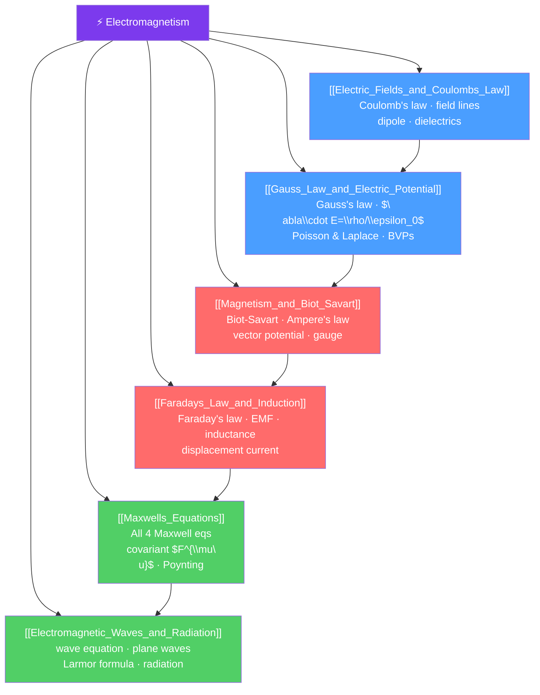

# ⚡ Electromagnetism — Map of Content

> [!abstract] What This Section Covers
> Electromagnetism is the theory of electric and magnetic fields and their interaction with charged matter. It spans from Coulomb's law (the force between point charges) through Maxwell's four equations (which unify all electric and magnetic phenomena) to electromagnetic waves — including light. At the graduate level, electromagnetism is formulated covariantly using the electromagnetic field tensor $F^{\mu\nu}$ and generates the template for all gauge theories in modern physics, including the Standard Model. This section covers the full arc: Coulomb and Gauss's laws for static electric fields, Biot-Savart and Ampere for static magnetic fields, Faraday's law for electromagnetic induction, Maxwell's unification, and radiation from accelerating charges.

## Concept Map

## Learning Path

1. [[Electric_Fields_and_Coulombs_Law]] — Coulomb's law, field lines, superposition, dipoles, and dielectrics.
2. [[Gauss_Law_and_Electric_Potential]] — Gauss's law in integral/differential form, electric potential, Poisson/Laplace equations, boundary value problems.
3. [[Magnetism_and_Biot_Savart]] — Biot-Savart law, Ampere's law, vector potential, gauge invariance.
4. [[Faradays_Law_and_Induction]] — Faraday's law, Lenz's law, self/mutual inductance, displacement current.
5. [[Maxwells_Equations]] — All four Maxwell's equations, energy, Poynting vector, covariant formulation.
6. [[Electromagnetic_Waves_and_Radiation]] — EM wave equation, polarization, Larmor radiation, Liénard-Wiechert potentials.

## All Notes at a Glance

| Note | Difficulty | What You'll Learn |
|------|------------|-------------------|
| [[Electric_Fields_and_Coulombs_Law]] | Secondary → PhD | Coulomb, superposition, multipole, dielectrics, Green's functions |
| [[Gauss_Law_and_Electric_Potential]] | Secondary → PhD | Gauss's law, $\nabla\cdot E$, potential, Poisson, Laplace, Legendre polynomials |
| [[Magnetism_and_Biot_Savart]] | Secondary → PhD | Biot-Savart, Ampere's law, magnetic materials, vector potential, gauge |
| [[Faradays_Law_and_Induction]] | Secondary → PhD | Faraday's law, inductance, EM momentum, superconductivity preview |
| [[Maxwells_Equations]] | Undergraduate → PhD | All 4 Maxwell eqs, Poynting theorem, $F^{\mu\nu}$ tensor, electromagnetic duality |
| [[Electromagnetic_Waves_and_Radiation]] | Undergraduate → PhD | EM waves, Fresnel equations, Larmor formula, Liénard-Wiechert, synchrotron |

## Key Questions This Section Answers

- How does the electric field from a continuous charge distribution differ from Coulomb's law for point charges?
- Why is the electric potential more useful than the electric field for solving boundary value problems?
- How does a current loop produce a magnetic dipole field, and what is the vector potential?
- What is the displacement current, and why was it Maxwell's crucial insight?
- How do Maxwell's equations predict electromagnetic waves at speed $c = 1/\sqrt{\mu_0\epsilon_0}$?
- What is the power radiated by an accelerating charge, and how does it depend on acceleration?

## Related Sections

- [[_MOC_Physics_Master|↑ Physics Master MOC]]
- [[_MOC_Classical_Mechanics|← Classical Mechanics]] — Lagrangian/Hamiltonian formalism for EM fields
- [[_MOC_Waves_and_Optics|→ Waves & Optics]] — EM waves are the physics behind optics
- [[_MOC_Quantum_Mechanics|→ Quantum Mechanics]] — QED is the quantum theory of electromagnetism

## Key References

- Griffiths — *Introduction to Electrodynamics*, 4th ed. — the undergraduate standard
- Jackson — *Classical Electrodynamics*, 3rd ed. — the graduate bible
- Landau & Lifshitz — *Classical Theory of Fields*, 2nd ed.
- Purcell & Morin — *Electricity and Magnetism*, 3rd ed.

#MOC #Physics #Electromagnetism
