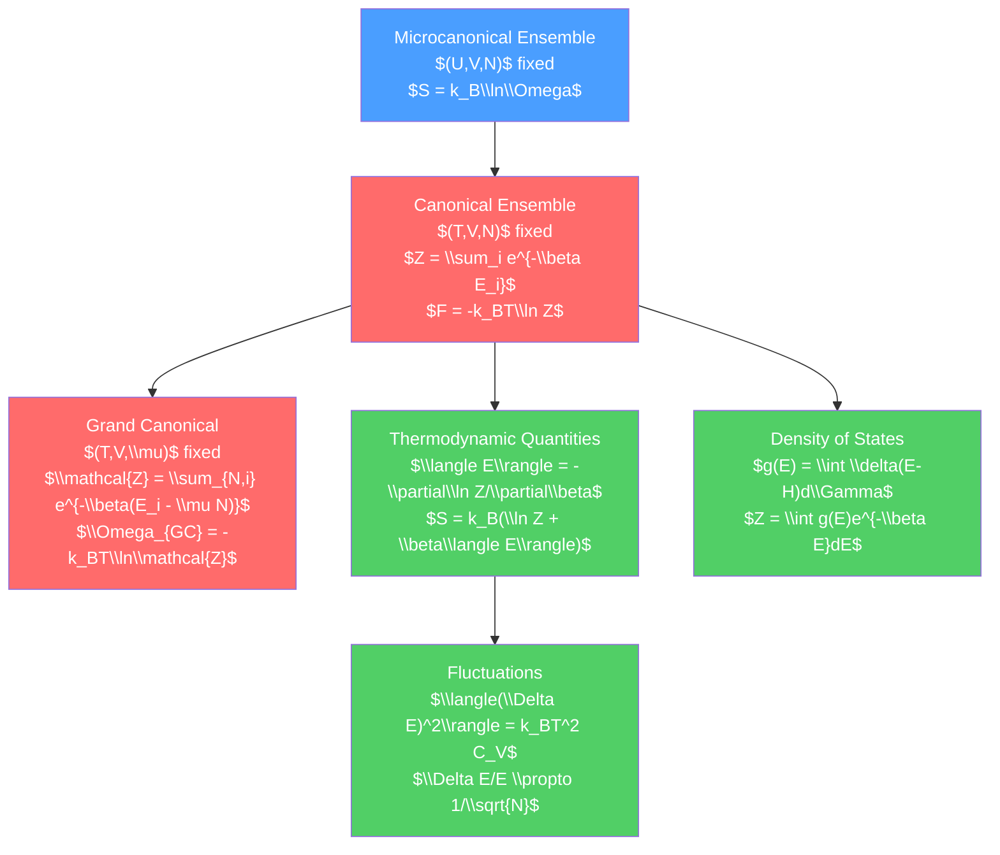

# 📊 Classical Statistical Mechanics

> [!abstract] TL;DR
> Statistical mechanics derives thermodynamics from the microscopic behavior of $\sim 10^{23}$ particles by using probability theory to avoid tracking every particle individually. Three ensembles describe different experimental conditions: microcanonical (fixed $U$, $V$, $N$), canonical (fixed $T$, $V$, $N$), and grand canonical (fixed $T$, $V$, $\mu$). The canonical partition function $Z = \sum_i e^{-\beta E_i}$ is the workhorse — from it, all thermodynamic quantities follow by differentiation. At graduate level, fluctuations, density of states, and the cluster expansion for non-ideal gases systematize the theory.

## Intuition — analogy FIRST

You don't need to track every molecule in a gas to understand its thermodynamics — just as you don't need to track every voter's conversation to predict an election result. Statistical mechanics uses probabilities to characterize what the system is *likely* doing, and then derives the macroscopic properties from these probabilities.

The key insight: at equilibrium, a system in contact with a heat bath is most likely in states with energies near $k_BT$. Very low energy states are few (not many ways to have very little energy); very high energy states are suppressed by the Boltzmann factor $e^{-\beta E}$ (the bath's influence). The probability peaks at intermediate energies — this is the canonical distribution.

---

## How It Works



---

## Key Concepts / Details

### Undergraduate Level

**The Three Ensembles**

| Ensemble | Fixed | Free | Thermodynamic potential |
|----------|-------|------|------------------------|
| Microcanonical | $U, V, N$ | — | $S(U,V,N) = k_B\ln\Omega$ |
| Canonical | $T, V, N$ | $U$ | $F(T,V,N) = -k_BT\ln Z$ |
| Grand canonical | $T, V, \mu$ | $U, N$ | $\Omega_{GC}(T,V,\mu) = -k_BT\ln\mathcal{Z}$ |

For macroscopic systems, all ensembles give the same results (ensemble equivalence) — fluctuations in the free variables are negligibly small ($\sim 1/\sqrt{N}$).

**Canonical Partition Function**

For a system with discrete energy levels $E_i$:

$$Z(T, V, N) = \sum_i e^{-\beta E_i}, \qquad \beta = \frac{1}{k_BT}$$

For a continuous system (classical phase space):

$$Z = \frac{1}{h^{3N}N!}\int e^{-\beta H(\vec{q},\vec{p})}\,d^{3N}q\,d^{3N}p$$

The $1/h^{3N}$ factor comes from quantizing phase space cells; $1/N!$ accounts for indistinguishability.

**All Thermodynamics from $Z$**:

$$F = -k_BT\ln Z$$
$$\langle U\rangle = -\frac{\partial\ln Z}{\partial\beta} = k_BT^2\frac{\partial\ln Z}{\partial T}$$
$$S = k_B\left(\ln Z + \beta\langle U\rangle\right) = -\frac{\partial F}{\partial T}$$
$$P = k_BT\frac{\partial\ln Z}{\partial V}, \quad \mu = -k_BT\frac{\partial\ln Z}{\partial N}$$

**Ideal Gas Partition Function**

Single-particle partition function (in a box of volume $V$, treating quantized energy levels):

$$z_1 = \frac{V}{\lambda_{th}^3}, \qquad \lambda_{th} = \sqrt{\frac{2\pi\hbar^2}{mk_BT}} \quad \text{(thermal de Broglie wavelength)}$$

$N$-particle (classical, distinguishable): $Z_N = z_1^N / N!$ (indistinguishable correction).

$$F = -Nk_BT\left[\ln\left(\frac{V}{N\lambda_{th}^3}\right) + 1\right]$$

This reproduces $PV = Nk_BT$, $U = \tfrac{3}{2}Nk_BT$, and the Sackur-Tetrode entropy — all from the partition function.

**Grand Canonical Ensemble**

$$\mathcal{Z}(T, V, \mu) = \sum_{N=0}^\infty e^{\beta\mu N} Z_N(T, V) = \sum_{N,i} e^{-\beta(E_{N,i} - \mu N)}$$

Grand potential: $\Omega_{GC} = -k_BT\ln\mathcal{Z} = F - \mu N$

From $\mathcal{Z}$: $\langle N\rangle = k_BT\partial\ln\mathcal{Z}/\partial\mu$, $P = k_BT\ln\mathcal{Z}/V$.

### Graduate Level

**Fluctuations and Response Functions**

Variance of energy in the canonical ensemble:

$$\langle(\Delta E)^2\rangle = \langle E^2\rangle - \langle E\rangle^2 = -\frac{\partial\langle E\rangle}{\partial\beta} = k_BT^2 C_V$$

Since $\langle E\rangle \propto N$ and $C_V \propto N$: relative fluctuation $\sqrt{\langle(\Delta E)^2\rangle}/\langle E\rangle \propto 1/\sqrt{N}$. For $N \sim 10^{23}$, fluctuations are $\sim 10^{-12}$ — thermodynamics is exact.

Similarly, particle number fluctuations in the grand canonical ensemble:

$$\langle(\Delta N)^2\rangle = k_BT\frac{\partial\langle N\rangle}{\partial\mu} = k_BT^2\frac{\partial^2\ln\mathcal{Z}}{\partial\mu^2}$$

**Density of States**

The density of states $g(E)$ is the number of microstates per unit energy:

$$g(E) = \int \delta(E - H(\vec{q},\vec{p}))\frac{d^{3N}q\,d^{3N}p}{h^{3N}N!}$$

The partition function is:

$$Z = \int_0^\infty g(E)e^{-\beta E}\,dE \qquad \text{(Laplace transform of } g(E)\text{)}$$

For a 3D ideal gas of $N$ particles: $g(E) \propto E^{3N/2-1}$. The Laplace transform gives $Z \propto T^{3N/2}$, reproducing $U = \tfrac{3}{2}Nk_BT$.

For a general density of states $g(\epsilon) = C\epsilon^{\alpha-1}$:

$$Z = C\Gamma(\alpha)/\beta^\alpha, \quad \langle E\rangle = \alpha k_BT$$

**Cluster Expansions and Virial Coefficients**

For a gas with pairwise interaction potential $u(r_{ij})$, define the Mayer f-function:

$$f_{ij} = e^{-\beta u(r_{ij})} - 1$$

The grand canonical cluster expansion gives the virial equation:

$$\frac{P}{k_BT} = n + B_2(T)n^2 + B_3(T)n^3 + \cdots$$

where $n = N/V$ and the second virial coefficient:

$$B_2(T) = -\frac{1}{2}\int f(r)\,4\pi r^2\,dr = -\frac{1}{2}\int\left(e^{-\beta u(r)} - 1\right)4\pi r^2\,dr$$

For the van der Waals gas: $B_2(T) = b - a/(k_BT)$, recovering the van der Waals equation.

**The Classical Limit of Quantum Statistics**

Classical statistical mechanics is valid when the average occupation of any quantum state is $\ll 1$, i.e., when $n\lambda_{th}^3 \ll 1$ (dilute gas condition). Otherwise, quantum statistics (Fermi-Dirac or Bose-Einstein) must be used — see [[Quantum_Statistical_Mechanics]].

```python
import numpy as np
import matplotlib.pyplot as plt
from scipy.special import gamma as gamma_func

# Canonical partition function and thermodynamics for a 1D harmonic oscillator
kB = 1.380649e-23  # J/K
hbar = 1.054571817e-34  # J*s

omega = 1e12  # rad/s (harmonic oscillator frequency)
T_range = np.linspace(1, 1000, 300)  # K

# Classical partition function: Z_class = kT/(hbar*omega)
Z_class = kB * T_range / (hbar * omega)
F_class = -kB * T_range * np.log(Z_class)
U_class = kB * T_range  # equipartition: 1/2 kT kinetic + 1/2 kT potential = kT
C_class = kB * np.ones_like(T_range)  # constant heat capacity

# Quantum partition function: Z_quant = sum_{n=0}^{inf} exp(-beta*hbar*omega*(n+1/2))
# = exp(-beta*hbar*omega/2) / (1 - exp(-beta*hbar*omega))
beta = 1 / (kB * T_range)
x = hbar * omega * beta  # dimensionless
Z_quant = np.exp(-x/2) / (1 - np.exp(-x))
U_quant = hbar * omega * (0.5 + 1/(np.exp(x) - 1))
C_quant = kB * x**2 * np.exp(x) / (np.exp(x) - 1)**2

fig, (ax1, ax2) = plt.subplots(1, 2, figsize=(10, 4))
ax1.plot(T_range, U_quant / (kB * T_range), label='Quantum (Planck)')
ax1.axhline(1.0, color='r', linestyle='--', label='Classical (equipartition)')
ax1.set_xlabel('Temperature (K)')
ax1.set_ylabel(r'$\langle E \rangle / k_B T$')
ax1.set_title('Harmonic Oscillator: Quantum vs Classical Energy')
ax1.legend()
ax1.set_ylim(0.4, 1.1)

ax2.plot(T_range, C_quant / kB, label='Quantum (Einstein)')
ax2.axhline(1.0, color='r', linestyle='--', label='Classical')
ax2.axvline(hbar * omega / kB, color='g', linestyle=':', label=r'$T = \hbar\omega/k_B$')
ax2.set_xlabel('Temperature (K)')
ax2.set_ylabel(r'$C / k_B$')
ax2.set_title('Harmonic Oscillator: Heat Capacity')
ax2.legend()
plt.tight_layout()
```

---

## Real-World Notes

- **Materials science**: density of states calculations for electrons and phonons in solids determine electrical conductivity, heat capacity, and optical properties.
- **Atmospheric modeling**: the grand canonical ensemble (variable particle number) naturally describes atmospheric gases where molecules can condense and evaporate.
- **Nuclear physics**: the nuclear level density $\rho(E)$ (density of states for nuclei) is crucial for calculating nuclear reaction rates in stellar nucleosynthesis.
- **Machine learning**: the Boltzmann machine and its modern descendants (restricted Boltzmann machines, energy-based models) are literally statistical mechanics systems — the training objective is a partition function estimate.
- **Finance**: the partition function formalism from statistical mechanics has been applied to option pricing and portfolio theory (statistical mechanics of markets).

---

## Common Pitfalls

1. **$1/N!$ correction matters**: forgetting the $1/N!$ indistinguishability factor gives the Gibbs paradox (non-extensive entropy). Always include it for identical particles.
2. **Thermal de Broglie wavelength condition**: classical statistics requires $n\lambda_{th}^3 \ll 1$. For electrons in metals at room temperature, $n\lambda_{th}^3 \gg 1$ — you MUST use Fermi-Dirac statistics.
3. **Ensemble equivalence breaks near phase transitions**: near a critical point, fluctuations diverge ($\langle(\Delta E)^2\rangle \to \infty$) and different ensembles can give different results for finite systems.
4. **The partition function is a Laplace transform**: $Z(\beta) = \int g(E)e^{-\beta E}\,dE$ — all thermodynamics is in this transform. Singularities of $Z$ in the complex $\beta$-plane signal phase transitions.
5. **Classical $Z$ has dimensions of $[action]^{3N}$**: the classical partition function $\int e^{-\beta H}\,d^{3N}q\,d^{3N}p$ has units of $(J\cdot s)^{3N}$. The dimensionless $Z$ requires dividing by $h^{3N}N!$.

---

## Related Concepts

- [[_MOC_Thermodynamics|↑ Section MOC]]
- [[Entropy_and_Second_Law]] — $S = k_B\ln\Omega$ is the microcanonical entropy
- [[Thermodynamic_Potentials]] — $F = -k_BT\ln Z$ connects partition function to Helmholtz free energy
- [[Hamiltonian_Mechanics]] — Liouville's theorem justifies equal a priori probabilities
- [[Quantum_Statistical_Mechanics]] — quantum version: discrete energy levels, indistinguishability fundamental

---

## Review Questions

1. **Undergraduate**: Calculate the partition function for a 3D harmonic oscillator (classical). Find the average energy and heat capacity. Verify the equipartition theorem result ($3k_BT$ average energy per oscillator).
2. **Graduate**: Show that the variance of energy in the canonical ensemble is $\langle(\Delta E)^2\rangle = k_BT^2 C_V$. Use this to argue that thermodynamic fluctuations are negligibly small for macroscopic systems.
3. **PhD**: Derive the virial expansion for a gas with pairwise interaction by expanding $\ln\mathcal{Z}$ in the grand canonical ensemble in powers of fugacity $z = e^{\beta\mu}$. Show that the second virial coefficient $B_2(T) = -\tfrac{1}{2}\int(e^{-\beta u(r)} - 1)d^3r$. Evaluate $B_2$ for hard spheres of diameter $d$.

---

## Sources

- Huang — *Statistical Mechanics*, 2nd ed., Ch. 6–10
- Kittel & Kroemer — *Thermal Physics*, 2nd ed., Ch. 3–7
- Pathria & Beale — *Statistical Mechanics*, 4th ed., Ch. 1–4
- Landau & Lifshitz — *Statistical Physics*, Part 1, §28–50

#physics #statistical-mechanics #partitionFunction #canonical #microcanonical #grandCanonical #fluctuations #virial #undergraduate #graduate
