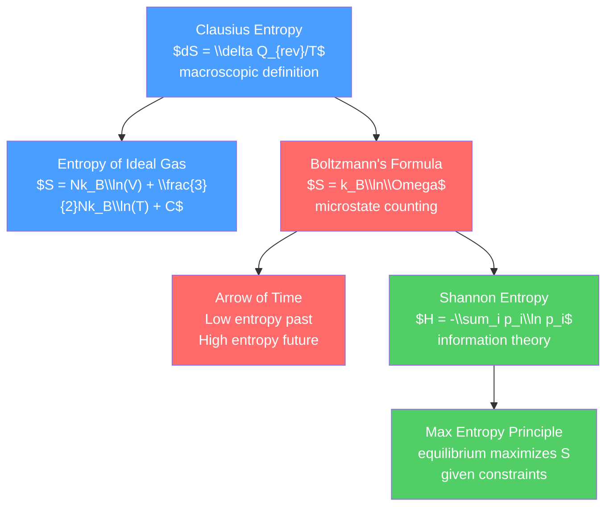

# ♾️ Entropy and the Second Law

> [!abstract] TL;DR
> Entropy is the central concept of the second law and one of the most profound ideas in all of physics. Clausius defined it operationally as $dS = \delta Q_{rev}/T$; Boltzmann gave it a microscopic meaning as $S = k_B\ln\Omega$ — the logarithm of the number of microstates consistent with a given macrostate. Entropy always increases in any spontaneous, irreversible process. This explains the "arrow of time" — why the past is different from the future — and connects to information theory (Shannon entropy), the erasure of information (Landauer's principle), and black hole thermodynamics.

## Intuition — analogy FIRST

Imagine a messy teenager's room versus a tidy one. The tidy state is achieved in one specific way (everything in its place). The messy state can be achieved in millions of ways (everything scattered differently). Probability alone guarantees the room will tend to get messier over time — not because of any force, but because there are vastly more "messy" configurations than "tidy" ones.

This is entropy. A gas confined to one half of a box (ordered) has far fewer ways to arrange the molecules than a gas filling the whole box (disordered). If you remove the partition, the gas expands irreversibly — not because there's a force pushing it, but because there are so many more ways to be spread out than to be confined.

The "arrow of time" — the fact that mixing happens but unmixing doesn't, that ice melts but water doesn't spontaneously freeze in a warm room — is entirely due to this statistical overwhelming of ordered states by disordered ones.

---

## How It Works



---

## Key Concepts / Details

### Secondary Level

**Entropy as Disorder**

Entropy is a measure of the disorder or randomness of a system. Higher entropy = more disorder.

- Ice melts in a warm room: entropy increases (liquid is more disordered than solid crystal)
- Gas expands into a vacuum: entropy increases (more volume = more ways to arrange molecules)
- Mixing two gases: entropy increases (mixed = more states available)

**Second Law**: the total entropy of an isolated system never decreases:
$$\Delta S_{universe} = \Delta S_{system} + \Delta S_{surroundings} \geq 0$$

($= 0$ for reversible processes, $> 0$ for irreversible)

**Entropy change in typical processes** (ideal gas):
- Isothermal expansion $V_i \to V_f$: $\Delta S = nR\ln(V_f/V_i)$
- Heat transfer $Q$ at constant $T$: $\Delta S = Q/T$
- Two objects at $T_1 > T_2$ exchange heat $Q$: $\Delta S_{total} = Q(1/T_2 - 1/T_1) > 0$

### Undergraduate Level

**Clausius Entropy — State Function**

For any reversible path from state $A$ to state $B$:
$$S_B - S_A = \int_A^B \frac{\delta Q_{rev}}{T}$$

$S$ is a state function (path-independent for reversible processes). For irreversible: $\int \delta Q_{irrev}/T < S_B - S_A$.

**Entropy of an Ideal Gas (Sackur-Tetrode)**

The full entropy of a monatomic ideal gas (from quantum counting):

$$S = Nk_B\left[\ln\left(\frac{V}{N}\left(\frac{4\pi mU}{3Nh^2}\right)^{3/2}\right) + \frac{5}{2}\right]$$

This is the Sackur-Tetrode equation. It gives $S = 0$ at $T = 0$ (third law compliance) and is extensive in $V$ and $N$ (unlike the classical expression, which has the Gibbs paradox).

**Gibbs Paradox and the Role of Quantum Mechanics**

The classical expression for entropy of an ideal gas is not extensive — mixing $N$ molecules in volume $V$ with $N$ identical molecules in another volume $V$ should give the same entropy as having $2N$ molecules in $2V$ (no "entropy of mixing" for identical particles). The classical formula fails; the Sackur-Tetrode formula (which accounts for quantum indistinguishability via $1/N!$) is correct.

### Graduate Level

**Boltzmann's Formula: $S = k_B\ln\Omega$**

For a macrostate defined by $(U, V, N)$, the number of accessible microstates is $\Omega(U,V,N)$.

$$S = k_B\ln\Omega$$

This is the bridge between microscopic physics and thermodynamics. For a monatomic ideal gas, counting quantum states in phase space gives exactly the Sackur-Tetrode formula above.

Example — coin flipping: for $N$ fair coins, the probability of having exactly $N_H$ heads is $W(N_H) = N!/(N_H!(N-N_H)!) \cdot (1/2)^N$. The most probable state ($N_H = N/2$) has the largest $\Omega$ and hence maximum entropy. The probability of a fluctuation where all $N$ coins land heads is $2^{-N}$ — exponentially suppressed.

**The Arrow of Time**

The fundamental laws of physics (Newton's laws, Maxwell's equations, Schrödinger's equation) are time-reversal symmetric. Yet we observe a strong arrow of time. Resolution: the initial state of the universe had enormously low entropy. All subsequent evolution is just the universe's entropy increasing toward maximum. This "past hypothesis" is a cosmological constraint — its ultimate origin is an open problem in physics.

**Ergodic Hypothesis**

For a system in equilibrium, time averages equal ensemble averages:

$$\langle f \rangle_{time} = \langle f \rangle_{ensemble}$$

This is the ergodic hypothesis. It is technically true for "most" systems (Birkhoff's theorem for ergodic systems) but can fail for integrable systems, systems with many conserved quantities, or glassy systems. Its violation is active research (many-body localization, quantum scars).

**Shannon Entropy and Information Theory**

Claude Shannon's (1948) information entropy:

$$H = -\sum_i p_i\log_2 p_i \quad \text{(bits)}$$

or in natural log: $H = -\sum_i p_i\ln p_i$ (nats).

This is formally identical to Boltzmann-Gibbs entropy with $k_B = 1$. Shannon entropy measures information: $H$ is maximized when all outcomes are equally likely (maximum uncertainty). Receiving a message reduces entropy by the amount of information it contains.

**Landauer's Principle**

Erasing one bit of information requires dissipating at least $k_BT\ln 2$ of heat. This connects computation to thermodynamics: information is physical. Landauer's principle has been experimentally verified (2012, Bérut et al.).

**Maximum Entropy Principle (MaxEnt)**

The equilibrium distribution is the one that maximizes entropy subject to the known constraints (energy, particle number). For a system in contact with a heat bath at temperature $T$:

$$p_i = \frac{e^{-\beta E_i}}{Z}, \quad Z = \sum_i e^{-\beta E_i}$$

This is the Boltzmann distribution — derived by maximizing $S = -k_B\sum_i p_i\ln p_i$ subject to $\sum_i p_i = 1$ and $\sum_i p_i E_i = \langle E\rangle$.

```python
import numpy as np
import matplotlib.pyplot as plt
from itertools import product

# Demonstrate Boltzmann's counting: dice roll entropy
# Shows that the most likely macrostate (sum = 7 for two dice) has most microstates

dice_sums = {}
for d1, d2 in product(range(1, 7), range(1, 7)):
    s = d1 + d2
    dice_sums[s] = dice_sums.get(s, 0) + 1

sums = sorted(dice_sums.keys())
counts = [dice_sums[s] for s in sums]

fig, (ax1, ax2) = plt.subplots(1, 2, figsize=(10, 4))
ax1.bar(sums, counts, color='steelblue', edgecolor='white')
ax1.set_xlabel('Sum of two dice')
ax1.set_ylabel('Number of microstates $\\Omega$')
ax1.set_title('Two Dice: Microstates per Macrostate')
ax1.set_xticks(sums)

# Entropy = k_B * ln(Omega)
kB = 1  # natural units
entropy = [kB * np.log(c) for c in counts]
ax2.bar(sums, entropy, color='tomato', edgecolor='white')
ax2.set_xlabel('Sum of two dice')
ax2.set_ylabel('$S = k_B \\ln\\Omega$ (natural units)')
ax2.set_title('Entropy of Two Dice')
ax2.set_xticks(sums)
plt.tight_layout()

# Gas expansion: entropy change calculation
print("\nEntropy change in isothermal gas expansion:")
n, R = 1.0, 8.314  # mol, J/(mol K)
for Vf_Vi in [2, 4, 10, 100]:
    dS = n * R * np.log(Vf_Vi)
    print(f"  V_f/V_i = {Vf_Vi:3d}: ΔS = {dS:.3f} J/K")
```

---

## Real-World Notes

- **Refrigerators**: cool their contents (decrease local entropy) by pumping heat to the environment (increasing external entropy more). Total entropy increases.
- **Life and entropy**: living organisms are highly ordered (low entropy) — but they maintain this by consuming low-entropy energy (sunlight, food) and producing high-entropy waste (heat, CO₂). Evolution is not a thermodynamic violation.
- **Black hole entropy**: Bekenstein-Hawking entropy $S_{BH} = k_B A/(4l_P^2)$ (where $l_P$ is the Planck length) is proportional to horizon area, not volume. This suggests a holographic principle — all information in a volume can be encoded on its boundary surface.
- **Cosmic entropy**: the observable universe's entropy is dominated by supermassive black holes. The total entropy is $\sim 10^{104}$ bits, while the early universe had $\sim 10^{88}$ bits — entropy has grown enormously.
- **Data compression**: Shannon entropy gives the theoretical limit for lossless data compression. GZIP, ZIP, and other algorithms approach this limit; no algorithm can compress below $H$ bits per symbol on average.

---

## Common Pitfalls

1. **Entropy is not "disorder" in everyday language**: "disorder" is a colloquial description. More precisely, entropy measures the logarithm of the number of accessible microstates — the "phase space volume."
2. **Entropy is a state function, not a process**: $S$ depends only on the current state (T, P, V) of the system, not on how it got there. $\Delta S$ for a process depends only on initial and final states (computed via any reversible path).
3. **Second law applies to isolated systems**: a system's entropy can decrease if it interacts with its environment (refrigerators, living things). Only the total entropy of the system + environment must increase.
4. **Boltzmann vs Shannon entropy**: they are mathematically identical up to a constant ($k_B$) and choice of log base. Boltzmann entropy uses natural log with $k_B$ in J/K; Shannon uses $\log_2$ in bits. They measure the same thing.
5. **Maximum entropy at equilibrium**: entropy is maximized for equilibrium given the constraints. If you specify energy exactly (microcanonical), all microstates with that energy are equally probable (uniform distribution over energy shell).

---

## Related Concepts

- [[_MOC_Thermodynamics|↑ Section MOC]]
- [[Laws_of_Thermodynamics]] — operational second law and Carnot efficiency
- [[Classical_Statistical_Mechanics]] — partition function and Gibbs entropy
- [[Kinetic_Theory_of_Gases]] — Boltzmann's H-theorem as microscopic second law

---

## Review Questions

1. **Secondary**: A hot object at 400 K and a cold object at 200 K exchange 100 J of heat. Calculate the entropy change of each object and the total entropy change. Is this process spontaneous?
2. **Undergraduate**: Derive the Sackur-Tetrode equation for the entropy of a monatomic ideal gas. Show it satisfies the third law ($S \to 0$ as $T \to 0$) and resolves the Gibbs paradox.
3. **Graduate**: Derive the canonical (Boltzmann) distribution by maximizing the entropy $S = -k_B\sum_i p_i\ln p_i$ subject to the constraints $\sum_i p_i = 1$ and $\sum_i p_i E_i = \langle U\rangle$ using Lagrange multipliers. Identify the Lagrange multiplier $\beta = 1/(k_BT)$.

---

## Sources

- Callen — *Thermodynamics and an Introduction to Thermostatistics*, 2nd ed., Ch. 1–5
- Boltzmann, L. (1877) — "Über die Beziehung..." (original $S = k\ln W$ paper)
- Shannon, C.E. (1948) — "A Mathematical Theory of Communication," *Bell System Technical J.*
- Penrose, R. — *The Emperor's New Mind*, Ch. 7 (arrow of time)

#physics #thermodynamics #entropy #SecondLaw #Boltzmann #Shannon #arrowOfTime #information #secondary #undergraduate #graduate
