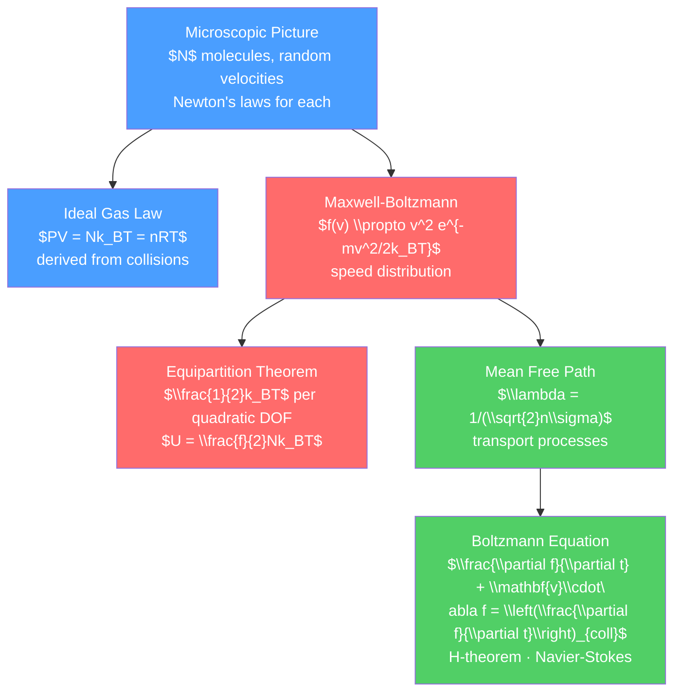

# 💨 Kinetic Theory of Gases

> [!abstract] TL;DR
> Kinetic theory bridges the microscopic world of atoms to macroscopic thermodynamics by treating a gas as an enormous number of randomly moving particles. The ideal gas law $PV = nRT$ emerges from Newton's second law applied to molecular collisions with a container wall. The Maxwell-Boltzmann speed distribution gives the probability of finding a molecule with a given speed, and the equipartition theorem assigns $\tfrac{1}{2}k_BT$ of energy to each quadratic degree of freedom. At graduate level, Boltzmann's transport equation provides the microscopic basis for the Navier-Stokes equations and transport coefficients.

## Intuition — analogy FIRST

Imagine a room full of billiard balls bouncing off each other and the walls in complete chaos. Each ball moves in a straight line until it hits something, then bounces off and goes in a new direction. This is essentially what happens in a gas at the molecular level — with $\sim 10^{25}$ molecules per cubic meter instead of a few dozen billiard balls.

The pressure you feel on the walls of the room is simply the combined effect of billions of molecular collisions per second per square centimeter. Temperature is a measure of how fast the balls are moving on average. Heating a gas means making the molecules move faster — they hit the walls harder and more frequently, increasing pressure.

---

## How It Works



---

## Key Concepts / Details

### Secondary Level

**Ideal Gas Law from Molecular Motion**

Consider $N$ molecules of mass $m$ in a cubic box of side $L$. A molecule with velocity $v_x$ bounces off the right wall, transferring momentum $2mv_x$ per collision. Collision rate = $v_x/(2L)$. Force on wall from one molecule = $mv_x^2/L$. Summing over all $N$ molecules:

$$P = \frac{F}{A} = \frac{Nm\langle v^2\rangle}{3V} = \frac{Nm\langle v_x^2\rangle}{V} \quad \text{(since } \langle v_x^2\rangle = \langle v_y^2\rangle = \langle v_z^2\rangle = \langle v^2\rangle/3\text{)}$$

Comparing with $PV = Nk_BT$: average kinetic energy per molecule $= \tfrac{3}{2}k_BT$.

**Root Mean Square Speed**:

$$v_{rms} = \sqrt{\langle v^2\rangle} = \sqrt{\frac{3k_BT}{m}} = \sqrt{\frac{3RT}{M}}$$

For nitrogen at 300 K: $v_{rms} \approx 517$ m/s.

### Undergraduate Level

**Maxwell-Boltzmann Speed Distribution**

For an ideal gas in equilibrium at temperature $T$:

$$f(v) = 4\pi\left(\frac{m}{2\pi k_BT}\right)^{3/2}v^2\exp\left(-\frac{mv^2}{2k_BT}\right)$$

(This is the speed distribution — the distribution of $|\vec{v}|$, not $v_x$, $v_y$, $v_z$ individually.)

Key speeds:
- Most probable: $v_p = \sqrt{2k_BT/m}$
- Mean speed: $\bar{v} = \sqrt{8k_BT/\pi m}$
- RMS speed: $v_{rms} = \sqrt{3k_BT/m}$

Ordering: $v_p < \bar{v} < v_{rms}$.

**Equipartition Theorem**

For a system in thermal equilibrium at temperature $T$, each independent quadratic term in the energy has average energy $\tfrac{1}{2}k_BT$:

$$\left\langle \frac{1}{2}mv_x^2\right\rangle = \frac{k_BT}{2}$$

| Molecule type | Translational DOF | Rotational DOF | Vibrational DOF | $C_V/(Nk_B)$ (classical) |
|--------------|-------------------|----------------|-----------------|--------------------------|
| Monatomic | 3 | 0 | 0 | 3/2 |
| Diatomic (rigid) | 3 | 2 | 0 | 5/2 |
| Diatomic (vibrating) | 3 | 2 | 2 | 7/2 |
| Nonlinear polyatomic | 3 | 3 | $3N-6$ | $3 + (3N-6)$ |

Note: at room temperature, vibrational modes of small molecules are typically "frozen out" (quantum effect — $k_BT \ll \hbar\omega_{vib}$), so diatomic gases like $\text{N}_2, \text{O}_2$ have $C_V = \frac{5}{2}k_B$ rather than $\frac{7}{2}k_B$.

**Mean Free Path**

Average distance between collisions for a molecule of diameter $d$:

$$\lambda = \frac{1}{\sqrt{2}\,n\,\pi d^2} = \frac{k_BT}{\sqrt{2}\,P\,\pi d^2}$$

where $n = N/V$ is number density. For air at STP: $\lambda \approx 70$ nm.

**Transport Properties** (from kinetic theory):

- Viscosity: $\eta = \frac{1}{3}\rho\bar{v}\lambda = \frac{1}{3}nm\bar{v}\lambda$ (independent of pressure!)
- Thermal conductivity: $\kappa = \frac{1}{3}n\bar{v}\lambda C_V$
- Diffusion coefficient: $D = \frac{1}{3}\bar{v}\lambda$

Maxwell's remarkable prediction: viscosity of a gas is independent of pressure (confirmed experimentally, valid over wide pressure range).

### Graduate Level

**Boltzmann Transport Equation**

The single-particle distribution function $f(\vec{r}, \vec{p}, t)$ satisfies:

$$\frac{\partial f}{\partial t} + \vec{v}\cdot\nabla_r f + \vec{F}\cdot\nabla_p f = \left(\frac{\partial f}{\partial t}\right)_{coll}$$

The left side is the Liouville equation (phase space flow); the right side is the collision integral.

**H-Theorem**: Boltzmann proved that the quantity $H = \int f\ln f\, d^3r\, d^3p$ can only decrease with time (for the Boltzmann collision integral):

$$\frac{dH}{dt} \leq 0$$

This provides the microscopic origin of the second law. The equilibrium distribution ($dH/dt = 0$) is the Maxwell-Boltzmann distribution.

**Chapman-Enskog Expansion**

Expanding $f = f^{(0)}(1 + \phi)$ around the local equilibrium distribution $f^{(0)}$ and solving perturbatively yields the Navier-Stokes equations:

$$\rho\left(\frac{\partial\vec{u}}{\partial t} + \vec{u}\cdot\nabla\vec{u}\right) = -\nabla P + \eta\nabla^2\vec{u}$$

with $\eta = (5\pi/32)nm\bar{v}\lambda$ (Chapman-Enskog result for hard spheres). This is the derivation of macroscopic fluid dynamics from molecular motion.

**Beyond the Ideal Gas**

Van der Waals equation:
$$\left(P + \frac{aN^2}{V^2}\right)(V - Nb) = Nk_BT$$

$a$ accounts for molecular attractions; $b$ for finite molecular size. Gives a qualitatively correct description of the gas-liquid phase transition.

Virial expansion (systematic improvement):
$$\frac{PV}{Nk_BT} = 1 + \frac{B_2(T)}{V/N} + \frac{B_3(T)}{(V/N)^2} + \cdots$$

where $B_2(T)$ is the second virial coefficient, computed from the pair potential.

```python
import numpy as np
import matplotlib.pyplot as plt
from scipy.constants import k, N_A

def maxwell_boltzmann(v, m_kg, T):
    """Maxwell-Boltzmann speed distribution"""
    return 4*np.pi * (m_kg/(2*np.pi*k*T))**1.5 * v**2 * np.exp(-m_kg*v**2/(2*k*T))

v = np.linspace(0, 2000, 500)  # m/s
m_N2 = 28e-3 / N_A  # kg per molecule for N2

fig, ax = plt.subplots(figsize=(8, 5))
for T, color, label in [(100, 'blue', '100 K'), (300, 'green', '300 K'),
                         (1000, 'red', '1000 K'), (3000, 'purple', '3000 K')]:
    f = maxwell_boltzmann(v, m_N2, T)
    ax.plot(v, f * 1e-3, color=color, label=label, lw=2)
    # Mark most probable speed
    vp = np.sqrt(2*k*T/m_N2)
    ax.axvline(vp, color=color, linestyle='--', alpha=0.5)

ax.set_xlabel('Speed (m/s)')
ax.set_ylabel('f(v) × 10³ (s/m)')
ax.set_title('Maxwell-Boltzmann Speed Distribution for N₂\n(dashed = most probable speed)')
ax.legend()
ax.set_xlim(0, 2000)
plt.tight_layout()

# Verify equipartition
print("\nEquipartition check:")
for T in [100, 300, 1000]:
    f = maxwell_boltzmann(v, m_N2, T)
    KE_avg = np.trapz(0.5 * m_N2 * v**2 * f, v)
    expected = 1.5 * k * T
    print(f"T={T}K: <KE> = {KE_avg:.4e} J, 3/2 kT = {expected:.4e} J")
```

---

## Real-World Notes

- **Atmospheric escape**: only atoms/molecules in the high-velocity tail of the Maxwell-Boltzmann distribution can escape Earth's gravity. Hydrogen (lightest) has highest speeds — this is why Earth's atmosphere has little hydrogen (it escaped over billions of years).
- **Chemical reaction rates**: the Arrhenius equation $k = Ae^{-E_a/k_BT}$ reflects that only molecules in the high-energy tail of the distribution have enough energy to surmount the activation barrier.
- **Effusion and gas separation**: Graham's law $r_1/r_2 = \sqrt{M_2/M_1}$ (lighter gas effuses faster) follows from $\bar{v} \propto 1/\sqrt{m}$. Used in uranium isotope separation (UF₆ gas diffusion).
- **Viscosity and altitude**: because gas viscosity is independent of pressure, aircraft lubricants have the same viscosity at sea level and at cruising altitude.
- **Stars**: stellar cores reach $T \sim 10^7$ K; nuclear fusion occurs when particles in the tail of the Maxwell-Boltzmann distribution have enough energy to tunnel through the Coulomb barrier (quantum tunneling + thermal distribution).

---

## Common Pitfalls

1. **Most probable $\neq$ mean $\neq$ RMS speed**: the three characteristic speeds are ordered $v_p < \bar{v} < v_{rms}$, with ratios $1 : \sqrt{4/\pi} : \sqrt{3/2}$.
2. **Equipartition fails at low temperature**: quantum mechanics freezes out high-frequency modes when $k_BT \ll \hbar\omega$. Rotational modes of hydrogen at room temperature, and vibrational modes of all small molecules, are partially or fully frozen.
3. **Mean free path is ensemble average**: individual molecules don't travel exactly $\lambda$ between collisions — it follows an exponential distribution with mean $\lambda$.
4. **H-theorem and irreversibility**: Boltzmann's H-theorem shows $dH/dt \leq 0$ on average, but does not explain why the universe started with low entropy. The "reversibility paradox" and "recurrence paradox" show that $H$ must eventually increase — but on astronomically long timescales.
5. **Van der Waals liquid-gas transition**: the isotherm below the critical temperature has a region of negative $\partial P/\partial V > 0$ — unphysical. Maxwell construction replaces this with a flat "tie line" representing the coexistence region.

---

## Related Concepts

- [[_MOC_Thermodynamics|↑ Section MOC]]
- [[Laws_of_Thermodynamics]] — macro laws that kinetic theory derives
- [[Entropy_and_Second_Law]] — Boltzmann's H-theorem and microscopic entropy
- [[Classical_Statistical_Mechanics]] — more systematic ensemble approach

---

## Review Questions

1. **Secondary**: Using kinetic theory, derive the expression for gas pressure $P = \frac{1}{3}\rho v_{rms}^2$. What is the rms speed of oxygen molecules at 300 K? ($M_{O_2} = 32$ g/mol)
2. **Undergraduate**: (a) Derive the Maxwell-Boltzmann speed distribution from the velocity distribution (which is a product of three independent Gaussians). (b) Use the equipartition theorem to predict $C_V$ for a diatomic ideal gas at room temperature. Why doesn't the vibrational mode contribute?
3. **Graduate**: Outline the derivation of the Navier-Stokes equations from the Boltzmann transport equation via the Chapman-Enskog expansion. What assumptions are made? What is the relationship between the viscosity $\eta$ and microscopic quantities $\bar{v}$ and $\lambda$?

---

## Sources

- Kittel & Kroemer — *Thermal Physics*, 2nd ed., Ch. 14
- Reif — *Fundamentals of Statistical and Thermal Physics*, Ch. 7
- Huang — *Statistical Mechanics*, 2nd ed., Ch. 3–5
- Chapman & Cowling — *Mathematical Theory of Non-Uniform Gases*

#physics #thermodynamics #kinetic-theory #MaxwellBoltzmann #equipartition #meanFreePath #BoltzmannEquation #secondary #undergraduate #graduate
