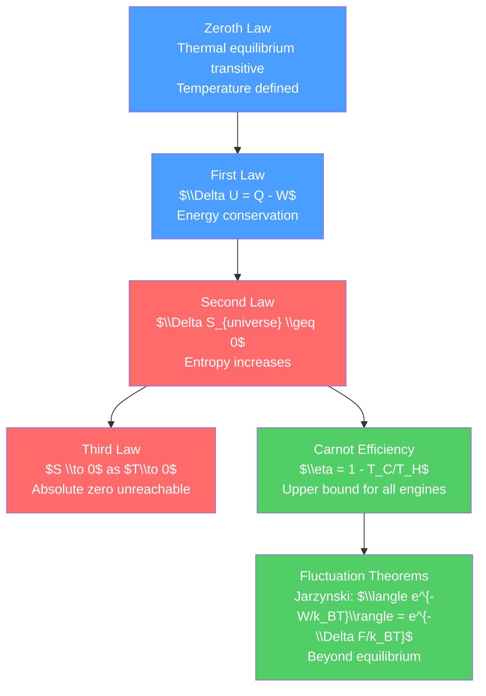

# 🔥 Laws of Thermodynamics

> [!abstract] TL;DR
> The four laws of thermodynamics are among the most universal and unbreakable rules in all of physics. The zeroth law establishes temperature as a meaningful quantity; the first law is energy conservation for thermal processes ($\Delta U = Q - W$); the second law declares that entropy never decreases ($\Delta S_{universe} \geq 0$), limiting heat engine efficiency; and the third law says absolute zero is unattainable. At the graduate level, the Carnot theorem, entropy production, and modern fluctuation theorems (Jarzynski, Crooks) extend thermodynamics to small systems far from equilibrium.

## Intuition — analogy FIRST

Think of a steam engine. Coal burns, water boils, steam pushes a piston — motion is produced from heat. The first law says you can't get more work out than the total energy (heat) you put in. But the second law is more ruthless: you can't even get *all* the heat out as work. Some must be dumped to a cold reservoir. The maximum efficiency is set by the temperature ratio — a profound result that depends on nothing but the temperatures involved.

Three things you can never build, by the laws of thermodynamics:
1. **Perpetual motion machine of the 1st kind**: outputs more work than energy input (violates 1st law)
2. **Perpetual motion machine of the 2nd kind**: converts heat entirely to work with no cold exhaust (violates 2nd law)
3. **Absolute zero machine**: actually reaches 0 K by any finite process (3rd law)

---

## How It Works



---

## Key Concepts / Details

### Secondary Level

**Zeroth Law**

If system A is in thermal equilibrium with system C, and system B is in thermal equilibrium with system C, then A and B are in thermal equilibrium with each other. This justifies temperature as a measurable, transitive property.

**First Law: Energy Conservation**

$$\Delta U = Q - W$$

where:
- $\Delta U$ = change in internal energy (state function)
- $Q$ = heat absorbed by the system
- $W$ = work done *by* the system

Sign convention: heat *into* the system is positive; work done *by* the system is positive.

For an ideal gas: $U = nC_V T$ (depends only on temperature).

Specific processes:
| Process | Constraint | Work done |
|---------|-----------|-----------|
| Isothermal | $T = $ const | $W = nRT\ln(V_f/V_i)$ |
| Adiabatic | $Q = 0$ | $W = -\Delta U = -nC_V\Delta T$ |
| Isochoric | $V = $ const | $W = 0$, $\Delta U = Q$ |
| Isobaric | $P = $ const | $W = P\Delta V$ |

**Second Law (basic)**

Heat flows spontaneously from hot to cold, never the reverse. No engine operating between temperatures $T_H$ and $T_C < T_H$ can be more efficient than a Carnot engine:

$$\eta_{Carnot} = 1 - \frac{T_C}{T_H}$$

For a coal plant: $T_H \approx 800$ K, $T_C \approx 300$ K, $\eta_{max} \approx 62\%$. Real plants achieve ~40%.

**Third Law**

The entropy of a perfect crystal at $T = 0$ K is zero. In practice: it is impossible to reach absolute zero by any finite series of processes.

### Undergraduate Level

**Clausius Statement and Kelvin-Planck Statement**

*Clausius*: It is impossible to construct a device whose sole effect is to transfer heat from a cold body to a hot body (without work input). — No refrigerator works for free.

*Kelvin-Planck*: It is impossible to construct a device that, operating in a cycle, produces no other effect than the absorption of heat from a reservoir and the performance of an equivalent amount of work. — No perfect heat engine.

Both are equivalent statements of the second law.

**Carnot Cycle**

The Carnot cycle is the most efficient cycle operating between $T_H$ and $T_C$:

1. Isothermal expansion at $T_H$: absorbs $Q_H$
2. Adiabatic expansion: cools from $T_H$ to $T_C$
3. Isothermal compression at $T_C$: rejects $|Q_C|$
4. Adiabatic compression: heats from $T_C$ to $T_H$

Efficiency: $\eta = W_{net}/Q_H = 1 - Q_C/Q_H = 1 - T_C/T_H$

Coefficient of Performance (refrigerator): $COP = Q_C/W = T_C/(T_H - T_C)$

**Entropy**

Clausius defined entropy:
$$dS = \frac{\delta Q_{rev}}{T}$$

For reversible processes: $\Delta S_{system} + \Delta S_{environment} = 0$. For irreversible: $\Delta S_{total} > 0$.

**Carnot Theorem Proof**

Suppose an engine $E$ is more efficient than a Carnot engine $C$. Run $C$ in reverse as a heat pump using the work from $E$. The combined device transfers heat from $T_C$ to $T_H$ with no work input, violating the Clausius statement. Contradiction — Carnot efficiency is the upper bound.

### Graduate Level

**Entropy Production**

For any irreversible process:
$$\frac{dS_{total}}{dt} = \sigma \geq 0$$

where $\sigma$ is the entropy production rate. For a heat flux $\vec{J}_Q$ in a temperature gradient:
$$\sigma = \vec{J}_Q\cdot\nabla(1/T) \geq 0$$

Onsager's reciprocal relations (1931) relate the fluxes to the forces in systems near equilibrium: $J_i = \sum_j L_{ij}X_j$ with $L_{ij} = L_{ji}$.

**Endo-reversible Engines**

Real engines have finite power because the Carnot cycle is infinitely slow. For an endo-reversible engine (internally reversible but with finite heat transfer at the boundaries), Curzon and Ahlborn (1975) derived the efficiency at maximum power:

$$\eta_{CA} = 1 - \sqrt{\frac{T_C}{T_H}}$$

For typical power plants: $\eta_{CA}$ agrees better with observed efficiencies than $\eta_{Carnot}$.

**Fluctuation Theorems**

For small systems (biological motors, nanomachines) driven far from equilibrium, macroscopic thermodynamics fails. Fluctuation theorems quantify the probability of entropy-decreasing fluctuations:

*Jarzynski equality* (1997):
$$\langle e^{-W/k_BT}\rangle = e^{-\Delta F/k_BT}$$

where $W$ is the work done in a non-equilibrium process and $\Delta F$ is the equilibrium free energy difference. This powerful result holds even far from equilibrium and has enabled free energy measurements in single-molecule experiments.

*Crooks fluctuation theorem*:
$$\frac{P_F(W)}{P_R(-W)} = e^{(W-\Delta F)/k_BT}$$

where $P_F(W)$ is the probability of performing work $W$ in the forward process and $P_R(-W)$ is the probability for the reverse process.

```python
import numpy as np
import matplotlib.pyplot as plt

# Carnot efficiency vs temperature ratio
T_C = 300  # K (cold reservoir, ~room temperature)
T_H_range = np.linspace(310, 2000, 200)

eta_Carnot = 1 - T_C / T_H_range
eta_CA = 1 - np.sqrt(T_C / T_H_range)  # Curzon-Ahlborn (max power)

plt.figure(figsize=(7, 5))
plt.plot(T_H_range, eta_Carnot * 100, label='Carnot (max efficiency)', lw=2)
plt.plot(T_H_range, eta_CA * 100, '--', label='Curzon-Ahlborn (max power)', lw=2)

# Mark typical systems
systems = {'Coal plant\n($T_H$=800K)': 800, 'Gas turbine\n($T_H$=1300K)': 1300}
for name, TH in systems.items():
    eta_c = (1 - T_C/TH) * 100
    eta_ca = (1 - np.sqrt(T_C/TH)) * 100
    plt.scatter([TH], [eta_c], zorder=5)
    plt.scatter([TH], [eta_ca], zorder=5)

plt.xlabel('Hot reservoir temperature $T_H$ (K)')
plt.ylabel('Efficiency (%)')
plt.title(f'Heat Engine Efficiency ($T_C = {T_C}$ K)')
plt.legend()
plt.grid(True, alpha=0.3)
plt.tight_layout()
```

---

## Real-World Notes

- **Power plants**: all thermal power stations (coal, gas, nuclear) are Carnot-limited. Efficiency gains require either higher operating temperatures (materials engineering challenge) or combined cycles (gas turbine exhaust heats steam turbine — up to ~60% combined efficiency).
- **Refrigerators and heat pumps**: coefficient of performance can exceed 1 (for heat pumps) — you move more heat than the work input, but the second law still applies.
- **Biological machines**: ATP synthase (the cellular energy motor) operates at ~40% efficiency, close to the Curzon-Ahlborn maximum power efficiency for its operating temperatures.
- **Cosmology**: the universe's entropy is constantly increasing. The initial low entropy of the Big Bang is one of the deep unsolved problems in cosmology.
- **Black hole thermodynamics**: Bekenstein and Hawking showed black holes have entropy $S = k_B A/(4l_P^2)$ and temperature $T_H = \hbar c^3/(8\pi G M k_B)$ — the laws of thermodynamics apply to black holes.

---

## Common Pitfalls

1. **Sign convention for $W$**: some textbooks use $\Delta U = Q + W$ (work done *on* the system is positive — chemistry convention). Be explicit about which convention you're using.
2. **Carnot efficiency is an upper bound, not an average**: a real engine can have lower efficiency due to friction, heat leaks, non-quasi-static processes. No real engine can exceed Carnot efficiency.
3. **Third law and entropy = 0**: the third law refers to a perfect crystalline substance. For glasses (disordered), residual entropy may remain at $T = 0$.
4. **Second law applies to the universe**: the entropy of a *subsystem* can decrease (refrigerator cools and orders things inside), as long as the total entropy including the environment increases.
5. **Clausius vs Boltzmann entropy**: Clausius entropy $S = \int dQ_{rev}/T$ is an operational definition; Boltzmann's $S = k_B\ln\Omega$ is microscopic. They give the same result for equilibrium systems. See [[Entropy_and_Second_Law]].

---

## Related Concepts

- [[_MOC_Thermodynamics|↑ Section MOC]]
- [[Entropy_and_Second_Law]] — deep dive into entropy as a state function and its microscopic meaning
- [[Thermodynamic_Potentials]] — free energies encode equilibrium conditions for various constraints
- [[Classical_Statistical_Mechanics]] — statistical derivation of the thermodynamic laws

---

## Review Questions

1. **Secondary**: A Carnot engine operates between 600 K and 300 K. (a) What is its maximum efficiency? (b) If it absorbs 1000 J from the hot reservoir, how much work does it do and how much heat is rejected to the cold reservoir?
2. **Undergraduate**: Prove the equivalence of the Clausius and Kelvin-Planck statements of the second law. (Hint: assume one fails and show the other must fail.)
3. **Graduate**: State and derive the Jarzynski equality. What assumptions are required? Explain how it can be used to extract equilibrium free energy differences from irreversible single-molecule pulling experiments.

---

## Sources

- Callen — *Thermodynamics and an Introduction to Thermostatistics*, 2nd ed., Ch. 1–4
- Fermi — *Thermodynamics* (classic short text)
- Jarzynski, C. (1997) — "Nonequilibrium Equality for Free Energy Differences," *PRL* 78, 2690
- Curzon & Ahlborn (1975) — *Am. J. Phys.* 43, 22

#physics #thermodynamics #firstlaw #secondlaw #Carnot #entropy #fluctuationtheorems #secondary #undergraduate #graduate
