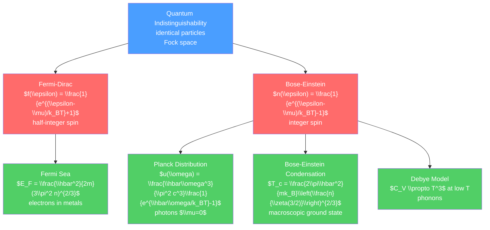

# 🌡️ Quantum Statistical Mechanics

> [!abstract] TL;DR
> When particles are indistinguishable and quantum mechanics applies, the Boltzmann distribution gives way to Fermi-Dirac statistics (half-integer spin — "no two in the same state") or Bose-Einstein statistics (integer spin — bosons actually prefer the same state). These quantum distributions explain blackbody radiation (Planck spectrum), the stability of metals (Fermi sea), specific heat of solids (Einstein/Debye models), and Bose-Einstein condensation (macroscopic occupation of the ground state). The energy scales $k_BT$, $\hbar\omega$, and $E_F$ govern which regime applies.

## Intuition — analogy FIRST

Classical statistics treats particles as distinguishable labeled balls — each ball can be in any state independently. Quantum mechanics changes the rules: identical particles are truly indistinguishable. There are two possibilities:

**Fermions** (electrons, protons, quarks — half-integer spin): nature enforces the Pauli exclusion principle — no two fermions can occupy the same quantum state. Think of parking spaces: each space holds at most one car. At zero temperature, fermions fill all states up to the Fermi energy like water filling a container.

**Bosons** (photons, helium-4, Cooper pairs — integer spin): bosons actually *prefer* to be in the same state — stimulated emission, laser action, and Bose-Einstein condensation are all manifestations. Think of parking where cars attract each other — once one car parks in a spot, others are more likely to join it.

---

## How It Works



---

## Key Concepts / Details

### Undergraduate Level

**Quantum Statistics: Two Distributions**

The mean occupation number of a single quantum state with energy $\epsilon$ at temperature $T$ and chemical potential $\mu$:

$$\langle n_\epsilon\rangle = \frac{1}{e^{(\epsilon-\mu)/k_BT} \pm 1}$$

- $+1$: Fermi-Dirac (fermions, half-integer spin)
- $-1$: Bose-Einstein (bosons, integer spin)
- Classical limit ($e^{(\epsilon-\mu)/k_BT} \gg 1$): both → Maxwell-Boltzmann $e^{-(\epsilon-\mu)/k_BT}$

Classical limit requires $n\lambda_{th}^3 \ll 1$ (low density, high temperature).

**Blackbody Radiation: Planck Distribution**

Photons are bosons with $\mu = 0$ (no conservation of photon number). The spectral energy density:

$$u(\omega) = \frac{\hbar\omega^3}{\pi^2 c^3}\frac{1}{e^{\hbar\omega/k_BT}-1}$$

Key results:
- Wien's displacement law: $\lambda_{max} T = 2.898\times10^{-3}$ m·K
- Stefan-Boltzmann law: $\int u\,d\omega = \sigma T^4$ where $\sigma = 5.67\times10^{-8}$ W/(m²K⁴)
- Total intensity: $I = \sigma T^4$

At low frequency ($\hbar\omega \ll k_BT$): Planck → Rayleigh-Jeans ($u \propto \omega^2 T$, classical)
At high frequency: exponential suppression (avoids ultraviolet catastrophe)

**Fermi-Dirac: Electrons in Metals**

At $T = 0$, all states below the Fermi energy $E_F$ are filled, all above are empty:

$$f(\epsilon) = \begin{cases} 1 & \epsilon < E_F \\ 0 & \epsilon > E_F \end{cases} \quad (T=0)$$

Fermi energy (3D free electrons, number density $n$):

$$E_F = \frac{\hbar^2}{2m}(3\pi^2 n)^{2/3}$$

For copper: $n \approx 8.5\times10^{28}$ m$^{-3}$, $E_F \approx 7.0$ eV (Fermi temperature $T_F = E_F/k_B \approx 80,000$ K).

At room temperature $T \ll T_F$: the Fermi sea is largely unchanged. This explains why electrons don't contribute much to the heat capacity of metals classically (they would contribute $\tfrac{3}{2}k_B$ per electron, but $C_V^{el} = \pi^2k_B^2T/(3E_F) \cdot n$ — a factor $T/T_F \sim 1/300$ smaller).

**Bose-Einstein Distribution: General Bosons**

For bosons with a conserved number (e.g., $^4$He atoms, cold atomic gases), $\mu \leq 0$ is required for stability ($\langle n\rangle \geq 0$ requires $\mu \leq \epsilon$ for all $\epsilon$).

The total number:
$$N = \int_0^\infty \frac{g(\epsilon)}{e^{(\epsilon-\mu)/k_BT}-1}\,d\epsilon$$

As $T$ decreases at fixed $N$, $\mu$ increases toward 0. When $\mu \to 0^-$, the ground state ($\epsilon = 0$) becomes macroscopically occupied: this is **Bose-Einstein condensation**.

### Graduate Level

**Grand Canonical Treatment of Ideal Quantum Gases**

Grand partition function (independent quantum states):

$$\ln\mathcal{Z} = \mp\sum_\epsilon g_\epsilon\ln(1 \mp e^{-\beta(\epsilon-\mu)})$$

where $g_\epsilon$ is the degeneracy and upper/lower signs are for bosons/fermions.

Grand potential: $\Omega_{GC} = -k_BT\ln\mathcal{Z} = \mp k_BT\sum_\epsilon g_\epsilon\ln(1 \mp e^{-\beta(\epsilon-\mu)})$

**Density of States in 1D, 2D, 3D**

For a free particle in $d$ dimensions:

$$g(\epsilon) \propto \epsilon^{d/2-1}$$

| Dimension | $g(\epsilon)$ | Behavior |
|-----------|--------------|---------|
| 1D | $\propto \epsilon^{-1/2}$ | Diverges at $\epsilon = 0$ |
| 2D | $\propto \epsilon^0$ (constant) | Step function for $T=0$ Fermi gas |
| 3D | $\propto \epsilon^{1/2}$ | Vanishes at $\epsilon = 0$ |

**BEC Critical Temperature**

For bosons in 3D at $\mu = 0$:

$$N - N_0 = \int_0^\infty \frac{g(\epsilon)}{e^{\beta\epsilon}-1}d\epsilon = \frac{V}{\lambda_{th}^3}\zeta(3/2) \quad (\mu\to 0^-)$$

where $\zeta(3/2) \approx 2.612$ is the Riemann zeta function. The critical temperature:

$$T_c = \frac{2\pi\hbar^2}{mk_B}\left(\frac{n}{\zeta(3/2)}\right)^{2/3}$$

Below $T_c$, the fraction in the condensate:

$$\frac{N_0}{N} = 1 - \left(\frac{T}{T_c}\right)^{3/2}$$

BEC in dilute atomic gases was achieved in 1995 (Cornell & Wieman for Rb-87, Ketterle for Na-23; Nobel Prize 2001). Temperatures: $T_c \sim$ 100 nK. The condensate is a macroscopic quantum state — a coherent matter wave.

**Note on 1D/2D**: BEC does not occur in 1D or 2D ideal gas (density of states argument: the integral $\int g(\epsilon)/(e^{\beta\epsilon}-1)d\epsilon$ diverges at $\epsilon=0$ in 1D and 2D, so $\mu$ can always adjust to accommodate any finite $N$). Phase transitions in lower-dimensional systems require interactions.

**Phonon Contribution: Debye Model**

Phonons are quantized vibrations of a crystal lattice — bosons with $\mu = 0$. In the Debye model, phonon dispersion is linear: $\omega = c_s k$ up to a cutoff (Debye frequency $\omega_D$).

Heat capacity at low temperature ($T \ll T_D = \hbar\omega_D/k_B$):

$$C_V = \frac{12\pi^4}{5}Nk_B\left(\frac{T}{T_D}\right)^3 \propto T^3$$

This $T^3$ law is well-confirmed experimentally (Debye model) and contrasts with the Einstein model ($e^{-\theta_E/T}$ exponential suppression).

At high temperature ($T \gg T_D$): both Debye and Einstein give the Dulong-Petit result $C_V = 3Nk_B$ (classical limit).

**Photon Gas**

Photons are bosons with $\mu = 0$ (no number conservation). In a cavity at temperature $T$:

$$U = \frac{\pi^2 k_B^4 T^4}{15\hbar^3 c^3}V, \qquad P = \frac{U}{3V}$$

The pressure-energy relation $P = U/(3V)$ holds for any ultra-relativistic or massless gas (photons, ultra-relativistic electrons). For a non-relativistic ideal gas: $P = 2U/(3V)$.

```python
import numpy as np
import matplotlib.pyplot as plt
from scipy.constants import k, hbar, c, pi

# Planck distribution and comparison with classical Rayleigh-Jeans
T_vals = [3000, 5778, 10000]  # K (incandescent bulb, Sun surface, hot star)

fig, (ax1, ax2) = plt.subplots(1, 2, figsize=(12, 5))

wavelength = np.linspace(100e-9, 3000e-9, 500)  # m
for T, label in zip(T_vals, ['3000 K (incandescent)', '5778 K (Sun)', '10000 K (hot star)']):
    omega = 2*pi*c / wavelength
    # Planck spectral energy density per wavelength
    B_lam = 2*hbar*c**2/wavelength**5 / (np.exp(hbar*c/(k*T*wavelength)) - 1)
    ax1.plot(wavelength*1e9, B_lam/max(B_lam), label=label, lw=2)

ax1.axvspan(380, 700, alpha=0.2, color='yellow', label='Visible')
ax1.set_xlabel('Wavelength (nm)')
ax1.set_ylabel('Normalized spectral radiance')
ax1.set_title('Planck Blackbody Spectrum')
ax1.legend(fontsize=8)
ax1.set_xlim(0, 3000)

# Fermi-Dirac vs Bose-Einstein vs Boltzmann
epsilon_range = np.linspace(-3, 5, 200)  # in units of kT
mu = 0.0  # chemical potential in units of kT

f_FD = 1 / (np.exp(epsilon_range - mu) + 1)  # Fermi-Dirac
f_BE = 1 / (np.exp(epsilon_range - mu) - 1 + 1e-10)  # Bose-Einstein (avoid zero division)
f_MB = np.exp(-(epsilon_range - mu))  # Maxwell-Boltzmann (classical)

ax2.plot(epsilon_range, f_FD, lw=2, label='Fermi-Dirac (fermions)')
ax2.plot(epsilon_range, np.where(epsilon_range > 0.1, f_BE, np.nan), lw=2, label='Bose-Einstein (bosons)')
ax2.plot(epsilon_range, f_MB, '--', lw=2, label='Maxwell-Boltzmann (classical)')
ax2.axvline(mu, color='k', linestyle=':', label=r'$\mu = 0$')
ax2.set_xlabel(r'$(\epsilon - \mu)/k_BT$')
ax2.set_ylabel(r'$\langle n \rangle$')
ax2.set_title('Quantum vs Classical Occupation Numbers')
ax2.legend(fontsize=9)
ax2.set_ylim(0, 2.5)
ax2.set_xlim(-3, 5)
plt.tight_layout()

# BEC: condensate fraction vs temperature
T_Tc_range = np.linspace(0, 1.5, 200)
N0_N = np.maximum(0, 1 - T_Tc_range**1.5)

print("\nBEC condensate fraction:")
for T_Tc in [0.2, 0.5, 0.8, 1.0]:
    frac = max(0, 1 - T_Tc**1.5)
    print(f"  T/T_c = {T_Tc}: N0/N = {frac:.3f}")
```

---

## Real-World Notes

- **LED and laser technology**: stimulated emission (bosonic enhancement) is the operating principle of lasers. Fermi-Dirac statistics determine the gain curves and threshold conditions for semiconductor lasers.
- **Superconductivity (BCS)**: Cooper pairs (pairs of electrons) act as composite bosons and undergo BEC-like condensation into a coherent macroscopic quantum state, expelling magnetic flux (Meissner effect).
- **White dwarf stars**: electron degeneracy pressure (from the Pauli exclusion principle — Fermi pressure) supports white dwarfs against gravitational collapse. The Chandrasekhar mass limit is where gravity overcomes Fermi pressure.
- **Neutron stars**: at nuclear density, neutron degeneracy pressure (Fermi pressure) supports neutron stars. Above ~2–3 solar masses, the star collapses to a black hole.
- **Quantum computing**: Bose-Einstein condensates and ultracold Fermi gases are used as quantum simulators to study strongly correlated systems that are computationally intractable.

---

## Common Pitfalls

1. **$\mu$ for photons is zero**: photons are not conserved — they can be created and absorbed. The condition $\partial F/\partial N = \mu = 0$ follows from minimizing free energy over photon number.
2. **BEC in 1D/2D requires interactions**: the ideal gas in 1D or 2D does not BEC. Real experiments on 2D systems can show quasi-BEC (Berezinskii-Kosterlitz-Thouless transition) due to interactions.
3. **Debye cutoff**: the Debye model is a classical approximation (linear dispersion, sharp cutoff). Real crystals have complex phonon dispersions, but the $T^3$ law at low $T$ is universal.
4. **Fermion ground state energy is not zero**: the zero-temperature Fermi gas has average energy $(3/5)E_F$ per particle — enormous kinetic energy due to Pauli exclusion. This Fermi pressure exists at $T = 0$.
5. **Chemical potential decreases with $T$ for fermions**: at $T = 0$, $\mu = E_F > 0$. As $T \to \infty$, $\mu \to -\infty$ (classical limit). For bosons, $\mu \leq 0$ always (3D); for photons, $\mu = 0$ always.

---

## Related Concepts

- [[_MOC_Thermodynamics|↑ Section MOC]]
- [[Classical_Statistical_Mechanics]] — the classical limit and partition function formalism
- [[Photoelectric_Effect_and_Compton]] — photons as bosons, early quantum theory
- [[Laws_of_Thermodynamics]] — the third law has different character for quantum systems

---

## Review Questions

1. **Undergraduate**: The Sun emits as a blackbody at $T = 5778$ K. (a) What is the peak wavelength? (b) What is the total power radiated per square meter of the Sun's surface? (c) What is the total luminosity of the Sun? ($R_{Sun} = 6.96\times10^8$ m.)
2. **Graduate**: Derive the Fermi energy for a 3D free electron gas with electron density $n$. Estimate the electronic heat capacity at room temperature and show it is much smaller than the classical value $\tfrac{3}{2}Nk_B$. This explains why early measurements of metallic heat capacity found only atomic vibrational contributions.
3. **PhD**: Derive the BEC critical temperature for an ideal Bose gas in 3D. Why does BEC not occur in an ideal gas in 1D or 2D? Hint: examine the behavior of the density of states integral near $\epsilon = 0$. What does the Mermin-Wagner theorem say about long-range order in low dimensions?

---

## Sources

- Huang — *Statistical Mechanics*, 2nd ed., Ch. 11–13
- Kittel & Kroemer — *Thermal Physics*, 2nd ed., Ch. 7
- Pathria & Beale — *Statistical Mechanics*, 4th ed., Ch. 6–8
- Anderson, M.H. et al. (1995) — "Observation of BEC in Dilute Atomic Vapor," *Science* 269, 198

#physics #statistical-mechanics #FermiDirac #BoseEinstein #blackbody #Planck #BEC #phonons #Debye #undergraduate #graduate
