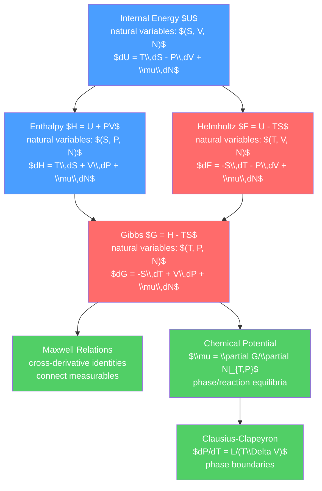

# ⚗️ Thermodynamic Potentials

> [!abstract] TL;DR
> Thermodynamic potentials — internal energy $U$, enthalpy $H$, Helmholtz free energy $F$, and Gibbs free energy $G$ — are four equivalent ways to encode all thermodynamic information about a system, each optimal for different constraint conditions. The Legendre transform elegantly connects them. Maxwell relations (cross-derivative identities like $\partial S/\partial P|_T = -\partial V/\partial T|_P$) connect seemingly unrelated quantities. Chemical potential $\mu$ governs phase equilibria and chemical reactions. The Clausius-Clapeyron equation determines phase boundaries.

## Intuition — analogy FIRST

Think of a ball in a bowl: it settles to the bottom (minimum energy). But if you shake the bowl vigorously (keep it at constant temperature instead of constant energy), the ball doesn't just sit at the bottom — it trades between positions based on a balance of energy and "random jostling" (entropy). The effective potential the ball minimizes is no longer energy alone but free energy — energy minus temperature times entropy.

The free energy $F = U - TS$ captures this: at low temperature, $U$ dominates and the system finds low energy. At high temperature, $TS$ dominates and the system maximizes entropy (disorder). Phase transitions happen when the free energies of two phases cross — whichever has lower $F$ (or $G$ at constant $T, P$) wins.

---

## How It Works



---

## Key Concepts / Details

### Undergraduate Level

**The Four Thermodynamic Potentials**

All four potentials carry equivalent information but are convenient for different experimental conditions:

| Potential | Symbol | Legendre Transform | Natural Variables | Min at equilibrium when |
|-----------|--------|--------------------|-------------------|--------------------------|
| Internal energy | $U$ | — | $S, V, N$ | $S$ and $V$ fixed |
| Enthalpy | $H = U + PV$ | $U - (-P)V$ | $S, P, N$ | $S$ and $P$ fixed (adiabatic, const pressure) |
| Helmholtz free energy | $F = U - TS$ | $U - TS$ | $T, V, N$ | $T$ and $V$ fixed (isochoric heat bath) |
| Gibbs free energy | $G = H - TS$ | $U - TS + PV$ | $T, P, N$ | $T$ and $P$ fixed (most common lab conditions) |

**Fundamental Relations**

From $dU = T\,dS - P\,dV + \mu\,dN$:

$$dH = T\,dS + V\,dP + \mu\,dN$$
$$dF = -S\,dT - P\,dV + \mu\,dN$$
$$dG = -S\,dT + V\,dP + \mu\,dN$$

These allow reading off derivatives:
$$T = \frac{\partial U}{\partial S}\bigg|_{V,N}, \quad -P = \frac{\partial U}{\partial V}\bigg|_{S,N}, \quad \mu = \frac{\partial U}{\partial N}\bigg|_{S,V}$$

**Maxwell Relations**

From the symmetry of second derivatives ($\partial^2/\partial x\partial y = \partial^2/\partial y\partial x$) applied to each potential:

| From | Maxwell Relation |
|------|-----------------|
| $dU$ | $\left(\frac{\partial T}{\partial V}\right)_{S,N} = -\left(\frac{\partial P}{\partial S}\right)_{V,N}$ |
| $dH$ | $\left(\frac{\partial T}{\partial P}\right)_{S,N} = \left(\frac{\partial V}{\partial S}\right)_{P,N}$ |
| $dF$ | $\left(\frac{\partial S}{\partial V}\right)_{T,N} = \left(\frac{\partial P}{\partial T}\right)_{V,N}$ |
| $dG$ | $-\left(\frac{\partial S}{\partial P}\right)_{T,N} = \left(\frac{\partial V}{\partial T}\right)_{P,N}$ |

Maxwell relations are powerful: they express unmeasurable quantities (like $\partial S/\partial P$) in terms of measurable ones ($\partial V/\partial T$ from thermal expansion coefficient).

**Chemical Potential**

$$\mu = \frac{\partial G}{\partial N}\bigg|_{T,P} = \frac{G}{N} \quad \text{(for a single-component system: } G = \mu N\text{)}$$

Equilibrium condition for two phases in contact: $\mu_1 = \mu_2$ (chemical potentials are equal). For a mixture: $\mu_i = \mu_i^0 + k_BT\ln(p_i/p^0)$ (ideal gas, partial pressure $p_i$).

**Stability Conditions**

For a system to be stable (not spontaneously phase-separate):

$$C_V > 0, \quad \kappa_T = -\frac{1}{V}\frac{\partial V}{\partial P}\bigg|_T > 0$$

(positive heat capacity and positive isothermal compressibility). The van der Waals loop (spinodal region where $\partial P/\partial V > 0$) violates $\kappa_T > 0$ — that region is mechanically unstable, leading to phase separation.

### Graduate Level

**Legendre Transform Perspective**

The Legendre transform is the formal machinery connecting the potentials. Given $U(S, V, N)$:

$$H = U + PV \quad \text{(swap } V \leftrightarrow -P\text{)}$$
$$F = U - TS \quad \text{(swap } S \leftrightarrow T\text{)}$$
$$G = U - TS + PV \quad \text{(swap both)}$$

The Legendre transform ensures no information is lost — any potential can recover the others via inverse Legendre transform. This is why all four are equivalent descriptions.

**Phase Equilibria: Clausius-Clapeyron Equation**

Along a phase boundary where $\mu_1(T,P) = \mu_2(T,P)$:

$$\frac{dP}{dT}\bigg|_{coexist} = \frac{S_2 - S_1}{V_2 - V_1} = \frac{L}{T\Delta V}$$

where $L = T\Delta S = T(S_2 - S_1)$ is the latent heat per mole.

For the liquid-vapor boundary with vapor treated as ideal gas ($\Delta V \approx V_{vapor} = RT/P$):

$$\frac{d\ln P}{dT} = \frac{L}{RT^2} \implies P = P_0 e^{-L/RT}$$

This predicts the vapor pressure as a function of temperature (Antoine equation).

**Chemical Reactions and Gibbs Free Energy**

For a chemical reaction $\sum_i \nu_i A_i = 0$ at constant $T, P$:

$$\Delta G_{rxn} = \sum_i \nu_i \mu_i = \Delta G^0 + RT\ln Q$$

where $Q$ is the reaction quotient and $\Delta G^0$ is the standard Gibbs free energy.

Equilibrium: $\Delta G_{rxn} = 0 \implies K_{eq} = e^{-\Delta G^0/RT}$ (van't Hoff equation).

**Thermodynamic Response Functions**

Key response functions expressible via second derivatives of $G$:

- Heat capacity at constant pressure: $C_P = -T\dfrac{\partial^2 G}{\partial T^2}\bigg|_P$
- Isothermal compressibility: $\kappa_T = -\dfrac{1}{V}\dfrac{\partial^2 G}{\partial P^2}\bigg|_T$
- Thermal expansion coefficient: $\alpha_P = \dfrac{1}{V}\dfrac{\partial^2 G}{\partial T\partial P}$

These are related: $C_P - C_V = \dfrac{TV\alpha_P^2}{\kappa_T}$.

```python
import numpy as np
import matplotlib.pyplot as plt

# Clausius-Clapeyron: vapor pressure of water vs temperature
R = 8.314  # J/(mol K)
L_water = 40660  # J/mol latent heat of vaporization (at 100°C)
T0 = 373.15  # K, boiling point at 1 atm
P0 = 101325  # Pa, 1 atm

T = np.linspace(270, 420, 200)  # K
P_vapor = P0 * np.exp(-L_water / R * (1/T - 1/T0))  # Pa

# Convert to different units
P_bar = P_vapor / 1e5
P_atm = P_vapor / P0

fig, (ax1, ax2) = plt.subplots(1, 2, figsize=(10, 4))
ax1.semilogy(T - 273.15, P_bar)
ax1.axhline(1, color='r', linestyle='--', label='1 bar (sea level)')
ax1.set_xlabel('Temperature (°C)')
ax1.set_ylabel('Vapor Pressure (bar, log scale)')
ax1.set_title('Vapor Pressure of Water (Clausius-Clapeyron)')
ax1.legend()
ax1.grid(True, alpha=0.3)

# Phase diagram sketch
T_range = np.linspace(250, 650, 300)
# Ice-water: steep dP/dT (small Delta V, L_fusion = 6010 J/mol)
L_fus = 6010
dV_fus = -1.64e-6  # m^3/mol (water contracts on freezing)
T_tp = 273.16  # triple point K
P_tp = 611.7   # Pa triple point

P_fus = P_tp + L_fus / (T_tp * dV_fus) * (T_range - T_tp)
ax2.fill_between([250, 273.16], [P_tp, P_tp], [1e7, 1e7], alpha=0.2, color='blue', label='Ice')
ax2.fill_between([273, 647], [0, 0], P_vapor[T > 273][:374]/1e5, alpha=0.2, color='cyan', label='Liquid water')
ax2.semilogy(T - 273.15, P_vapor / 1e5, 'b-', lw=2, label='Liquid-vapor')
ax2.set_xlabel('Temperature (°C)')
ax2.set_ylabel('Pressure (bar, log scale)')
ax2.set_title('Water Phase Diagram (schematic)')
ax2.legend()
ax2.set_xlim(-23, 127)
plt.tight_layout()
```

---

## Real-World Notes

- **Batteries**: the open-circuit voltage of an electrochemical cell is $\mathcal{E} = -\Delta G/(nF)$, directly from Gibbs free energy. Lithium-ion battery energy density is determined by $\Delta G$ of the electrode reactions.
- **Protein folding**: proteins fold into their native structure by minimizing Gibbs free energy at physiological conditions ($T = 310$ K, $P = 1$ atm) — the Gibbs free energy of folding is only $\sim 20$–40 kJ/mol (a few $k_BT$).
- **Atmospheric science**: the Clausius-Clapeyron equation determines how much water vapor the atmosphere can hold as temperature rises — central to climate change projections (about 7% more per degree of warming).
- **Cooking at altitude**: at lower atmospheric pressure (high altitude), water boils at lower temperature (Clausius-Clapeyron), so cooking takes longer.
- **Chemical engineering**: equilibrium yield of chemical reactions (Haber process for ammonia, synthesis gas) is optimized by choosing the temperature/pressure that minimizes $G$.

---

## Common Pitfalls

1. **Choosing the wrong potential**: use $F$ (Helmholtz) when $T$ and $V$ are held fixed (e.g., rigid isochoric container in a thermostat). Use $G$ (Gibbs) when $T$ and $P$ are fixed (most laboratory experiments).
2. **Maxwell relations require state functions**: Maxwell relations are derived from the second derivatives of state functions. They fail for non-equilibrium systems or for non-state-function quantities (like heat or work).
3. **Chemical potential is per particle, not per mole**: $\mu = \partial U/\partial N$ is per particle. Molar chemical potential $\mu_{mol} = N_A\mu_{particle}$. Be consistent.
4. **$\Delta G < 0$ is necessary but not sufficient for spontaneity**: $\Delta G < 0$ means the reaction is thermodynamically favorable (will proceed to reduce $G$), but kinetics (activation energy) can prevent it from happening at a measurable rate.
5. **Legendre transforms invert**: you can go back: $U = F + TS$, $H = G + TS$, etc. All potentials contain the same information.

---

## Related Concepts

- [[_MOC_Thermodynamics|↑ Section MOC]]
- [[Laws_of_Thermodynamics]] — the first and second laws are the foundation
- [[Entropy_and_Second_Law]] — entropy and equilibrium conditions
- [[Classical_Statistical_Mechanics]] — partition function gives $F = -k_BT\ln Z$ directly

---

## Review Questions

1. **Undergraduate**: Show that for a process at constant $T$ and $P$, the equilibrium condition is minimum Gibbs free energy. Use this to derive the condition $\mu_1 = \mu_2$ for phase coexistence.
2. **Undergraduate**: Starting from the fundamental relation $dG = -S\,dT + V\,dP$, derive the Maxwell relation $(\partial S/\partial P)_T = -(\partial V/\partial T)_P$ and use it to show that for an ideal gas, $(\partial U/\partial V)_T = 0$.
3. **Graduate**: The Clausius-Clapeyron equation gives $dP/dT = L/(T\Delta V)$. For the solid-liquid transition of water, $\Delta V < 0$ (water expands on freezing). This means the melting point decreases under pressure. Estimate the decrease in melting point when ice is under 100 atm pressure. (Use $L_{fus} = 6$ kJ/mol, $\Delta V \approx -1.6\times10^{-6}$ m³/mol.)

---

## Sources

- Callen — *Thermodynamics and an Introduction to Thermostatistics*, 2nd ed., Ch. 5–8
- Huang — *Statistical Mechanics*, 2nd ed., Ch. 2
- Atkins & de Paula — *Physical Chemistry*, 10th ed. (for chemistry applications)
- Landau & Lifshitz — *Statistical Physics*, Part 1, §15–25

#physics #thermodynamics #freeEnergy #GibbsFreeEnergy #Helmholtz #MaxwellRelations #chemicalPotential #ClausiusClapeyron #undergraduate #graduate
