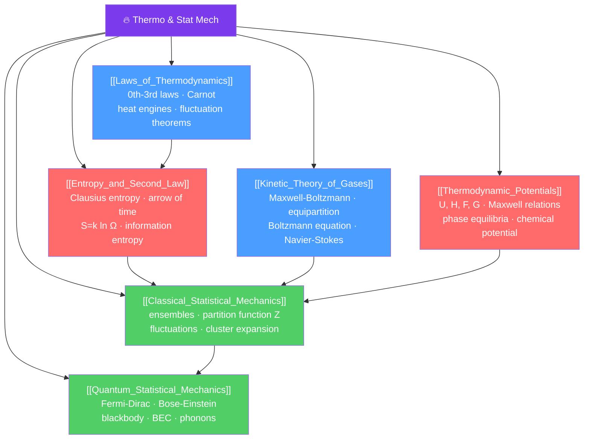

# 🔥 Thermodynamics and Statistical Mechanics — Map of Content

> [!abstract] What This Section Covers
> Thermodynamics gives us the macroscopic laws governing heat, work, and entropy — the four laws that no machine can violate. Statistical mechanics connects these macroscopic laws to the microscopic world of atoms and molecules, deriving thermodynamics from the statistical behavior of $\sim 10^{23}$ particles. The section runs from the operational (heat engines, Carnot efficiency) through the conceptual (entropy and the arrow of time, free energies and equilibrium conditions) to the profound (Boltzmann's $S = k_B\ln\Omega$, quantum statistics, and Bose-Einstein condensation). These ideas connect directly to information theory, black hole thermodynamics, and the foundations of quantum field theory.

## Concept Map

## Learning Path

1. [[Laws_of_Thermodynamics]] — The four laws, heat engines, Carnot efficiency, irreversibility, and fluctuation theorems.
2. [[Kinetic_Theory_of_Gases]] — Maxwell-Boltzmann distribution, equipartition theorem, mean free path, and Boltzmann's transport equation.
3. [[Entropy_and_Second_Law]] — Clausius entropy, the arrow of time, Boltzmann's formula $S = k_B\ln\Omega$, and connections to information theory.
4. [[Thermodynamic_Potentials]] — Internal energy, enthalpy, Helmholtz free energy, Gibbs free energy, Maxwell relations, and phase equilibria.
5. [[Classical_Statistical_Mechanics]] — Microcanonical, canonical, and grand canonical ensembles, partition functions, and fluctuations.
6. [[Quantum_Statistical_Mechanics]] — Quantum indistinguishability, Fermi-Dirac and Bose-Einstein distributions, Planck radiation, and Bose-Einstein condensation.

## All Notes at a Glance

| Note | Difficulty | What You'll Learn |
|------|------------|-------------------|
| [[Laws_of_Thermodynamics]] | Secondary → PhD | Four laws, Carnot, irreversibility, Jarzynski/Crooks fluctuation theorems |
| [[Kinetic_Theory_of_Gases]] | Secondary → PhD | Maxwell-Boltzmann, equipartition, Boltzmann equation, Navier-Stokes derivation |
| [[Entropy_and_Second_Law]] | Secondary → PhD | Entropy, arrow of time, $S = k_B\ln\Omega$, Shannon entropy, max entropy principle |
| [[Thermodynamic_Potentials]] | Undergraduate → PhD | $U$, $H$, $F$, $G$, Maxwell relations, Clausius-Clapeyron, chemical reactions |
| [[Classical_Statistical_Mechanics]] | Undergraduate → PhD | Ensembles, partition function, fluctuations, density of states, virial expansion |
| [[Quantum_Statistical_Mechanics]] | Undergraduate → PhD | Quantum statistics, blackbody radiation, Fermi sea, BEC, Debye model |

## Key Questions This Section Answers

- Why can't any heat engine be 100% efficient — what does the second law actually forbid?
- Where does the Maxwell-Boltzmann speed distribution come from, and what is the equipartition theorem?
- What is entropy at a microscopic level — how does $S = k_B\ln\Omega$ define it?
- How does the partition function $Z$ encode all thermodynamic quantities?
- Why do fermions and bosons behave so differently at low temperature?
- What is Bose-Einstein condensation, and why does it only happen for integer-spin particles?

## Related Sections

- [[_MOC_Physics_Master|↑ Physics Master MOC]]
- [[_MOC_Classical_Mechanics|← Classical Mechanics]] — Hamiltonian phase space and Liouville's theorem are the mechanical underpinning
- [[_MOC_Waves_and_Optics|→ Waves & Optics]] — Blackbody radiation is the bridge to quantum mechanics
- [[_MOC_Quantum_Mechanics|→ Quantum Mechanics]] — Quantum statistics require quantum mechanics as input

## Key References

- Callen — *Thermodynamics and an Introduction to Thermostatistics*, 2nd ed. — postulatory approach
- Kittel & Kroemer — *Thermal Physics*, 2nd ed. — clear undergraduate text
- Huang — *Statistical Mechanics*, 2nd ed. — graduate level
- Landau & Lifshitz — *Statistical Physics*, Part 1, 3rd ed.
- Pathria & Beale — *Statistical Mechanics*, 4th ed.

#MOC #Physics #Thermodynamics #StatisticalMechanics
