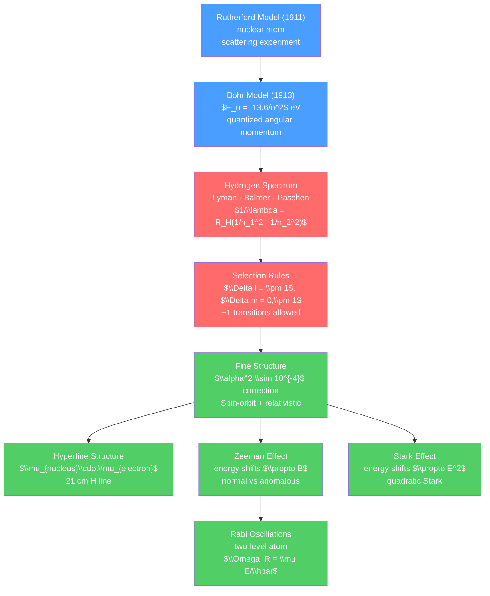

# 🔬 Atomic Models and Spectroscopy

> [!abstract] TL;DR
> Atomic spectroscopy — measuring the light emitted or absorbed by atoms — revealed the discrete energy levels of atoms and forced the development of quantum mechanics. The Bohr model (1913) explained hydrogen's spectrum with quantized orbits: $E_n = -13.6/n^2$ eV. Quantum mechanics (Schrödinger equation) replaced Bohr's picture with wavefunctions, explaining the full hydrogen spectrum including fine structure (relativistic + spin-orbit corrections) and hyperfine structure (nuclear spin interaction). At graduate level, the Zeeman and Stark effects (response to external fields), two-level atom Rabi oscillations, and quantum defect theory for multi-electron atoms provide the complete spectroscopic toolkit.

## Intuition — analogy FIRST

Atoms are like musical instruments: each type of atom can only vibrate at certain frequencies (its "resonant frequencies"). When heated or excited, atoms emit light only at these specific frequencies — their unique fingerprint. A sodium flame is bright yellow because sodium atoms emit strongly at 589 nm. Neon signs glow reddish-orange; argon makes blue-purple; mercury vapor makes blue-white.

Hold a diffraction grating up to a lamp and you see discrete bright lines against a dark background — each line corresponding to one specific "musical note" of that atom. When Balmer noticed in 1885 that hydrogen's visible spectral lines fit the formula $1/\lambda = R(1/4 - 1/n^2)$, it was a cryptic message from the atom waiting 28 years for Bohr to decode it.

---

## How It Works



---

## Key Concepts / Details

### Secondary Level

**Rutherford Scattering (1911)**

Geiger and Marsden fired alpha particles at gold foil. Most passed straight through (expected). But some bounced back — "as if you fired artillery shells at tissue paper and they came back and hit you."

This proved the atom is mostly empty space with a tiny, dense, positively charged nucleus. Rutherford nuclear model: nucleus ($\sim 10^{-15}$ m) surrounded by electrons at much larger distances ($\sim 10^{-10}$ m).

Problem: classical physics predicts the electron should spiral into the nucleus in $\sim 10^{-8}$ s as it radiates EM energy (centripetally accelerating charge must radiate — see [[Electromagnetic_Waves_and_Radiation]]). Atoms wouldn't exist!

**Bohr Model (1913)**

Bohr postulated (without derivation): electrons can only occupy certain circular orbits where angular momentum is quantized:

$$L = mvr = n\hbar, \qquad n = 1, 2, 3, \ldots$$

Combining with the Coulomb force (centripetal):

$$r_n = a_0 n^2, \qquad a_0 = \frac{\hbar^2}{m_e e^2/(4\pi\epsilon_0)} \approx 0.529\, \text{Å} \quad \text{(Bohr radius)}$$

Energy levels of hydrogen:

$$E_n = -\frac{13.6\, \text{eV}}{n^2}$$

Photon emitted when electron transitions from $n_i$ to $n_f < n_i$:

$$\frac{1}{\lambda} = R_H\left(\frac{1}{n_f^2} - \frac{1}{n_i^2}\right), \qquad R_H = 1.097\times10^7\, \text{m}^{-1}$$

**Hydrogen Spectrum Series**:

| Series | $n_f$ | Spectral region | Example line |
|--------|-------|-----------------|-------------|
| Lyman | 1 | UV | Lyman-$\alpha$: 121.6 nm |
| Balmer | 2 | Visible | H-$\alpha$: 656.3 nm (red) |
| Paschen | 3 | Near IR | 1875 nm |
| Brackett | 4 | IR | 4051 nm |

### Undergraduate Level

**Quantum Mechanics Replaces Bohr**

The Schrödinger equation for hydrogen gives quantum numbers:
- $n$ = principal (1, 2, 3, …): energy $E_n = -13.6/n^2$ eV
- $l$ = orbital (0 to $n-1$): orbital angular momentum $L = \hbar\sqrt{l(l+1)}$
- $m_l$ = magnetic (-$l$ to $+l$): $z$-component of $L$
- $m_s$ = spin ($\pm\tfrac{1}{2}$): electron spin

Degeneracy of level $n$: $g_n = 2n^2$ (factor of 2 from spin).

**Selection Rules for Electric Dipole (E1) Transitions**

Allowed transitions ($\Delta l = \pm 1$, $\Delta m_l = 0, \pm 1$, parity change) — from the matrix element $\langle f|\vec{r}|i\rangle$:

Forbidden transitions can occur via E2 (quadrupole), M1 (magnetic dipole) — but $\sim10^6$ times slower.

**Zeeman Effect: Atoms in Magnetic Fields**

An external field $B$ lifts the $m_l$ degeneracy:

*Normal Zeeman* (spin effects ignored): energy shift $\Delta E = m_l\mu_B B$ where $\mu_B = e\hbar/(2m_e) = 9.274\times10^{-24}$ J/T is the Bohr magneton.

*Anomalous Zeeman* (includes electron spin, $g_s \approx 2$): energy shift $\Delta E = m_j g_J \mu_B B$ where $g_J$ is the Landé g-factor.

**Stark Effect: Atoms in Electric Fields**

External electric field $E$ mixes energy levels via the perturbation $H' = -e\vec{r}\cdot\vec{E}$.

For $n > 1$ hydrogen (degenerate): first-order Stark effect. For ground state ($n=1$): second-order (quadratic) Stark effect since no states of opposite parity at the same energy.

### Graduate Level

**Fine Structure**

The hydrogen energy levels are corrected by:
$$E_{n,l,j} = E_n\left[1 + \frac{\alpha^2}{n^2}\left(\frac{n}{j+1/2} - \frac{3}{4}\right)\right]$$

where $\alpha = e^2/(4\pi\epsilon_0\hbar c) \approx 1/137$ is the fine structure constant and $j$ is the total angular momentum quantum number.

Fine structure has three contributions:
1. **Relativistic kinetic energy**: $H_{rel} = -p^4/(8m_e^3c^2)$ — $O(\alpha^2)$ correction to $T$
2. **Spin-orbit coupling**: $H_{so} = \frac{1}{2m_e^2c^2}\frac{1}{r}\frac{dV}{dr}\vec{L}\cdot\vec{S}$ — magnetic interaction between electron spin and orbital magnetic field
3. **Darwin term**: $H_D = \frac{\hbar^2}{8m_e^2c^2}\nabla^2 V$ — from Zitterbewegung (trembling motion, only for $l=0$)

The spin-orbit splitting lifts the $l$ degeneracy: $2p_{1/2}$ and $2p_{3/2}$ split by 0.365 meV in hydrogen.

**Hyperfine Structure**

The nuclear spin $\vec{I}$ interacts with the electron's magnetic moment:

$$H_{hfs} = A\vec{I}\cdot\vec{J}$$

This further splits levels: for hydrogen (proton spin $I = 1/2$), the $1s$ level splits into $F = 1$ (triplet) and $F = 0$ (singlet) with splitting:

$$\Delta E_{hfs}(1s) = 5.88\times10^{-6}\, \text{eV} \implies \nu = 1420.405751...\, \text{MHz}$$

This is the famous **21 cm line** of neutral hydrogen — the most observed spectral line in radio astronomy, used to map the structure and velocity of our galaxy.

**Quantum Defect Theory**

For multi-electron atoms, the inner electrons screen the nucleus. The effective nuclear charge seen by the outer electron at large $r$ approaches $Z_{eff} = 1$ (one proton). The energy levels are:

$$E_{n,l} = -\frac{13.6\, \text{eV}}{(n - \delta_l)^2}$$

where $\delta_l$ is the quantum defect (empirically determined, depends on $l$). For sodium: $\delta_s \approx 1.35$ (strong s-wave penetration), $\delta_p \approx 0.86$, $\delta_d \approx 0.01$.

**Two-Level Atom and Rabi Oscillations**

A two-level atom (ground $|g\rangle$, excited $|e\rangle$, splitting $\hbar\omega_0$) driven by a resonant electromagnetic field of amplitude $E_0$ and frequency $\omega$ undergoes Rabi oscillations:

$$|\psi(t)\rangle = \cos\frac{\Omega_R t}{2}|g\rangle - i\sin\frac{\Omega_R t}{2}|e\rangle$$

where the Rabi frequency $\Omega_R = \mu_{eg}E_0/\hbar$ ($\mu_{eg}$ = transition dipole moment).

Off-resonance: generalized Rabi frequency $\tilde{\Omega}_R = \sqrt{\Omega_R^2 + \Delta^2}$ where $\Delta = \omega - \omega_0$ is the detuning.

A $\pi$-pulse ($\Omega_R t = \pi$) transfers the population from $|g\rangle$ to $|e\rangle$ completely. A $\pi/2$-pulse creates a 50/50 superposition. This is the basis of:
- NMR/MRI pulse sequences
- Atomic clocks (cesium fountain clock)
- Quantum gates for quantum computing

```python
import numpy as np
import matplotlib.pyplot as plt
from scipy.constants import hbar, c, alpha, m_e, e as e_charge

# Hydrogen energy levels and spectral series
R_H = 1.0973731568539e7  # Rydberg constant (m^-1)
E_n = lambda n: -13.6 / n**2  # eV

fig, axes = plt.subplots(1, 2, figsize=(11, 6))

# Energy level diagram
n_levels = range(1, 7)
for n in n_levels:
    E = E_n(n)
    axes[0].plot([-0.5, 0.5], [E, E], 'b-', lw=2)
    axes[0].text(0.55, E, f'n={n}', va='center', fontsize=9)

# Draw transitions for Balmer series (n_f = 2)
colors = ['red', 'cyan', 'blue', 'violet', 'violet']
for ni, col in zip(range(3, 8), colors):
    delta_E = E_n(2) - E_n(ni)
    lam_nm = 1240 / abs(delta_E)  # E = hc/lambda, hc in eV*nm ≈ 1240
    axes[0].annotate('', xy=(0, E_n(2)), xytext=(0, E_n(ni)),
                     arrowprops=dict(arrowstyle='->', color=col, lw=1.5))
    axes[0].text(-0.7, (E_n(2)+E_n(ni))/2, f'{lam_nm:.0f}nm', fontsize=7, color=col)

axes[0].set_ylabel('Energy (eV)')
axes[0].set_title('Hydrogen Energy Levels\n(Balmer series transitions shown)')
axes[0].set_xlim(-1, 1)
axes[0].axhline(0, color='k', lw=0.5, linestyle='--')
axes[0].set_xticks([])

# Rabi oscillations: on-resonance and off-resonance
t = np.linspace(0, 4*np.pi, 300)  # time in units of 1/Omega_R
Omega_R = 1.0  # normalized

for detuning, label, color in [(0, 'On resonance ($\\Delta=0$)', 'blue'),
                                 (0.5, '$\\Delta = 0.5\\Omega_R$', 'green'),
                                 (1.0, '$\\Delta = \\Omega_R$', 'red')]:
    Omega_gen = np.sqrt(Omega_R**2 + detuning**2)
    P_e = (Omega_R/Omega_gen)**2 * np.sin(Omega_gen*t/2)**2
    axes[1].plot(t/np.pi, P_e, label=label, lw=2, color=color)

axes[1].set_xlabel('Time ($\\pi / \\Omega_R$)')
axes[1].set_ylabel('Population in excited state $|e\\rangle$')
axes[1].set_title('Rabi Oscillations: Two-Level Atom')
axes[1].legend(fontsize=9)
axes[1].grid(True, alpha=0.3)

plt.tight_layout()

# Fine structure: 2p splitting in hydrogen
alpha_fine = 1/137.036
E_2 = E_n(2)
FS_21_2 = E_2 * alpha_fine**2 * (2/(1.5) - 0.75)  # 2p_3/2 
FS_21_1 = E_2 * alpha_fine**2 * (2/(0.5) - 0.75)  # 2p_1/2 ... simplified
Delta_FS = abs(E_2) * alpha_fine**2 / 4 * 2  # rough estimate
print(f"\nHydrogen fine structure:")
print(f"  Fine structure constant α = {alpha_fine:.6f}")
print(f"  α² = {alpha_fine**2:.2e}")
print(f"  2p fine structure splitting ≈ 0.365 meV")
print(f"\nHyperfine structure (21 cm line):")
print(f"  1s hyperfine splitting: 1420.405751 MHz")
print(f"  Wavelength: {c/1420.405751e6*100:.2f} cm (21 cm line)")
```

---

## Real-World Notes

- **Astronomy**: stellar spectra reveal composition, temperature, velocity, and redshift. The hydrogen Balmer series is seen in absorption in most stars. The 21 cm line maps neutral hydrogen throughout our galaxy.
- **Atomic clocks**: the hyperfine transition of $^{133}$Cs at 9,192,631,770 Hz is the SI definition of the second. NIST-F2 cesium fountain clock: accuracy $\sim 10^{-16}$ (1 second error in 300 million years).
- **Laser spectroscopy**: Doppler-free saturation spectroscopy resolves hyperfine structure of hydrogen. Nobel Prizes: Ramsay & Ramsey (1989), Hänsch & Hall (2005).
- **Medical imaging (NMR/MRI)**: proton hyperfine transitions at MHz frequencies (Larmor frequency in B field). MRI contrast comes from different relaxation times in different tissues.
- **Quantum computing**: trapped ion qubits use hyperfine states of $^{40}$Ca$^+$ or $^{171}$Yb$^+$ as qubit states, manipulated by Rabi oscillations via laser pulses.

---

## Common Pitfalls

1. **Bohr model works only for hydrogen-like atoms**: it fails for multi-electron atoms because it ignores electron-electron repulsion and the full quantum mechanical wavefunction structure.
2. **$l$ determines orbital shape, not just angular momentum**: $l = 0$ (s orbitals) is spherically symmetric with maximum probability at $r = n^2 a_0$. $l = 1$ (p) has lobe-shaped distributions. The Bohr model gives no information about orbital shape.
3. **Fine structure vs Lamb shift**: fine structure is a relativistic/spin-orbit effect ($O(\alpha^2)$). The Lamb shift ($2s_{1/2}$ and $2p_{1/2}$ have different energies despite equal $j$) is a QED effect ($O(\alpha^3\ln\alpha)$) and requires quantum field theory.
4. **Zeeman vs anomalous Zeeman**: the "normal" Zeeman effect (only orbital magnetic moment) is actually the exception. The "anomalous" effect (including spin) is the rule for most atoms. The word "anomalous" is historical.
5. **Rabi frequency is different from the laser frequency**: $\Omega_R = \mu E_0/\hbar$ is determined by the coupling strength and field amplitude, not by the optical frequency $\omega_0$. $\Omega_R \sim$ MHz–GHz for typical laser intensities.

---

## Related Concepts

- [[_MOC_Waves_and_Optics|↑ Section MOC]]
- [[Photoelectric_Effect_and_Compton]] — photons and energy quantization that led to Bohr model
- [[Electromagnetic_Waves_and_Radiation]] — atomic emission is radiation from accelerating charges
- [[_MOC_Quantum_Mechanics]] — full quantum treatment of atoms (Schrödinger equation, perturbation theory)

---

## Review Questions

1. **Secondary**: Calculate the wavelength of light emitted when a hydrogen electron drops from $n=4$ to $n=2$. In what spectral region (UV, visible, IR) does this line fall?
2. **Undergraduate**: Using first-order perturbation theory, calculate the first-order energy correction to hydrogen energy levels in a uniform external electric field $\vec{E} = E_0\hat{z}$ (Stark effect). Show that the ground state ($n=1$) has no first-order correction but the $n=2$ degenerate levels do. (Hint: consider parity of the perturbation $H' = eE_0 z$.)
3. **Graduate**: Derive the spin-orbit coupling Hamiltonian $H_{so} = \frac{1}{2m_e^2c^2}\frac{1}{r}\frac{dV}{dr}\vec{L}\cdot\vec{S}$ from relativistic considerations (hint: in the electron's rest frame, the proton's electric field becomes a magnetic field). Calculate the fine structure splitting of the $2p$ level in hydrogen ($n=2, l=1$) and compare to the experimental value of 0.365 meV.

---

## Sources

- Griffiths — *Introduction to Quantum Mechanics*, 3rd ed., Ch. 4–6
- Foot — *Atomic Physics*, Oxford University Press (clear and comprehensive)
- Hänsch & Schawlow (1975) — "Cooling of gases by laser radiation," *Opt. Comm.* 13, 68
- Bohr, N. (1913) — "On the Constitution of Atoms and Molecules," *Philos. Mag.* 26, 1

#physics #atomic-physics #BohrModel #hydrogenSpectrum #fineStructure #hyperfineStructure #ZeemanEffect #StarkEffect #RabiOscillations #secondary #undergraduate #graduate
