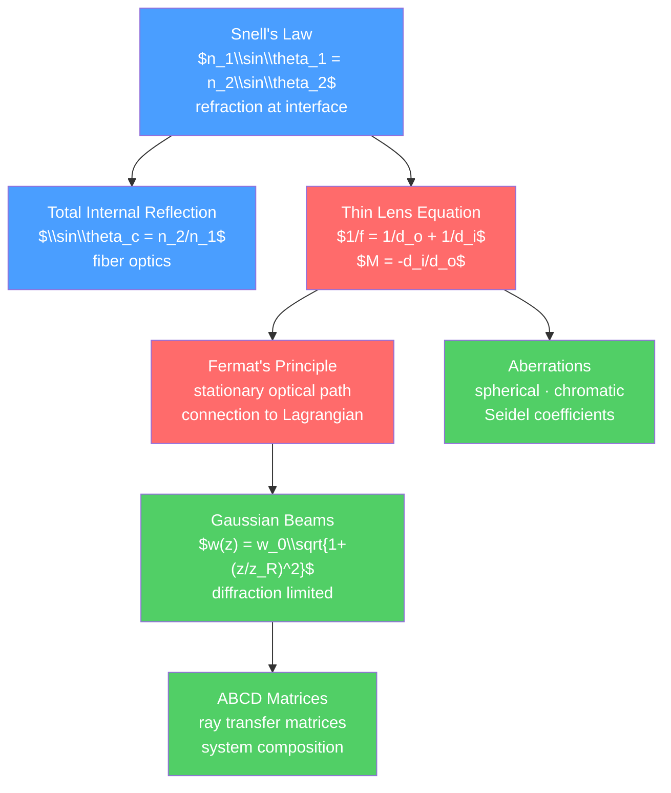

# 🔬 Geometric and Wave Optics

> [!abstract] TL;DR
> Geometric (ray) optics is the $\lambda \to 0$ limit of wave optics: light travels in straight-line rays, bending at interfaces according to Snell's law. Thin lenses focus light with $1/f = 1/d_o + 1/d_i$, and mirrors follow the same formula. At the graduate level, Fermat's principle (light takes the path of stationary optical path length) connects geometric optics to the Lagrangian principle of mechanics, Gaussian beam optics describes laser beams, and ABCD ray transfer matrices provide a systematic framework for analyzing any optical system.

## Intuition — analogy FIRST

The bottom of a swimming pool looks shallower than it is. A straw in a glass of water looks bent. These are refraction — light bending as it crosses from water into air (or vice versa) because it travels slower in water. The ratio of speeds gives the refractive index $n = c/v_{medium}$, and Snell's law ($n_1\sin\theta_1 = n_2\sin\theta_2$) tells exactly how much the ray bends.

A magnifying glass focuses sunlight to a hot spot because it bends all the parallel rays from the Sun to converge at a single focal point. This is the thin lens in action. The image of a distant mountain "seen" in a lens is light rays that came from the mountain, were bent by the lens, and converge on the film or sensor — forming an image.

---

## How It Works



---

## Key Concepts / Details

### Secondary Level

**Reflection and Refraction**

Law of reflection: $\theta_r = \theta_i$ (angle of incidence = angle of reflection, measured from normal).

Snell's law of refraction:
$$n_1\sin\theta_1 = n_2\sin\theta_2$$

Refractive indices: vacuum = 1.000, air ≈ 1.000, water = 1.333, glass ≈ 1.5, diamond = 2.417.

**Total Internal Reflection**

When light travels from a denser to a less dense medium ($n_1 > n_2$), at the critical angle $\theta_c$:
$$\sin\theta_c = \frac{n_2}{n_1}$$

For $\theta_i > \theta_c$: all light is reflected (no transmitted ray). Applications: fiber optics (glass fiber, light trapped inside), gems (diamonds sparkle due to TIR), prism binoculars.

**Thin Lenses**

The thin lens equation (paraxial approximation):
$$\frac{1}{f} = \frac{1}{d_o} + \frac{1}{d_i}$$

Lateral magnification: $M = -d_i/d_o = h_i/h_o$

Sign conventions: real objects (light arriving from object side) have $d_o > 0$. Real images ($d_i > 0$) form on the far side of the lens and are inverted ($M < 0$). Virtual images ($d_i < 0$) are upright.

Lensmaker's equation: $1/f = (n-1)(1/R_1 - 1/R_2)$

**Mirrors**

Same formula as thin lenses but $f = R/2$ for a spherical mirror of radius of curvature $R$:

$$\frac{1}{f} = \frac{1}{d_o} + \frac{1}{d_i}, \qquad f = \frac{R}{2}$$

Convex mirror: $f < 0$, always virtual, upright, reduced image (rear-view mirrors).
Concave mirror: $f > 0$, real image for $d_o > f$.

**Optical Instruments**:
- Microscope: objective (high magnification of nearby object) + eyepiece (acts as magnifier). Total magnification $M = M_{obj} \times M_{eye}$.
- Telescope (astronomical): objective focuses distant object; eyepiece magnifies. Angular magnification $m = f_{obj}/f_{eye}$.

### Undergraduate Level

**Fermat's Principle**

Light travels between two points via the path that makes the optical path length (OPL = $\int n\,ds$) stationary (minimum in most cases):

$$\delta\int_A^B n\,ds = 0$$

Consequences:
- Straight line in uniform medium (minimum OPL)
- Snell's law at interface (stationarity condition)
- Reflection law (stationarity at a mirror)

Connection to classical mechanics: Fermat's principle is the optical analog of Hamilton's principle of stationary action. The Eikonal equation ($|\nabla S|^2 = n^2$) is the Hamilton-Jacobi equation of mechanics. Rays are the "particle trajectories" of geometric optics.

**Paraxial Approximation**

For rays making small angles with the optical axis ($\theta \ll 1$ rad): $\sin\theta \approx \theta$, $\tan\theta \approx \theta$.

In this approximation, all Gaussian optics results hold exactly. Real optical systems deviate: aberrations measure how much the paraxial approximation fails.

**Aberrations**

Seidel's five primary (third-order) aberrations:
1. Spherical aberration: different focal lengths for paraxial vs marginal rays
2. Coma: oblique rays form a comet-shaped blur
3. Astigmatism: different focal lengths in tangential and sagittal planes
4. Field curvature: flat object → curved image surface
5. Distortion: image magnification varies across field (barrel/pincushion)

Plus chromatic aberration: different wavelengths focus at different points (because $n$ depends on $\lambda$). Corrected by achromatic doublets (two lenses of different glass types).

### Graduate Level

**Gaussian Beams**

A laser beam is well-described by a Gaussian TEM$_{00}$ mode. The beam waist $w(z)$ (1/e² radius):

$$w(z) = w_0\sqrt{1 + \left(\frac{z}{z_R}\right)^2}$$

where:
- $w_0$ = minimum beam waist (at the focus, $z = 0$)
- $z_R = \pi w_0^2/\lambda$ = Rayleigh range (distance where beam area doubles)
- Far field divergence: $\theta_0 = \lambda/(\pi w_0)$ (diffraction limited)

At $z = z_R$: $w = w_0\sqrt{2}$, intensity drops to half.

The phase of a Gaussian beam includes the Gouy phase: an extra $\pi$ phase shift accumulated over the full propagation through focus (from $-\infty$ to $+\infty$):

$$\phi_{Gouy} = -\arctan(z/z_R)$$

The M² factor measures beam quality: $M^2 = 1$ for a perfect Gaussian (diffraction limit); real beams have $M^2 > 1$.

**ABCD Ray Transfer Matrix**

A paraxial ray is characterized by position $y$ and slope $u = dy/dz$. Optical elements act as 2×2 matrices on the vector $[y, u]^T$:

| Element | ABCD matrix |
|---------|-------------|
| Free propagation, distance $d$ | $\begin{pmatrix}1 & d \\ 0 & 1\end{pmatrix}$ |
| Thin lens, focal length $f$ | $\begin{pmatrix}1 & 0 \\ -1/f & 1\end{pmatrix}$ |
| Flat interface $n_1\to n_2$ | $\begin{pmatrix}1 & 0 \\ 0 & n_1/n_2\end{pmatrix}$ |
| Curved mirror, radius $R$ | $\begin{pmatrix}1 & 0 \\ -2/R & 1\end{pmatrix}$ |

For a complete system: $M_{total} = M_n \cdots M_2 M_1$ (multiply right to left, as the first element encountered goes on the right).

Gaussian beam transformed by ABCD system:

$$q_{out} = \frac{Aq_{in} + B}{Cq_{in} + D}$$

where $q = z - iz_R$ is the complex beam parameter (encodes both waist position and size).

**Evanescent Waves**

At total internal reflection, the transmitted wave becomes evanescent (exponentially decaying):

$$E_t \propto e^{i(k_y y - \omega t)}e^{-\kappa x}$$

where $\kappa = k_0\sqrt{n_1^2\sin^2\theta_i - n_2^2}$. Despite TIR, the field penetrates $\sim\lambda/(2\pi)$ into medium 2. This evanescent field is exploited in Total Internal Reflection Fluorescence (TIRF) microscopy for imaging molecular processes at cell membranes.

```python
import numpy as np
import matplotlib.pyplot as plt

# Gaussian beam propagation
lambda_laser = 1064e-9  # m, Nd:YAG
w0 = 0.5e-3  # m, beam waist
z_R = np.pi * w0**2 / lambda_laser  # Rayleigh range

print(f"Gaussian beam parameters:")
print(f"  Beam waist w0 = {w0*1e3:.2f} mm")
print(f"  Rayleigh range z_R = {z_R:.2f} m")
print(f"  Far-field divergence theta = {lambda_laser/(np.pi*w0)*1000:.2f} mrad")

z = np.linspace(-5*z_R, 5*z_R, 500)
w = w0 * np.sqrt(1 + (z/z_R)**2)  # beam radius
I_peak = 1 / w**2  # peak intensity ~ 1/w^2

fig, (ax1, ax2) = plt.subplots(1, 2, figsize=(10, 4))
# Beam profile
ax1.fill_between(z, -w*1000, w*1000, alpha=0.3, color='red', label='1/e² boundary')
ax1.fill_between(z, -w0*1000*np.ones_like(z), w0*1000*np.ones_like(z), 
                  alpha=0.1, color='blue', label='Waist region')
ax1.axvline(0, color='k', linestyle='--', linewidth=0.5)
ax1.axvline(z_R, color='g', linestyle=':', label=f'$z_R$ = {z_R:.1f} m')
ax1.axvline(-z_R, color='g', linestyle=':')
ax1.set_xlabel('z (m)')
ax1.set_ylabel('Beam radius (mm)')
ax1.set_title('Gaussian Beam Propagation')
ax1.legend(fontsize=8)

# Snell's law: refraction angle vs incidence angle
n1, n2 = 1.5, 1.0  # glass to air
theta_inc = np.linspace(0, np.pi/2, 300)
sin_trans = n1 * np.sin(theta_inc) / n2
theta_trans = np.where(sin_trans <= 1, np.arcsin(sin_trans), np.nan)
theta_c = np.arcsin(n2/n1)

ax2.plot(np.degrees(theta_inc), np.degrees(theta_trans), lw=2, color='blue')
ax2.axvline(np.degrees(theta_c), color='r', linestyle='--', 
            label=f'Critical angle = {np.degrees(theta_c):.1f}°')
ax2.set_xlabel('Incidence angle θ₁ (°)')
ax2.set_ylabel('Refraction angle θ₂ (°)')
ax2.set_title(f'Snell\'s Law (glass n={n1} → air n={n2})')
ax2.legend()
ax2.grid(True, alpha=0.3)
plt.tight_layout()
```

---

## Real-World Notes

- **Optical fiber**: uses total internal reflection (glass core with $n \approx 1.48$, cladding $n \approx 1.46$). Single-mode fibers have $w_0 \approx 5\,\mu$m — they are Gaussian beam waveguides.
- **Camera lenses**: modern camera lenses with 15+ elements are designed using ABCD matrix methods to minimize all five Seidel aberrations simultaneously.
- **Microscopy**: high-resolution confocal microscopes use Gaussian beam optics. TIRF microscopy (evanescent field) achieves single-molecule imaging by illuminating only the first ~100 nm from the surface.
- **Laser eye surgery (LASIK)**: excimer laser ablates cornea to change its curvature — adjusting the corneal radius of curvature modifies the focal length of the eye's optical system.
- **Gravitational lensing**: general relativity predicts that massive objects bend light. The "Einstein ring" is a gravitational lens forming a ring image — mathematically similar to Snell's law but for spacetime curvature.

---

## Common Pitfalls

1. **Sign convention consistency**: thin lens formula requires consistent sign conventions (Real is positive is common: real image $d_i > 0$, real object $d_o > 0$, converging lens $f > 0$).
2. **Thin lens approximation**: the thin lens equation assumes lens thickness $\ll$ focal length. For thick lenses, you need the lensmaker's equation with principal planes.
3. **Paraxial vs non-paraxial**: the thin lens equation and Gaussian beam formulas are paraxial ($\theta \ll 1$ rad). For wide-angle lenses or large-aperture systems, aberrations must be considered.
4. **ABCD matrix order**: $M_{total} = M_n \cdots M_2 M_1$, read right-to-left. The first element the beam hits goes on the right.
5. **Evanescent field does carry information**: despite TIR, the evanescent field exists in medium 2 and can be "frustrated" (FTIR) if a second interface is close enough ($< \lambda$). This is the optical analog of quantum tunneling.

---

## Related Concepts

- [[_MOC_Waves_and_Optics|↑ Section MOC]]
- [[Wave_Motion_and_Properties]] — wave optics recovers geometric optics in the short wavelength limit
- [[Interference_and_Diffraction]] — wave effects become important when $\lambda \sim$ aperture size
- [[Polarization_and_Dispersion]] — chromatic aberration is related to dispersion

---

## Review Questions

1. **Secondary**: A converging lens with focal length 20 cm is used to form an image of an object placed 30 cm away. Find the image distance, magnification, and state whether the image is real or virtual, inverted or upright.
2. **Undergraduate**: Derive Snell's law from Fermat's principle by minimizing the optical path length for a ray traveling from point A in medium $n_1$ to point B in medium $n_2$ across a flat interface.
3. **Graduate**: A Gaussian laser beam with waist $w_0 = 1$ mm passes through a thin lens of focal length $f = 10$ cm placed at the waist. Using the ABCD matrix method and the complex beam parameter, find the new waist size and its location.

---

## Sources

- Hecht — *Optics*, 5th ed., Ch. 4–6
- Born & Wolf — *Principles of Optics*, 7th ed., Ch. 3–5
- Saleh & Teich — *Fundamentals of Photonics*, 3rd ed. (Gaussian beams, ABCD)
- Goldstein et al. — *Classical Mechanics* (Fermat's principle and Hamilton-Jacobi)

#physics #optics #SnellsLaw #TotalInternalReflection #thinLens #FermatsPrinciple #GaussianBeam #ABCDmatrix #secondary #undergraduate #graduate
