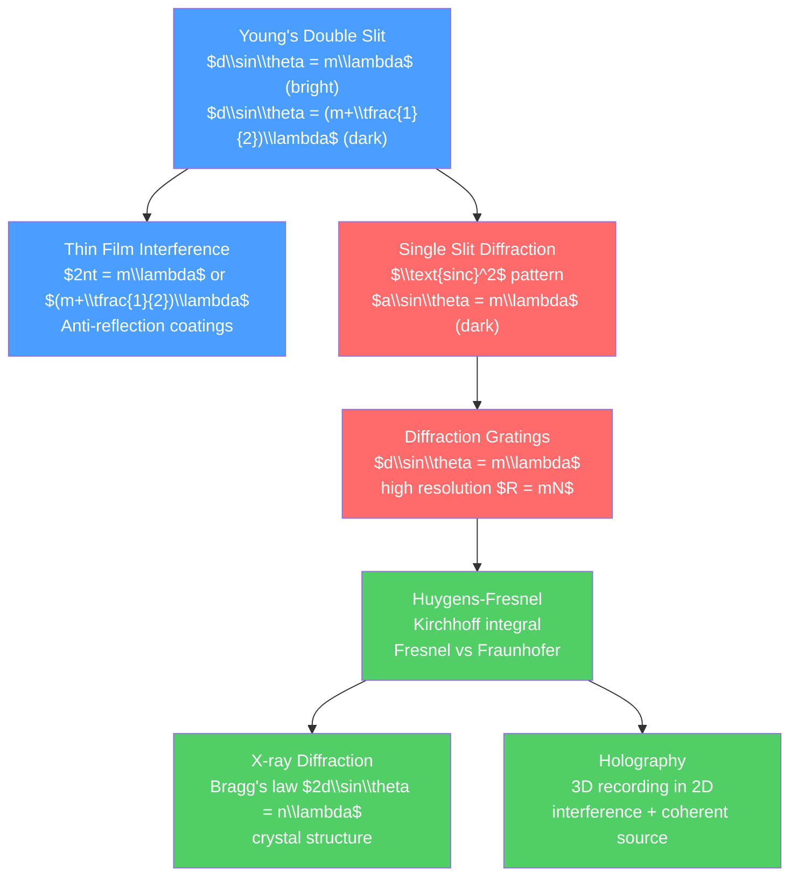

# 🌈 Interference and Diffraction

> [!abstract] TL;DR
> Interference occurs when two or more coherent waves overlap and add constructively (bright fringe) or destructively (dark fringe). Young's double-slit experiment ($d\sin\theta = m\lambda$) definitively showed light is a wave in 1801. Diffraction is the bending of waves around obstacles and through apertures — the single-slit pattern ($\text{sinc}^2$) and diffraction grating are the essential tools for measuring wavelengths. At graduate level, the Huygens-Fresnel principle and Kirchhoff diffraction integral unify these phenomena, X-ray diffraction (Bragg's law) reveals crystal structure, and holography stores 3D information in a 2D interference pattern.

## Intuition — analogy FIRST

Drop two stones into a pond simultaneously, a meter apart. Where the ripples from the two stones meet, you see a complex pattern: in some places the waves pile up (constructive interference — tall crests), in others they cancel (destructive interference — flat water). The pattern of "tall water" and "flat water" radiates outward.

This is exactly what Young saw in 1801 when he shone light through two tiny slits. The resulting pattern of bright and dark bands on a screen was inexplicable if light were particles (Newton's theory), but perfectly explained if light were a wave interfering with itself. Young's experiment was decisive evidence for the wave nature of light.

---

## How It Works



---

## Key Concepts / Details

### Secondary Level

**Young's Double-Slit Experiment**

Two slits separated by distance $d$, screen at distance $L \gg d$.

Bright fringes (constructive interference): $d\sin\theta \approx d\cdot y/L = m\lambda$, so $y_m = m\lambda L/d$

Dark fringes (destructive): $d\sin\theta = (m+\tfrac{1}{2})\lambda$

Fringe spacing: $\Delta y = \lambda L/d$

Key requirements:
- **Coherent source**: both slits illuminated by the same source (or sufficiently coherent source). Laser is ideal.
- **Monochromatic**: single wavelength. White light gives colored fringes.

**Thin Film Interference**

For a film of thickness $t$ and refractive index $n$, light reflects from both top and bottom surfaces:

Path difference: $2nt$ (extra path in the film)

Phase shift on reflection: if reflecting from a denser medium ($n_2 > n_1$), get $\pi$ phase shift (like reflection from a fixed end).

Anti-reflection coating: $t = \lambda/(4n)$ → destructive interference for reflected light → most light transmitted. Used on camera lenses, eyeglasses, solar cells.

### Undergraduate Level

**Single-Slit Diffraction**

A slit of width $a$ illuminated by a plane wave. Using Huygens' principle (each point on the slit is a secondary wavelet source):

Intensity pattern (Fraunhofer):
$$I(\theta) = I_0\left[\frac{\sin(\beta)}{\beta}\right]^2, \qquad \beta = \frac{\pi a\sin\theta}{\lambda}$$

Minima (dark fringes): $a\sin\theta = m\lambda$ for $m = \pm1, \pm2, \ldots$ (not $m=0$)

Central maximum width: $\Delta\theta \approx 2\lambda/a$ (wider slit → narrower diffraction pattern)

**Rayleigh Criterion (Resolution)**

Two point sources are just resolved when the central maximum of one falls on the first minimum of the other:

$$\theta_{min} = 1.22\frac{\lambda}{D}$$

for a circular aperture of diameter $D$. Human eye (pupil $D \approx 3$ mm, $\lambda = 500$ nm): $\theta_{min} \approx 0.2$ mrad $\approx 0.7'$ of arc.

Hubble Space Telescope ($D = 2.4$ m): $\theta_{min} \approx 0.06''$ — resolves features as small as ~100 m on the Moon.

**Diffraction Gratings**

$N$ slits with separation $d$. Principal maxima (grating equation): $d\sin\theta = m\lambda$.

Angular dispersion: $d\theta/d\lambda = m/(d\cos\theta)$

Resolving power: $R = \lambda/\Delta\lambda = mN$ (where $N$ is the number of illuminated slits).

A grating with $N = 10,000$ slits at order $m = 2$: $R = 20,000$ — can resolve wavelengths separated by 0.025 nm in the visible.

**Interference in Two Dimensions: Newton's Rings**

A convex lens resting on a flat glass plate: the air gap increases with distance from the contact point. Reflected light shows circular rings (Newton's rings). At the center: dark (phase shift at one surface, not the other).

### Graduate Level

**Huygens-Fresnel Principle**

Every point on a wavefront is a source of secondary wavelets. The field at any point $P$ is:

$$U(P) = \frac{-i}{\lambda}\int\int_\Sigma U(Q)\frac{e^{ikr}}{r}K(\chi)\,dS$$

where $K(\chi)$ is the obliquity factor (Kirchhoff's modification), $r$ is the distance from surface element $dS$ to $P$.

**Fraunhofer vs Fresnel Diffraction**

| Regime | Condition | Pattern | Math |
|--------|-----------|---------|------|
| Far-field (Fraunhofer) | $a^2/\lambda L \ll 1$ | Fourier transform of aperture | $U(\theta) = \int A(x)e^{-ikx\sin\theta}\,dx$ |
| Near-field (Fresnel) | $a^2/\lambda L \sim 1$ | Quadratic phase correction | Fresnel integral, complex |

The Fraunhofer diffraction pattern is the Fourier transform of the aperture function. This powerful result means:
- Single slit: sinc function (FT of rect)
- Two slits: sinc × cos² (FT of two delta functions with sinc envelope)
- Circular aperture: Airy pattern (FT of circle = $J_1$ Bessel function)

**X-ray Diffraction and Bragg's Law**

In a crystal with atomic planes separated by $d$, constructive interference of X-rays occurs at:

$$2d\sin\theta = n\lambda \quad \text{(Bragg's law)}$$

The scattered intensity is the Fourier transform squared of the electron density: $I(\vec{G}) = |F(\vec{G})|^2$ where $\vec{G}$ is a reciprocal lattice vector and $F(\vec{G})$ is the structure factor.

X-ray crystallography determined the structure of DNA (Franklin, Watson, Crick, 1953), proteins (penicillin, insulin, hemoglobin), and millions of other molecules.

**Holography**

A hologram records the interference pattern between a reference beam and the object beam. The recorded pattern encodes both the amplitude and phase of the object wave (unlike a photograph, which records only intensity).

Reconstruction: illuminate the developed hologram with the reference beam. The diffracted light reconstructs the original wavefront — a 3D image is visible.

$$E_{holo}(x,y) = |E_{obj}|^2 + |E_{ref}|^2 + E_{obj}E_{ref}^* + E_{obj}^*E_{ref}$$

The term $E_{obj}^*E_{ref}$ is the virtual image (appears behind the hologram).

```python
import numpy as np
import matplotlib.pyplot as plt

# Double slit and single slit diffraction simulation
lambda_light = 500e-9  # m, green light
slit_sep = 0.1e-3  # m, double slit separation
slit_width = 0.02e-3  # m, single slit width
L = 1.0  # m, screen distance

theta = np.linspace(-0.02, 0.02, 2000)  # radians

# Single slit (sinc^2)
beta = np.pi * slit_width * np.sin(theta) / lambda_light
I_single = np.sinc(beta / np.pi)**2  # np.sinc uses sinc(x)=sin(pi*x)/(pi*x)

# Double slit = single slit envelope × double slit pattern
phi = np.pi * slit_sep * np.sin(theta) / lambda_light
I_double = I_single * np.cos(phi)**2

# Position on screen
y = L * np.tan(theta) * 1000  # mm

fig, (ax1, ax2) = plt.subplots(2, 1, figsize=(9, 6), sharex=True)
ax1.plot(y, I_single, lw=2, color='blue', label='Single slit (envelope)')
ax1.set_ylabel('Intensity (normalized)')
ax1.set_title(f'Diffraction Patterns ($\\lambda$ = {lambda_light*1e9:.0f} nm, L = {L} m)')
ax1.legend()

ax2.plot(y, I_double, lw=1, color='red', label='Double slit + diffraction')
ax2.plot(y, I_single, '--', lw=1, color='blue', alpha=0.5, label='Single slit envelope')
ax2.set_xlabel('Position on screen (mm)')
ax2.set_ylabel('Intensity (normalized)')
ax2.legend()

plt.tight_layout()

# Bragg diffraction: which crystal planes reflect Cu Ka X-rays?
lambda_xray = 0.154e-9  # nm, Cu Ka radiation
d_spacings = [0.356e-9, 0.204e-9, 0.147e-9]  # Si (111), (220), (311)
labels = ['Si (111)', 'Si (220)', 'Si (311)']

print("\nBragg diffraction angles for Cu Kα radiation (λ=0.154 nm):")
for d, lab in zip(d_spacings, labels):
    for n in [1, 2]:
        sin_theta = n * lambda_xray / (2 * d)
        if sin_theta <= 1:
            theta_deg = np.degrees(np.arcsin(sin_theta))
            print(f"  {lab} n={n}: 2θ = {2*theta_deg:.2f}°")
```

---

## Real-World Notes

- **CD/DVD reading**: a laser reads interference patterns created by the tiny pits in the reflecting layer. The pit size is $\sim\lambda/4$ to give $\pi$ phase shift and destructive interference.
- **Anti-reflection coatings**: camera lenses, spectacle lenses, and solar cell surfaces use $\lambda/4$ thin films ($t = \lambda/(4n)$) to minimize reflections.
- **Protein crystallography**: X-ray diffraction from protein crystals solves the 3D structure of proteins. The 2019 AlphaFold protein structure database built on decades of XRD data.
- **Interferometers (LIGO)**: gravitational wave detector uses a Michelson interferometer with 4 km arms, sensitive to distance changes of $\sim10^{-19}$ m — 1/1000 the size of a proton.
- **Holographic data storage**: holographic storage encodes $\sim 10$ Tb/cm³ in 3D interference patterns within a photorefractive medium.

---

## Common Pitfalls

1. **Single-slit minima at $a\sin\theta = m\lambda$**: note these are the DARK fringes, not bright. The central maximum is the brightest; secondary maxima are much weaker.
2. **Fringe spacing for double slit increases with $\lambda$**: $\Delta y = \lambda L/d$. Longer wavelength (red) → wider fringes. Blue light → finer fringes.
3. **Coherence length matters**: interference requires temporal coherence. A source with coherence length $l_c = \lambda^2/\Delta\lambda$ can only interfere with copies of itself shifted by $< l_c$. Sodium lamp: $l_c \approx 1$ mm; laser: $l_c \sim$ meters–km.
4. **Grating resolving power vs brightness**: high $m$ gives high resolving power but lower intensity (energy distributed across more orders).
5. **Bragg condition and lattice planes**: Bragg's law is for reflections from lattice planes, not surface diffraction. The $d$-spacing is the interplanar spacing, determined by crystal structure.

---

## Related Concepts

- [[_MOC_Waves_and_Optics|↑ Section MOC]]
- [[Wave_Motion_and_Properties]] — superposition principle is the foundation
- [[Geometric_and_Wave_Optics]] — ray optics emerges when $\lambda \ll$ obstacles
- [[Polarization_and_Dispersion]] — coherent wave treatment applies to polarized light

---

## Review Questions

1. **Secondary**: In a Young's double-slit experiment, the slit separation is 0.2 mm, the screen is 2 m away, and green light ($\lambda = 546$ nm) is used. What is the fringe spacing? What happens if you illuminate with white light?
2. **Undergraduate**: Derive the single-slit diffraction pattern by treating the slit as an array of Huygens sources and integrating. Show that the result is a sinc² function. Where are the minima, and what is the ratio of the intensities of the central and first secondary maxima?
3. **Graduate**: Show that the Fraunhofer diffraction pattern from an aperture $A(x,y)$ is the 2D Fourier transform of $A$. Use this to find the diffraction pattern from a circular aperture of radius $R$, and derive the Rayleigh resolution criterion from the zeros of the resulting Bessel function.

---

## Sources

- Hecht — *Optics*, 5th ed., Ch. 9–10
- Born & Wolf — *Principles of Optics*, 7th ed., Ch. 7–8
- Goodman — *Introduction to Fourier Optics*, 4th ed.
- Young, T. (1804) — "Experiments and calculations relative to physical optics," *Philos. Trans. R. Soc.*

#physics #waves #optics #interference #diffraction #YoungDoubleSlit #Bragg #holography #secondary #undergraduate #graduate
