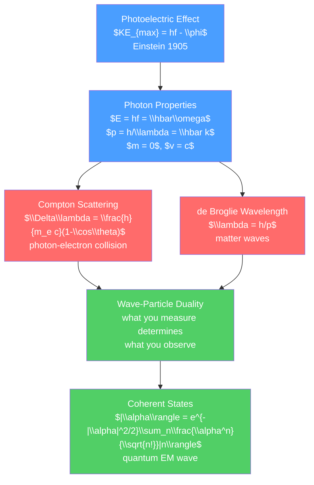

# ⚛️ Photoelectric Effect and Compton Scattering

> [!abstract] TL;DR
> The photoelectric effect (Einstein, 1905) and Compton scattering (Compton, 1923) together prove that light has particle-like properties: photons carry discrete energy $E = hf$ and momentum $p = h/\lambda$. De Broglie (1924) extended the duality to matter: any particle with momentum $p$ has an associated wavelength $\lambda = h/p$. Wave-particle duality is not a paradox but a feature of quantum mechanics — what you observe depends on what you measure. At the graduate level, photons are the quanta of the electromagnetic field in quantum field theory, and coherent states are the closest quantum analog to classical EM waves.

## Intuition — analogy FIRST

The photoelectric effect: shine light on a metal and electrons get knocked out. Classical physics predicted that brighter light (more energy delivered) would always give more energetic electrons. Wrong. Experiments showed that whether electrons are emitted at all depends only on the *color* (frequency) of light, not its brightness. Bright red light: no electrons. Dim blue light: electrons. Brighter blue: more electrons, but no more energetic.

Einstein explained it in 1905 (the same year as special relativity): light comes in packets called photons, each carrying energy $E = hf$. An electron needs a minimum energy $\phi$ (the work function) to escape the metal. If $hf < \phi$: no escape, no matter how many photons. If $hf > \phi$: electrons escape with kinetic energy $KE = hf - \phi$. More photons → more electrons, but same KE each. This particle picture of light earned Einstein the Nobel Prize in Physics in 1921.

---

## How It Works



---

## Key Concepts / Details

### Secondary Level

**Photoelectric Effect (Einstein 1905)**

When light of frequency $f$ hits a metal surface, electrons are emitted with kinetic energy:

$$KE_{max} = hf - \phi$$

where:
- $h = 6.626\times10^{-34}$ J·s = Planck's constant
- $f$ = frequency of light (Hz)
- $\phi$ = work function of the metal (depends on metal, typically 2–5 eV)

Key observations:
1. Threshold frequency: $f_0 = \phi/h$ — below this, no emission regardless of intensity
2. Above threshold: $KE_{max}$ increases linearly with $f$ — slope = $h$
3. Intensity affects number of electrons, not their energy
4. Emission is instantaneous (no buildup time, unlike classical wave prediction)

Work functions (selected): Sodium: 2.28 eV, Gold: 5.10 eV, Silicon: 4.52 eV.

**Photon Energy and Momentum**

$$E = hf = \frac{hc}{\lambda} = \hbar\omega, \qquad p = \frac{h}{\lambda} = \frac{E}{c} = \hbar k$$

For visible light ($\lambda = 500$ nm): $E = 2.48$ eV per photon.

**Compton Scattering (1923)**

X-ray photon collides with a free electron. Like billiard balls, both momentum and energy are conserved. The scattered X-ray has a longer wavelength:

$$\Delta\lambda = \lambda' - \lambda = \frac{h}{m_e c}(1 - \cos\theta) = \lambda_C(1-\cos\theta)$$

where $\lambda_C = h/(m_e c) = 2.426\times10^{-12}$ m is the Compton wavelength of the electron.

This shift can only be explained if X-rays have particle-like momentum $p = h/\lambda$ — it cannot be explained by wave optics.

### Undergraduate Level

**de Broglie Hypothesis (1924)**

If light (a wave) can behave like a particle, perhaps particles can behave like waves. de Broglie proposed:

$$\lambda = \frac{h}{p} = \frac{h}{mv} \quad \text{(non-relativistic)}$$

For an electron with kinetic energy $E_k$: $\lambda = h/\sqrt{2m_eE_k}$.

At 100 eV: $\lambda \approx 0.12$ nm — the same order as atomic separations. This explains why electrons diffract in crystals (confirmed by Davisson-Germer experiment, 1927).

At room temperature, a nitrogen molecule: $\lambda_{th} = h/\sqrt{2mk_BT} \approx 0.028$ nm — smaller than molecular size, so classical.

**Wave-Particle Duality**

| Experiment | Particle aspect | Wave aspect |
|-----------|----------------|-------------|
| Photoelectric effect | Photon hits electron | Frequency determines energy |
| Compton scattering | Momentum conserved in collision | Wavelength shift |
| Double-slit (electrons) | Each electron hits one point | Interference pattern builds up |
| Single-photon detection | Click at one detector | Probability described by waves |

The double-slit experiment with single electrons: each electron goes through both slits simultaneously (as a wave), but is detected at a single point (as a particle). The interference pattern builds up over many electrons — probability distribution is wave-like.

Heisenberg uncertainty principle (from wave-particle duality):

$$\Delta x\cdot\Delta p \geq \frac{\hbar}{2}, \qquad \Delta E\cdot\Delta t \geq \frac{\hbar}{2}$$

These are not measurement limitations — they are fundamental properties of quantum states.

**Historical Context**

1900 — Planck: blackbody radiation fit requires $E = nhf$ (quantized oscillators)
1905 — Einstein: photoelectric effect explains as photons ($E = hf$)
1913 — Bohr: atomic model with quantized orbits (see [[Atomic_Models_and_Spectroscopy]])
1923 — Compton: X-ray scattering shows photon momentum $p = h/\lambda$
1924 — de Broglie: matter waves $\lambda = h/p$
1925 — Heisenberg: matrix mechanics (first complete QM)
1926 — Schrödinger: wave mechanics; Born: probability interpretation
1927 — Davisson & Germer: electron diffraction confirms de Broglie

### Graduate Level

**Photons as Field Quanta (QFT)**

In quantum field theory (QED), the electromagnetic field is quantized. The field is described by creation ($\hat{a}^\dagger$) and annihilation ($\hat{a}$) operators satisfying $[\hat{a}, \hat{a}^\dagger] = 1$.

The Hamiltonian of the EM field:
$$\hat{H} = \sum_{\vec{k},s}\hbar\omega_k\left(\hat{a}^\dagger_{\vec{k},s}\hat{a}_{\vec{k},s} + \frac{1}{2}\right)$$

Photon number states: $|n\rangle$ has definite photon number $n$ but completely undefined phase.

**Coherent States**

The coherent state $|\alpha\rangle$ (eigenstate of the annihilation operator: $\hat{a}|\alpha\rangle = \alpha|\alpha\rangle$) is the closest quantum analog to a classical sinusoidal EM field:

$$|\alpha\rangle = e^{-|\alpha|^2/2}\sum_{n=0}^\infty\frac{\alpha^n}{\sqrt{n!}}|n\rangle$$

Properties:
- Poisson photon number distribution: $P(n) = |\alpha|^2/n!\cdot e^{-|\alpha|^2}$ with $\langle n\rangle = |\alpha|^2$
- Minimum uncertainty: $\Delta x\cdot\Delta p = \hbar/2$
- Expectation value of field oscillates classically: $\langle\hat{E}\rangle \propto \cos(\omega t - \phi)$ where $\phi = \arg(\alpha)$

Laser light is well approximated by a coherent state. Thermal light is a mixture of number states (Bose-Einstein photon statistics).

**Photo-ionization and Selection Rules**

In atoms, photon absorption induces transitions. The transition rate depends on the matrix element:

$$\Gamma_{i\to f} \propto |\langle f|\hat{H}_{int}|i\rangle|^2 \cdot \rho(E_f)$$

For electric dipole (E1) transitions (dominant for optical frequencies):

$$\langle f|\hat{H}_{E1}|i\rangle \propto \langle f|\vec{r}|i\rangle$$

Selection rules (for E1): $\Delta l = \pm 1$, $\Delta m = 0, \pm 1$, parity must change. These explain which atomic spectral lines are observed — see [[Atomic_Models_and_Spectroscopy]].

```python
import numpy as np
import matplotlib.pyplot as plt
from scipy.constants import h, c, m_e, e as electron_charge

# Photoelectric effect: KE vs frequency for various metals
work_functions = {
    'Sodium': 2.28,    # eV
    'Aluminum': 4.28,  # eV
    'Copper': 4.65,    # eV
    'Gold': 5.10,      # eV
}

eV = 1.602e-19  # J per eV
freq = np.linspace(1e14, 2e15, 500)  # Hz
energy_photon = h * freq / eV  # eV

fig, (ax1, ax2) = plt.subplots(1, 2, figsize=(11, 5))
for metal, phi in work_functions.items():
    KE = np.maximum(energy_photon - phi, 0)
    ax1.plot(freq * 1e-14, KE, label=f'{metal} ($\\phi$={phi} eV)', lw=2)

ax1.set_xlabel('Frequency ($\\times 10^{14}$ Hz)')
ax1.set_ylabel('Max kinetic energy of electrons (eV)')
ax1.set_title('Photoelectric Effect: $KE_{max} = hf - \\phi$')
ax1.legend(fontsize=9)
ax1.grid(True, alpha=0.3)
ax1.axhline(0, color='k', lw=0.5)

# Compton scattering: wavelength shift vs angle
lambda_C = h / (m_e * c)  # Compton wavelength
print(f"\nCompton wavelength of electron: λ_C = {lambda_C*1e12:.4f} pm")

theta_deg = np.linspace(0, 180, 200)
theta = np.radians(theta_deg)
delta_lambda = lambda_C * (1 - np.cos(theta)) * 1e12  # pm

ax2.plot(theta_deg, delta_lambda, lw=2, color='red')
ax2.set_xlabel('Scattering angle θ (°)')
ax2.set_ylabel('Wavelength shift Δλ (pm)')
ax2.set_title(f'Compton Scattering: $\\Delta\\lambda = \\lambda_C(1-\\cos\\theta)$\n$\\lambda_C = {lambda_C*1e12:.3f}$ pm')
ax2.annotate(f'Max Δλ = {lambda_C*2*1e12:.3f} pm\n(backscatter θ=180°)',
             xy=(180, delta_lambda[-1]), xytext=(130, 3),
             arrowprops=dict(arrowstyle='->', color='black'), fontsize=9)
ax2.grid(True, alpha=0.3)
plt.tight_layout()

# de Broglie wavelength for various particles
print("\nde Broglie wavelengths:")
particles = [('Electron at 100 eV', m_e, 100*eV),
             ('Proton at 1 MeV', 1.673e-27, 1e6*eV),
             ('Thermal neutron (25 meV)', 1.675e-27, 0.025*eV),
             ('Baseball (m=0.145 kg, v=30 m/s)', 0.145, 0.5*0.145*30**2)]
for name, mass, KE in particles:
    p = np.sqrt(2 * mass * KE)
    lam = h / p
    print(f"  {name}: λ = {lam:.3e} m = {lam*1e10:.3e} Å")
```

---

## Real-World Notes

- **Photodetectors and solar cells**: the photoelectric effect is the operating principle. The quantum efficiency (electrons out per photon in) determines device performance. Silicon solar cells have $\phi \approx 1.1$ eV — matches the solar spectrum well.
- **X-ray imaging**: Compton scattering contributes to noise in medical X-ray imaging (Compton-scattered photons create background that degrades contrast). At higher energies (CT, PET), Compton dominates over photoelectric absorption.
- **Electron microscopy**: electron de Broglie wavelength at 100 keV is $\sim 0.004$ nm — 100× smaller than visible light, enabling atomic-resolution imaging.
- **Neutron diffraction**: thermal neutrons have $\lambda \approx 0.1$–1 nm, matching crystal lattice spacings. Neutron diffraction is especially sensitive to light elements (H, Li, C) and magnetic structure.
- **Quantum cryptography**: single-photon sources and detectors, based on the quantized nature of photons, are the foundation of quantum key distribution (BB84 protocol).

---

## Common Pitfalls

1. **$KE_{max}$, not typical KE**: the photoelectric formula gives the maximum kinetic energy (for electrons at the surface with no energy loss). Most emitted electrons have less $KE$ due to scattering before exiting.
2. **Compton shift is independent of initial wavelength**: $\Delta\lambda = \lambda_C(1-\cos\theta)$ depends only on angle, not on $\lambda$. But the fractional shift $\Delta\lambda/\lambda$ is large for X-rays and negligible for visible light ($\lambda \gg \lambda_C$).
3. **Wave-particle duality is not "sometimes wave, sometimes particle"**: a photon or electron is always described by a quantum state. Whether we observe wave-like (interference) or particle-like (detection at a point) behavior depends on the experimental setup — specifically, which-path information availability.
4. **The work function is a material property**: $\phi$ is the energy needed to remove an electron from the bulk metal to vacuum. It differs from ionization energy of isolated atoms. Surface cleanliness matters (adsorbed layers change $\phi$).
5. **de Broglie wavelength is not the "size" of a particle**: $\lambda_{dB}$ is the wavelength of the probability wave. A bullet has $\lambda_{dB} \sim 10^{-35}$ m — negligible quantum effects.

---

## Related Concepts

- [[_MOC_Waves_and_Optics|↑ Section MOC]]
- [[Atomic_Models_and_Spectroscopy]] — photoelectric effect led directly to Bohr model
- [[Quantum_Statistical_Mechanics]] — photon statistics (Planck distribution) and Bose-Einstein
- [[Electromagnetic_Waves_and_Radiation]] — classical treatment of light that QM superseded

---

## Review Questions

1. **Secondary**: Light of wavelength 250 nm strikes a zinc surface (work function 4.3 eV). (a) What is the photon energy in eV? (b) Is the photoelectric effect possible? (c) If so, what is the maximum KE of emitted electrons?
2. **Undergraduate**: An X-ray of wavelength 0.100 nm is Compton-scattered through an angle of 90°. Find (a) the wavelength of the scattered X-ray, (b) the kinetic energy of the recoiling electron.
3. **Graduate**: Derive the time-averaged photon number variance for a coherent state $|\alpha\rangle$ and for a thermal (blackbody) state at temperature $T$. Show that the Fano factor ($F = \sigma_n^2/\langle n\rangle$) equals 1 for coherent light and $1 + \langle n\rangle$ for thermal light. What is the physical significance of $F > 1$ (super-Poissonian) statistics?

---

## Sources

- Einstein, A. (1905) — "Über einen die Erzeugung und Verwandlung des Lichtes betreffenden heuristischen Gesichtspunkt," *Ann. Phys.* 17, 132
- Compton, A.H. (1923) — "A Quantum Theory of the Scattering of X-rays by Light Elements," *Phys. Rev.* 21, 483
- de Broglie, L. (1924) — *Recherches sur la théorie des quanta* (PhD thesis)
- Mandel & Wolf — *Optical Coherence and Quantum Optics* (coherent states, photon statistics)

#physics #quantumMechanics #photoelectricEffect #ComptonScattering #deBroglie #waveparticleduality #photons #coherentStates #secondary #undergraduate #graduate
