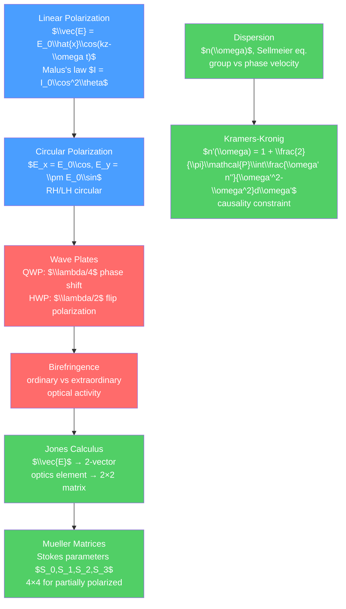

# 🌀 Polarization and Dispersion

> [!abstract] TL;DR
> Polarization describes the orientation of the electric field vector in an electromagnetic wave. Linear, circular, and elliptical polarization are the three general states; Malus's law ($I = I_0\cos^2\theta$) governs linear polarizers. Dispersion arises because the refractive index $n(\omega)$ of a material depends on frequency — separating white light into a spectrum. At the graduate level, Jones calculus (2×2 matrices for polarization states) and Mueller matrices (4×4 for intensities) systematize polarimetry, and Kramers-Kronig relations connect the real and imaginary parts of $n(\omega)$ through causality.

## Intuition — analogy FIRST

Light is a transverse wave — the electric field oscillates perpendicular to the direction of travel. If you shake a rope up and down, the rope oscillates vertically — this is like linearly polarized light with vertical polarization. Shake it horizontally, and you have horizontal polarization. A polarizing filter is like a picket fence: it only lets through the component of the wave oscillating in the direction of the filter's slats.

Dispersion: a prism splits white light into a rainbow because different colors (frequencies) travel at slightly different speeds in glass (each has a different refractive index). Red light slows less than blue light in glass, so red is bent less — the spectrum spreads out.

---

## How It Works



---

## Key Concepts / Details

### Secondary Level

**Polarization States**

Light is a transverse electromagnetic wave. The electric field $\vec{E}$ is perpendicular to the direction of propagation.

- **Unpolarized light**: $\vec{E}$ oscillates in random directions (thermal sources: sun, incandescent lamp, LED)
- **Linearly polarized**: $\vec{E}$ oscillates in a fixed plane
- **Circularly polarized**: $\vec{E}$ rotates in a circle (equal amplitudes, 90° phase difference)
- **Elliptically polarized**: most general case (unequal amplitudes or phase $\neq 90°$)

**Malus's Law**

A linear polarizer transmits the component of $\vec{E}$ along its transmission axis. If the incident light is linearly polarized at angle $\theta$ to the polarizer's axis:

$$I = I_0\cos^2\theta$$

At $\theta = 0°$: full transmission. At $\theta = 90°$: zero transmission. At $\theta = 45°$: half intensity.

**Polarization by Reflection: Brewster's Angle**

At Brewster's angle $\theta_B = \arctan(n_2/n_1)$, the reflected light is completely s-polarized. Polarizing sunglasses use this: the coating blocks s-polarized glare from horizontal surfaces (roads, water).

**Dispersion**

The refractive index of glass depends on wavelength (color):
- Crown glass: $n_{red} \approx 1.512$, $n_{violet} \approx 1.532$
- Diamond: $n_{red} \approx 2.407$, $n_{violet} \approx 2.451$

Prisms and raindrops separate white light into colors because $n$ is larger for shorter wavelengths (normal dispersion). Rainbows appear because sunlight is dispersed and internally reflected in spherical water droplets.

### Undergraduate Level

**Wave Plates (Retarders)**

A birefringent crystal has two principal axes with different refractive indices ($n_o$ for ordinary, $n_e$ for extraordinary rays). A plate of thickness $d$ introduces a phase retardation:

$$\Gamma = \frac{2\pi d(n_e - n_o)}{\lambda}$$

| Wave plate | Retardation | Effect |
|-----------|-------------|--------|
| Quarter-wave plate (QWP) | $\Gamma = \pi/2$ | Linear → circular (at 45°), circular → linear |
| Half-wave plate (HWP) | $\Gamma = \pi$ | Rotates linear polarization by $2\alpha$ (for fast axis at angle $\alpha$) |
| Full-wave plate | $\Gamma = 2\pi$ | No net effect (polarization state unchanged) |

**Birefringence**

In an anisotropic crystal, ordinary and extraordinary rays travel at different speeds. The two rays accumulate phase difference as they propagate, changing the polarization state. Applications: LCD displays (liquid crystal = tunable birefringent medium), optical isolators, polarization beam splitters.

**Optical Activity**

Some chiral media (like quartz, sugar solutions) rotate the plane of polarization by $\beta = \alpha_s \cdot l$ (where $\alpha_s$ is specific rotation in deg/dm and $l$ is path length). Used in polarimetry to measure sugar concentration in food science.

**Sellmeier Equation**

Empirical dispersion formula for transparent materials:

$$n^2(\lambda) = 1 + \sum_j\frac{B_j\lambda^2}{\lambda^2 - C_j}$$

For SiO₂ glass: three terms give an accurate fit over 0.2–2 µm.

### Graduate Level

**Jones Calculus**

For fully polarized light, the Jones vector is a complex 2-vector:

$$\vec{J} = \begin{pmatrix}E_x \\ E_y\end{pmatrix} = \begin{pmatrix}A_x e^{i\phi_x} \\ A_y e^{i\phi_y}\end{pmatrix}$$

Common polarization states:
- Horizontal linear: $(1, 0)^T$
- Vertical linear: $(0, 1)^T$
- 45° linear: $(1, 1)^T/\sqrt{2}$
- Right circular: $(1, -i)^T/\sqrt{2}$
- Left circular: $(1, i)^T/\sqrt{2}$

Jones matrices for optical elements:
- Horizontal polarizer: $\begin{pmatrix}1&0\\0&0\end{pmatrix}$
- HWP (fast axis horizontal): $\begin{pmatrix}1&0\\0&-1\end{pmatrix}$
- QWP (fast axis horizontal): $\begin{pmatrix}1&0\\0&i\end{pmatrix}$
- Rotation by $\theta$: $\begin{pmatrix}\cos\theta & -\sin\theta\\\sin\theta & \cos\theta\end{pmatrix}$

Total effect of $N$ elements: $J_{total} = J_N \cdots J_2 J_1$ (right to left).

**Stokes Parameters and Mueller Matrices**

For partially polarized light, use the Stokes vector $\vec{S} = (S_0, S_1, S_2, S_3)^T$:

$$S_0 = I_{total}, \quad S_1 = I_x - I_y, \quad S_2 = I_{45} - I_{135}, \quad S_3 = I_R - I_L$$

Degree of polarization: $DOP = \sqrt{S_1^2+S_2^2+S_3^2}/S_0 \in [0,1]$.

Mueller matrix: 4×4 real matrix relating input to output Stokes vectors: $\vec{S}_{out} = M\vec{S}_{in}$.

Mueller matrices are measurable (unlike Jones matrices, which require coherent detection) and work for depolarizing elements.

**Kramers-Kronig Relations**

The complex refractive index $\tilde{n}(\omega) = n'(\omega) + in''(\omega)$ (where $n''$ describes absorption) must satisfy causality: the medium cannot respond before the field arrives. This causality constraint through contour integration in the complex $\omega$-plane gives:

$$n'(\omega) - 1 = \frac{2}{\pi}\mathcal{P}\int_0^\infty\frac{\omega'n''(\omega')}{\omega'^2 - \omega^2}\,d\omega'$$

$$n''(\omega) = -\frac{2\omega}{\pi}\mathcal{P}\int_0^\infty\frac{n'(\omega')-1}{\omega'^2-\omega^2}\,d\omega'$$

Practical consequence: if you know the absorption spectrum $n''(\omega)$ over all frequencies, you can calculate the refractive index $n'(\omega)$ — and vice versa. Used in spectroscopy, optical design, and verifying physical models.

**Anomalous Dispersion**

Near an absorption resonance, $dn/d\omega < 0$ — shorter wavelengths travel faster. This leads to group velocity exceeding phase velocity, and in extreme cases $v_g > c$ or even negative (in absorbing media). This does not violate special relativity because signal velocity is limited to $c$ — the peak of a pulse can advance in time without carrying information faster than $c$ (Sommerfeld-Brillouin analysis).

**Nonlinear Optics Introduction**

At high optical intensities (lasers), the polarization response becomes nonlinear:

$$P = \epsilon_0(\chi^{(1)}E + \chi^{(2)}E^2 + \chi^{(3)}E^3 + \cdots)$$

$\chi^{(2)}$ (second-harmonic generation, sum/difference frequency, parametric amplification) — requires non-centrosymmetric crystal. $\chi^{(3)}$ (self-phase modulation, four-wave mixing, Kerr effect) — present in all media including amorphous materials.

```python
import numpy as np
import matplotlib.pyplot as plt
from matplotlib.patches import Ellipse

# Jones calculus: tracing polarization state through optical system
def jones_state(Ex, Ey, label):
    return np.array([Ex, Ey], dtype=complex), label

def malus_law_check():
    theta = np.linspace(0, 2*np.pi, 200)
    I = np.cos(theta)**2
    fig, ax = plt.subplots(figsize=(6, 4))
    ax.plot(np.degrees(theta), I, lw=2)
    ax.set_xlabel('Angle between polarization and analyzer (°)')
    ax.set_ylabel('Transmitted Intensity / I₀')
    ax.set_title("Malus's Law: $I = I_0\\cos^2\\theta$")
    ax.grid(True, alpha=0.3)
    return fig

# Sellmeier dispersion for BK7 glass
def sellmeier_BK7(wavelength_um):
    """BK7 glass dispersion (Schott catalog coefficients)"""
    l2 = wavelength_um**2
    n2 = (1 + 1.03961212*l2/(l2 - 0.00600069867)
            + 0.231792344*l2/(l2 - 0.0200179144)
            + 1.01046945*l2/(l2 - 103.560653))
    return np.sqrt(n2)

lam = np.linspace(0.35, 2.0, 300)  # micrometers
n = sellmeier_BK7(lam)

fig2, (ax1, ax2) = plt.subplots(1, 2, figsize=(10, 4))
ax1.plot(lam*1000, n, lw=2, color='blue')
ax1.set_xlabel('Wavelength (nm)')
ax1.set_ylabel('Refractive index n')
ax1.set_title('BK7 Glass: Sellmeier Dispersion')
ax1.axvline(589.3, color='yellow', linewidth=2, alpha=0.8, label='Na D-line (589 nm)')
ax1.legend()
ax1.grid(True, alpha=0.3)

# Group velocity
omega = 2*np.pi*3e14 / lam  # rad/s (c in um/s, lam in um)
# Use finite differences for d(omega)/dk = c/(n - lambda*dn/dlambda)
dn_dlam = np.gradient(n, lam)
v_phase = 1 / n  # units of c
v_group = 1 / (n - lam * dn_dlam)  # units of c

ax2.plot(lam*1000, v_phase, label='Phase velocity $c/n$', lw=2)
ax2.plot(lam*1000, v_group, '--', label='Group velocity', lw=2)
ax2.set_xlabel('Wavelength (nm)')
ax2.set_ylabel('Velocity (units of c)')
ax2.set_title('Group vs Phase Velocity in BK7')
ax2.legend()
ax2.grid(True, alpha=0.3)
plt.tight_layout()

malus_law_check()
```

---

## Real-World Notes

- **LCD screens**: liquid crystal molecules rotate polarization when a voltage is applied, acting as tunable wave plates. Combined with crossed polarizers, this switches each pixel from dark to bright.
- **Optical coherence tomography (OCT)**: uses polarization-sensitive OCT to image biological tissues. Different tissue types (muscle, fat, collagen) have different birefringence — contrast mechanism in medical imaging.
- **Fiber optic communications**: polarization mode dispersion (PMD) limits bandwidth in long-haul fibers. Different polarization modes travel at slightly different speeds due to fiber imperfections.
- **Sunglasses**: anti-glare sunglasses use vertically oriented linear polarizers. Reflected sunlight from horizontal surfaces (roads, water) is predominantly s-polarized (horizontal) and is blocked.
- **Ellipsometry**: measures the change in polarization state upon reflection from thin films to determine thickness and refractive index with sub-nanometer precision — used in semiconductor manufacturing.

---

## Common Pitfalls

1. **Jones calculus vs Mueller calculus**: Jones vectors work for coherent (fully polarized) light; Mueller matrices work for partially polarized or incoherent light. For single-mode lasers use Jones; for thermal sources use Mueller.
2. **Wave plate at the wrong angle**: a QWP converts linear to circular only when the linear polarization is at 45° to the fast axis. At 0° or 90°, the QWP has no effect on linear polarization.
3. **Anomalous dispersion doesn't violate relativity**: $v_g > c$ is possible in absorbing media near a resonance, but a real signal (with a sharp turn-on) propagates at the "front velocity" = $c$. Only pre-shaped pulses can apparently exceed $c$ due to reshaping by the medium.
4. **Stokes parameter $S_3$ sign convention**: some sources define $S_3 = I_L - I_R$ (physics convention) and others $S_3 = I_R - I_L$ (engineering). Be consistent.
5. **Sellmeier formula extrapolation**: the Sellmeier equation is only valid in the transparent region. Near absorption bands, the fit fails. Use Kramers-Kronig for a physically consistent extension.

---

## Related Concepts

- [[_MOC_Waves_and_Optics|↑ Section MOC]]
- [[Wave_Motion_and_Properties]] — polarization is a property of transverse waves
- [[Electromagnetic_Waves_and_Radiation]] — polarization states of EM waves
- [[Interference_and_Diffraction]] — coherence and polarization interact in interference

---

## Review Questions

1. **Secondary**: Vertically polarized light of intensity $I_0$ passes through a polarizer oriented at 30° from vertical, then through a second polarizer at 60° from vertical (i.e., horizontal). What is the transmitted intensity?
2. **Undergraduate**: Derive the Jones matrix for a wave plate with fast axis at angle $\alpha$ to the horizontal and retardation $\Gamma$. Show that for $\Gamma = \pi$ (HWP) with fast axis at 45°, the matrix converts horizontal linear polarization to vertical linear polarization.
3. **Graduate**: State and derive the Kramers-Kronig relations. Assume $n(\omega)$ is analytic in the upper half complex plane (causality) and apply the residue theorem. What physical information does each relation give about the medium?

---

## Sources

- Hecht — *Optics*, 5th ed., Ch. 8 (polarization)
- Born & Wolf — *Principles of Optics*, 7th ed., Ch. 1, 10
- Saleh & Teich — *Fundamentals of Photonics*, 3rd ed., Ch. 6–7
- Boyd — *Nonlinear Optics*, 4th ed.

#physics #optics #polarization #dispersion #birefringence #JonesCalculus #MuellerMatrix #KramersKronig #nonlinearOptics #secondary #undergraduate #graduate
