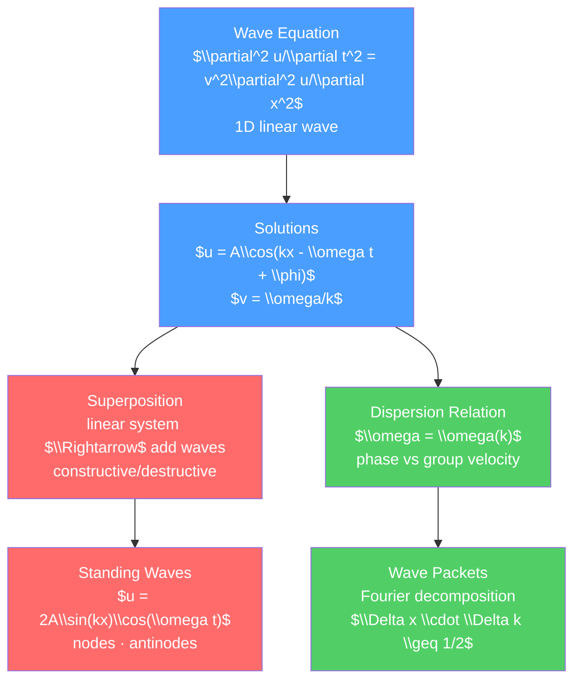

# 🌊 Wave Motion and Properties

> [!abstract] TL;DR
> A wave is a disturbance that propagates through space and time, carrying energy without carrying matter. The wave equation $\partial^2 u/\partial t^2 = v^2\,\partial^2 u/\partial x^2$ governs all linear waves. Superposition, interference, and standing waves are consequences of linearity. At the graduate level, the distinction between group velocity (speed of information/energy) and phase velocity (speed of wavefronts) becomes crucial for dispersive media, and wave packets / Fourier decomposition reveal the time-bandwidth uncertainty relation.

## Intuition — analogy FIRST

Watch ripples spread across a still pond after you drop a stone. The water molecules themselves don't travel outward — they just move up and down. It's the *disturbance*, the *pattern* that moves. This is the key insight: waves transport energy, not matter.

Push one end of a slinky spring quickly and let go. A compression pulse shoots along the slinky, bounces off the wall, and comes back. The spring coils didn't permanently move — they oscillated around their equilibrium positions as the wave passed. That pulse is a mechanical wave.

---

## How It Works



---

## Key Concepts / Details

### Secondary Level

**Types of Waves**

| Type | Vibration direction | Example |
|------|--------------------|---------| 
| Transverse | Perpendicular to propagation | Light, waves on string |
| Longitudinal | Parallel to propagation | Sound, slinky compression |

**Key Wave Parameters**

| Quantity | Symbol | Relation |
|---------|--------|---------|
| Wavelength | $\lambda$ | Distance between crests (m) |
| Frequency | $f$ | Oscillations per second (Hz) |
| Period | $T$ | $T = 1/f$ (s) |
| Wave speed | $v$ | $v = f\lambda = \lambda/T$ |
| Angular frequency | $\omega$ | $\omega = 2\pi f$ (rad/s) |
| Wave number | $k$ | $k = 2\pi/\lambda$ (rad/m) |

**Sinusoidal Wave**: $y(x,t) = A\sin(kx - \omega t + \phi_0)$

- $A$ = amplitude (maximum displacement)
- $kx - \omega t = $ phase
- Phase velocity: $v_{ph} = \omega/k = f\lambda$

**Superposition Principle**: when two or more waves overlap in a linear medium, the total displacement is the vector sum of individual displacements.

**Beats**: two waves with frequencies $f_1$ and $f_2$ close together: combined wave has beat frequency $f_{beat} = |f_1 - f_2|$.

### Undergraduate Level

**The Wave Equation**

For a transverse wave on a string with tension $T$ and linear mass density $\mu$:

$$\frac{\partial^2 y}{\partial t^2} = \frac{T}{\mu}\frac{\partial^2 y}{\partial x^2} = v^2\frac{\partial^2 y}{\partial x^2}$$

where $v = \sqrt{T/\mu}$. The general solution (D'Alembert): $y(x,t) = f(x-vt) + g(x+vt)$ — any right-moving or left-moving wave profile.

Sound waves: $v_{sound} = \sqrt{\gamma P_0/\rho}$ (adiabatic, where $\gamma = C_P/C_V$). For air at 20°C: $v \approx 343$ m/s.

**Standing Waves**

Two equal waves traveling in opposite directions: $y_1 = A\cos(kx-\omega t)$, $y_2 = A\cos(kx+\omega t)$.

Sum: $y = 2A\cos(kx)\cos(\omega t)$

Standing wave pattern: nodes at $x = (n+\tfrac{1}{2})\lambda/2$, antinodes at $x = n\lambda/2$.

For a string fixed at both ends (length $L$): $\lambda_n = 2L/n$, $f_n = nv/(2L)$ for $n = 1, 2, 3, \ldots$

**Energy and Intensity**

Energy density: $u = \tfrac{1}{2}\mu\omega^2 A^2$ (time-averaged).

Intensity: $I = \tfrac{1}{2}\rho v\omega^2 A^2$ (power per unit area).

Decibel scale: $\beta = 10\log_{10}(I/I_0)$ dB, where $I_0 = 10^{-12}$ W/m².

**Impedance and Reflection**

Characteristic impedance: $Z = \sqrt{T\mu} = \mu v$ (string); $Z = \rho v$ (acoustic).

Reflection coefficient at interface: $r = (Z_2 - Z_1)/(Z_2 + Z_1)$.

At $Z_2 \gg Z_1$ (fixed end): $r = +1$ (no phase change for pressure; $-1$ for displacement).

### Graduate Level

**Dispersion Relation $\omega(k)$**

In a non-dispersive medium: $\omega = vk$ (linear), all frequencies travel at the same speed.

In a dispersive medium: $\omega = \omega(k)$ is nonlinear. Examples:
- Deep water waves: $\omega = \sqrt{gk}$
- Electron de Broglie waves: $\omega = \hbar k^2/(2m)$
- Electromagnetic waves in plasma: $\omega^2 = \omega_p^2 + c^2k^2$

**Phase Velocity vs Group Velocity**

Phase velocity: $v_{ph} = \omega/k$ (speed of a constant-phase wavefront)

Group velocity: $v_g = d\omega/dk$ (speed of the wave packet envelope — carries energy and information)

These are equal only for non-dispersive media ($\omega \propto k$). In general:

$$v_g = v_{ph} + k\frac{dv_{ph}}{dk}$$

Examples:
- Deep water: $v_{ph} = \sqrt{g/k}$, $v_g = v_{ph}/2$ — wave crests outrun the packet
- Plasma: $v_{ph} = c/\sqrt{1-\omega_p^2/\omega^2} > c$, but $v_g = c\sqrt{1-\omega_p^2/\omega^2} < c$ (information travels at $v_g$, not $v_{ph}$)

**Wave Packets and Fourier Decomposition**

Any wave packet can be decomposed into sinusoidal components:

$$u(x, t=0) = \frac{1}{\sqrt{2\pi}}\int_{-\infty}^\infty \tilde{u}(k)e^{ikx}\,dk$$

A Gaussian wave packet ($u(x) = e^{-x^2/(4\sigma_x^2)}e^{ik_0 x}$) has Gaussian Fourier transform with width $\sigma_k = 1/(2\sigma_x)$:

$$\sigma_x\sigma_k = \frac{1}{2} \quad \text{(minimum uncertainty)}$$

For a dispersive medium, the packet spreads (disperses) over time because different $k$ components travel at different speeds. Spreading time: $t_{spread} \sim \sigma_x^2/|d^2\omega/dk^2|$.

**Waveguides and Modes**

In a 2D or 3D geometry with boundaries, only discrete modes can propagate. For a rectangular waveguide:

$$k_z^2 = \frac{\omega^2}{c^2} - \left(\frac{m\pi}{a}\right)^2 - \left(\frac{n\pi}{b}\right)^2$$

Cutoff frequency: $\omega_{mn} = c\pi\sqrt{(m/a)^2 + (n/b)^2}$. Below cutoff, $k_z$ is imaginary and the wave decays exponentially (evanescent).

```python
import numpy as np
import matplotlib.pyplot as plt
from scipy.fft import fft, fftfreq, ifft

# Wave packet: Gaussian envelope on a carrier
k0 = 5.0   # carrier wave number (rad/m)
sigma_k = 0.5  # width in k-space
x = np.linspace(-10, 10, 1000)

# Construct packet in k-space (Gaussian around k0)
k = fftfreq(len(x), d=(x[1]-x[0])) * 2 * np.pi
k_spectrum = np.exp(-(k - k0)**2 / (2*sigma_k**2))

# Inverse FFT to get spatial wave packet
packet = np.abs(ifft(k_spectrum))
sigma_x_theoretical = 1 / (2 * sigma_k)

fig, axes = plt.subplots(2, 2, figsize=(10, 7))

# 1. Spatial wave packet
axes[0,0].plot(x, packet, lw=2)
axes[0,0].set_title(f'Wave Packet ($\\sigma_x \\approx {sigma_x_theoretical:.2f}$ m)')
axes[0,0].set_xlabel('x (m)')

# 2. k-spectrum
k_plot = np.linspace(0, 10, 500)
spectrum = np.exp(-(k_plot - k0)**2 / (2*sigma_k**2))
axes[0,1].plot(k_plot, spectrum, lw=2, color='red')
axes[0,1].set_title(f'k-spectrum ($\\sigma_k = {sigma_k}$ rad/m)')
axes[0,1].set_xlabel('k (rad/m)')

# 3. Dispersion: deep water waves omega = sqrt(g*k)
g = 9.81
k_range = np.linspace(0.1, 10, 200)
omega_disp = np.sqrt(g * k_range)
v_ph = omega_disp / k_range
v_g = np.gradient(omega_disp, k_range)

axes[1,0].plot(k_range, v_ph, label='$v_{ph} = \\omega/k$', lw=2)
axes[1,0].plot(k_range, v_g, '--', label='$v_g = d\\omega/dk$', lw=2)
axes[1,0].set_xlabel('k (rad/m)')
axes[1,0].set_ylabel('Speed (m/s)')
axes[1,0].set_title('Deep Water: Group vs Phase Velocity')
axes[1,0].legend()

# 4. Uncertainty product
sigma_x_vals = np.logspace(-2, 2, 100)
sigma_k_vals = 1 / (2 * sigma_x_vals)
axes[1,1].loglog(sigma_x_vals, sigma_k_vals, lw=2)
axes[1,1].set_xlabel(r'$\sigma_x$ (m)')
axes[1,1].set_ylabel(r'$\sigma_k$ (rad/m)')
axes[1,1].set_title(r'Uncertainty: $\sigma_x \cdot \sigma_k = 1/2$')
axes[1,1].grid(True, alpha=0.3)

plt.tight_layout()
```

---

## Real-World Notes

- **Musical instruments**: standing waves in strings, air columns, and membranes determine the resonant frequencies (harmonics) of musical instruments. The timbre depends on the relative amplitudes of harmonics.
- **Fiber optics**: group velocity dispersion (different frequencies travel at different speeds in glass) limits the bandwidth of fiber optic communications — dispersion compensation is key to modern long-haul fiber links.
- **Seismology**: P-waves (longitudinal) and S-waves (transverse) from earthquakes travel at different speeds through the Earth. The time delay between them at a seismograph lets us locate the earthquake epicenter.
- **Ultrasound imaging**: sound waves reflect at tissue interfaces (impedance mismatch). The echo timing gives depth information. Resolution is $\sim\lambda/2$.
- **Radar**: pulse compression uses waveform design (chirps — frequency-swept pulses) to achieve fine range resolution with large transmitted energy.

---

## Common Pitfalls

1. **Group velocity carries energy and information, phase velocity does not**: a single-frequency wave is infinitely extended and carries no information. Information requires a modulated wave packet, which travels at $v_g$.
2. **Standing waves require boundary conditions**: standing waves form between reflecting boundaries. On an open string or in free space, traveling waves result.
3. **Beats are not amplitude modulation**: beats arise from the superposition of two sinusoidal waves. Amplitude modulation (AM radio) intentionally imposes a similar pattern by multiplying a carrier by a signal.
4. **Wave speed depends on medium, not frequency** (non-dispersive): in non-dispersive media (vacuum for EM waves), all frequencies travel at the same speed. In dispersive media (glass, plasma, water), speed depends on frequency.
5. **Fourier uncertainty $\sigma_x\sigma_k = 1/2$ is for Gaussian packets**: other packet shapes (square pulse, etc.) have $\sigma_x\sigma_k \geq 1/2$. The Gaussian achieves the minimum uncertainty.

---

## Related Concepts

- [[_MOC_Waves_and_Optics|↑ Section MOC]]
- [[Oscillations_and_SHM]] — coupled oscillators lead to wave equations
- [[Interference_and_Diffraction]] — superposition of waves at different paths
- [[Electromagnetic_Waves_and_Radiation]] — EM waves as solutions to Maxwell's equations

---

## Review Questions

1. **Secondary**: A string has tension 50 N and linear mass density 0.005 kg/m. What is the wave speed? If the string is 1 m long and fixed at both ends, what are the frequencies of the first three harmonics?
2. **Undergraduate**: A wave packet on a string is given by $y(x, 0) = A\exp(-x^2/(2\sigma^2))\cos(k_0 x)$. Find its Fourier transform. What is $\sigma_x \cdot \sigma_k$? How does the packet evolve for $t > 0$ in a non-dispersive medium?
3. **Graduate**: For deep water gravity waves ($\omega = \sqrt{gk}$), compute the group velocity and show that $v_g = v_{ph}/2$. A Gaussian wave packet with initial spatial width $\sigma_0$ will spread. Derive the spreading timescale $t_{spread}$ in terms of $\sigma_0$, $g$, and $k_0$.

---

## Sources

- French — *Vibrations and Waves*, MIT Introductory Physics Series
- Pain — *The Physics of Vibrations and Waves*, 6th ed.
- Born & Wolf — *Principles of Optics*, 7th ed., Ch. 1
- Griffiths — *Introduction to Electrodynamics*, 4th ed., Ch. 9

#physics #waves #WaveEquation #superposition #standingWaves #groupVelocity #phaseVelocity #dispersion #FourierDecomposition #secondary #undergraduate #graduate
