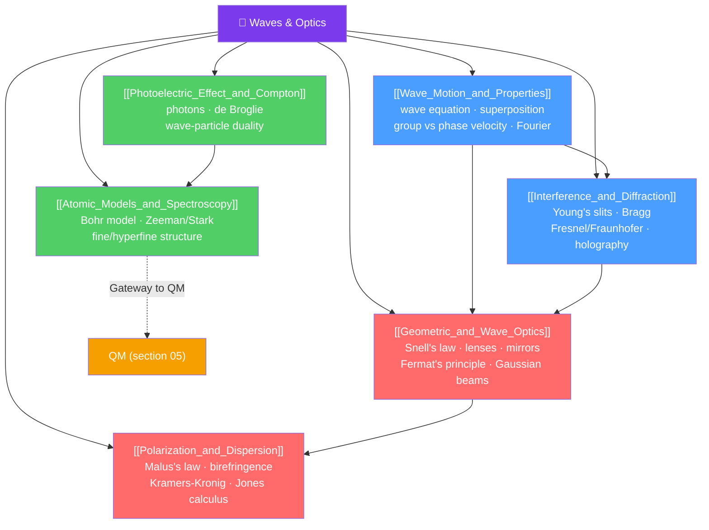

# 🌊 Waves and Optics — Map of Content

> [!abstract] What This Section Covers
> Waves are the physics of disturbances that propagate through space and time, from sound and water waves to light and quantum wavefunctions. Optics applies wave physics to light — both geometric (ray optics for $\lambda \ll$ obstacle size) and physical (wave optics for $\lambda \sim$ obstacle size). The section spans wave motion and the wave equation, interference and diffraction (the definitive evidence that light is a wave), geometric and wave optics, polarization and dispersion, and the photoelectric effect and Compton scattering (where light behaves as a particle). The section closes with atomic models and spectroscopy — the historical gateway to quantum mechanics.

## Concept Map

## Learning Path

1. [[Wave_Motion_and_Properties]] — Wave equation, transverse/longitudinal waves, superposition, standing waves, group/phase velocity, and wave packets.
2. [[Interference_and_Diffraction]] — Young's double slit, thin films, single-slit diffraction, diffraction gratings, Rayleigh criterion, X-ray diffraction.
3. [[Geometric_and_Wave_Optics]] — Snell's law, total internal reflection, lenses, mirrors, Fermat's principle, Gaussian beams, and ABCD matrices.
4. [[Polarization_and_Dispersion]] — Polarization states, Malus's law, wave plates, Jones calculus, dispersion, Kramers-Kronig, and nonlinear optics.
5. [[Photoelectric_Effect_and_Compton]] — Photoelectric effect, Compton scattering, de Broglie wavelength, wave-particle duality, and coherent states.
6. [[Atomic_Models_and_Spectroscopy]] — Rutherford scattering, Bohr model, hydrogen spectrum, Zeeman/Stark effects, fine structure, and Rabi oscillations.

## All Notes at a Glance

| Note | Difficulty | What You'll Learn |
|------|------------|-------------------|
| [[Wave_Motion_and_Properties]] | Secondary → PhD | Wave equation, superposition, standing waves, group velocity, dispersion, Fourier |
| [[Interference_and_Diffraction]] | Secondary → PhD | Young's slits, single slit, gratings, Rayleigh criterion, X-ray diffraction, holography |
| [[Geometric_and_Wave_Optics]] | Secondary → PhD | Snell's law, lenses, Fermat's principle, aberrations, Gaussian beams, ABCD matrices |
| [[Polarization_and_Dispersion]] | Secondary → PhD | Polarization, birefringence, Jones/Mueller calculus, Kramers-Kronig, nonlinear optics |
| [[Photoelectric_Effect_and_Compton]] | Secondary → PhD | Photoelectric effect, Compton, de Broglie, coherent states, QFT photons |
| [[Atomic_Models_and_Spectroscopy]] | Secondary → PhD | Bohr model, Zeeman/Stark, spin-orbit coupling, hyperfine, Rabi oscillations |

## Key Questions This Section Answers

- Why does double-slit interference only appear for coherent light, and what makes light coherent?
- How does a single slit diffract light, and what determines the width of the central maximum?
- Why does total internal reflection occur, and what is the evanescent wave?
- Why does a wave entering a dispersive medium split into different colors, and what are Kramers-Kronig relations?
- Why did the photoelectric effect require photons when classical wave theory failed?
- What is the Bohr model's explanation for atomic spectra, and where does it fail?

## Related Sections

- [[_MOC_Physics_Master|↑ Physics Master MOC]]
- [[_MOC_Electromagnetism|← Electromagnetism]] — EM waves are the physics behind light and optics
- [[_MOC_Thermodynamics|← Thermodynamics]] — Blackbody radiation bridges thermo and quantum
- [[_MOC_Quantum_Mechanics|→ Quantum Mechanics]] — Wave-particle duality leads directly into QM

## Key References

- Hecht — *Optics*, 5th ed. — comprehensive undergraduate optics
- Born & Wolf — *Principles of Optics*, 7th ed. — definitive graduate reference
- Griffiths — *Introduction to Electrodynamics*, 4th ed., Ch. 9 — EM waves in matter
- French — *Vibrations and Waves* — MIT Introductory Physics

#MOC #Physics #Waves #Optics
