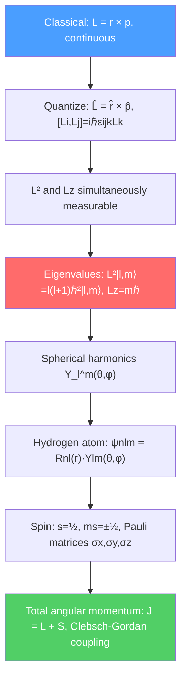

# 🌀 Angular Momentum and Spin

> [!abstract] TL;DR
> Angular momentum in quantum mechanics is quantized in units of $\hbar$: orbital states labeled $l,m_l$ describe the shape of electron orbitals, while spin is an intrinsic property with no classical analog. The hydrogen atom is solved exactly by combining radial and angular (spherical harmonic) solutions. At PhD level, addition of angular momenta via Clebsch-Gordan coefficients, the Wigner-Eckart theorem, and the SU(2) representation theory underlie atomic spectroscopy, nuclear physics, and particle physics.

## Intuition — analogy FIRST

Imagine a spinning top. Classically, it can spin at any rate and point in any direction. Now shrink the top to atomic size: quantum mechanics says only certain spinning rates are allowed, and the axis can only point in a discrete set of directions relative to any measurement axis you choose. Moreover, electrons have a built-in "intrinsic spin" — as if they were tiny spinning tops — but this spin has no classical analog: the electron is a point particle yet has angular momentum $\hbar/2$.

The remarkable prediction of spin emerged from Dirac's relativistic quantum mechanics and was confirmed by the Stern-Gerlach experiment: a beam of silver atoms passing through an inhomogeneous magnetic field splits into exactly two beams, corresponding to spin-up and spin-down, not a classical continuous spread.

---

## How It Works

---

## Key Concepts / Details

### Secondary Level

**Classical angular momentum:** $\vec{L} = \vec{r} \times \vec{p}$, measured in kg·m²/s or equivalently in units of $\hbar$.

**Quantization rules:** In quantum mechanics, angular momentum is quantized:
- Magnitude: $L = \sqrt{l(l+1)}\,\hbar$, where $l = 0, 1, 2, 3, \ldots$ (called $s, p, d, f$ orbitals in chemistry)
- $z$-component: $L_z = m_l\hbar$, where $m_l = -l, -l+1, \ldots, +l$ (so $2l+1$ values)

**Electron spin:** A purely quantum property with no classical rotating-object analog. The electron has spin quantum number $s = 1/2$, so:
- $S = \sqrt{s(s+1)}\,\hbar = \frac{\sqrt{3}}{2}\hbar$
- $S_z = m_s\hbar = \pm\hbar/2$ (spin-up $|\uparrow\rangle$ or spin-down $|\downarrow\rangle$)

**Stern-Gerlach experiment (1922):** Silver atoms (with one unpaired electron) in an inhomogeneous magnetic field split into exactly 2 beams ($m_s = \pm 1/2$), confirming spin quantization.

### Undergraduate Level

**Angular momentum commutation relations:** The three components satisfy:

$$[\hat{L}_x, \hat{L}_y] = i\hbar\hat{L}_z, \quad [\hat{L}_y, \hat{L}_z] = i\hbar\hat{L}_x, \quad [\hat{L}_z, \hat{L}_x] = i\hbar\hat{L}_y$$

or compactly $[\hat{L}_i, \hat{L}_j] = i\hbar\epsilon_{ijk}\hat{L}_k$. Because $\hat{L}^2$ commutes with all three components, $\hat{L}^2$ and $\hat{L}_z$ can be simultaneously diagonalized.

**Spherical harmonics:** The eigenfunctions of $\hat{L}^2$ and $\hat{L}_z$ in spherical coordinates:

$$\hat{L}^2 Y_l^{m_l}(\theta,\phi) = l(l+1)\hbar^2\,Y_l^{m_l}, \qquad \hat{L}_z Y_l^{m_l} = m_l\hbar\,Y_l^{m_l}$$

Examples: $Y_0^0 = 1/\sqrt{4\pi}$ (spherically symmetric), $Y_1^0 = \sqrt{3/4\pi}\cos\theta$ ($p_z$ orbital), $Y_1^{\pm 1} = \mp\sqrt{3/8\pi}\sin\theta\,e^{\pm i\phi}$.

**Hydrogen atom solution:** With $V = -e^2/4\pi\epsilon_0 r$, the TISE separates as $\psi_{nlm}(r,\theta,\phi) = R_{nl}(r)\,Y_l^m(\theta,\phi)$. Energies:

$$E_n = -\frac{13.6\text{ eV}}{n^2}, \qquad n = 1, 2, 3, \ldots$$

with $l = 0, 1, \ldots, n-1$ and $m = -l, \ldots, +l$. The degeneracy $n^2$ (times 2 for spin) is a special feature of the $1/r$ potential.

**Pauli matrices for spin-1/2:**

$$\sigma_x = \begin{pmatrix}0&1\\1&0\end{pmatrix}, \quad \sigma_y = \begin{pmatrix}0&-i\\i&0\end{pmatrix}, \quad \sigma_z = \begin{pmatrix}1&0\\0&-1\end{pmatrix}$$

Spin operators $\hat{S}_i = \hbar\sigma_i/2$. Eigenstates of $\hat{S}_z$: $|\uparrow\rangle = \binom{1}{0}$, $|\downarrow\rangle = \binom{0}{1}$.

**Spin-orbit coupling:** The interaction between the electron's orbital motion and its spin: $\hat{H}_{SO} = \frac{e^2}{8\pi\epsilon_0}\frac{1}{m_e^2c^2}\frac{1}{r^3}\hat{\vec{L}}\cdot\hat{\vec{S}}$. This splits the $n=2$ hydrogen level into $2p_{1/2}$ and $2p_{3/2}$ (fine structure).

**Addition of angular momenta:** Two angular momenta $\vec{J}_1$ (quantum number $j_1$) and $\vec{J}_2$ (quantum number $j_2$) combine to give total angular momentum $J = \vec{J}_1 + \vec{J}_2$ with $j$ ranging from $|j_1-j_2|$ to $j_1+j_2$. The joint eigenstates $|j,m\rangle$ are related to the product basis $|j_1,m_1\rangle|j_2,m_2\rangle$ by **Clebsch-Gordan coefficients** $\langle j_1,m_1;j_2,m_2|j,m\rangle$:

$$|j,m\rangle = \sum_{m_1+m_2=m}\langle j_1,m_1;j_2,m_2|j,m\rangle\,|j_1,m_1\rangle|j_2,m_2\rangle$$

For two spin-1/2 particles: $j=1$ (triplet: $|1,1\rangle, |1,0\rangle, |1,-1\rangle$) and $j=0$ (singlet: $|0,0\rangle$).

### Graduate Level

**Wigner-Eckart theorem:** For an irreducible tensor operator $\hat{T}_q^{(k)}$ of rank $k$:

$$\langle j,m|\hat{T}_q^{(k)}|j',m'\rangle = \langle j',m';k,q|j,m\rangle\,\langle j\|\hat{T}^{(k)}\|j'\rangle$$

The matrix element factorizes into a Clebsch-Gordan coefficient (purely geometric, depends on $m,m',q$) and a reduced matrix element $\langle j\|\hat{T}^{(k)}\|j'\rangle$ independent of magnetic quantum numbers. This enormously simplifies selection rule derivations and intensity calculations in spectroscopy.

**Irreducible tensor operators:** Spherical harmonics $Y_l^m$ are rank-$l$ tensors; dipole operator $\hat{r}$ is rank-1. Selection rules $\Delta l = \pm 1$, $\Delta m = 0, \pm 1$ follow directly from the Wigner-Eckart theorem and properties of Clebsch-Gordan coefficients.

**Spinors and SU(2):** Spin-1/2 states transform under rotation by angle $\phi$ around axis $\hat{n}$ as:

$$U(\hat{n},\phi) = e^{-i\phi\hat{n}\cdot\vec{S}/\hbar} = \cos(\phi/2)\,\mathbb{1} - i\sin(\phi/2)\,\hat{n}\cdot\vec{\sigma}$$

Crucially, a $2\pi$ rotation gives $U = -\mathbb{1}$ — a spinor acquires a minus sign under $360°$ rotation! A $720°$ rotation returns to the original state. This is the double-cover property: $\text{SU}(2)$ is the double cover of $\text{SO}(3)$.

**Representations of SU(2):** For each integer or half-integer $j$, there is a $(2j+1)$-dimensional irreducible representation. Integer $j$ corresponds to bosons (symmetric under exchange); half-integer $j$ to fermions (antisymmetric). The representations are labeled by the highest weight $j$ (the Cartan generator eigenvalue).

---

## Real-World Notes

- **Atomic spectroscopy:** Electron configurations $(nl)^{N}$ and the spectroscopic terms $^{2S+1}L_J$ follow from angular momentum addition; selection rules from Wigner-Eckart determine which transitions are electric-dipole allowed.
- **NMR/MRI:** Nuclear spins $I$ precess around an external field at the Larmor frequency $\omega_L = \gamma B$. Resonant RF pulses rotate the spin (SU(2) rotation), forming the basis of all NMR spectroscopy and MRI imaging.
- **Quantum computing:** The qubit is a two-state quantum system (spin-1/2 or equivalent). Quantum gates are SU(2) rotations on the Bloch sphere.
- **Particle physics:** Hadrons are classified by their total spin: mesons (quark-antiquark, $j = 0$ or $1$) and baryons (three quarks, $j = 1/2$ or $3/2$). Clebsch-Gordan coefficients in SU(3) flavor symmetry predict the particle multiplets.

---

## Common Pitfalls

- **$L = \sqrt{l(l+1)}\hbar$, not $L = l\hbar$.** Students often confuse the quantum number $l$ with the magnitude of angular momentum. The correct magnitude is $\sqrt{l(l+1)}\hbar$.
- **Spin is NOT the electron rotating.** A point particle cannot literally spin; the magnetic moment and angular momentum of an electron match quantum mechanics but are not explained by a classical spinning sphere.
- **The uncertainty principle for angular momentum:** $\Delta L_x\,\Delta L_y \geq \hbar|\langle L_z\rangle|/2$ — you cannot simultaneously know two components of $\vec{L}$.
- **Spinors change sign under $2\pi$ rotation** — this is observable in interference experiments (neutron interferometry) and is the physical basis of the spin-statistics theorem.

---

## Related Concepts
- [[Schrodinger_Equation]] — Angular equations solved by spherical harmonics; radial part gives hydrogen spectrum
- [[Perturbation_Theory]] — Fine structure, Zeeman effect, hyperfine structure all computed as perturbative corrections
- [[Many_Body_Quantum_Systems]] — Spin statistics (bosons vs fermions) from SU(2) representation theory
- [[Standard_Model_Overview]] — Quarks and leptons carry spin-1/2; gauge bosons have spin-1
- [[Intro_to_Quantum_Field_Theory]] — Dirac equation = relativistic wave equation for spin-1/2 particles
- [[_MOC_Quantum_Mechanics|↑ Section MOC]]

---

## Review Questions

1. **(Secondary)** For the $3d$ subshell of hydrogen ($n=3$, $l=2$), list all possible values of $m_l$ and $m_s$. How many distinct quantum states exist in this subshell?
2. **(Undergraduate)** Two spin-1/2 particles are in the state $|\uparrow\rangle|\downarrow\rangle$. Express this as a superposition of total angular momentum eigenstates $|j,m\rangle$ using Clebsch-Gordan coefficients. What is the probability of measuring $j=1$?
3. **(Graduate)** Using the Wigner-Eckart theorem, prove that the electric dipole selection rules for hydrogen are $\Delta l = \pm 1$ and $\Delta m = 0, \pm 1$. What is the selection rule on $\Delta m$ for $\pi$-polarized and $\sigma^{\pm}$-polarized light?

---

## Sources
- Griffiths, *Introduction to Quantum Mechanics*, Ch. 4 (quantum mechanics in 3D, hydrogen atom, spin)
- Sakurai & Napolitano, *Modern Quantum Mechanics*, Ch. 3 (theory of angular momentum)
- Cohen-Tannoudji, *Quantum Mechanics*, Vol. 2, Ch. VI (general theory of angular momentum)
- Condon & Shortley, *The Theory of Atomic Spectra* (Clebsch-Gordan tables, spectroscopic terms)
- Biedenharn & Louck, *Angular Momentum in Quantum Physics* (Wigner-Eckart theorem, irreducible tensors)

#physics #quantum-mechanics #angular-momentum #spin #spherical-harmonics #Pauli-matrices #Clebsch-Gordan
