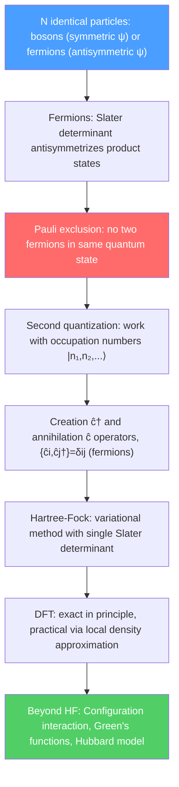

# 🔬 Many-Body Quantum Systems

> [!abstract] TL;DR
> When many quantum particles interact, the wave function lives in an exponentially large Hilbert space and new physics emerges — Pauli exclusion, superconductivity, Bose-Einstein condensation, Mott insulators. The formalism of second quantization (creation/annihilation operators $\hat{c}^\dagger, \hat{c}$) organizes this complexity by working directly with occupation numbers. Hartree-Fock and density functional theory provide tractable approximations that underpin all of quantum chemistry and materials science.

## Intuition — analogy FIRST

Consider organizing a library with a million books. The "first quantization" approach tracks every single book's exact position and identity — a million coordinates. "Second quantization" instead says: how many books are on shelf 1? How many on shelf 2? This occupation-number description is far more natural when books (particles) are identical and indistinguishable.

For identical particles, quantum mechanics has a radical consequence: the wave function must be either symmetric (bosons — any number per state, like photons and helium-4) or antisymmetric (fermions — at most one per state, like electrons and protons). The antisymmetry requirement for fermions is the Pauli exclusion principle, and it is the reason matter is stable, atoms have shells, and the periodic table exists.

---

## How It Works

---

## Key Concepts / Details

### Undergraduate Level

**Identical particles and symmetry:** For two identical particles, swapping them either leaves the wave function unchanged (bosons, symmetric: $\psi(2,1) = +\psi(1,2)$) or flips its sign (fermions, antisymmetric: $\psi(2,1) = -\psi(1,2)$). This dichotomy is called the **spin-statistics theorem** and is proved in relativistic quantum field theory: integer-spin particles are bosons; half-integer-spin particles are fermions.

**Pauli exclusion principle:** For fermions, $\psi(1,1) = -\psi(1,1) \Rightarrow \psi = 0$. Two identical fermions cannot occupy the same quantum state. This explains the periodic table: electrons fill shells $1s, 2s, 2p, \ldots$ with at most 2 per orbital (one spin-up, one spin-down).

**Slater determinant:** The antisymmetric many-electron wave function for $N$ electrons in single-particle states $\phi_1, \phi_2, \ldots, \phi_N$:

$$\Psi(\vec{r}_1, \vec{r}_2, \ldots, \vec{r}_N) = \frac{1}{\sqrt{N!}}\begin{vmatrix}\phi_1(\vec{r}_1) & \phi_2(\vec{r}_1) & \cdots & \phi_N(\vec{r}_1) \\ \phi_1(\vec{r}_2) & \phi_2(\vec{r}_2) & \cdots & \phi_N(\vec{r}_2) \\ \vdots & & \ddots & \vdots \\ \phi_1(\vec{r}_N) & \phi_2(\vec{r}_N) & \cdots & \phi_N(\vec{r}_N)\end{vmatrix}$$

The determinant automatically enforces antisymmetry (swapping two rows changes sign) and vanishes if any two single-particle states are identical (two identical rows).

**Bosonic statistics:** For bosons, the wave function is a permanent (determinant with all $+$ signs). Bosons tend to "bunch" — the probability of two bosons being in the same state is enhanced. Bose-Einstein condensation (BEC) occurs when a macroscopic fraction of bosons occupies the single-particle ground state below a critical temperature.

### Graduate Level

**Second quantization (occupation-number formalism):** Instead of tracking particle labels, work with occupation numbers $\{n_i\}$. For fermions:

- **Creation operator:** $\hat{c}_i^\dagger |n_1,\ldots,n_i=0,\ldots\rangle = (-1)^{\sum_{j<i}n_j}|n_1,\ldots,n_i=1,\ldots\rangle$
- **Annihilation operator:** $\hat{c}_i |\ldots,n_i=1,\ldots\rangle = (-1)^{\sum_{j<i}n_j}|\ldots,n_i=0,\ldots\rangle$, $\hat{c}_i|\ldots,n_i=0,\ldots\rangle = 0$
- **Anti-commutation relations:** $\{\hat{c}_i, \hat{c}_j^\dagger\} = \delta_{ij}$, $\{\hat{c}_i, \hat{c}_j\} = 0$

For bosons, replace anti-commutators with commutators: $[\hat{a}_i, \hat{a}_j^\dagger] = \delta_{ij}$.

**General Hamiltonian in second quantization:**

$$\hat{H} = \sum_{ij} h_{ij}\hat{c}_i^\dagger\hat{c}_j + \frac{1}{2}\sum_{ijkl} V_{ijkl}\hat{c}_i^\dagger\hat{c}_j^\dagger\hat{c}_l\hat{c}_k$$

One-body terms $h_{ij} = \langle i|\hat{T}+\hat{V}_{ext}|j\rangle$ and two-body interaction $V_{ijkl} = \langle ij|V_{ee}|kl\rangle$ (Coulomb repulsion).

**Hartree-Fock approximation:** Approximate the true ground state by the single Slater determinant that minimizes the energy. The variational principle gives the Hartree-Fock equations:

$$\hat{F}\phi_i(\vec{r}) = \epsilon_i\phi_i(\vec{r})$$

where the Fock operator $\hat{F} = \hat{T} + V_{ext} + \hat{V}_H + \hat{V}_X$ includes the Hartree (direct Coulomb) potential $\hat{V}_H$ and the exchange potential $\hat{V}_X$ (a non-local term with no classical analog, arising from the antisymmetry requirement). Solved self-consistently (SCF): guess orbitals → compute $\hat{F}$ → solve eigenvalue problem → update orbitals → repeat until converged.

**Density Functional Theory (DFT):** The Hohenberg-Kohn theorem (1964) proves that the ground-state energy is a unique functional of the electron density $n(\vec{r})$: $E = E[n(\vec{r})]$. The Kohn-Sham scheme (1965) maps the interacting system onto an equivalent non-interacting system with the same density, leading to self-consistent single-particle equations with an exchange-correlation functional $E_{xc}[n]$. In practice, the local density approximation (LDA) or generalized gradient approximation (GGA) is used. DFT is the workhorse of computational chemistry and materials science ($>50\%$ of all condensed matter calculations).

**Hubbard model:** The simplest model for strongly correlated electrons:

$$\hat{H} = -t\sum_{\langle i,j\rangle,\sigma}(\hat{c}_{i\sigma}^\dagger\hat{c}_{j\sigma} + h.c.) + U\sum_i \hat{n}_{i\uparrow}\hat{n}_{i\downarrow}$$

Hopping term $t$ favors delocalization (kinetic energy); on-site repulsion $U$ favors localization. For $U/t \gg 1$, the system is a Mott insulator (localized, magnetic); for $U/t \ll 1$, it is a metal. The Hubbard model captures the metal-insulator transition, magnetism, and (high-$T_c$) superconductivity in cuprates.

**Green's function methods:** The single-particle Green's function $G(\vec{k}, \omega) = [\omega - \epsilon_k - \Sigma(\vec{k},\omega)]^{-1}$ encodes the spectral properties. The self-energy $\Sigma$ captures all many-body effects. The spectral function $A(\vec{k},\omega) = -2\,\text{Im}\,G(\vec{k},\omega)$ is directly measured by ARPES (angle-resolved photoemission spectroscopy).

**Quantum entanglement and density matrices:** For a bipartite system $A \cup B$, the reduced density matrix $\hat{\rho}_A = \text{Tr}_B|\Psi\rangle\langle\Psi|$ captures all measurable properties of subsystem $A$. The entanglement entropy $S = -\text{Tr}(\hat{\rho}_A\ln\hat{\rho}_A)$ quantifies quantum correlations. Area law for ground states (entanglement entropy scales with boundary area, not volume) enables efficient numerical methods like DMRG (density matrix renormalization group).

**Quantum computing basics:** A qubit is a two-dimensional Hilbert space; $N$ qubits span $2^N$ dimensions. The exponential scaling of quantum many-body Hilbert space is simultaneously the source of computational hardness (simulation of quantum systems on classical computers scales exponentially) and quantum advantage (a quantum computer can simulate quantum systems efficiently).

---

## Real-World Notes

- **Electronic structure of materials:** DFT calculations predict band gaps, lattice constants, and phonon spectra of real materials to $\sim 1\%$ accuracy. Every new material's properties are now calculated before synthesis.
- **Drug discovery:** Hartree-Fock and post-HF methods (MP2, coupled cluster) compute protein-ligand binding energies, enabling rational drug design.
- **Quantum chemistry benchmarks:** Coupled cluster singles, doubles, and perturbative triples (CCSD(T)) — the "gold standard" for molecular energetics — is a systematic many-body perturbation theory in second quantization.
- **Quantum simulation:** IBM, Google, and IonQ quantum computers simulate small Hubbard models and molecular Hamiltonians, demonstrating quantum advantage for chemistry.

---

## Common Pitfalls

- **Slater determinant is an approximation, not exact.** The true ground state of an interacting system requires a superposition of many Slater determinants (configuration interaction). Hartree-Fock misses correlation energy ($\sim 1$ eV per electron pair).
- **DFT is in principle exact but in practice approximate.** The exact $E_{xc}[n]$ is unknown; LDA/GGA systematically underestimate band gaps. Hybrid functionals (B3LYP, HSE) partially correct this.
- **Second quantization commutation vs anti-commutation:** Bosons use commutators $[\hat{a},\hat{a}^\dagger]=1$; fermions use anti-commutators $\{\hat{c},\hat{c}^\dagger\}=1$. Mixing these up leads to wrong statistics.
- **Entanglement entropy vs classical entropy:** The von Neumann entropy $S = -\text{Tr}(\rho\ln\rho)$ is zero for a pure state even if it is highly entangled across a bipartition. "Entanglement" and "entropy" only coincide for the reduced density matrix.

---

## Related Concepts
- [[Schrodinger_Equation]] — Many-body Schrödinger equation, density matrix, Lindblad equation
- [[Angular_Momentum_and_Spin]] — Pauli exclusion from spin-statistics theorem; Slater determinants for spin orbitals
- [[Quantum_Harmonic_Oscillator]] — Ladder operators are the prototype for second-quantization creation/annihilation operators
- [[Crystal_Structure_and_Band_Theory]] — Bloch states as single-particle states in HF/DFT; phonons as bosons
- [[Superconductivity]] — BCS pairing of electrons; Bogoliubov transformation; Cooper pairs as effective bosons
- [[Intro_to_Quantum_Field_Theory]] — Second quantization of fields; particle creation and annihilation
- [[_MOC_Quantum_Mechanics|↑ Section MOC]]

---

## Review Questions

1. **(Undergraduate)** Write the normalized two-electron wave function for a helium atom (two electrons in the 1s orbital) as a Slater determinant. Why does Pauli exclusion not forbid this configuration?
2. **(Graduate)** Derive the Hartree-Fock equations from the variational principle applied to a single Slater determinant. Identify the Hartree and exchange terms physically.
3. **(Graduate)** For the Hubbard model at half-filling ($\langle n\rangle = 1$), explain qualitatively why the system is an insulator for $U/t \gg 1$ and a metal for $U/t \ll 1$. What is the signature of the metal-insulator transition in the spectral function $A(\vec{k},\omega)$?

---

## Sources
- Griffiths, *Introduction to Quantum Mechanics*, Ch. 5 (identical particles)
- Sakurai & Napolitano, *Modern Quantum Mechanics*, Ch. 6 (identical particles, Pauli principle)
- Szabo & Ostlund, *Modern Quantum Chemistry* (Hartree-Fock, configuration interaction, second quantization)
- Martin, *Electronic Structure: Basic Theory and Practical Methods* (DFT, Kohn-Sham, LDA)
- Fetter & Walecka, *Quantum Theory of Many-Particle Systems* (Green's functions, Hubbard model)
- Nielsen & Chuang, *Quantum Computation and Quantum Information* (qubits, entanglement)

#physics #quantum-mechanics #many-body #second-quantization #Hartree-Fock #DFT #Hubbard-model #entanglement
