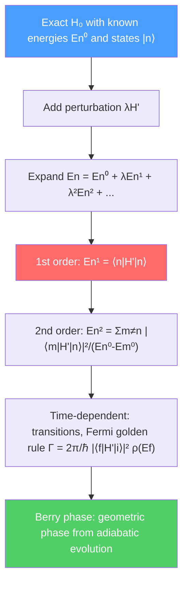

# 🔧 Perturbation Theory

> [!abstract] TL;DR
> Most Hamiltonians cannot be solved exactly, but when the true Hamiltonian $\hat{H} = \hat{H}_0 + \lambda\hat{H}'$ is close to a solvable $\hat{H}_0$, perturbation theory gives systematic corrections to energies and states as a power series in the small parameter $\lambda$. Time-independent theory yields the fine structure of hydrogen; time-dependent theory gives transition rates and Fermi's golden rule. At PhD level, the variational principle, WKB approximation, and Berry's geometric phase extend the toolkit to non-perturbative regimes.

## Intuition — analogy FIRST

Imagine calculating the orbit of a planet around the Sun while ignoring other planets (the exact Kepler problem). Now "turn on" the gravitational pull of Jupiter — a small perturbation. You do not need to restart from scratch; you calculate Jupiter's effect as a small correction to the Kepler orbit. If Jupiter's effect is $1\%$ of the Sun's, keeping just the first correction gives you $99\%+$ accuracy with $1\%$ of the work.

Quantum perturbation theory works identically: start from an exactly-solvable Hamiltonian $\hat{H}_0$, treat the complication $\hat{H}'$ as small, and calculate corrections as a power series. The technique is so powerful that essentially all of atomic and molecular spectroscopy, nuclear physics, and particle physics is built on it.

---

## How It Works

---

## Key Concepts / Details

### Secondary Level

**Why perturbation theory?** Only a handful of quantum systems (hydrogen atom, harmonic oscillator, infinite square well) have exact analytical solutions. Real systems — multi-electron atoms, molecules, solids — are unsolvable exactly. Perturbation theory lets us get accurate answers whenever the "correction" is much smaller than the unperturbed energies.

**Idea:** If $\hat{H} = \hat{H}_0 + \lambda\hat{H}'$ with $\lambda \ll 1$, expand everything in powers of $\lambda$:
$$E_n = E_n^{(0)} + \lambda E_n^{(1)} + \lambda^2 E_n^{(2)} + \cdots$$
$$|n\rangle = |n^{(0)}\rangle + \lambda|n^{(1)}\rangle + \cdots$$

### Undergraduate Level

**First-order energy correction (non-degenerate):**

$$E_n^{(1)} = \langle n^{(0)}|\hat{H}'|n^{(0)}\rangle$$

This is just the expectation value of the perturbation in the unperturbed state — simple and physically intuitive.

**Second-order energy correction:**

$$E_n^{(2)} = \sum_{m \neq n}\frac{|\langle m^{(0)}|\hat{H}'|n^{(0)}\rangle|^2}{E_n^{(0)} - E_m^{(0)}}$$

The denominator shows why this can fail: if two states are nearly degenerate ($E_n^{(0)} \approx E_m^{(0)}$), the expansion diverges.

**First-order state correction:**

$$|n^{(1)}\rangle = \sum_{m \neq n}\frac{\langle m^{(0)}|\hat{H}'|n^{(0)}\rangle}{E_n^{(0)} - E_m^{(0)}}|m^{(0)}\rangle$$

**Degenerate perturbation theory:** When $\hat{H}_0$ has degenerate eigenvalues, first diagonalize $\hat{H}'$ within the degenerate subspace. The correct zeroth-order states are the eigenvectors of this subspace Hamiltonian, and the eigenvalues give the first-order splittings.

**Fine structure of hydrogen:** Three corrections at order $(v/c)^2$:

1. **Relativistic kinetic energy:** $\hat{H}'_{rel} = -\hat{p}^4/8m_e^3c^2$
2. **Spin-orbit coupling:** $\hat{H}'_{SO} = \frac{e^2}{8\pi\epsilon_0}\frac{1}{m_e^2c^2}\frac{1}{r^3}\hat{\vec{L}}\cdot\hat{\vec{S}}$
3. **Darwin term** (contact interaction): $\hat{H}'_D = \frac{\hbar^2 e^2}{8m_e^2c^2\epsilon_0}\delta^3(\vec{r})$

Combined fine structure energy:

$$E_{nj}^{FS} = -\frac{13.6\text{ eV}}{n^2}\cdot\frac{\alpha^2}{n^2}\left(\frac{n}{j+1/2} - \frac{3}{4}\right)$$

where $\alpha \approx 1/137$ is the fine structure constant and $j = l \pm 1/2$ is the total angular momentum quantum number.

**Time-dependent perturbation theory:** For $\hat{H}(t) = \hat{H}_0 + \hat{H}'(t)$, the probability amplitude for a transition from initial state $|i\rangle$ to final state $|f\rangle$ at first order is:

$$c_f(t) = -\frac{i}{\hbar}\int_0^t \langle f|\hat{H}'(t')| i\rangle\,e^{i(E_f-E_i)t'/\hbar}\,dt'$$

**Fermi's golden rule:** For a constant perturbation $\hat{H}'$ turned on at $t=0$, the transition rate from $|i\rangle$ to a continuum of final states with density $\rho(E_f)$ is:

$$\Gamma_{i\to f} = \frac{2\pi}{\hbar}|\langle f|\hat{H}'|i\rangle|^2\rho(E_f)$$

This formula underlies radioactive decay rates, scattering cross-sections, and optical absorption coefficients.

### Graduate Level

**Variational principle:** The exact ground-state energy satisfies $E_0 \leq \langle\psi_{trial}|\hat{H}|\psi_{trial}\rangle$ for any normalized trial state. Choose a parameterized ansatz and minimize over parameters to get an upper bound. The Hartree-Fock method is a variational calculation with Slater determinant trial states.

**WKB approximation:** For slowly varying potentials (de Broglie wavelength much smaller than the scale of potential variation), the wave function is approximately:

$$\psi(x) \approx \frac{A}{\sqrt{p(x)}}\exp\!\left(\pm\frac{i}{\hbar}\int p(x')\,dx'\right), \qquad p(x) = \sqrt{2m(E-V(x))}$$

Connection formulas at classical turning points (where $E = V$) and the Bohr-Sommerfeld quantization condition $\oint p\,dq = (n+1/2)h$ follow from careful asymptotic matching. WKB tunneling exponent: $T \propto \exp(-2/\hbar \int \sqrt{2m(V-E)}\,dx)$.

**Adiabatic theorem:** If a Hamiltonian is changed infinitely slowly (adiabatically), a system initially in the $n$-th eigenstate remains in the instantaneous $n$-th eigenstate at all times (no transitions). The condition for adiabaticity is $|\langle m|\partial\hat{H}/\partial t|n\rangle| \ll |E_m - E_n|^2/\hbar$.

**Berry phase (geometric phase):** When a Hamiltonian is carried around a closed loop $C$ in parameter space adiabatically, the $n$-th eigenstate acquires a geometric phase in addition to the dynamic phase $e^{-i\int E_n\,dt/\hbar}$:

$$\gamma_n(C) = i\oint_C \langle n(\vec{R})|\nabla_{\vec{R}}|n(\vec{R})\rangle \cdot d\vec{R}$$

This Berry phase is gauge-invariant and topological. It manifests in the Aharonov-Bohm effect, quantum Hall effect, and topological insulators. For a spin-1/2 in a rotating magnetic field, $\gamma = -\Omega/2$ where $\Omega$ is the solid angle subtended.

**Stark effect (Zeeman effect):** Electric (Stark) or magnetic (Zeeman) fields as perturbations lift hydrogen's $2l+1$ degeneracy. Normal Zeeman effect adds $\Delta E = m_l \mu_B B$ (orbital only); anomalous Zeeman effect requires including spin, giving $\Delta E = g_J m_J \mu_B B$ with Landé $g$-factor $g_J = 1 + [j(j+1) + s(s+1) - l(l+1)]/[2j(j+1)]$.

---

## Real-World Notes

- **Atomic spectroscopy:** Fine structure splittings ($\sim \alpha^2 \times 13.6$ eV $\approx 10^{-3}$ eV) and Lamb shift ($\sim \alpha^5 \times 13.6$ eV, from QED loop corrections) are measured to 12 decimal places — the most precisely tested predictions in physics.
- **Radioactive decay rates:** Fermi's golden rule gives the beta-decay rate as $\Gamma = (G_F^2/2\pi^3) \times$ (phase space integral), where $G_F$ is the Fermi constant.
- **Raman spectroscopy:** Second-order perturbation theory (two virtual photon vertices) explains Raman scattering — molecular vibrations probed by inelastic light scattering.
- **Quantum Hall effect:** Berry curvature integrated over the Brillouin zone gives the Chern number (TKNN invariant), explaining the integer quantum Hall conductance $\sigma_{xy} = ne^2/h$.

---

## Common Pitfalls

- **Perturbation theory fails when energy denominators are small.** Always check that $|\langle m|\hat{H}'|n\rangle| \ll |E_n^{(0)} - E_m^{(0)}|$ before applying non-degenerate theory.
- **Fermi's golden rule requires a continuum.** For a discrete final state, the exact transition probability oscillates in time (Rabi oscillations); the golden rule applies only when the density of states $\rho(E_f)$ is smooth.
- **Berry phase vs dynamic phase:** The dynamic phase $\int E_n\,dt/\hbar$ depends on time of evolution; Berry phase depends only on the geometry of the path in parameter space. Both are real and can interfere.
- **WKB quantization:** The $+1/2$ in $(n+1/2)h = \oint p\,dq$ (Maslov correction) comes from the phase shift at each turning point. Forgetting this gives wrong zero-point energies.

---

## Related Concepts
- [[Schrodinger_Equation]] — Perturbation theory corrects exact eigenvalues of $\hat{H}_0\phi = E\phi$
- [[Angular_Momentum_and_Spin]] — Fine structure, Zeeman, and Stark effects as perturbations of hydrogen
- [[Quantum_Harmonic_Oscillator]] — Anharmonic corrections are $n$-th order perturbations
- [[Many_Body_Quantum_Systems]] — Hartree-Fock as a variational method; configuration interaction as higher-order perturbation theory
- [[Crystal_Structure_and_Band_Theory]] — Berry phase explains topological band invariants
- [[_MOC_Quantum_Mechanics|↑ Section MOC]]

---

## Review Questions

1. **(Secondary/Undergraduate)** The ground state of hydrogen is perturbed by an electric field $\mathcal{E}$ (Stark effect). Explain why the first-order energy correction is zero for the ground state $|1,0,0\rangle$. What is the leading correction, and why does it require second-order perturbation theory?
2. **(Undergraduate)** Using Fermi's golden rule, derive the spontaneous emission rate for a two-level atom with transition frequency $\omega_0$ and dipole matrix element $\vec{d}_{fi}$. Show that $\Gamma = \omega_0^3|\vec{d}_{fi}|^2/(3\pi\epsilon_0\hbar c^3)$.
3. **(Graduate)** A spin-1/2 particle is in a magnetic field $\vec{B}(t)$ that slowly traces a cone of half-angle $\theta$ in parameter space over time $T$. Calculate the Berry phase accumulated and show it equals $-\pi(1-\cos\theta)$.

---

## Sources
- Griffiths, *Introduction to Quantum Mechanics*, Ch. 6–7 (time-independent and time-dependent perturbation theory)
- Sakurai & Napolitano, *Modern Quantum Mechanics*, Ch. 5 (approximation methods)
- Landau & Lifshitz, *Quantum Mechanics*, §38–40 (perturbation theory), §46 (WKB)
- Berry, "Quantal Phase Factors Accompanying Adiabatic Changes," *Proc. R. Soc. Lond.* A 392, 45 (1984)
- Thouless et al., "Quantized Hall Conductance in a Two-Dimensional Periodic Potential," *Phys. Rev. Lett.* 49, 405 (1982)

#physics #quantum-mechanics #perturbation-theory #Fermi-golden-rule #Berry-phase #WKB #fine-structure
