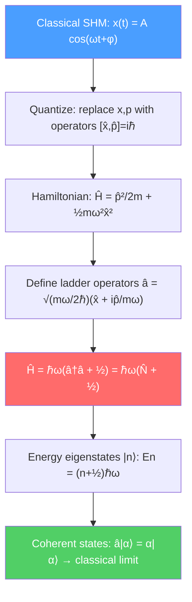

# 🎵 Quantum Harmonic Oscillator

> [!abstract] TL;DR
> The quantum harmonic oscillator — a particle in a parabolic potential $V = \frac{1}{2}m\omega^2 x^2$ — is the single most important exactly-solvable system in all of physics. Its equally-spaced energy levels $E_n = (n+\frac{1}{2})\hbar\omega$ predict zero-point energy and are generated elegantly by ladder operators $\hat{a}^\dagger$ and $\hat{a}$. At graduate level, coherent states bridge quantum and classical behavior, squeezed states underlie quantum metrology, and the QHO is the building block for phonons in solids and every quantum field theory.

## Intuition — analogy FIRST

A child on a swing is a classical harmonic oscillator: it swings back and forth at a fixed frequency, and you can give it any energy you like by pushing harder. A quantum child on a quantum swing can only have certain discrete energies — you cannot continuously vary the energy but must add or remove one "quantum" $\hbar\omega$ at a time. Even when you do not push the swing at all, it still jiggles with a minimum energy of $\hbar\omega/2$. This zero-point energy is not a measurement effect — it is real and measurable (it contributes to the Casimir force between metal plates).

The ladder operator algebra makes this especially beautiful: instead of solving a differential equation, you "climb" the energy ladder using a creation operator $\hat{a}^\dagger$ and descend it with an annihilation operator $\hat{a}$, like rungs on an infinite ladder.

---

## How It Works

---

## Key Concepts / Details

### Secondary Level

**Classical harmonic oscillator recap:** For a mass $m$ on a spring with constant $k$, frequency $\omega = \sqrt{k/m}$. Energy $E = \frac{1}{2}kA^2$ is continuous — any value allowed.

**Quantum energy levels:** Solving the Schrödinger equation for $V(x) = \frac{1}{2}m\omega^2 x^2$ gives only discrete energies:

$$E_n = \left(n + \frac{1}{2}\right)\hbar\omega, \qquad n = 0, 1, 2, 3, \ldots$$

The energy spacing is uniform: $\Delta E = \hbar\omega$ between adjacent levels. This is why atoms absorb and emit light at specific frequencies.

**Zero-point energy:** The ground state ($n=0$) has energy $E_0 = \hbar\omega/2 \neq 0$. A classical oscillator at rest has $E=0$, but quantum mechanics forbids simultaneous zero position and momentum (uncertainty principle), so the particle must always jiggle.

### Undergraduate Level

**Ladder (creation/annihilation) operators:** Define:

$$\hat{a} = \sqrt{\frac{m\omega}{2\hbar}}\left(\hat{x} + \frac{i\hat{p}}{m\omega}\right), \qquad \hat{a}^\dagger = \sqrt{\frac{m\omega}{2\hbar}}\left(\hat{x} - \frac{i\hat{p}}{m\omega}\right)$$

These satisfy $[\hat{a}, \hat{a}^\dagger] = 1$. The Hamiltonian becomes:

$$\hat{H} = \hbar\omega\!\left(\hat{a}^\dagger\hat{a} + \frac{1}{2}\right) = \hbar\omega\!\left(\hat{N} + \frac{1}{2}\right)$$

where $\hat{N} = \hat{a}^\dagger\hat{a}$ is the number operator. The ladder operators act on energy eigenstates $|n\rangle$ as:

$$\hat{a}|n\rangle = \sqrt{n}\,|n-1\rangle, \qquad \hat{a}^\dagger|n\rangle = \sqrt{n+1}\,|n+1\rangle$$

**Position and momentum from ladder operators:**

$$\hat{x} = \sqrt{\frac{\hbar}{2m\omega}}(\hat{a} + \hat{a}^\dagger), \qquad \hat{p} = i\sqrt{\frac{m\omega\hbar}{2}}(\hat{a}^\dagger - \hat{a})$$

**Wave functions:** The energy eigenfunctions are:

$$\psi_n(x) = \left(\frac{m\omega}{\pi\hbar}\right)^{1/4}\frac{1}{\sqrt{2^n n!}}\,H_n\!\left(\sqrt{\frac{m\omega}{\hbar}}\,x\right)\,e^{-m\omega x^2/2\hbar}$$

where $H_n(\xi)$ are Hermite polynomials: $H_0=1$, $H_1=2\xi$, $H_2=4\xi^2-2$, etc. The ground state is a Gaussian; higher states have $n$ nodes.

**Uncertainty product:** The ground state achieves the minimum uncertainty: $\Delta x\,\Delta p = \hbar/2$ (Gaussian wave packet).

### Graduate Level

**Coherent states:** Eigenstates of the annihilation operator $\hat{a}|\alpha\rangle = \alpha|\alpha\rangle$ (complex $\alpha$). Expanding in the Fock basis:

$$|\alpha\rangle = e^{-|\alpha|^2/2}\sum_{n=0}^{\infty}\frac{\alpha^n}{\sqrt{n!}}|n\rangle$$

Coherent states have Poissonian photon number distribution ($\langle n\rangle = |\alpha|^2$, $\Delta n = |\alpha|$) and minimum uncertainty. Their expectation values follow classical trajectories: $\langle\hat{x}\rangle(t) = x_0\cos(\omega t)$. Laser light is the physical realization of a coherent state.

**Squeezed states:** Generalize coherent states by reducing uncertainty in one quadrature at the cost of the other. If $\hat{x}$ uncertainty is squeezed below $\sqrt{\hbar/2m\omega}$, then $\hat{p}$ uncertainty exceeds its coherent-state value, still satisfying $\Delta x\,\Delta p \geq \hbar/2$. Squeezed light is used in gravitational wave detectors (LIGO) to beat the standard quantum limit.

**Displaced oscillator (polaron):** In condensed matter, coupling an electron to phonons can be handled by a displaced harmonic oscillator transformation $\hat{a} \to \hat{a} - g$, where $g$ is the coupling constant. The polaron binding energy is $E_p = -g^2\hbar\omega$; this transformation is exact and non-perturbative.

**Jaynes-Cummings model:** A two-level atom coupled to a single mode of the radiation field:

$$\hat{H}_{JC} = \hbar\omega\hat{a}^\dagger\hat{a} + \frac{\hbar\omega_0}{2}\hat{\sigma}_z + \hbar g(\hat{a}\hat{\sigma}_+ + \hat{a}^\dagger\hat{\sigma}_-)$$

Exactly solvable and exhibits Rabi oscillations, vacuum Rabi splitting, and photon-number collapse-and-revival — hallmarks of quantum optics. This model is realized in cavity QED and superconducting qubits.

**Phonons as harmonic oscillators:** In a crystal, the normal modes of lattice vibration are independent QHOs. Quantizing them gives phonons with energy $\hbar\omega_k$ per quasiparticle. The Debye and Einstein models of heat capacity, thermal conductivity, and BCS superconductivity all rest on this foundation.

---

## Real-World Notes

- **Molecular vibrational spectroscopy:** IR absorption occurs at frequencies $\omega$ of molecular bonds (C-H stretch $\approx 3000$ cm$^{-1}$). The QHO energy levels explain the spectrum; anharmonic corrections explain overtones.
- **LIGO squeezed light:** Advanced LIGO injects squeezed vacuum to reduce quantum noise below the standard quantum limit, improving sensitivity at high frequencies.
- **Superconducting qubits:** Transmon qubits are nearly-harmonic oscillators with a slight anharmonicity (from the Josephson junction), making the $|0\rangle\to|1\rangle$ transition addressable without driving $|1\rangle\to|2\rangle$.
- **Casimir effect:** The zero-point energy of electromagnetic field modes between two parallel plates (a sum of $\hbar\omega/2$ per mode) produces a measurable attractive force — experimentally confirmed to 1% precision.

---

## Common Pitfalls

- **$\hat{a}$ and $\hat{a}^\dagger$ are not Hermitian** — $\hat{a}^\dagger \neq \hat{a}$. They cannot represent observables directly; position and momentum are $(\hat{a}+\hat{a}^\dagger)/\sqrt{2}$ and $i(\hat{a}^\dagger-\hat{a})/\sqrt{2}$ (up to constants).
- **Zero-point energy is relative, not absolute** in non-relativistic QM. Only energy differences are observable classically, but the sum of zero-point energies across all modes is the cosmological constant problem in QFT.
- **Coherent states are overcomplete** — they form a resolution of the identity but are not orthogonal: $\langle\alpha|\beta\rangle = e^{-|\alpha-\beta|^2/2}\neq 0$.
- **Do not confuse $|n\rangle$ (Fock state) with $|\alpha\rangle$ (coherent state).** Fock states have definite photon number; coherent states have definite phase. A laser produces coherent states, not Fock states.

---

## Related Concepts
- [[Schrodinger_Equation]] — QHO is the most important application of the TISE
- [[Wave_Particle_Duality_and_Uncertainty]] — Ground state uncertainty product is exactly $\hbar/2$
- [[Perturbation_Theory]] — Anharmonic corrections to the QHO (cubic/quartic terms)
- [[Many_Body_Quantum_Systems]] — Second quantization formalizes the ladder operator language for many particles
- [[Intro_to_Quantum_Field_Theory]] — Every quantum field is a collection of QHOs (one per mode)
- [[Crystal_Structure_and_Band_Theory]] — Phonons = quantized lattice vibrations = QHO quanta
- [[_MOC_Quantum_Mechanics|↑ Section MOC]]

---

## Review Questions

1. **(Secondary)** A diatomic molecule has vibrational frequency $\omega = 3 \times 10^{14}$ rad/s. What are the ground-state and first-excited-state energies? What wavelength photon causes a $n=0\to n=1$ transition?
2. **(Undergraduate)** Using ladder operators, prove that $\langle\hat{x}\rangle_n = 0$ and $\langle\hat{x}^2\rangle_n = (n+1/2)\hbar/m\omega$ for the state $|n\rangle$. Hence compute $\Delta x\,\Delta p$ and verify the uncertainty principle.
3. **(Graduate)** Show that a coherent state $|\alpha\rangle$ remains coherent under time evolution: $|\alpha(t)\rangle = e^{-i\omega t/2}|\alpha e^{-i\omega t}\rangle$. What does this mean physically about the motion of the wave packet?

---

## Sources
- Griffiths, *Introduction to Quantum Mechanics*, §2.3 (harmonic oscillator)
- Sakurai & Napolitano, *Modern Quantum Mechanics*, §2.3 (simple harmonic oscillator)
- Gerry & Knight, *Introductory Quantum Optics*, Ch. 2–3 (coherent and squeezed states)
- Mahan, *Many-Particle Physics*, Ch. 1 (second quantization and phonons)
- Walls & Milburn, *Quantum Optics*, Ch. 2–4 (Jaynes-Cummings model)

#physics #quantum-mechanics #harmonic-oscillator #ladder-operators #coherent-states #zero-point-energy #phonons
