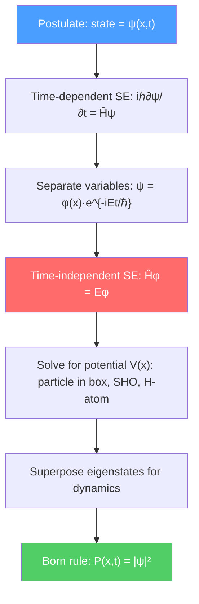

# 🌊 Schrödinger Equation

> [!abstract] TL;DR
> The Schrödinger equation $i\hbar\,\partial\psi/\partial t = \hat{H}\psi$ is the fundamental equation of motion in quantum mechanics — the quantum analogue of Newton's second law. The squared magnitude $|\psi|^2$ gives the probability density of finding the particle, and energy eigenstates satisfy the time-independent form $\hat{H}\psi = E\psi$. Solutions range from the exactly solvable infinite square well to WKB tunneling through barriers; at PhD level, Feynman's path integral and the Lindblad master equation generalize the framework to open quantum systems.

## Intuition — analogy FIRST

When you pluck a guitar string, it vibrates in standing wave patterns — the fundamental plus harmonics. You cannot get any arbitrary vibration: only discrete modes are stable. A quantum particle trapped in a potential well is like a plucked string: only certain wave patterns fit, each corresponding to a definite, discrete energy level. The "shape" of the vibration is the wave function $\psi$; the energy of the mode is the eigenvalue $E$.

The Schrödinger equation is simply the rule that tells you which shapes are allowed and how they evolve in time — it is the equation of motion for quantum waves.

---

## How It Works

---

## Key Concepts / Details

### Secondary Level

**The wave function $\psi(x,t)$:** A complex-valued function encoding everything knowable about a quantum particle. By itself it has no classical analog, but $|\psi(x,t)|^2 dx$ is the probability of finding the particle between $x$ and $x+dx$ at time $t$.

**Time-dependent Schrödinger equation (TDSE):**

$$i\hbar \frac{\partial \psi}{\partial t} = \hat{H}\psi = \left(-\frac{\hbar^2}{2m}\frac{\partial^2}{\partial x^2} + V(x)\right)\psi$$

In words: the Hamiltonian operator $\hat{H}$ (kinetic + potential energy) acting on $\psi$ gives $i\hbar$ times the time derivative of $\psi$.

**Normalization:** Probability must sum to 1:
$$\int_{-\infty}^{\infty}|\psi(x,t)|^2\,dx = 1$$

The Schrödinger equation preserves normalization automatically (continuity equation for probability).

**Particle in a box (infinite square well):** A particle confined to $0 < x < L$ with $V=0$ inside and $V=\infty$ outside. Boundary conditions $\psi(0)=\psi(L)=0$ give standing waves:

$$\psi_n(x) = \sqrt{\frac{2}{L}}\sin\!\left(\frac{n\pi x}{L}\right), \qquad E_n = \frac{n^2\pi^2\hbar^2}{2mL^2}, \quad n = 1,2,3,\ldots$$

The ground state ($n=1$) has $E_1 > 0$ — zero-point energy, a direct consequence of confinement and the uncertainty principle.

### Undergraduate Level

**Time-independent Schrödinger equation (TISE):** For a stationary state $\psi(x,t) = \phi(x)e^{-iEt/\hbar}$:

$$-\frac{\hbar^2}{2m}\frac{d^2\phi}{dx^2} + V(x)\phi = E\phi$$

This is an eigenvalue problem: $\hat{H}\phi = E\phi$. The set of allowed energies $\{E_n\}$ is the spectrum; the corresponding $\phi_n$ are energy eigenstates.

**Finite square well:** Potential $V=-V_0$ for $|x|<a$, $V=0$ outside. Inside, solutions are sinusoidal; outside, exponentially decaying (evanescent). Matching boundary conditions at $\pm a$ gives a transcendental equation for allowed energies — always at least one bound state for any $V_0 > 0$.

**Quantum tunneling:** A particle with $E < V_0$ hitting a barrier of height $V_0$ and width $d$ has non-zero transmission probability:

$$T \approx e^{-2\kappa d}, \qquad \kappa = \sqrt{\frac{2m(V_0 - E)}{\hbar^2}}$$

This is classically forbidden but quantum-mechanically allowed because $\psi$ decays exponentially rather than vanishing inside the barrier.

**WKB approximation (Wentzel-Kramers-Brillouin):** For slowly varying potentials, the tunneling exponent generalizes to:

$$T \propto \exp\!\left(-\frac{2}{\hbar}\int_{x_1}^{x_2}\sqrt{2m(V(x)-E)}\,dx\right)$$

This underlies alpha decay (Gamow theory), field emission, and scanning tunneling microscopy.

**Current density:** The probability current

$$j(x,t) = \frac{\hbar}{2mi}\left(\psi^*\frac{\partial\psi}{\partial x} - \psi\frac{\partial\psi^*}{\partial x}\right)$$

satisfies the continuity equation $\partial|\psi|^2/\partial t + \partial j/\partial x = 0$, confirming probability conservation.

### Graduate Level

**Feynman path integral formulation:** The propagator $K(x_f,t_f;x_i,t_i)$ — the amplitude to go from $x_i$ at $t_i$ to $x_f$ at $t_f$ — is a sum over all paths:

$$K(x_f,t_f;x_i,t_i) = \int \mathcal{D}[x(t)]\,\exp\!\left(\frac{i}{\hbar}S[x(t)]\right)$$

where $S = \int L\,dt$ is the classical action. The classical path dominates in the limit $\hbar \to 0$ (stationary phase), recovering classical mechanics. This formulation is the natural starting point for quantum field theory.

**Density matrix formalism:** For a mixed state or entangled subsystem, the state is described by a density operator $\hat{\rho}$ rather than a pure wave function. For a pure state $|\psi\rangle$, $\hat{\rho} = |\psi\rangle\langle\psi|$. Time evolution is governed by the von Neumann equation:

$$i\hbar\frac{d\hat{\rho}}{dt} = [\hat{H}, \hat{\rho}]$$

**Lindblad equation (open quantum systems):** When a quantum system interacts with a Markovian environment, the density matrix evolves as:

$$\frac{d\hat{\rho}}{dt} = -\frac{i}{\hbar}[\hat{H},\hat{\rho}] + \sum_k\left(\hat{L}_k\hat{\rho}\hat{L}_k^\dagger - \frac{1}{2}\hat{L}_k^\dagger\hat{L}_k\hat{\rho} - \frac{1}{2}\hat{\rho}\hat{L}_k^\dagger\hat{L}_k\right)$$

The Lindblad operators $\hat{L}_k$ describe dissipation and decoherence channels (spontaneous emission, dephasing, etc.). This is the most general Markovian master equation consistent with complete positivity.

---

## Real-World Notes

- **Semiconductor tunneling:** WKB tunneling through oxide barriers in MOSFETs sets a hard limit to miniaturization (gate leakage current); flash memory stores charge by controlled Fowler-Nordheim tunneling.
- **Scanning tunneling microscopy (STM):** The exponential sensitivity of $T$ to barrier width $d$ gives sub-angstrom vertical resolution — enough to image individual atoms.
- **Nuclear fusion:** Protons in the Sun tunnel through the Coulomb barrier, making stellar fusion possible at temperatures far below what classical physics would require.
- **Quantum chemistry:** The TISE for multi-electron atoms/molecules is solved numerically (Hartree-Fock, DFT) to predict bond lengths, reaction rates, and molecular spectra.

---

## Common Pitfalls

- **$\psi$ is not a physical wave in 3D space for multi-particle systems.** For $N$ particles, $\psi$ lives in $3N$-dimensional configuration space. Only for a single particle does it have a real-space interpretation.
- **The TDSE is linear but quantum measurement is not.** Wave function collapse is an additional postulate (or emerges from decoherence/many-worlds) — it is not described by the Schrödinger equation itself.
- **Tunneling probability depends exponentially on $\kappa d$**, so small changes in barrier width or height have dramatic effects — this is why STM is sensitive to single atoms.
- **Stationary states still evolve in time** — the phase factor $e^{-iEt/\hbar}$ cancels in any observable $|\psi|^2$, but it is crucial for calculating time-dependent superpositions.

---

## Related Concepts
- [[Wave_Particle_Duality_and_Uncertainty]] — The wave function is the mathematical embodiment of wave-particle duality
- [[Quantum_Harmonic_Oscillator]] — The most important application of the TISE
- [[Angular_Momentum_and_Spin]] — TISE in spherical coordinates → hydrogen atom
- [[Perturbation_Theory]] — Methods for solving TISE when exact solution is impossible
- [[Many_Body_Quantum_Systems]] — Density matrix and Lindblad equation for many-body physics
- [[_MOC_Quantum_Mechanics|↑ Section MOC]]

---

## Review Questions

1. **(Secondary)** An electron is trapped in a 1D box of length $L = 0.5$ nm. Calculate the ground state energy and the energy of the first excited state. What photon wavelength would cause a transition between them?
2. **(Undergraduate)** Derive the transmission coefficient $T$ for a rectangular barrier of height $V_0$ and width $d$ using the WKB approximation. Why does $T$ depend exponentially on $\sqrt{V_0 - E}$?
3. **(Graduate)** Write the Lindblad equation for a two-level atom subject to spontaneous emission with rate $\gamma$. Show that the off-diagonal elements of $\hat{\rho}$ decay as $e^{-\gamma t/2}$ while populations decay as $e^{-\gamma t}$.

---

## Sources
- Griffiths, *Introduction to Quantum Mechanics*, 3rd ed., Ch. 1–3 (wave function, TISE, formalism)
- Sakurai & Napolitano, *Modern Quantum Mechanics*, Ch. 2 (quantum dynamics)
- Feynman & Hibbs, *Quantum Mechanics and Path Integrals* (path integral formulation)
- Breuer & Petruccione, *The Theory of Open Quantum Systems*, Ch. 3 (Lindblad equation)
- Landau & Lifshitz, *Quantum Mechanics*, §20–23 (WKB approximation)

#physics #quantum-mechanics #schrodinger-equation #wave-function #tunneling #path-integral
