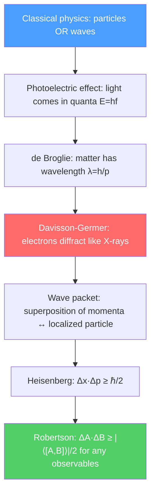

# ⚡ Wave-Particle Duality and Uncertainty

> [!abstract] TL;DR
> Matter and light each exhibit both wave and particle behavior depending on how you probe them — a fact encoded in de Broglie's relation $\lambda = h/p$. The Heisenberg uncertainty principle $\Delta x\,\Delta p \geq \hbar/2$ is not a measurement disturbance but a fundamental property of waves: a well-localized wave packet necessarily spans many frequencies (momenta). At PhD level, this sharpens into the Robertson inequality for any pair of non-commuting observables and connects to decoherence as the mechanism that hides quantum weirdness at macroscopic scales.

## Intuition — analogy FIRST

Drop a stone into a still pond. You see ripples — a wave spreading outward. But when a photodetector "clicks," it records a single, localized event — a particle. Neither description is complete; reality uses both.

Now think about musical notes. A perfectly pure tone (single frequency) lasts forever — it has no definite start time. A sharp drum beat (definite time) is a mixture of many frequencies. You cannot have both a perfectly definite pitch and a perfectly definite timing. Quantum mechanics says the same thing about position and momentum: **position is to time as momentum is to frequency**. Localizing a particle in space forces its momentum to spread over a range — not because of clumsy measurement, but because that is what waves do.

---

## How It Works

---

## Key Concepts / Details

### Secondary Level

**de Broglie hypothesis (1924):** If light (a wave) behaves like particles (photons), perhaps particles behave like waves. For a particle with momentum $p$:

$$\lambda = \frac{h}{p} = \frac{h}{mv}$$

For an electron accelerated through 100 V, $\lambda \approx 0.12$ nm — the same scale as atomic spacings in a crystal. This is why electrons diffract off crystal planes just like X-rays.

**Heisenberg uncertainty principle (1927):**

$$\Delta x \,\Delta p \geq \frac{\hbar}{2}, \qquad \hbar = \frac{h}{2\pi} \approx 1.055 \times 10^{-34} \text{ J·s}$$

Here $\Delta x$ is the standard deviation of position measurements and $\Delta p$ is the standard deviation of momentum measurements on identically prepared particles. The product can never be smaller than $\hbar/2$.

**Energy-time uncertainty:**

$$\Delta E \,\Delta t \geq \frac{\hbar}{2}$$

This explains the natural linewidth of atomic transitions: a state that lives for time $\Delta t$ has an energy spread $\Delta E \geq \hbar/(2\Delta t)$.

### Undergraduate Level

**Davisson-Germer experiment (1927):** Electrons of 54 eV ($\lambda \approx 0.166$ nm) striking a nickel crystal produced diffraction peaks at the exact angles predicted by Bragg's law for that wavelength. This confirmed de Broglie's hypothesis directly.

**Wave packets and Fourier analysis:** A spatially localized particle is represented by a superposition of plane waves:

$$\psi(x,t) = \frac{1}{\sqrt{2\pi}} \int_{-\infty}^{\infty} \phi(k)\, e^{i(kx - \omega t)}\, dk$$

The momentum-space amplitude $\phi(k)$ is the Fourier transform of $\psi(x,0)$. The width $\Delta x$ of $|\psi|^2$ and width $\Delta k$ of $|\phi|^2$ satisfy the Fourier bandwidth theorem $\Delta x \,\Delta k \geq 1/2$. Since $p = \hbar k$, this gives $\Delta x\,\Delta p \geq \hbar/2$ directly — **the uncertainty principle is the Fourier theorem applied to quantum mechanics**.

**Group velocity vs phase velocity:** The group velocity $v_g = d\omega/dk$ gives the speed of the wave packet (the particle's speed). The phase velocity $v_p = \omega/k$ is the speed of individual crests and can exceed $c$ without violating causality (it carries no information).

**Measurement problem introduction:** Before measurement, a particle does not have a definite position or momentum — it exists in a superposition. Measurement collapses the wave function to an eigenstate. This raises deep interpretational questions (Copenhagen, Many Worlds, Pilot Wave) that remain debated.

### Graduate Level

**Robertson uncertainty relation:** For any two observables $\hat{A}$ and $\hat{B}$ with commutator $[\hat{A}, \hat{B}] = \hat{A}\hat{B} - \hat{B}\hat{A}$:

$$\Delta A\,\Delta B \geq \frac{1}{2}\left|\langle[\hat{A},\hat{B}]\rangle\right|$$

For position and momentum $[\hat{x}, \hat{p}] = i\hbar$, so $\Delta x\,\Delta p \geq \hbar/2$. For two spin components $[\hat{S}_x, \hat{S}_y] = i\hbar\hat{S}_z$, giving $\Delta S_x\,\Delta S_y \geq \hbar|\langle S_z\rangle|/2$.

**Wigner function:** A quasi-probability distribution $W(x,p)$ in phase space that reproduces quantum mechanics while appearing classical. It can take negative values (a hallmark of non-classical states) and is defined as:

$$W(x,p) = \frac{1}{\pi\hbar}\int_{-\infty}^{\infty} \psi^*(x+y)\,\psi(x-y)\,e^{2ipy/\hbar}\,dy$$

**Quantum Zeno effect:** Frequent measurement of a quantum system can freeze its evolution — a state repeatedly projected onto itself never decays. This is experimentally verified with unstable atomic states and has applications in quantum error correction.

**Decoherence:** The apparent collapse of the wave function in macroscopic systems arises from entanglement with environmental degrees of freedom (air molecules, photons, phonons). The off-diagonal elements of the density matrix $\rho_{nm} = \langle n|\hat{\rho}|m\rangle$ decay exponentially fast for macroscopic superpositions, with timescale $\tau_D \sim \hbar/(m\Delta v \cdot k_BT)^{1/2}$. This is why Schrödinger's cat is never seen in a superposition — decoherence is extraordinarily fast at the macroscopic scale.

---

## Real-World Notes

- **Electron microscopes** exploit $\lambda = h/p$: electrons at 100 keV have $\lambda \approx 0.004$ nm, enabling atomic-resolution imaging (TEM, SEM).
- **Tunnel diodes and STM:** Quantum tunneling (enabled by wave-like nature) underlies scanning tunneling microscopy and semiconductor tunnel diodes.
- **Natural linewidths:** Spectral line broadening in atomic emission is a direct consequence of energy-time uncertainty; laser cooling exploits this for Doppler cooling to microkelvin temperatures.
- **Heisenberg microscope (historical):** Bohr-Heisenberg thought experiment showing that the photon used to locate an electron imparts an uncontrolled momentum kick. While the derivation is heuristic, the conclusion is correct for the right reasons.

---

## Common Pitfalls

- **Uncertainty ≠ measurement disturbance.** The HUP is about the intrinsic statistical spread in identically prepared states, not about "the measuring device disturbing the particle." The Ozawa inequality (2003) separates these rigorously.
- **$\Delta t$ is not an operator.** In non-relativistic QM, time is a parameter, not an observable. The energy-time uncertainty has a different derivation from the Robertson relation.
- **Group velocity can exceed $c$?** The envelope of a wave packet can propagate faster than $c$ in anomalous dispersion media, but the signal velocity (front velocity) never does — causality is preserved.
- **Wave-particle duality doesn't mean "sometimes wave, sometimes particle."** The system is always described by a wave function; the apparent dichotomy comes from which experimental setup you choose (complementarity).

---

## Related Concepts
- [[Schrodinger_Equation]] — The wave equation that governs how $\psi$ evolves in time
- [[Quantum_Harmonic_Oscillator]] — Uncertainty principle applied: ground state spread $\Delta x = \sqrt{\hbar/2m\omega}$
- [[Angular_Momentum_and_Spin]] — Commutation relations for angular momentum components give uncertainty relations
- [[Many_Body_Quantum_Systems]] — Decoherence connects single-particle QM to classical macroscopic behavior
- [[_MOC_Quantum_Mechanics|↑ Section MOC]]

---

## Review Questions

1. **(Secondary)** An electron is accelerated through 150 V. Calculate its de Broglie wavelength and explain why this is useful for microscopy.
2. **(Undergraduate)** Starting from the Fourier transform of a Gaussian wave packet $\phi(k) \propto e^{-k^2/(4\sigma_k^2)}$, derive $\Delta x\,\Delta p = \hbar/2$ and show this is a minimum-uncertainty state.
3. **(Graduate)** State and prove the Robertson uncertainty relation from the Cauchy-Schwarz inequality. For a spin-1/2 particle in state $|+z\rangle$, evaluate $\Delta S_x\,\Delta S_y$ and verify the bound.

---

## Sources
- Griffiths, *Introduction to Quantum Mechanics*, Ch. 1–2 (wave functions, uncertainty principle)
- Sakurai & Napolitano, *Modern Quantum Mechanics*, Ch. 1 (fundamental concepts)
- Cohen-Tannoudji, Diu & Laloë, *Quantum Mechanics*, Vol. 1, Ch. I–II
- Zurek, "Decoherence and the Transition from Quantum to Classical," *Physics Today* 44, 36 (1991)
- Ozawa, "Universally valid reformulation of the Heisenberg uncertainty principle," *Phys. Rev. A* 67, 042105 (2003)

#physics #quantum-mechanics #wave-particle-duality #uncertainty-principle #de-Broglie
