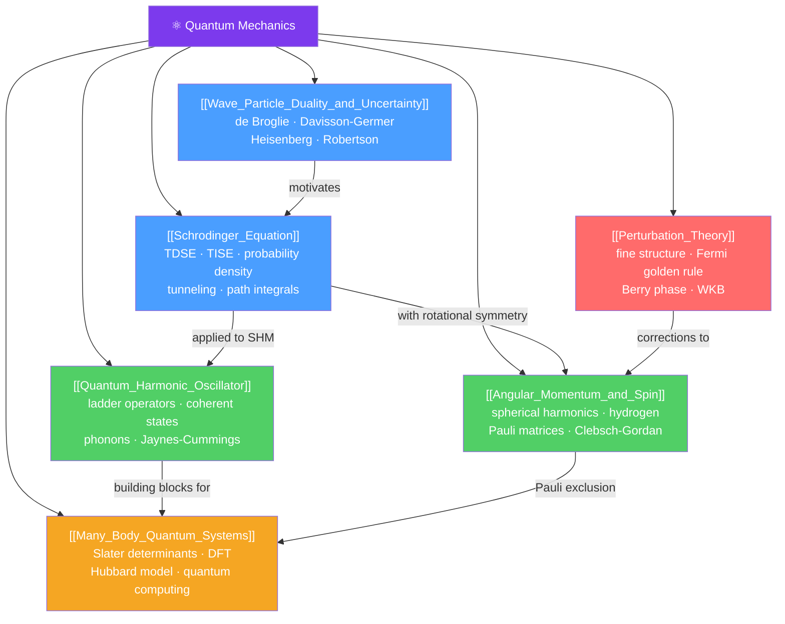

# ⚛️ Quantum Mechanics — Map of Content

> [!abstract] What This Section Covers
> Quantum mechanics is the theory governing the behavior of matter and energy at atomic and subatomic scales. It replaces deterministic Newtonian trajectories with probability amplitudes, wave functions, and operators. This section builds from the foundational wave-particle duality and Heisenberg uncertainty principle through the Schrödinger equation and its canonical solutions, up to the full apparatus of angular momentum, perturbation theory, and many-body quantum systems. Coverage spans A-level intuition through PhD-level formalism including path integrals, second quantization, and density functional theory.

## Concept Map

## Learning Path
1. [[Wave_Particle_Duality_and_Uncertainty]] — Start here: why classical physics fails at small scales, de Broglie hypothesis, wave packets, and the Heisenberg uncertainty principle.
2. [[Schrodinger_Equation]] — The central equation of QM: time-dependent and time-independent forms, probability interpretation, the particle in a box, and quantum tunneling.
3. [[Quantum_Harmonic_Oscillator]] — The most important exactly-solvable problem: energy levels, zero-point energy, and ladder operators that unlock all of quantum field theory.
4. [[Angular_Momentum_and_Spin]] — Quantization of angular momentum, spherical harmonics, the hydrogen atom, and the intrinsic spin of particles.
5. [[Perturbation_Theory]] — How to handle real-world Hamiltonians that cannot be solved exactly: corrections, transitions, Fermi's golden rule.
6. [[Many_Body_Quantum_Systems]] — Identical particles, second quantization, and the bridge to condensed matter and quantum computing.

## All Notes at a Glance
| Note | Difficulty | What You'll Learn |
|------|------------|-------------------|
| [[Wave_Particle_Duality_and_Uncertainty]] | Secondary → PhD | de Broglie relation, electron diffraction, wave packets, Heisenberg and Robertson uncertainty relations, Wigner function, decoherence |
| [[Schrodinger_Equation]] | Secondary → PhD | TDSE and TISE, probability density, square wells, WKB tunneling, Feynman path integrals, Lindblad equation |
| [[Quantum_Harmonic_Oscillator]] | Secondary → PhD | Energy quantization, zero-point energy, creation/annihilation operators, coherent states, phonons, Jaynes-Cummings model |
| [[Angular_Momentum_and_Spin]] | Secondary → PhD | Orbital quantization, spherical harmonics, hydrogen atom, spin-1/2, Pauli matrices, Clebsch-Gordan, Wigner-Eckart theorem |
| [[Perturbation_Theory]] | Undergraduate → PhD | First/second-order energy corrections, degenerate theory, fine structure, Fermi's golden rule, Berry phase, adiabatic theorem |
| [[Many_Body_Quantum_Systems]] | Undergraduate → PhD | Bosons/fermions, Slater determinants, second quantization, Hartree-Fock, DFT, Hubbard model, entanglement, quantum computing |

## Key Questions This Section Answers
- Why can't a particle have both a definite position and definite momentum simultaneously?
- What does the wave function $\psi$ physically mean, and why is $|\psi|^2$ a probability density?
- Why does the quantum harmonic oscillator have a non-zero ground-state energy?
- How does spin emerge from quantum mechanics, and what is a spinor?
- When can we use perturbation theory, and how do we calculate corrections to energy levels?
- What forbids two electrons from occupying the same quantum state?

## Related Sections
- [[_MOC_Physics_Master|↑ Physics Master MOC]]
- [[_MOC_Relativity|→ Special and General Relativity]]
- [[_MOC_Nuclear_Particle_Physics|→ Nuclear and Particle Physics]]
- [[_MOC_Condensed_Matter|→ Condensed Matter and Advanced]]

#MOC #physics #quantum-mechanics
