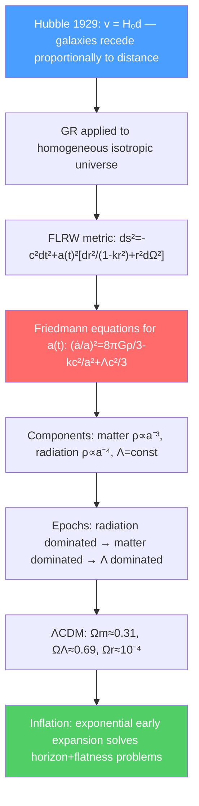

# 🌌 Cosmology and the Expanding Universe

> [!abstract] TL;DR
> The universe is expanding: distant galaxies recede at velocity $v = H_0 d$ (Hubble's law). General relativity applied to a homogeneous, isotropic universe gives the Friedmann equations governing the scale factor $a(t)$. The standard $\Lambda$CDM model — ordinary matter, cold dark matter, and dark energy (cosmological constant) — fits all observations from the Big Bang to today. At PhD level, inflation, primordial perturbations, and structure formation connect quantum-scale fluctuations in the early universe to the galaxy distribution we see today.

## Intuition — analogy FIRST

Imagine dots drawn on a balloon being inflated. Every dot sees every other dot moving away from it — there is no "center" of the expansion. The dots are not moving through space; space itself is stretching. The universe works the same way: galaxies are not flying away from us through empty space; the space between galaxies is expanding, stretching the wavelength of light (cosmological redshift) just as a balloon stretch would stretch a drawn wave.

Even more striking: the universe was once smaller than an atom, extraordinarily hot and dense (the Big Bang). The Cosmic Microwave Background (CMB) — the afterglow of this hot phase — is the oldest light we can see, and its tiny temperature fluctuations encode the seeds of all structure in the universe.

---

## How It Works

---

## Key Concepts / Details

### Secondary / Early Undergraduate Level

**Hubble's law (1929):**
$$v = H_0 d$$

Galaxies at distance $d$ recede with velocity $v$. Hubble constant $H_0 \approx 70$ km/s/Mpc (still debated — the "Hubble tension"). This means the universe is expanding; running time backwards, it was once much denser and hotter — the Big Bang.

**Cosmological redshift:** As light travels through expanding space, its wavelength stretches. The redshift $z$ is defined by:
$$1 + z = \frac{\lambda_{obs}}{\lambda_{emit}} = \frac{a(t_{now})}{a(t_{emit})}$$

where $a(t)$ is the scale factor (normalized to $a_0 = 1$ today).

**Cosmic Microwave Background (CMB):** About 380,000 years after the Big Bang, the universe cooled enough for electrons and protons to combine into neutral hydrogen (recombination). The photons from this epoch free-streamed to us, forming the CMB at temperature $T_0 = 2.725$ K. Tiny temperature fluctuations $\delta T/T \sim 10^{-5}$ encode primordial density perturbations.

**Big Bang nucleosynthesis (BBN):** In the first few minutes, protons and neutrons fused into light nuclei (H, D, $^3$He, $^4$He, $^7$Li). The predicted primordial abundances match observations: $\sim 75\%$ H, $\sim 25\%$ $^4$He by mass.

### Undergraduate Level

**FLRW metric:** The Friedmann-Lemaître-Robertson-Walker metric for a homogeneous, isotropic universe:
$$ds^2 = -c^2dt^2 + a(t)^2\!\left[\frac{dr^2}{1-kr^2} + r^2d\theta^2 + r^2\sin^2\theta\,d\phi^2\right]$$

where $k = +1, 0, -1$ for closed, flat, open spatial geometry. Observations ($k \approx 0$) say the universe is spatially flat to $< 1\%$.

**Friedmann equations:** Substituting the FLRW metric into the Einstein field equations with a perfect fluid $T^{\mu\nu}$:

$$\left(\frac{\dot{a}}{a}\right)^2 = \frac{8\pi G}{3}\rho - \frac{kc^2}{a^2} + \frac{\Lambda c^2}{3}$$

$$\frac{\ddot{a}}{a} = -\frac{4\pi G}{3}\left(\rho + \frac{3p}{c^2}\right) + \frac{\Lambda c^2}{3}$$

The first is the Friedmann equation; the second is the acceleration equation. The Hubble parameter $H = \dot{a}/a$.

**Density parameter:** Define $\Omega_x = \rho_x/\rho_{crit}$ where $\rho_{crit} = 3H^2/8\pi G$. The Friedmann equation becomes:
$$\Omega_m + \Omega_r + \Omega_\Lambda + \Omega_k = 1$$

where $\Omega_k = -kc^2/a^2H^2$.

**Equation of state and density evolution:** For a fluid with $p = w\rho c^2$:
$$\rho \propto a^{-3(1+w)}$$

| Component | $w$ | $\rho(a)$ | Dominates |
|-----------|-----|-----------|-----------|
| Matter (dust) | $0$ | $a^{-3}$ | $z \sim 0.3$ to $10^3$ |
| Radiation | $1/3$ | $a^{-4}$ | $z \gtrsim 10^4$ |
| Dark energy ($\Lambda$) | $-1$ | $a^0$ = const | $z \lesssim 0.3$ today |

**$\Lambda$CDM model:** Current best-fit cosmological parameters ($Planck$ 2018):
- $H_0 = 67.4$ km/s/Mpc
- $\Omega_m = 0.315$ (ordinary + dark matter)
- $\Omega_b = 0.049$ (ordinary/baryonic matter)
- $\Omega_\Lambda = 0.685$ (dark energy)
- $\Omega_r \approx 9 \times 10^{-5}$ (radiation, negligible today)
- $k = 0$ (spatially flat)

**Dark energy:** The accelerating expansion (discovered 1998 via Type Ia supernovae) implies $\ddot{a} > 0$, requiring a component with $w < -1/3$. The simplest model: cosmological constant $\Lambda$ with $w = -1$. Physical origin unknown.

### Graduate Level

**Inflation:** An exponentially rapid expansion ($a \propto e^{Ht}$ for $H \approx$ const) lasting $\sim 10^{-36}$ to $10^{-32}$ s after the Big Bang, driven by a scalar field (inflaton) with $w \approx -1$. Inflation solves:
- **Horizon problem:** Regions of CMB that were causally disconnected at recombination have the same temperature — inflation stretched them from a causally connected region.
- **Flatness problem:** Why is $\Omega_{tot} \approx 1$ to $10^{-4}$ precision today? Any deviation grows as $a^2$ in matter domination; inflation drives $\Omega \to 1$ exponentially fast.
- **Monopole problem:** GUT-scale phase transitions would produce magnetic monopoles; inflation dilutes them to unobservable densities.

**Primordial perturbations:** Quantum fluctuations of the inflaton field during inflation become classical density perturbations after inflation ends (horizon exit). These are nearly scale-invariant (Harrison-Zel'dovich spectrum) with spectral index $n_s \approx 0.96$ — confirmed by CMB observations. Tensor perturbations (primordial gravitational waves) from inflation are parameterized by the tensor-to-scalar ratio $r$ — not yet detected; current bound $r < 0.06$.

**Structure formation:** After matter-radiation equality, density perturbations $\delta \rho/\rho$ grow under gravity (Jeans instability). Linear perturbation theory gives $\delta_k(t) \propto D(t)$ (growth factor). Non-linear collapse produces dark matter halos; baryons cool and form galaxies inside them. The power spectrum $P(k) = |\delta_k|^2$ measured from galaxy surveys matches $\Lambda$CDM predictions to excellent precision.

**Cosmological perturbation theory:** In the perturbed FLRW metric, decompose perturbations into scalar, vector, and tensor modes (SVT decomposition). Scalar modes: density and velocity perturbations → acoustic oscillations in the photon-baryon fluid → CMB acoustic peaks. The Boltzmann equations for photons + neutrinos + dark matter + baryons, coupled to perturbed Einstein equations, are solved numerically (CAMB, CLASS codes).

---

## Real-World Notes

- **Dark matter evidence:** Galaxy rotation curves, gravitational lensing, and CMB acoustic peaks all point to $\Omega_{DM} \approx 0.26$ of a non-baryonic, non-luminous component. Leading candidates: WIMPs, axions, primordial black holes.
- **The Hubble tension:** CMB-based $H_0 \approx 67.4$ km/s/Mpc vs late-universe measurements ($H_0 \approx 73$ km/s/Mpc from Cepheids + Type Ia SNe). The $5\sigma$ discrepancy may point to new physics beyond $\Lambda$CDM.
- **James Webb Space Telescope (JWST):** Probing $z > 10$ galaxies (universe age $< 500$ Myr), testing structure formation models and searching for the first stars (Population III).
- **21-cm cosmology:** Future radio arrays (SKA) will map neutral hydrogen across cosmic time, tracing the epoch of reionization ($z \sim 6$–$20$) and providing a new window on dark energy and inflation.

---

## Common Pitfalls

- **The Big Bang was not an explosion in space.** It was an expansion of space itself. There is no "center" of the Big Bang — every point was the Big Bang.
- **Hubble's law fails for very nearby objects** (peculiar velocities dominate) and must be understood statistically at large distances (redshift space distortions from peculiar velocities).
- **Dark energy is not vacuum energy (exactly).** The measured $\Lambda \approx 10^{-52}$ m$^{-2}$ corresponds to $\rho_\Lambda \approx 10^{-27}$ kg/m$^3$; naive QFT vacuum energy predicts $\sim 10^{120}$ times larger. This is the cosmological constant problem.
- **$\Omega_{tot} = 1$ means flat, not static.** A flat universe can still expand (and does), accelerate, and eventually freeze to $T \to 0$ (Heat Death).

---

## Related Concepts
- [[Introduction_to_General_Relativity]] — Friedmann equations from Einstein field equations + FLRW metric
- [[Schwarzschild_Solution_and_Black_Holes]] — Black holes in cosmological context; de Sitter space as $\Lambda$-dominated limit
- [[Astrophysics_and_Cosmology]] — Stellar evolution, galaxy formation, gravitational waves in cosmological context
- [[_MOC_Relativity|↑ Section MOC]]

---

## Review Questions

1. **(Undergraduate)** Derive the Friedmann equation from the $G_{00} = 8\pi G T_{00}/c^4$ Einstein equation with the FLRW metric. Show that for a matter-dominated flat universe ($k=0$, $\Lambda=0$, $w=0$), the scale factor evolves as $a(t) \propto t^{2/3}$.
2. **(Undergraduate)** The CMB has $T_0 = 2.725$ K today ($z=0$). At redshift $z = 1100$ (recombination), what was the CMB temperature? Explain why the universe became transparent at this epoch.
3. **(Graduate)** Explain how quantum fluctuations during inflation generate a nearly scale-invariant power spectrum of density perturbations. Why is the spectral index $n_s$ slightly less than 1, and what does this tell us about the inflation dynamics?

---

## Sources
- Carroll, *Spacetime and Geometry*, Ch. 8 (cosmology)
- Ryden, *Introduction to Cosmology* (accessible undergraduate cosmology textbook)
- Weinberg, *Cosmology* (comprehensive advanced treatment)
- Planck Collaboration, "Planck 2018 results. VI. Cosmological parameters," *A&A* 641, A6 (2020)
- Baumann, *Cosmology* (excellent graduate lecture notes, available online)

#physics #cosmology #Hubble-law #Friedmann-equations #FLRW-metric #dark-energy #Lambda-CDM #inflation #Big-Bang
