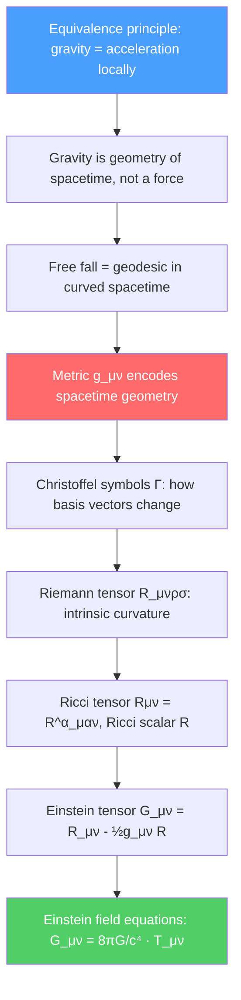

# 🌀 Introduction to General Relativity

> [!abstract] TL;DR
> General relativity replaces Newtonian gravity with a geometric theory: mass-energy curves spacetime, and freely-falling objects follow the straightest possible paths (geodesics) in that curved spacetime. The Einstein field equations $G_{\mu\nu} = 8\pi G T_{\mu\nu}/c^4$ relate spacetime curvature (left side) to the distribution of mass-energy (right side). The weak-field limit reproduces Newtonian gravity; strong-field predictions — gravitational time dilation, light bending, black holes, gravitational waves — have all been confirmed experimentally.

## Intuition — analogy FIRST

Place a bowling ball on a stretched rubber sheet. The sheet curves around it. Now roll a marble nearby — it curves toward the bowling ball, not because of any invisible force, but because it follows the curved surface. This is the GR picture of gravity: massive objects curve spacetime, and other objects follow those curves. The "force" of gravity is really just the geometry of spacetime telling matter how to move.

The key insight is the equivalence principle: standing on Earth's surface feels exactly like accelerating upward in a rocket at $g = 9.8$ m/s². Einstein elevated this observation to a fundamental principle and built his entire theory on it — with stunning experimental success.

---

## How It Works

---

## Key Concepts / Details

### Secondary / Early Undergraduate Level

**Equivalence principle:** In a sufficiently small region of spacetime, the effects of gravity are indistinguishable from those of acceleration. A falling elevator is locally inertial (weightless). This "local flatness" is why GR reduces to SR in free-fall frames.

**Gravitational time dilation:** A clock at lower gravitational potential runs slow relative to a clock at higher potential:
$$\Delta t_{top} = \Delta t_{bottom}\sqrt{1 - 2GM/rc^2} \approx \Delta t_{bottom}\left(1 + \frac{gh}{c^2}\right)$$

At Earth's surface: $gh/c^2 \approx 10^{-16}$ per meter height — tiny but measurable with modern atomic clocks.

**Light bending:** A photon passing near the Sun is deflected by an angle:
$$\delta\theta = \frac{4GM_\odot}{bc^2} \approx 1.75''$$

where $b$ is the impact parameter. Newtonian gravity predicts half this value; GR's extra contribution comes from the curvature of space (not just time). Confirmed by Eddington's 1919 eclipse expedition.

**Gravitational redshift:** Light climbing out of a gravitational well loses energy:
$$\frac{\Delta\nu}{\nu} = -\frac{GM}{Rc^2} \approx -\frac{gh}{c^2}$$

Confirmed to $10^{-4}$ by the Pound-Rebka experiment (1959) using the Mössbauer effect.

### Undergraduate Level

**Metric tensor $g_{\mu\nu}$:** Generalizes $\eta_{\mu\nu}$ to curved spacetime:
$$ds^2 = g_{\mu\nu}(x)\,dx^\mu dx^\nu$$

The metric encodes all geometric information: distances, angles, and how geodesics behave. In flat spacetime $g_{\mu\nu} = \eta_{\mu\nu}$.

**Geodesic equation:** A freely-falling particle follows a geodesic — the curve that extremizes proper time. In coordinates:
$$\frac{d^2x^\mu}{d\tau^2} + \Gamma^\mu{}_{\alpha\beta}\frac{dx^\alpha}{d\tau}\frac{dx^\beta}{d\tau} = 0$$

where the Christoffel symbols (connection coefficients):
$$\Gamma^\mu{}_{\alpha\beta} = \frac{1}{2}g^{\mu\nu}\left(\partial_\alpha g_{\nu\beta} + \partial_\beta g_{\nu\alpha} - \partial_\nu g_{\alpha\beta}\right)$$

encode how basis vectors twist as you move through curved spacetime.

**Newtonian limit:** For weak, slow gravity ($g_{\mu\nu} = \eta_{\mu\nu} + h_{\mu\nu}$ with $|h_{\mu\nu}|\ll 1$, $v\ll c$), the geodesic equation reduces to:
$$\ddot{\vec{r}} = -\nabla\Phi, \qquad \Phi = -GM/r$$

Newton's second law + law of gravity emerge as the weak-field, slow-motion limit of GR.

**Riemann curvature tensor:** The key measure of intrinsic curvature:
$$R^\rho{}_{\sigma\mu\nu} = \partial_\mu\Gamma^\rho{}_{\nu\sigma} - \partial_\nu\Gamma^\rho{}_{\mu\sigma} + \Gamma^\rho{}_{\mu\lambda}\Gamma^\lambda{}_{\nu\sigma} - \Gamma^\rho{}_{\nu\lambda}\Gamma^\lambda{}_{\mu\sigma}$$

Conceptually: parallel-transport a vector around a closed loop; the angle through which it rotates equals the integrated Riemann tensor over the enclosed surface. In flat spacetime, $R^\rho{}_{\sigma\mu\nu} = 0$ everywhere.

**Ricci tensor and scalar:** Contractions of the Riemann tensor:
$$R_{\mu\nu} = R^\alpha{}_{\mu\alpha\nu}, \qquad R = g^{\mu\nu}R_{\mu\nu}$$

**Einstein tensor:**
$$G_{\mu\nu} = R_{\mu\nu} - \frac{1}{2}g_{\mu\nu}R$$

It satisfies the contracted Bianchi identity $\nabla^\mu G_{\mu\nu} = 0$, which will ensure stress-energy conservation.

### Graduate Level

**Einstein field equations (EFE):**
$$G_{\mu\nu} = \frac{8\pi G}{c^4}T_{\mu\nu}$$

This is 10 coupled nonlinear PDEs for the 10 components of $g_{\mu\nu}$ (symmetric $4\times 4$ matrix). The right-hand side $T_{\mu\nu}$ is the stress-energy tensor of matter and energy. Four components of the Bianchi identity ($\nabla^\mu G_{\mu\nu} = 0$) imply stress-energy conservation $\nabla^\mu T_{\mu\nu} = 0$ — GR automatically enforces energy-momentum conservation.

**Derivation from action (Einstein-Hilbert action):**
$$S = \frac{c^4}{16\pi G}\int d^4x\,\sqrt{-g}\,(R - 2\Lambda) + S_{matter}$$

Varying with respect to $g^{\mu\nu}$ (Euler-Lagrange for the metric) gives the EFE with cosmological constant $\Lambda$.

**Cosmological constant:** Einstein added $\Lambda g_{\mu\nu}$ to the EFE to allow a static universe (1917). After Hubble's discovery of expansion, he called it his "biggest blunder." But since 1998, observations show $\Lambda > 0$ (dark energy) is required by the accelerating expansion.

**Stress-energy tensor components:**
- $T^{00}$ = energy density $\rho c^2$
- $T^{0i}$ = energy flux / momentum density
- $T^{ij}$ = stress (pressure tensor)

For a perfect fluid: $T^{\mu\nu} = (\rho + p/c^2)u^\mu u^\nu + p g^{\mu\nu}$.

**Gravitational wave equation:** In the linearized theory ($h_{\mu\nu} \ll 1$), in the transverse-traceless gauge:
$$\Box^2 \bar{h}_{\mu\nu} = -\frac{16\pi G}{c^4}T_{\mu\nu}$$

The wave equation! Gravitational waves propagate at $c$ with two polarization modes ($h_+$ and $h_\times$).

---

## Real-World Notes

- **GPS revisited:** The full $+38\,\mu$s/day correction includes gravitational blueshift ($+45\,\mu$s/day from GR) and SR time dilation ($-7\,\mu$s/day from orbital velocity). Without GR, GPS position errors would accumulate at $\sim 10$ km/day.
- **Gravitational lensing:** Galaxy clusters act as gravitational lenses, bending background light into arcs. Strong lensing magnifies distant quasars and galaxies; weak lensing statistics map the dark matter distribution in the universe.
- **Pulsar timing:** Binary pulsars lose orbital energy by gravitational wave emission exactly as GR predicts (Hulse-Taylor pulsar, Nobel Prize 1993).
- **LIGO/Virgo:** Direct detection of gravitational waves from binary black hole mergers (2015, Nobel Prize 2017) opened gravitational-wave astronomy.

---

## Common Pitfalls

- **GR is not just a "correction" to Newtonian gravity.** It is a completely different conceptual framework — space and time are dynamical, not fixed background stages.
- **The EFE are not "force = mass × curvature."** Both sides describe geometry differently: $G_{\mu\nu}$ is a combination of second derivatives of $g_{\mu\nu}$; $T_{\mu\nu}$ is matter content. The equation is a system of nonlinear PDEs.
- **Christoffel symbols are not tensors.** They vanish in a locally inertial frame (equivalence principle), confirming they represent the "fake" gravitational force, not intrinsic curvature.
- **Riemann tensor has 20 independent components** (in 4D), not $4^4 = 256$, due to its symmetries: $R_{\mu\nu\rho\sigma} = R_{\rho\sigma\mu\nu}$, $R_{\mu\nu\rho\sigma} = -R_{\nu\mu\rho\sigma}$, and the first Bianchi identity.

---

## Related Concepts
- [[Spacetime_and_Four_Vectors]] — Minkowski metric is $g_{\mu\nu} = \eta_{\mu\nu}$; GR generalizes to curved $g_{\mu\nu}$
- [[Special_Relativity_Kinematics]] — SR is the flat-spacetime ($R=0$) limit of GR
- [[Schwarzschild_Solution_and_Black_Holes]] — The exact GR solution for spherical mass distribution
- [[Cosmology_and_Expanding_Universe]] — FLRW metric as GR solution for a homogeneous, isotropic universe
- [[_MOC_Relativity|↑ Section MOC]]

---

## Review Questions

1. **(Undergraduate)** State the equivalence principle and use it to derive gravitational time dilation. If a clock is at height $h = 1$ km above a clock at sea level, how many nanoseconds per day does the higher clock gain?
2. **(Undergraduate)** Write the geodesic equation in a weak gravitational field and show that it reduces to Newton's equation $\ddot{x}^i = -\partial_i\Phi$ when $g_{00} \approx -(1 + 2\Phi/c^2)$ and $v \ll c$.
3. **(Graduate)** Starting from the Einstein-Hilbert action, vary with respect to $g^{\mu\nu}$ and derive the Einstein field equations with cosmological constant. Identify the Gibbons-Hawking-York boundary term and explain why it is needed.

---

## Sources
- Carroll, *Spacetime and Geometry: An Introduction to General Relativity* (excellent modern textbook)
- Misner, Thorne & Wheeler, *Gravitation* (comprehensive reference, classic)
- Wald, *General Relativity* (rigorous mathematical treatment)
- Hartle, *Gravity: An Introduction to Einstein's General Relativity* (accessible undergraduate level)
- Will, "The Confrontation between General Relativity and Experiment," *Living Rev. Rel.* 17, 4 (2014)

#physics #general-relativity #Einstein-field-equations #curved-spacetime #equivalence-principle #geodesics
