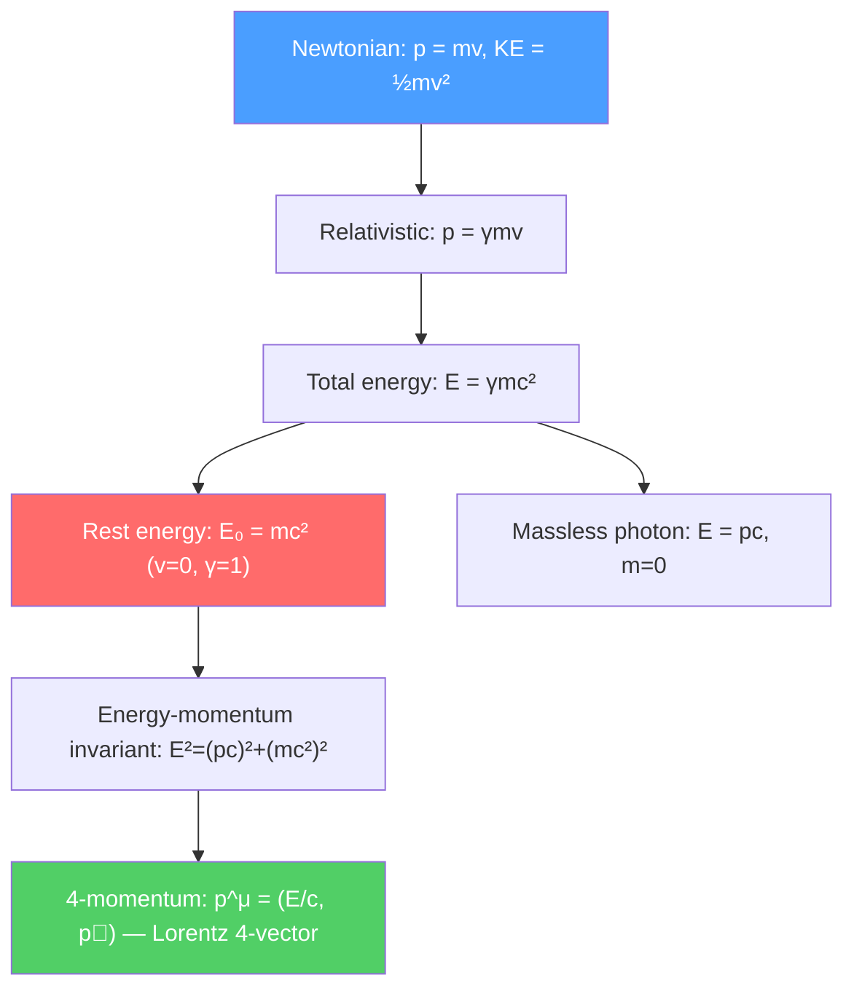

# ⚡ Relativistic Dynamics

> [!abstract] TL;DR
> At speeds approaching $c$, Newtonian dynamics breaks down: momentum becomes $p = \gamma mv$ and total energy $E = \gamma mc^2$. The rest energy $E_0 = mc^2$ is stored in mass itself — convertible to kinetic energy in nuclear reactions. Massless particles like photons satisfy $E = pc$. The covariant 4-momentum unifies energy and momentum into a single Lorentz-invariant object, with invariant mass $m^2c^2 = E^2/c^2 - p^2$.

## Intuition — analogy FIRST

Imagine pushing a sled on frictionless ice. In Newtonian physics, you keep adding speed proportionally to force applied. But as the sled approaches the speed of light, it becomes harder and harder to accelerate — not because of friction, but because its effective "inertia" increases without bound. The sled would need infinite energy to actually reach $c$, which is why massive objects can never quite get there.

Meanwhile, $E_0 = mc^2$ says that even sitting still, every kilogram of matter holds $9 \times 10^{16}$ joules — about 21 million tons of TNT. Nuclear fission and fusion are just the tip of this iceberg, releasing a fraction of a percent of the total rest energy. A perfect matter-antimatter annihilator would release all of it.

---

## How It Works

---

## Key Concepts / Details

### Secondary Level

**Relativistic momentum:**
$$\vec{p} = \gamma m\vec{v} = \frac{m\vec{v}}{\sqrt{1-v^2/c^2}}$$

As $v \to c$, $p \to \infty$. Momentum diverges, which is why you cannot accelerate a massive particle to $c$.

**Total relativistic energy:**
$$E = \gamma mc^2 = \frac{mc^2}{\sqrt{1-v^2/c^2}}$$

**Rest energy:** Setting $v = 0$ (so $\gamma = 1$):
$$E_0 = mc^2$$

This is the most famous equation in physics. Even a stationary particle has energy equal to $mc^2$.

**Relativistic kinetic energy:** The kinetic energy is the excess above rest energy:
$$KE = E - mc^2 = (\gamma - 1)mc^2$$

For $v \ll c$: $\gamma - 1 \approx v^2/2c^2$, so $KE \approx \frac{1}{2}mv^2$ — recovering the Newtonian result.

**Massless particles:** Photons and (possibly) gravitons have $m = 0$. Setting $m = 0$ in the energy formula:
$$E = pc, \quad \vec{p} = \frac{E}{c}\hat{n} = \frac{hf}{c}\hat{n}$$

A photon with frequency $f$ has energy $E = hf$ and momentum $p = hf/c = h/\lambda$.

### Undergraduate Level

**Energy-momentum invariant:** Combining $E$ and $p$:
$$E^2 = (pc)^2 + (mc^2)^2$$

This is the relativistic energy-momentum relation, the cornerstone of particle physics. It is Lorentz invariant (same in all frames), unlike $E$ and $p$ individually.

**Invariant mass:** For a single particle, $m^2c^4 = E^2 - p^2c^2$. For a system of particles, the invariant mass of the system is:
$$M^2c^4 = \left(\sum_i E_i\right)^2 - \left|\sum_i\vec{p}_i\right|^2 c^2$$

This determines what particles can be produced in a collision — a particle can only be created if $Mc^2$ is available as center-of-mass energy.

**Threshold energy:** To create a particle of mass $M$ in a collision $a + b \to a + b + X$ (target $b$ at rest), the minimum kinetic energy of projectile $a$ is:
$$KE_{threshold} = \frac{[m_a + m_b + M]^2c^4 - (m_a^2 + m_b^2)c^4}{2m_bc^2}$$

This is why fixed-target accelerators are less efficient than colliders: most of the projectile energy goes into center-of-mass motion of the target, not into creating new particles.

**Compton scattering:** A photon of wavelength $\lambda$ scatters off a stationary electron. The scattered photon has wavelength:
$$\lambda' = \lambda + \frac{h}{m_ec}(1-\cos\theta) = \lambda + \lambda_C(1-\cos\theta)$$

where $\lambda_C = h/m_ec = 2.43 \times 10^{-12}$ m is the Compton wavelength. This shift (momentum transfer from photon to electron) is derived directly from the energy-momentum invariant.

### Graduate Level

**Relativistic Lagrangian and action:** The action for a free relativistic particle is proportional to the proper time:
$$S = -mc\int ds = -mc^2\int\sqrt{1-\frac{v^2}{c^2}}\,dt = \int L\,dt, \quad L = -mc^2\sqrt{1-v^2/c^2}$$

For $v \ll c$: $L \approx -mc^2 + \frac{1}{2}mv^2$, recovering the non-relativistic Lagrangian (up to the constant $-mc^2$, which does not affect equations of motion).

**Covariant formulation of electrodynamics:** The 4-current $j^\mu = (c\rho, \vec{J})$ and 4-potential $A^\mu = (\phi/c, \vec{A})$ transform as 4-vectors. The electromagnetic field tensor:
$$F^{\mu\nu} = \partial^\mu A^\nu - \partial^\nu A^\mu$$

has components $F^{0i} = E^i/c$ and $F^{ij} = -\epsilon^{ijk}B_k$. Maxwell's equations become:
$$\partial_\mu F^{\mu\nu} = \mu_0 j^\nu, \qquad \partial_{[\mu}F_{\nu\rho]} = 0$$

**4-force:** The relativistic equation of motion $f^\mu = dp^\mu/d\tau$ where $f^\mu = \gamma(\vec{F}\cdot\vec{v}/c, \vec{F})$. For a charged particle in an electromagnetic field: $f^\mu = qF^{\mu\nu}u_\nu$ where $u^\nu$ is the 4-velocity.

**Relativistic collisions and invariants:** In particle physics, Mandelstam variables $s, t, u$ for a $2\to 2$ scattering $p_1 + p_2 \to p_3 + p_4$:
$$s = (p_1+p_2)^2c^2, \quad t = (p_1-p_3)^2c^2, \quad u = (p_1-p_4)^2c^2$$
with $s + t + u = \sum_i m_i^2 c^2$. $\sqrt{s}$ is the center-of-mass energy; $t$ and $u$ are momentum transfers. Cross-sections are most naturally expressed as functions of these invariants.

---

## Real-World Notes

- **Nuclear power:** Fission of $^{235}$U releases about $0.1\%$ of rest mass as energy. Per kilogram: $\sim 8 \times 10^{13}$ J — about $10^6$ times more than chemical combustion. $E = mc^2$ is not just theoretical; it is the equation behind every nuclear power plant.
- **PET scans:** Positron-emitting tracers annihilate with electrons: $e^+ + e^- \to 2\gamma$. Each photon carries $E = m_ec^2 = 0.511$ MeV and they travel in exactly opposite directions (momentum conservation with $p_{initial} \approx 0$).
- **Particle colliders:** The LHC collides protons at $\sqrt{s} = 13$ TeV center-of-mass energy, producing Higgs bosons ($M_H = 125$ GeV/$c^2$), top quarks ($m_t = 173$ GeV/$c^2$), and searching for BSM physics.
- **Cosmic ray air showers:** A $10^{20}$ eV cosmic ray proton has $\gamma \sim 10^{11}$. Its collisions with atmospheric nuclei create cascades of pions, kaons, and muons — the same threshold energy physics used to predict LHC particle production.

---

## Common Pitfalls

- **$E = mc^2$ is the rest energy, not the total energy.** Total energy is $E = \gamma mc^2$; rest energy is $mc^2$. The kinetic energy is $(\gamma-1)mc^2$.
- **"Relativistic mass" $m_{rel} = \gamma m$ is deprecated.** Modern usage: $m$ is the invariant (rest) mass; $p = \gamma mv$ and $E = \gamma mc^2$ are just the relativistic generalizations. Avoid saying "mass increases with speed."
- **The invariant mass of a photon is zero, but photons have momentum.** $E = pc$ for massless particles; they carry momentum $p = E/c = hf/c$.
- **Energy-momentum is frame-dependent; the invariant mass is not.** Two photons moving in the same direction have total invariant mass zero ($E_{tot}^2 = (E_1+E_2)^2 - (p_1+p_2)^2c^2 = 0$ since $p_i = E_i/c$). Two photons moving in opposite directions have invariant mass $\sqrt{s} = 2E_{photon}/c^2$.

---

## Related Concepts
- [[Special_Relativity_Kinematics]] — Kinematics: time dilation, length contraction, Lorentz transforms
- [[Spacetime_and_Four_Vectors]] — 4-momentum in covariant notation; electromagnetic field tensor
- [[Nuclear_Reactions_Fission_Fusion]] — $Q$-value from mass difference: $Q = (m_i - m_f)c^2$
- [[Standard_Model_Overview]] — Particle masses and decay products from energy-momentum conservation
- [[Fundamental_Forces_and_Feynman_Diagrams]] — Mandelstam variables in QED cross-section calculations
- [[_MOC_Relativity|↑ Section MOC]]

---

## Review Questions

1. **(Secondary)** A proton ($m_p = 938$ MeV/$c^2$) moves at $v = 0.99c$. Calculate (a) its Lorentz factor, (b) its total energy, (c) its kinetic energy, and (d) its momentum.
2. **(Undergraduate)** Using the energy-momentum invariant $E^2 = (pc)^2 + (mc^2)^2$, derive the threshold kinetic energy for pion production $p + p \to p + p + \pi^0$ with a stationary target proton. Given $m_\pi = 135$ MeV/$c^2$, $m_p = 938$ MeV/$c^2$, calculate the numerical threshold.
3. **(Graduate)** Starting from the relativistic Lagrangian $L = -mc^2\sqrt{1-v^2/c^2}$, derive the relativistic momentum and energy using the Euler-Lagrange equations and the Hamiltonian. Show that the Hamiltonian equals the total energy $E = \gamma mc^2$.

---

## Sources
- Griffiths, *Introduction to Electrodynamics*, Ch. 12 (electrodynamics and relativity)
- Taylor & Wheeler, *Spacetime Physics*, Ch. 7 (relativistic dynamics)
- Griffiths, *Introduction to Elementary Particles*, Ch. 3 (relativistic kinematics for particle physics)
- Landau & Lifshitz, *Classical Theory of Fields*, §9–10 (relativistic mechanics)
- Misner, Thorne & Wheeler, *Gravitation*, Ch. 5 (stress-energy tensor, 4-momentum)

#physics #special-relativity #mass-energy-equivalence #relativistic-momentum #4-momentum #E-equals-mc2
