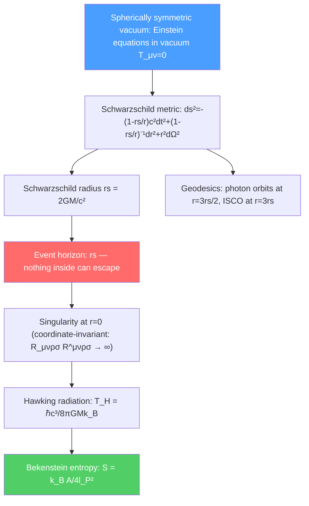

# ⚫ Schwarzschild Solution and Black Holes

> [!abstract] TL;DR
> The Schwarzschild metric is the exact GR solution for the spacetime outside any spherically symmetric mass — stars, planets, and black holes. At the Schwarzschild radius $r_s = 2GM/c^2$, the event horizon forms: a one-way surface from which nothing, not even light, can escape. At PhD level, Hawking radiation (quantum thermal emission from black holes), Bekenstein entropy ($S = k_B A/4l_P^2$), and the Kerr metric for rotating black holes connect GR to quantum gravity — one of the deepest open problems in physics.

## Intuition — analogy FIRST

Think of a waterfall. Above a certain point, fish can swim upstream against the current. Below that point, the current is faster than the fish can swim — they are inevitably carried downstream. A black hole event horizon is similar: below the Schwarzschild radius, "spacetime flows" inward faster than light can travel outward. Nothing can escape — not fish, not light, not information.

Yet quantum mechanics introduces a twist: Stephen Hawking showed that black holes are not perfectly black. Near the event horizon, quantum fluctuations create pairs of particles — one falls in, one escapes as "Hawking radiation." Over immense timescales, black holes evaporate. The temperature is inversely proportional to the black hole's mass, raising deep questions about what happens to the information of infalling matter (the "information paradox").

---

## How It Works

---

## Key Concepts / Details

### Secondary Level

**What is a black hole?** A region of spacetime where gravity is so strong that the escape velocity exceeds the speed of light. The boundary is the **event horizon** — once you cross it, you cannot return, no matter how powerful your rocket.

**Schwarzschild radius:**
$$r_s = \frac{2GM}{c^2}$$

For the Sun: $r_s \approx 3$ km (actual radius $\approx 700,000$ km — not a black hole!). For Earth: $r_s \approx 9$ mm. For a $10 M_\odot$ black hole: $r_s \approx 30$ km.

**Formation:** Black holes form when a massive star ($> 25 M_\odot$) exhausts its nuclear fuel and collapses — gravity overwhelms all other forces (electron degeneracy pressure, neutron degeneracy pressure). Can also form from neutron star mergers.

**Types:** Stellar-mass black holes ($\sim 3$–$100 M_\odot$), intermediate-mass ($10^3$–$10^5 M_\odot$), and supermassive ($10^6$–$10^{10} M_\odot$, in galactic centers like Sgr A* at $4 \times 10^6 M_\odot$).

### Undergraduate Level

**Schwarzschild metric:** The exact vacuum GR solution for a spherically symmetric mass $M$:
$$ds^2 = -\left(1 - \frac{r_s}{r}\right)c^2\,dt^2 + \left(1 - \frac{r_s}{r}\right)^{-1}dr^2 + r^2 d\theta^2 + r^2\sin^2\theta\,d\phi^2$$

where $r_s = 2GM/c^2$. Far from the source ($r \gg r_s$), this approaches Minkowski spacetime in spherical coordinates (as it must). Near $r_s$, the time component $g_{tt}$ vanishes and $g_{rr}$ diverges.

**Coordinate singularity at $r = r_s$:** The metric coefficients blow up at $r = r_s$, but the **Kretschner scalar** $K = R_{\mu\nu\rho\sigma}R^{\mu\nu\rho\sigma} = 48G^2M^2/r^6$ is finite there. This shows $r = r_s$ is a **coordinate singularity** (like the North Pole in lat/long coordinates) — removable by a change of coordinates (Kruskal-Szekeres). The physical singularity is at $r = 0$ where $K \to \infty$.

**Gravitational redshift from Schwarzschild metric:** A photon emitted at radius $r_e$ is observed at infinity with frequency:
$$\nu_\infty = \nu_e\sqrt{1 - r_s/r_e}$$

As $r_e \to r_s$, $\nu_\infty \to 0$ — photons emitted near the horizon are infinitely redshifted; a distant observer sees infalling matter "freeze" at the horizon and fade away.

**Geodesics and photon sphere:** For photons (null geodesics $ds^2 = 0$), there is a circular orbit at $r = 3r_s/2 = 3GM/c^2$ (the photon sphere). This orbit is unstable — slight perturbation causes the photon to spiral in or out.

**Innermost stable circular orbit (ISCO):** For massive particles, stable circular orbits exist only for $r \geq 3r_s = 6GM/c^2$. Inside this radius, circular orbits are unstable and particles spiral inward. ISCO location determines accretion disk structure and X-ray binary spectra.

**No-hair theorem:** A black hole in equilibrium is completely characterized by only three quantities: mass $M$, charge $Q$, and angular momentum $J$. All other information about the infalling matter is "lost" (or encoded in the Hawking radiation — the information paradox).

### Graduate Level

**Kruskal-Szekeres coordinates:** Remove the coordinate singularity at $r = r_s$ by:
$$T = \left(\frac{r}{r_s}-1\right)^{1/2}e^{r/2r_s}\sinh\!\left(\frac{ct}{2r_s}\right), \quad X = \left(\frac{r}{r_s}-1\right)^{1/2}e^{r/2r_s}\cosh\!\left(\frac{ct}{2r_s}\right)$$

The metric becomes $ds^2 = (4r_s^3/r)e^{-r/r_s}(-dT^2+dX^2)+r^2d\Omega^2$, manifestly non-singular at $r = r_s$. The Kruskal diagram reveals that the full Schwarzschild geometry has four regions: the exterior, the future singularity, a white hole (time-reverse of a black hole), and a second exterior universe — connected by an Einstein-Rosen bridge (wormhole). The wormhole is not traversable.

**Penrose diagrams:** Conformal diagrams compactifying spacetime to a finite region, showing causal structure. Future null infinity $\mathcal{I}^+$ and past null infinity $\mathcal{I}^-$ are the boundaries where light rays come from/go to. The event horizon appears as a $45°$ line; the singularity as a spacelike line at the top.

**Hawking radiation:** Near the horizon, quantum field theory in curved spacetime predicts particle creation at the Hawking temperature:
$$T_H = \frac{\hbar c^3}{8\pi G M k_B} \approx \frac{6 \times 10^{-8}\,\text{K}}{M/M_\odot}$$

Heuristic: virtual particle-antiparticle pairs near the horizon — one falls in (negative energy in the exterior region), one escapes. The black hole loses mass. Evaporation time $t_{evap} \sim (M/M_P)^3 \times t_P \sim 10^{71}$ years for $M = M_\odot$.

**Bekenstein-Hawking entropy:**
$$S_{BH} = \frac{k_B c^3 A}{4G\hbar} = \frac{k_B A}{4 l_P^2}$$

where $A = 4\pi r_s^2 = 16\pi G^2M^2/c^4$ is the horizon area and $l_P = \sqrt{G\hbar/c^3} \approx 1.6\times 10^{-35}$ m is the Planck length. This entropy is proportional to area (not volume) — the **holographic principle**: the information content of a region is proportional to its boundary area, not volume. This has led to AdS/CFT and holographic approaches to quantum gravity.

**Kerr metric:** For a rotating black hole with mass $M$ and angular momentum $J = aMc$ (Boyer-Lindquist coordinates):
$$ds^2 = -\left(1-\frac{r_s r}{\Sigma}\right)c^2dt^2 - \frac{2ar_s r\sin^2\theta}{\Sigma}c\,dt\,d\phi + \frac{\Sigma}{\Delta}dr^2 + \Sigma\,d\theta^2 + \left(r^2+a^2+\frac{ar_s r\sin^2\theta}{\Sigma}\right)\sin^2\theta\,d\phi^2$$

where $\Sigma = r^2+a^2\cos^2\theta$, $\Delta = r^2-r_sr+a^2$, $a = J/Mc$. New features: **ergosphere** (region outside horizon where frame-dragging forces co-rotation), **Penrose process** (extract rotational energy from ergosphere), inner and outer horizons.

**Gravitational waves from mergers:** Two merging black holes lose orbital energy to gravitational wave emission (inspiral), then merge (merger), and ring down to a final Kerr black hole (ringdown). The gravitational wave strain $h \sim 10^{-21}$ detected by LIGO (GW150914, 2015) matched GR predictions to $<1\%$ — the first direct detection.

---

## Real-World Notes

- **Event Horizon Telescope:** The 2019 image of M87* (6.5 billion solar mass black hole) and 2022 image of Sgr A* directly shows the photon ring and shadow predicted by the Schwarzschild/Kerr metric.
- **X-ray binaries:** Accretion disks around stellar-mass black holes emit X-rays; spectral features from the ISCO determine black hole spin (Kerr parameter $a$).
- **Gravitational wave astronomy:** Over 100 binary black hole mergers detected by LIGO/Virgo/KAGRA, enabling population studies of black hole mass distribution and tests of GR in the strong-field regime.
- **Information paradox:** If Hawking radiation is thermal (purely random), information about infalling matter is destroyed — violating quantum unitarity. This remains one of the most important unsolved problems in theoretical physics.

---

## Common Pitfalls

- **The event horizon is not a singularity.** The tidal forces at the horizon of a supermassive black hole ($M \sim 10^8 M_\odot$, $r_s \sim 3\times 10^{11}$ m) are completely negligible — you would not notice crossing it. Spaghettification happens later, near $r = 0$.
- **"Nothing escapes a black hole" applies classically.** Quantum mechanically, Hawking radiation does escape. The black hole eventually evaporates (after $\sim 10^{71}$ years for stellar-mass BHs).
- **Time dilation at the event horizon (external view):** An observer far away sees infalling objects freeze and redshift to zero at the horizon. The infalling observer reaches the singularity in finite proper time — the discrepancy is resolved by the different simultaneity slicings.
- **Schwarzschild is not the only black hole solution.** Kerr (rotating), Reissner-Nordström (charged), and Kerr-Newman (rotating + charged) complete the "no-hair" family.

---

## Related Concepts
- [[Introduction_to_General_Relativity]] — Schwarzschild metric as the simplest exact solution of the EFE
- [[Cosmology_and_Expanding_Universe]] — Schwarzschild-de Sitter metric; black holes in expanding universe
- [[Astrophysics_and_Cosmology]] — Stellar endpoints: neutron stars and black holes; gravitational wave sources
- [[Intro_to_Quantum_Field_Theory]] — QFT in curved spacetime: basis for Hawking radiation calculation
- [[_MOC_Relativity|↑ Section MOC]]

---

## Review Questions

1. **(Undergraduate)** Calculate the Schwarzschild radius and Hawking temperature for a stellar-mass black hole of $10 M_\odot$. Is Hawking radiation detectable for such objects today?
2. **(Undergraduate)** Using the Schwarzschild metric, derive the effective potential $V_{eff}(r)$ for circular geodesics of massive particles. Show that the ISCO occurs at $r = 6GM/c^2$.
3. **(Graduate)** Explain the Penrose process for energy extraction from a Kerr black hole. What is the maximum fraction of the black hole's mass-energy that can in principle be extracted? How does this relate to the second law of black hole thermodynamics?

---

## Sources
- Carroll, *Spacetime and Geometry*, Ch. 5–6 (Schwarzschild solution, black holes)
- Misner, Thorne & Wheeler, *Gravitation*, Ch. 31–33 (Schwarzschild geometry, Kruskal coordinates)
- Hawking, "Particle Creation by Black Holes," *Commun. Math. Phys.* 43, 199 (1975)
- Bekenstein, "Black Holes and Entropy," *Phys. Rev. D* 7, 2333 (1973)
- Abbott et al. (LIGO), "Observation of Gravitational Waves from a Binary Black Hole Merger," *Phys. Rev. Lett.* 116, 061102 (2016)

#physics #general-relativity #black-holes #Schwarzschild-metric #event-horizon #Hawking-radiation #Bekenstein-entropy #Kerr
