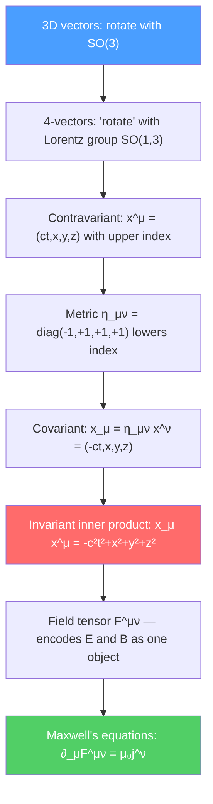

# 📐 Spacetime and Four-Vectors

> [!abstract] TL;DR
> Four-vectors are the natural language of special relativity: they transform as $x'^\mu = \Lambda^\mu{}_\nu x^\nu$ under Lorentz boosts and their inner products (contractions with the metric $\eta_{\mu\nu}$) are Lorentz invariants. The energy-momentum 4-vector $(E/c, \vec{p})$, the 4-velocity $u^\mu = \gamma(c, \vec{v})$, and the electromagnetic field tensor $F^{\mu\nu}$ encode all of SR's physics in a manifestly covariant form that generalizes naturally to curved spacetime (GR).

## Intuition — analogy FIRST

In 2D Euclidean geometry, a rotation mixes the $x$ and $y$ components of a vector, but the length $r = \sqrt{x^2+y^2}$ is invariant. Lorentz boosts are the spacetime analog of rotations — they mix the time and space coordinates, but the "length" $s^2 = -c^2t^2 + x^2 + y^2 + z^2$ is invariant. The minus sign (the Minkowski signature) is what makes boosts hyperbolic rather than circular rotations.

A 4-vector is anything that transforms the same way as $(ct, x, y, z)$ under Lorentz boosts. Once you express a physical law as a relation between 4-vectors and tensors, it automatically holds in all inertial frames — this is the principle of covariance, the mathematical backbone of special relativity.

---

## How It Works

---

## Key Concepts / Details

### Undergraduate Level

**Index notation:** In SR, Greek indices $\mu,\nu,\ldots = 0,1,2,3$ label spacetime components (0 = time, 1,2,3 = space). Latin indices $i,j,k = 1,2,3$ label spatial components only. The **Einstein summation convention**: repeated upper-lower index implies sum:
$$a^\mu b_\mu = \sum_{\mu=0}^3 a^\mu b_\mu = a^0b_0 + a^1b_1 + a^2b_2 + a^3b_3$$

**Minkowski metric:** The metric tensor $\eta_{\mu\nu}$ (particle physics convention, $-+++$):
$$\eta_{\mu\nu} = \eta^{\mu\nu} = \begin{pmatrix}-1&0&0&0\\0&1&0&0\\0&0&1&0\\0&0&0&1\end{pmatrix}$$

The metric raises and lowers indices: $x_\mu = \eta_{\mu\nu}x^\nu$, $x^\mu = \eta^{\mu\nu}x_\nu$.

**Key 4-vectors:**

| 4-vector | Components | Invariant |
|----------|-----------|-----------|
| Position $x^\mu$ | $(ct, x, y, z)$ | $x_\mu x^\mu = -c^2t^2 + r^2 = -c^2\tau^2$ |
| 4-velocity $u^\mu$ | $\gamma(c, v_x, v_y, v_z)$ | $u_\mu u^\mu = -c^2$ |
| 4-momentum $p^\mu$ | $(E/c, p_x, p_y, p_z)$ | $p_\mu p^\mu = -(mc)^2$ |
| 4-current $j^\mu$ | $(c\rho, J_x, J_y, J_z)$ | — |
| 4-potential $A^\mu$ | $(\phi/c, A_x, A_y, A_z)$ | — |

**4-velocity:** Defined as $u^\mu = dx^\mu/d\tau$ (derivative with respect to proper time). Since $d\tau = dt/\gamma$:
$$u^\mu = \gamma(c, \vec{v})$$

The invariant: $u_\mu u^\mu = \gamma^2(-c^2 + v^2) = -c^2$ (constant, confirming it is a valid 4-vector).

**4-momentum:** $p^\mu = mu^\mu = (E/c, \vec{p})$:
$$p_\mu p^\mu = -(mc)^2 \implies E^2 = p^2c^2 + m^2c^4$$

**Lorentz transformation in tensor notation:** The Lorentz transformation matrix $\Lambda^\mu{}_\nu$ (boost in $x$-direction):
$$\Lambda^\mu{}_\nu = \begin{pmatrix}\gamma & -\gamma\beta & 0 & 0\\ -\gamma\beta & \gamma & 0 & 0\\ 0 & 0 & 1 & 0\\ 0 & 0 & 0 & 1\end{pmatrix}, \qquad \beta = v/c$$

Any 4-vector transforms as $V'^\mu = \Lambda^\mu{}_\nu V^\nu$; a rank-2 tensor $T'^{\mu\nu} = \Lambda^\mu{}_\alpha\Lambda^\nu{}_\beta T^{\alpha\beta}$.

### Graduate Level

**Electromagnetic field tensor:** Define $F^{\mu\nu} = \partial^\mu A^\nu - \partial^\nu A^\mu$ (antisymmetric). Components:
$$F^{\mu\nu} = \begin{pmatrix}0 & -E_x/c & -E_y/c & -E_z/c\\ E_x/c & 0 & -B_z & B_y\\ E_y/c & B_z & 0 & -B_x\\ E_z/c & -B_y & B_x & 0\end{pmatrix}$$

Under a Lorentz boost with $\vec{\beta} = \beta\hat{x}$, the fields mix:
$$E'_\parallel = E_\parallel, \quad E'_\perp = \gamma(E_\perp + v\times B)_\perp, \quad B'_\parallel = B_\parallel, \quad B'_\perp = \gamma(B_\perp - v\times E/c^2)_\perp$$

A purely electric field in one frame has both electric and magnetic components in another — $\vec{E}$ and $\vec{B}$ are not separately Lorentz invariants; only $F^{\mu\nu}$ is.

**Maxwell's equations in covariant form:** The two pairs of Maxwell's equations combine elegantly:
$$\partial_\mu F^{\mu\nu} = \mu_0 j^\nu \quad (\text{Gauss's law + Ampère's law})$$
$$\partial_{[\mu}F_{\nu\rho]} = 0 \quad (\text{Faraday's law + no magnetic monopoles})$$

The second equation is automatically satisfied if $F^{\mu\nu} = \partial^\mu A^\nu - \partial^\nu A^\mu$ (Bianchi identity).

**Stress-energy tensor $T^{\mu\nu}$:** A rank-2 symmetric tensor generalizing energy and momentum density:
- $T^{00}$ = energy density
- $T^{0i} = T^{i0}$ = momentum density / energy flux
- $T^{ij}$ = stress tensor (momentum flux, pressure)

Conservation laws: $\partial_\mu T^{\mu\nu} = 0$ encodes energy conservation ($\nu=0$) and momentum conservation ($\nu=i$). For the electromagnetic field:
$$T^{\mu\nu}_{EM} = \frac{1}{\mu_0}\left(F^{\mu\alpha}F^\nu{}_\alpha - \frac{1}{4}\eta^{\mu\nu}F_{\alpha\beta}F^{\alpha\beta}\right)$$

$T^{00}_{EM} = \epsilon_0 E^2/2 + B^2/2\mu_0$ is the familiar electromagnetic energy density.

**Lorentz invariants from $F^{\mu\nu}$:** There are exactly two independent Lorentz invariants:
$$F_{\mu\nu}F^{\mu\nu} = 2(B^2 - E^2/c^2), \qquad \frac{1}{2}\epsilon^{\mu\nu\rho\sigma}F_{\mu\nu}F_{\rho\sigma} = -4\vec{E}\cdot\vec{B}/c$$

These constrain what field configurations can be related by Lorentz boosts: a purely electric field ($B=0$, $E\neq 0$) has positive first invariant; a purely magnetic field has negative first invariant — and they cannot be boosted into each other.

---

## Real-World Notes

- **Synchrotron radiation:** The covariant Larmor formula for radiated power $P = q^2a_\mu a^\mu/(6\pi\epsilon_0 c)$ (where $a^\mu$ is 4-acceleration) immediately gives the relativistic generalization, explaining the $\gamma^4$ power scaling in synchrotron emission.
- **QED Feynman rules:** The photon propagator $\propto \eta^{\mu\nu}/k^2$, the electron propagator $\propto (\gamma^\mu p_\mu + m)/(p^2 - m^2)$, and the vertex $\propto \gamma^\mu$ are all written in 4-vector notation. Lorentz invariance of amplitudes follows automatically.
- **Gravitational wave detectors (LIGO):** Strain $h_{\mu\nu}$ is a perturbation to the Minkowski metric $g_{\mu\nu} = \eta_{\mu\nu} + h_{\mu\nu}$; the tensor nature of gravitational waves follows from the tensor structure of GR.

---

## Common Pitfalls

- **Convention clash ($-+++$ vs $+---$):** Particle physics usually uses $\eta = \text{diag}(-,+,+,+)$; GR often uses $\text{diag}(+,-,-,-)$. Invariant mass squared is $p_\mu p^\mu = -(mc)^2$ in the first and $+(mc)^2$ in the second.
- **Raised vs lowered index matters:** $x^\mu = (ct, \vec{r})$ but $x_\mu = (-ct, \vec{r})$. Contracting same-type indices ($x^\mu x^\mu$ without metric) is wrong.
- **$\partial_\mu$ vs $\partial^\mu$:** $\partial_\mu = (\partial/c\partial t, \nabla)$ and $\partial^\mu = \eta^{\mu\nu}\partial_\nu = (-\partial/c\partial t, \nabla)$. The d'Alembertian $\Box^2 = \partial_\mu\partial^\mu = -\partial^2/c^2\partial t^2 + \nabla^2$.

---

## Related Concepts
- [[Special_Relativity_Kinematics]] — The spacetime interval and Lorentz transforms in component form
- [[Relativistic_Dynamics]] — 4-momentum $(E/c, \vec{p})$ and energy-momentum invariant
- [[Introduction_to_General_Relativity]] — Generalize $\eta_{\mu\nu}$ to curved metric $g_{\mu\nu}$, partial derivatives to covariant derivatives
- [[Intro_to_Quantum_Field_Theory]] — Fields $\phi(x^\mu)$, Lagrangian density $\mathcal{L}$, and all amplitudes written in 4-vector notation
- [[_MOC_Relativity|↑ Section MOC]]

---

## Review Questions

1. **(Undergraduate)** Show that the spacetime interval $ds^2 = \eta_{\mu\nu}dx^\mu dx^\nu$ is invariant under the Lorentz boost $\Lambda^\mu{}_\nu$. What condition must $\Lambda$ satisfy?
2. **(Undergraduate)** A charged particle moves in a uniform magnetic field $\vec{B} = B\hat{z}$ in frame $S$. In frame $S'$ moving at $\vec{v} = v\hat{x}$ relative to $S$, what are the electric and magnetic fields? Use the tensor transformation law $F'^{\mu\nu} = \Lambda^\mu{}_\alpha\Lambda^\nu{}_\beta F^{\alpha\beta}$.
3. **(Graduate)** Show that $\partial_\mu F^{\mu\nu} = \mu_0 j^\nu$ contains all four of Maxwell's source equations. Write out explicitly the $\nu=0$ component and identify it as Gauss's law.

---

## Sources
- Griffiths, *Introduction to Electrodynamics*, Ch. 12 (relativistic electrodynamics, 4-vectors)
- Jackson, *Classical Electrodynamics*, Ch. 11–12 (special relativity, covariant formulation)
- Landau & Lifshitz, *Classical Theory of Fields*, §23–33 (electromagnetic field tensor, invariants)
- Carroll, *Spacetime and Geometry*, Ch. 1–2 (manifolds, tensors — excellent transition to GR)
- Peskin & Schroeder, *An Introduction to Quantum Field Theory*, Ch. 3 (Lorentz group representations)

#physics #special-relativity #four-vectors #Minkowski-metric #electromagnetic-field-tensor #covariant-formulation
