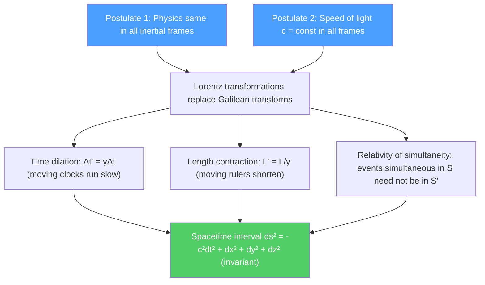

# ⏱️ Special Relativity Kinematics

> [!abstract] TL;DR
> Special relativity follows from two postulates: (1) the laws of physics are the same in all inertial frames, and (2) the speed of light $c$ is constant for all inertial observers. These simple assumptions force time dilation ($\Delta t' = \gamma\Delta t$), length contraction ($L' = L/\gamma$), and the breakdown of simultaneity — all experimentally confirmed. At graduate level, Minkowski's geometric formulation unifies space and time into a 4D spacetime with invariant interval $ds^2 = -c^2dt^2 + dx^2 + dy^2 + dz^2$.

## Intuition — analogy FIRST

Imagine two lifeguards on a beach synchronizing their watches, and then one swims across the ocean to Australia. When she returns, her watch reads less time than the stationary lifeguard's — not because of any mechanical malfunction, but because time itself ran slower for the moving observer. This is not science fiction; it is measured every day with atomic clocks on GPS satellites (which run $38$ microseconds fast per day from SR + GR effects combined) and with muons from cosmic rays that would decay before reaching the ground without time dilation.

The deepest lesson: **there is no absolute "now."** Two events that are simultaneous for one observer can be sequential for another. Space and time are not separate universal stages — they are a unified spacetime, and different observers simply "slice" this spacetime differently.

---

## How It Works

---

## Key Concepts / Details

### Secondary Level

**Two postulates (Einstein, 1905):**
1. The laws of physics take the same form in all inertial (non-accelerating) reference frames.
2. The speed of light in vacuum $c = 3 \times 10^8$ m/s is the same for all inertial observers, regardless of the motion of the source.

**Lorentz factor:**
$$\gamma = \frac{1}{\sqrt{1 - v^2/c^2}} \geq 1$$

For everyday speeds $v \ll c$, $\gamma \approx 1$ and SR effects are negligible. At $v = 0.9c$, $\gamma \approx 2.3$.

**Time dilation:** A clock moving at speed $v$ ticks more slowly by factor $\gamma$. If the moving clock measures a proper time $\Delta\tau$ (time between events at the same location in the moving frame):
$$\Delta t = \gamma\,\Delta\tau \geq \Delta\tau$$

The stationary observer measures a longer time interval. Moving clocks run slow.

**Length contraction:** A rod of proper length $L_0$ (measured in its rest frame) appears shorter along the direction of motion:
$$L = \frac{L_0}{\gamma} \leq L_0$$

The dimension perpendicular to motion is unchanged.

**Relativity of simultaneity:** Two events separated by distance $\Delta x$ and time $\Delta t = 0$ in frame $S$ are separated by $\Delta t' = -\gamma v\Delta x/c^2 \neq 0$ in frame $S'$ moving at velocity $v$.

### Undergraduate Level

**Lorentz transformations:** For frame $S'$ moving at velocity $v$ in the $x$-direction relative to $S$:

$$\begin{aligned}
x' &= \gamma(x - vt) \\
t' &= \gamma\!\left(t - \frac{vx}{c^2}\right) \\
y' &= y, \quad z' = z
\end{aligned}$$

Inverse: replace $v \to -v$. For $v \ll c$, these reduce to Galilean transformations $x' = x - vt$, $t' = t$.

**Velocity addition:** If object moves at $u'$ in $S'$ and $S'$ moves at $v$ relative to $S$:
$$u = \frac{u' + v}{1 + u'v/c^2}$$

Even if $u' = c$ and $v = c$, we get $u = c$ — the speed of light is the same in all frames, as required.

**Twin paradox:** Twin A stays on Earth; twin B travels to a star at $0.9c$ and returns. By time dilation, B is younger upon return. The "paradox" is that B might think A is the moving twin. The resolution: B accelerates when turning around, breaking the symmetry between the twins. A's frame is consistently inertial throughout; B's is not. The frame analysis unambiguously confirms B ages less.

**Spacetime interval:** Define:
$$\Delta s^2 = -c^2\Delta t^2 + \Delta x^2 + \Delta y^2 + \Delta z^2$$

This interval is invariant under Lorentz transformations — all observers agree on its value, even if they disagree on $\Delta t$ and $\Delta x$ separately.

- $\Delta s^2 < 0$: timelike separation (can have causal connection, same point in rest frame)
- $\Delta s^2 = 0$: lightlike/null (connected by a light ray)
- $\Delta s^2 > 0$: spacelike separation (cannot have causal connection)

**Proper time:** For a massive object moving along a worldline, the proper time $\tau$ satisfies $d\tau^2 = -ds^2/c^2 = dt^2 - d\vec{r}^2/c^2$. It is the time measured by a clock carried along the worldline.

### Graduate Level

**Minkowski spacetime geometry:** SR is most cleanly expressed as 4D flat spacetime (Minkowski space) with metric:
$$\eta_{\mu\nu} = \text{diag}(-1,+1,+1,+1) \quad (\text{particle physics convention})$$
or $\text{diag}(+1,-1,-1,-1)$ (general relativity convention). An event is a point $x^\mu = (ct, x, y, z)$; a worldline is a curve in this space. Lorentz transformations are the isometries of Minkowski space (analogous to rotations in Euclidean space), forming the Lorentz group $\text{O}(1,3)$.

**Light cones and causality:** The future light cone of event $P$ is $\{Q: (ct_Q-ct_P)^2 \geq |\vec{r}_Q-\vec{r}_P|^2, t_Q > t_P\}$. Only events inside $P$'s past light cone can causally influence $P$; events outside are spacelike-separated from $P$ and their time ordering depends on the observer. Causality (cause before effect) is preserved by SR because no signal can exceed $c$.

**Experimental tests:**
- **Muon lifetime:** Cosmic-ray muons ($\tau_0 = 2.2\,\mu$s at rest) travel $\sim 15$ km to reach Earth's surface — classically they should decay after $\sim 660$ m. Time dilation ($\gamma \approx 10$) extends their lifetime in Earth's frame to $\sim 22\,\mu$s, explaining their survival. Confirmed to $0.1\%$.
- **GPS satellites:** SR time dilation (clocks fast by $7\,\mu$s/day due to orbital speed) and GR gravitational blueshift ($+45\,\mu$s/day) combine; net correction of $+38\,\mu$s/day is applied. Without it, GPS would drift $\sim 10$ km/day.
- **Relativistic Doppler effect:** Source moving toward observer at speed $v$: $f_{obs} = f_0\sqrt{(1+\beta)/(1-\beta)}$, where $\beta = v/c$. The cosmological redshift of galaxies is a kinematic Doppler shift from cosmic expansion.

---

## Real-World Notes

- **Particle accelerators:** Protons in the LHC travel at $v = 0.999999991c$ with $\gamma \approx 7460$. Their effective "lifetime" is extended by the same factor — essential for storing them in the ring long enough to collide.
- **Synchrotron radiation:** Ultra-relativistic electrons in circular orbits radiate highly directed, intense X-rays (synchrotron radiation) — used in biology, materials science, and medical imaging.
- **Positron emission tomography (PET):** The $511$ keV photons from $e^+e^-$ annihilation ($E = mc^2$ in action) travel in exactly opposite directions, enabling 3D imaging.

---

## Common Pitfalls

- **Time dilation is not due to the travel time of light.** The effect is intrinsic to spacetime geometry, not a propagation delay. Account for light travel time separately (relativistic Doppler) before comparing clocks.
- **"The moving clock is wrong" — no.** Both clocks are correct; they measure proper time along their respective worldlines, which have different lengths in spacetime.
- **Length contraction is not compression of the rod.** The rod does not compress in its rest frame; it is a geometric effect of simultaneous measurement in different frames.
- **Velocity addition is not just for speeds near $c$.** The formula $u = (u'+v)/(1+u'v/c^2)$ is exact for all velocities; the Galilean $u = u' + v$ is the $v,u'\ll c$ limit.

---

## Related Concepts
- [[Relativistic_Dynamics]] — What happens to energy and momentum at relativistic speeds
- [[Spacetime_and_Four_Vectors]] — The covariant (index) notation that makes SR mathematically clean
- [[Introduction_to_General_Relativity]] — Curved spacetime: the relativistic theory of gravity
- [[_MOC_Relativity|↑ Section MOC]]

---

## Review Questions

1. **(Secondary)** A spacecraft travels at $v = 0.8c$ relative to Earth for 5 years of ship time. How much time passes on Earth? How far has it traveled in Earth's frame?
2. **(Undergraduate)** Derive the time dilation formula using a light clock (photon bouncing between mirrors perpendicular to motion). Then show that the spacetime interval $\Delta s^2 = -c^2\Delta t^2 + \Delta x^2$ is invariant under the Lorentz transformation.
3. **(Graduate)** Show that the Lorentz group $\text{O}(1,3)$ has four connected components corresponding to combinations of time-reversal $T$ and parity $P$. Which subgroup is continuously connected to the identity, and what is it called?

---

## Sources
- Griffiths, *Introduction to Electrodynamics*, Appendix B (special relativity primer)
- Taylor & Wheeler, *Spacetime Physics* (geometrical approach to SR)
- Einstein, "Zur Elektrodynamik bewegter Körper," *Ann. Phys.* 17, 891 (1905)
- Misner, Thorne & Wheeler, *Gravitation*, Ch. 1–6 (Minkowski spacetime, light cones)
- Hafele & Keating, "Around-the-World Atomic Clocks," *Science* 177, 166 (1972) (experimental test)

#physics #special-relativity #time-dilation #length-contraction #Lorentz-transformation #Minkowski-spacetime
