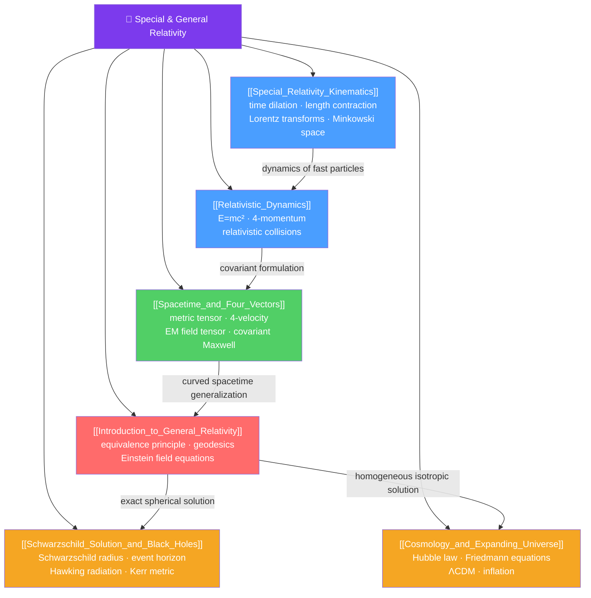

# 🌌 Special and General Relativity — Map of Content

> [!abstract] What This Section Covers
> Relativity fundamentally revised our understanding of space, time, and gravity. Special relativity (Einstein, 1905) unifies space and time into a single Minkowski spacetime, making the speed of light invariant and revealing that mass and energy are equivalent ($E = mc^2$). General relativity (Einstein, 1915) extends this to gravity by equating curvature of spacetime with the presence of mass-energy. This section spans from the intuitive paradoxes of time dilation and length contraction through four-vector formalism, the Schwarzschild solution, and the expanding universe — from A-level to frontier cosmology.

## Concept Map

## Learning Path
1. [[Special_Relativity_Kinematics]] — Postulates, time dilation, length contraction, Lorentz transformations, twin paradox, Minkowski spacetime.
2. [[Relativistic_Dynamics]] — Relativistic momentum, $E = \gamma mc^2$, rest energy, 4-momentum, invariant mass.
3. [[Spacetime_and_Four_Vectors]] — Covariant formalism: metric tensor, 4-vectors, electromagnetic field tensor, Maxwell's equations in covariant form.
4. [[Introduction_to_General_Relativity]] — Equivalence principle, curved spacetime, geodesics, Einstein field equations, weak-field limit.
5. [[Schwarzschild_Solution_and_Black_Holes]] — Schwarzschild metric, event horizons, Hawking radiation, Kerr metric, gravitational waves.
6. [[Cosmology_and_Expanding_Universe]] — Hubble's law, Friedmann equations, FLRW metric, CMB, dark energy, inflation.

## All Notes at a Glance
| Note | Difficulty | What You'll Learn |
|------|------------|-------------------|
| [[Special_Relativity_Kinematics]] | Secondary → PhD | Postulates, Lorentz factor, time dilation, length contraction, relativity of simultaneity, twin paradox, spacetime interval, muon lifetime test |
| [[Relativistic_Dynamics]] | Secondary → PhD | Relativistic energy and momentum, $E = mc^2$, massless particles, 4-momentum, threshold energies, covariant electrodynamics |
| [[Spacetime_and_Four_Vectors]] | Undergraduate → PhD | Minkowski metric, 4-vectors, invariants, electromagnetic field tensor $F^{\mu\nu}$, stress-energy tensor $T^{\mu\nu}$ |
| [[Introduction_to_General_Relativity]] | Undergraduate → PhD | Equivalence principle, geodesics, Christoffel symbols, Riemann tensor, Einstein equations $G_{\mu\nu} = 8\pi G T_{\mu\nu}/c^4$ |
| [[Schwarzschild_Solution_and_Black_Holes]] | Undergraduate → PhD | Schwarzschild metric, event horizon, Hawking radiation, Bekenstein entropy, Penrose diagrams, gravitational waves (LIGO) |
| [[Cosmology_and_Expanding_Universe]] | Undergraduate → PhD | Hubble law, Friedmann equations, $\Lambda$CDM, CMB, inflation, structure formation |

## Key Questions This Section Answers
- Why does time pass more slowly for fast-moving clocks, and how do we know this experimentally?
- What does $E = mc^2$ mean, and can we convert mass completely to energy?
- What is a 4-vector, and why is the spacetime interval invariant?
- Why does gravity curve spacetime rather than being a force?
- What happens at the event horizon of a black hole?
- Why is the universe expanding, and what is dark energy?

## Related Sections
- [[_MOC_Physics_Master|↑ Physics Master MOC]]
- [[_MOC_Quantum_Mechanics|← Quantum Mechanics]]
- [[_MOC_Nuclear_Particle_Physics|→ Nuclear and Particle Physics]]
- [[_MOC_Condensed_Matter|→ Condensed Matter and Advanced]]

#MOC #physics #special-relativity #general-relativity #spacetime #cosmology
