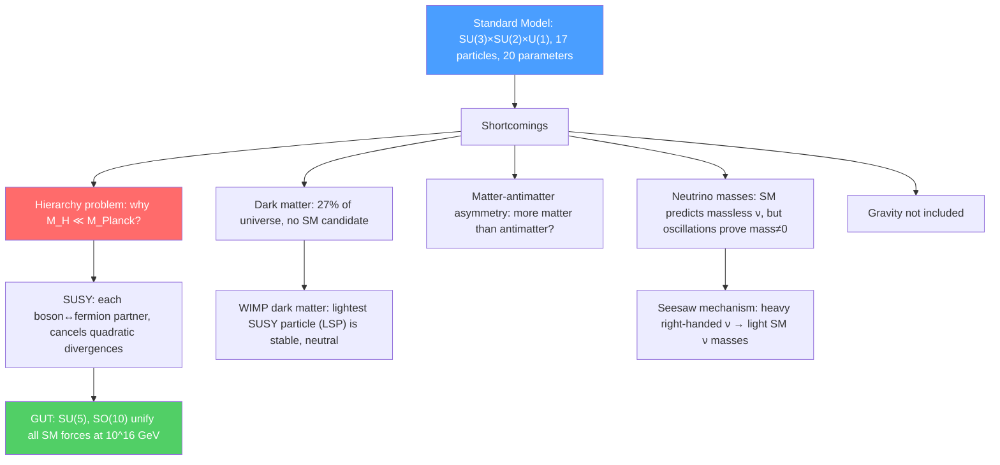

# 🔭 Beyond the Standard Model

> [!abstract] TL;DR
> Despite extraordinary success, the Standard Model cannot explain dark matter, the matter-antimatter asymmetry, neutrino masses, or why gravity is $10^{32}$ times weaker than the weak force (the hierarchy problem). Leading extensions include supersymmetry (SUSY), grand unified theories (GUTs), extra dimensions, and the minimal seesaw mechanism for neutrino masses. No BSM particles have been discovered at the LHC, pushing theoretical models to consider increasingly heavy new physics — but the confirmed discovery of neutrino oscillations proves the SM is incomplete.

## Intuition — analogy FIRST

The Standard Model is like Newton's laws of motion: extraordinarily successful for everything it was designed to explain, but it leaves deeper questions unanswered. Newton's laws did not explain why gravity has the strength it does, or predict the perihelion precession of Mercury — those required Einstein. Similarly, the SM does not explain its own parameters (why is the electron mass $0.511$ MeV/$c^2$ and not $10^{19}$ GeV/$c^2$?), does not include gravity, and does not account for $96\%$ of the universe's energy content (dark matter + dark energy).

BSM physics is the search for the "Einstein" — a deeper theory that explains what the SM takes as input.

---

## How It Works

---

## Key Concepts / Details

### Hierarchy Problem

The Higgs boson mass receives quantum corrections from every particle it couples to:
$$m_H^2 = m_{H,bare}^2 + \delta m_H^2, \qquad \delta m_H^2 \sim \frac{g^2}{16\pi^2}\Lambda^2$$

where $\Lambda$ is the UV cutoff (Planck scale $\sim 10^{19}$ GeV). The physical Higgs mass $m_H = 125$ GeV requires a cancellation to 1 part in $10^{32}$ between the bare mass and loop corrections — extreme fine-tuning. This "naturalness" problem motivates new physics at the TeV scale to cancel the divergences.

### Supersymmetry (SUSY)

SUSY posits a symmetry between bosons and fermions: every SM particle has a "superpartner" differing in spin by 1/2:

| SM particle | Superpartner | Symbol |
|------------|-------------|--------|
| Quark $q$ (spin-1/2) | Squark $\tilde{q}$ (spin-0) | $\tilde{u}, \tilde{d}, \ldots$ |
| Lepton $l$ (spin-1/2) | Slepton $\tilde{l}$ (spin-0) | $\tilde{e}, \tilde\mu, \ldots$ |
| Gluon $g$ (spin-1) | Gluino $\tilde{g}$ (spin-1/2) | $\tilde{g}$ |
| Wino $W$ (spin-1) | Wino $\tilde{W}$ (spin-1/2) | $\tilde{W}$ |
| Higgs $H$ (spin-0) | Higgsino $\tilde{H}$ (spin-1/2) | $\tilde{H}$ |

SUSY solves the hierarchy problem: fermion and boson loop contributions to $m_H^2$ cancel exactly if $m_{sparticle} = m_{particle}$. Since no sparticles have been found at $m = m_{SM}$, SUSY must be broken; sparticle masses pushed above $\sim 1$ TeV by LHC non-observation.

**SUSY algebra:** The supercharge $Q_\alpha$ (a spinor) satisfies:
$$\{Q_\alpha, \bar Q_{\dot\beta}\} = 2\sigma^\mu_{\alpha\dot\beta}P_\mu$$

This is an extension of the Poincaré algebra. Coleman-Mandula theorem (1967) forbids mixing internal and spacetime symmetries with commutators — SUSY evades this via anticommutators.

**Lightest supersymmetric particle (LSP):** If R-parity is conserved ($R = (-1)^{3B+L+2S}$, even for SM, odd for sparticles), the LSP is stable. The neutralino $\tilde\chi^0_1$ (mixture of $\tilde{B}$, $\tilde{W}^3$, $\tilde{H}^0$) is a natural WIMP dark matter candidate: massive ($\sim 100$ GeV), neutral, weakly interacting.

### Neutrino Masses and Oscillations

The SM originally predicted massless neutrinos. Neutrino oscillations (SuperKamiokande 1998, SNO 2001) prove that the three neutrino mass eigenstates $\nu_1, \nu_2, \nu_3$ differ from the flavor eigenstates $\nu_e, \nu_\mu, \nu_\tau$, related by the PMNS matrix:
$$\begin{pmatrix}\nu_e\\\nu_\mu\\\nu_\tau\end{pmatrix} = U_{PMNS}\begin{pmatrix}\nu_1\\\nu_2\\\nu_3\end{pmatrix}$$

The oscillation probability (two-flavor approximation):
$$P(\nu_\alpha \to \nu_\beta) = \sin^2(2\theta)\sin^2\!\left(\frac{\Delta m^2 L}{4E}\right)$$

where $\Delta m^2 = m_2^2 - m_1^2$, $L$ is baseline, $E$ is neutrino energy. Current knowledge: $\Delta m^2_{21} \approx 7.5\times10^{-5}$ eV², $\Delta m^2_{31} \approx 2.5\times10^{-3}$ eV², $\theta_{12} \approx 34°$, $\theta_{23} \approx 45°$, $\theta_{13} \approx 8.6°$. Absolute mass scale unknown; current bound $m_i < 0.12$ eV ($\sum m_i < 0.12$ eV from cosmology).

**Seesaw mechanism:** Add a right-handed neutrino $N_R$ (gauge-singlet) with a Majorana mass $M_R \gg v = 246$ GeV. The $2\times2$ mass matrix:
$$\mathcal{M} = \begin{pmatrix}0 & m_D \\ m_D & M_R\end{pmatrix}$$

has eigenvalues $m_\nu \approx m_D^2/M_R \ll m_D$ and $M_R \gg m_D$. The light neutrino mass is naturally suppressed by the large Majorana scale — "seesaw." For $m_D \sim m_{electron} \sim 0.5$ MeV and $M_R \sim 10^{10}$ GeV, one gets $m_\nu \sim 0.025$ eV — consistent with data.

### Grand Unified Theories (GUTs)

**Minimal SU(5) (Georgi-Glashow, 1974):** Embeds SM gauge group $\text{SU}(3)\times\text{SU}(2)\times\text{U}(1)$ in $\text{SU}(5)$. Quarks and leptons in the same multiplets: $\bar{5} = (\bar d, \nu_e, e^-)$ and $10 = (q, u^c, e^c)$. Predicts proton decay $p \to e^+ + \pi^0$ with $\tau_p \sim M_{GUT}^4/(m_p^5 \alpha_{GUT}^2) \sim 10^{30}$ years. Excluded by SuperKamiokande ($\tau_p > 1.6\times10^{34}$ yr for $p\to e^+\pi^0$).

**SO(10):** Larger group containing SU(5) + right-handed neutrino. All SM fermions of one generation (including $\nu_R$) fit into a single 16-dimensional representation. Predicts neutrino masses via seesaw; accommodates CP violation in leptogenesis (baryon asymmetry from lepton number violation).

### Dark Matter Candidates

| Candidate | Mass Range | Mechanism | Status |
|-----------|-----------|-----------|--------|
| WIMP (neutralino, Kaluza-Klein) | $\sim 10$–$10^4$ GeV | Freeze-out from thermal bath | No direct detection yet |
| Axion | $\sim 10^{-6}$–$10^{-3}$ eV | PQ symmetry breaking | ADMX experiments searching |
| Sterile neutrino | $\sim 1$–$100$ keV | Mixing with SM neutrinos | X-ray line constraints |
| Primordial black holes | $\sim 10^{15}$–$10^{33}$ g | Inflationary density perturbations | Constrained by microlensing |

### Strong CP Problem

QCD allows a CP-violating term $\theta\,\tilde{G}G/32\pi^2$ in the Lagrangian. The neutron electric dipole moment (nEDM) would be $d_n \sim 10^{-16}\theta$ e·cm. Experimental bound: $d_n < 1.8\times10^{-26}$ e·cm implies $\theta < 10^{-10}$. Why is $\theta$ so small? Peccei-Quinn symmetry (1977) proposes a new $\text{U}(1)_{PQ}$ that dynamically relaxes $\theta \to 0$, predicting the axion — a light pseudo-scalar boson.

### Extra Dimensions

**Large extra dimensions (ADD):** Gravity propagates in $4+n$ large dimensions of size $R$; SM particles confined to a 3-brane. Dilution of gravity in extra dimensions explains $M_{Planck} \gg M_{EW}$:
$$M_{Planck}^2 \sim M_*^{n+2}R^n$$

For $n=2$, $R \sim 0.1$ mm (testable in tabletop gravity experiments).

**Warped extra dimensions (RS):** Single extra dimension with exponential warp factor; the hierarchy problem solved by geometry. Predicts Kaluza-Klein graviton resonances at TeV scale — searched for at LHC.

---

## Real-World Notes

- **LHC BSM searches:** After Run 3 (13.6 TeV), no sparticles, no $Z'$, no microscopic black holes. Squarks and gluinos excluded below $\sim 1.5$–$2$ TeV; neutralinos below $\sim 600$ GeV in simplified models.
- **Direct dark matter detection:** LUX-ZEPLIN (LZ), PandaX-4T, and XENONnT use liquid xenon TPCs to search for WIMP scatters. Sensitivity approaching $\sigma_{SI} \sim 10^{-48}$ cm² — 5 orders of magnitude below early WIMP predictions.
- **Neutrino mass ordering:** Normal hierarchy ($m_1 < m_2 < m_3$) or inverted hierarchy ($m_3 < m_1 < m_2$)? DUNE (Deep Underground Neutrino Experiment) and Hyper-K will determine this by measuring $\delta_{CP}$ (CP violation in leptons).
- **Gravitational wave BSM:** Phase transitions in the early universe (e.g., electroweak or QCD) produce a stochastic gravitational wave background; detectable by LISA (2030s).

---

## Common Pitfalls

- **SUSY is not ruled out by LHC.** SUSY covers an enormous parameter space; current LHC exclusions cover simplified models. "Natural" SUSY (stops $\lesssim 1$ TeV) is heavily constrained but not fully excluded.
- **Dark matter does not need to be a particle.** Primordial black holes, fuzzy dark matter (ultra-light axions), and self-interacting dark matter are all viable and have different observational signatures.
- **Neutrino oscillations prove $\Delta m^2 \neq 0$, not absolute masses.** We know mass splittings but not the lightest neutrino mass ($m_1$ or $m_3$). Tritium beta decay endpoint (KATRIN) and cosmology both provide upper bounds.
- **GUTs do not include gravity.** GUTs unify strong, weak, and electromagnetic forces at $10^{16}$ GeV. Quantum gravity (string theory, loop quantum gravity) is needed at $10^{19}$ GeV.

---

## Related Concepts
- [[Standard_Model_Overview]] — The SM as the target to be extended
- [[Fundamental_Forces_and_Feynman_Diagrams]] — Running coupling unification motivates GUTs; renormalization group is the key tool
- [[Cosmology_and_Expanding_Universe]] — Dark matter and dark energy as cosmological evidence for BSM
- [[Intro_to_Quantum_Field_Theory]] — SUSY algebra, superfields, and supersymmetric Lagrangians
- [[_MOC_Nuclear_Particle_Physics|↑ Section MOC]]

---

## Review Questions

1. **(Graduate)** Explain the hierarchy problem. Why does SUSY solve it? What specific contributions to $\delta m_H^2$ are canceled by SUSY, and what breaks the cancellation in the MSSM?
2. **(Graduate)** A reactor experiment observes $\bar\nu_e$ disappearance at baseline $L = 2$ km with $E_\nu \approx 3$ MeV. Given $\Delta m^2_{31} \approx 2.5\times10^{-3}$ eV² and $\theta_{13} \approx 8.6°$, calculate the oscillation probability $P(\bar\nu_e \to \bar\nu_e)$ at the first minimum.
3. **(Graduate)** In minimal $\text{SU}(5)$ GUT, the proton can decay via $p \to e^+ + \pi^0$ mediated by an $X$ boson of mass $M_X \sim M_{GUT}$. Estimate the proton lifetime and compare to experimental bounds. What does the experimental limit imply for $M_X$?

---

## Sources
- Peskin & Schroeder, *An Introduction to Quantum Field Theory*, Ch. 20–21 (spontaneous symmetry breaking, gauge theories)
- Martin, "A Supersymmetry Primer," *Adv. Ser. Direct. High Energy Phys.* 21, 1 (2010) — comprehensive SUSY review (arXiv:hep-ph/9709356)
- Gonzalez-Garcia & Nir, "Neutrino Masses and Mixing: Evidence and Implications," *Rev. Mod. Phys.* 75, 345 (2003)
- Raby, "Grand Unified Theories," *PDG Review* (2020)
- Bertone, Hooper & Silk, "Particle Dark Matter: Evidence, Candidates and Constraints," *Phys. Rep.* 405, 279 (2005)

#physics #particle-physics #beyond-standard-model #SUSY #dark-matter #neutrino-oscillations #GUT #hierarchy-problem #seesaw-mechanism
