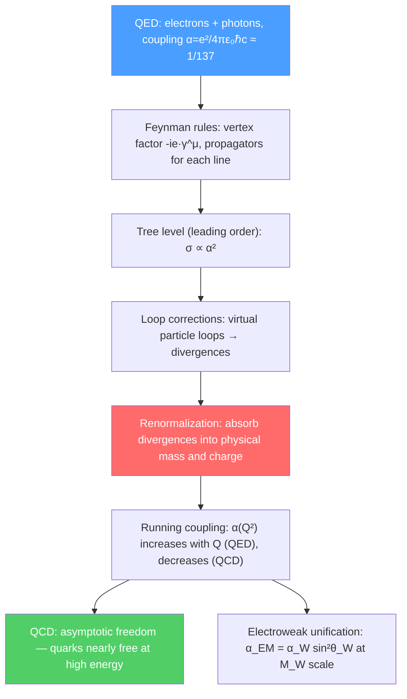

# 📊 Fundamental Forces and Feynman Diagrams

> [!abstract] TL;DR
> Quantum electrodynamics (QED) is the quantum field theory of the electromagnetic force — the most precisely tested theory in physics. Feynman diagrams are pictorial representations of perturbation theory terms: each diagram corresponds to an amplitude, each amplitude to an observable cross-section or decay rate. At PhD level, the renormalization group explains how coupling constants run with energy: QCD has asymptotic freedom (weak coupling at high energy, strong at low), while QED becomes stronger at high energy — ultimately unified with the weak force into the electroweak theory.

## Intuition — analogy FIRST

When two electrons repel each other, they do not reach out and push. Instead, they throw photons at each other — the electromagnetic "force" is a constant exchange of virtual photons. Feynman's diagrammatic language makes this literal: draw the electrons as lines, the exchanged photon as a wiggly line between them. The more complicated the diagram (more vertices = higher order in perturbation theory), the smaller its contribution by a factor of $\alpha \approx 1/137$ per vertex.

The remarkable thing is that this simple picture, worked out systematically, gives predictions like the anomalous magnetic moment of the electron $a_e = (g-2)/2$ to 12 significant figures — the most precisely tested prediction in all of science.

---

## How It Works

---

## Key Concepts / Details

### Undergraduate Level

**QED Feynman rules:** For each element of a diagram, assign a mathematical factor:

| Element | Factor |
|---------|--------|
| External fermion (in) | $u(p)$ or $v(p)$ spinor |
| External photon | Polarization vector $\epsilon_\mu$ |
| Fermion propagator | $i(\slashed{p}+m)/(p^2-m^2+i\epsilon)$ |
| Photon propagator | $-i\eta^{\mu\nu}/(k^2+i\epsilon)$ (Feynman gauge) |
| QED vertex | $-ie\gamma^\mu$ |
| Loop integral | $\int d^4k/(2\pi)^4$ over undetermined momentum |

The amplitude $\mathcal{M}$ for a process is the sum of all Feynman diagrams; the cross-section is proportional to $|\mathcal{M}|^2$.

**Key QED processes:**

- **Möller scattering** ($e^-e^- \to e^-e^-$): $t$- and $u$-channel photon exchange
- **Compton scattering** ($e^-\gamma \to e^-\gamma$): $s$- and $u$-channel diagrams; Klein-Nishina formula
- **Pair production** ($\gamma\gamma \to e^+e^-$): CP-conjugate of Compton; threshold $E_\gamma > m_e c^2$
- **Bhabha scattering** ($e^+e^- \to e^+e^-$): $t$-channel exchange + $s$-channel annihilation

**QED precision:** The electron magnetic moment $g_e/2 = 1 + a_e$ where:
$$a_e = \frac{\alpha}{2\pi} - 0.328\frac{\alpha^2}{\pi^2} + 1.181\frac{\alpha^3}{\pi^3} - \ldots \approx 0.001159652\ldots$$

Measured: $a_e^{exp} = 0.00115965218059(13)$. Theory matches to 12 decimal places — the greatest agreement between theory and experiment in science.

**QCD Feynman rules:** Similar to QED but:
- Quark-gluon vertex: $-ig_s\gamma^\mu t^a_{ij}$ (color matrices $t^a = \lambda^a/2$)
- 3-gluon vertex: $g_s f^{abc}$ (structure constants of SU(3))
- 4-gluon vertex: $g_s^2 f^{abc}f^{ade}$
- Color sums required

The 3- and 4-gluon self-interaction vertices have no analog in QED and are responsible for asymptotic freedom.

**Renormalization concept:** Loop diagrams contain integrals over virtual momenta $k$ from 0 to $\infty$ that diverge logarithmically or quartically. Renormalization absorbs these divergences into redefined ("physical") parameters:
$$e_0 = Z_e e_R, \quad m_0 = Z_m m_R, \quad \psi_0 = Z_\psi^{1/2}\psi_R$$

The observable predictions are finite and $Z$-independent. QED is renormalizable; quantum gravity is not (divergences require infinitely many counterterms).

**Running coupling:** The renormalized coupling depends on the renormalization scale $\mu$ (the energy at which it is defined). The beta function:
$$\beta(g) = \mu\frac{dg}{d\mu}$$

determines how $g$ runs with energy scale.

### Graduate Level

**QED beta function:**
$$\beta_{QED}(\alpha) = \frac{2\alpha^2}{3\pi} + O(\alpha^3) > 0$$

$\alpha$ increases with energy ($\alpha(M_Z) \approx 1/128$ vs $\alpha(0) \approx 1/137$). QED is an "infrared-free" theory — the Landau pole at $\sim 10^{286}$ eV is safely beyond any physical energy scale.

**QCD beta function (asymptotic freedom):**
$$\beta_{QCD}(g_s) = -\frac{g_s^3}{16\pi^2}\left(\frac{11}{3}C_A - \frac{4}{3}T_F n_f\right)$$

where $C_A = 3$ (adjoint color factor), $T_F = 1/2$, $n_f$ = number of active quark flavors. For $n_f \leq 16$, the coefficient is negative: $g_s$ decreases at higher energies. At $Q \sim 100$ GeV, $\alpha_s \approx 0.12$; at $Q \sim 1$ GeV, $\alpha_s \approx 0.5$ (perturbation theory breaks down — confinement region). Discovered by Politzer, Gross, and Wilczek (Nobel 2004).

**Electroweak unification (Glashow-Weinberg-Salam model):** At $Q \sim M_W$, the weak coupling $\alpha_W \approx \alpha_{EM}/\sin^2\theta_W \approx 1/30$ and the electromagnetic coupling $\alpha_{EM} \approx 1/128$ nearly meet — a signature of unification. The running couplings $\alpha_1$ (hypercharge), $\alpha_2$ (weak isospin), $\alpha_3$ (strong) are computed via:
$$\frac{1}{\alpha_i(\mu)} = \frac{1}{\alpha_i(\mu_0)} - \frac{b_i}{2\pi}\ln\frac{\mu}{\mu_0}$$

In the SM, the three couplings do NOT quite meet at a single point. Supersymmetry adjusts the $b_i$ coefficients to achieve precise unification at $M_{GUT} \sim 10^{16}$ GeV.

**Optical theorem and unitarity:** The imaginary part of the forward scattering amplitude equals the total cross-section:
$$\text{Im}\,\mathcal{M}(k \to k) = 2E_{cm}|\vec{p}_{cm}|\sigma_{tot}$$

This unitarity constraint is violated by tree-level amplitudes at high energy (e.g., $W_LW_L$ scattering grows as $E^2/M_W^2$). The Higgs boson is required to restore unitarity in longitudinal $WW$ scattering above the TeV scale — a theoretical argument for the Higgs boson before its experimental discovery.

**Dimensional regularization:** Loop integrals are regulated by working in $d = 4 - 2\epsilon$ dimensions. Divergences appear as poles $1/\epsilon$; the $\overline{\text{MS}}$ scheme subtracts $1/\epsilon + \ln(4\pi) - \gamma_E$. This preserves gauge invariance (unlike cutoff regularization) and is standard in modern perturbative QFT.

---

## Real-World Notes

- **Precision tests of QED:** Measurement of $a_e$ using single-electron quantum cyclotron (Hanneke et al. 2008) provides the most precise determination of $\alpha = 1/137.035999084(21)$ — a 0.7 ppb measurement.
- **LHC QCD tests:** PDF (parton distribution function) measurements at HERA (DESY) + QCD perturbation theory predict LHC cross-sections for Higgs, $W/Z$, top quark production at $1$–$5\%$ level. Agreement confirms QCD.
- **Jet physics:** Quarks and gluons produced at LHC fragment into "jets" of hadrons. Jet cross-sections are computed in perturbative QCD (NLO, NNLO) and test asymptotic freedom.
- **Lattice QCD:** Non-perturbative QCD solved numerically on a spacetime lattice. Predicts hadron masses, proton structure, quark masses from first principles — the only tool for low-energy QCD (confinement regime).

---

## Common Pitfalls

- **Feynman diagrams are not physical particle trajectories.** They are terms in a perturbation expansion. Virtual particles are off-shell ($p^2 \neq m^2$) mathematical objects, not "real" particles that travel between vertices.
- **Renormalization does not mean "sweeping infinities under the rug."** It is a systematic procedure: infinities in bare parameters are canceled by counter-terms; physical observables are finite and unambiguous.
- **Asymptotic freedom does not mean quarks are free at all high energies.** The coupling runs as $\alpha_s(Q^2) \sim 1/\ln(Q^2/\Lambda_{QCD}^2)$ — logarithmically weak at large $Q$, but the total QCD force (integrated over the string) still confines at large distances.
- **The Landau pole in QED is not a physical problem.** It occurs at $\sim 10^{286}$ eV, far above any conceivable energy. In any Grand Unified Theory, QED is embedded in a larger gauge group and has no Landau pole.

---

## Related Concepts
- [[Standard_Model_Overview]] — Feynman rules are derived from the SM Lagrangian
- [[Beyond_Standard_Model]] — Running couplings and GUT unification; SUSY alters beta functions
- [[Intro_to_Quantum_Field_Theory]] — Canonical quantization and path integral formalism underlying Feynman rules
- [[Relativistic_Dynamics]] — Mandelstam variables $s,t,u$ are the natural kinematic variables for Feynman amplitudes
- [[_MOC_Nuclear_Particle_Physics|↑ Section MOC]]

---

## Review Questions

1. **(Undergraduate)** Draw all Feynman diagrams at leading order (tree level) for Compton scattering $e^-\gamma \to e^-\gamma$. Write the amplitude using Feynman rules and identify which channel ($s$, $t$, or $u$) each diagram represents.
2. **(Graduate)** Derive the one-loop QED beta function starting from the photon self-energy (vacuum polarization). Show that the renormalized coupling $\alpha(\mu^2) = \alpha(\mu_0^2)[1 + (\alpha/3\pi)\ln(\mu^2/\mu_0^2)]^{-1}$ increases with $\mu$.
3. **(Graduate)** Explain why the three SM gauge couplings do not exactly unify, while MSSM (minimal supersymmetric SM) couplings do unify at $M_{GUT} \approx 2\times10^{16}$ GeV. What physical particles do supersymmetry add that change the beta function coefficients?

---

## Sources
- Griffiths, *Introduction to Elementary Particles*, Ch. 6–9 (Feynman diagrams, QED, QCD)
- Peskin & Schroeder, *An Introduction to Quantum Field Theory*, Ch. 4–9, 15–18 (Feynman rules, renormalization, gauge theories)
- Politzer, "Reliable Perturbative Results for Strong Interactions?" *Phys. Rev. Lett.* 30, 1346 (1973) (asymptotic freedom)
- Hanneke, Fogwell & Gabrielse, "New Measurement of the Electron Magnetic Moment," *Phys. Rev. Lett.* 100, 120801 (2008)
- Weinberg, "A Model of Leptons," *Phys. Rev. Lett.* 19, 1264 (1967) (electroweak unification)

#physics #particle-physics #QED #QCD #Feynman-diagrams #renormalization #asymptotic-freedom #electroweak-unification
