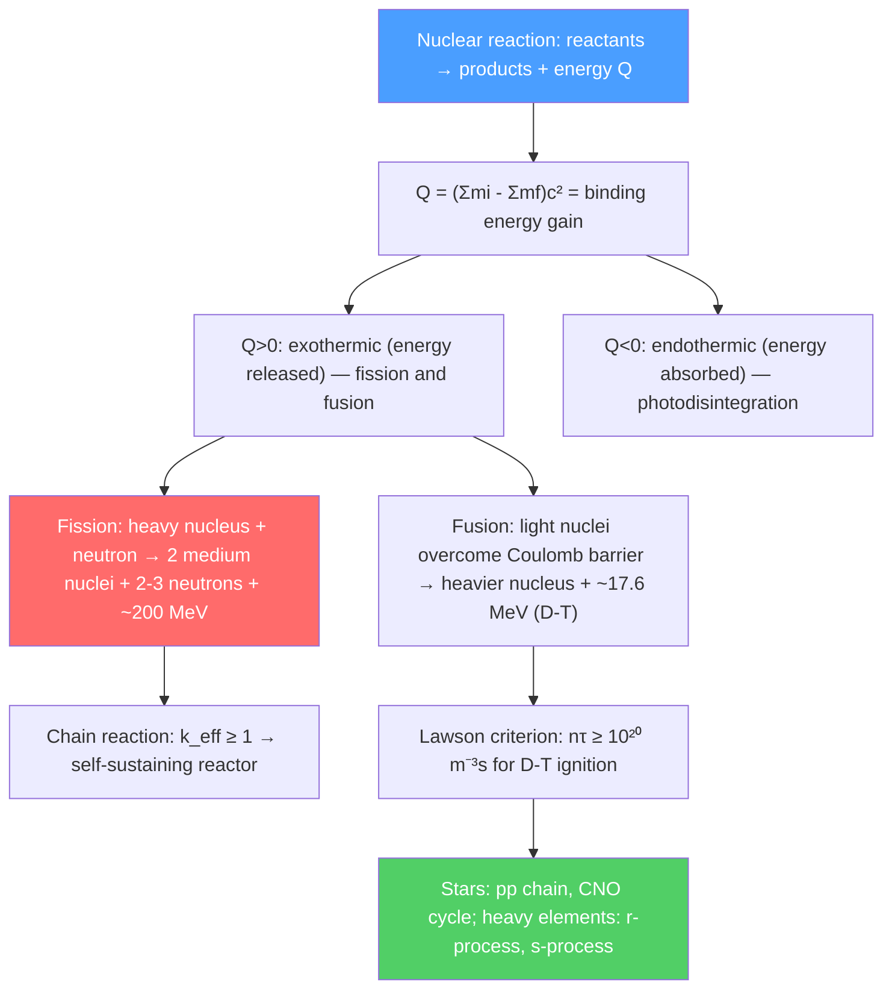

# ⚡ Nuclear Reactions, Fission, and Fusion

> [!abstract] TL;DR
> Nuclear reactions release (or absorb) energy equal to the mass difference $Q = (\sum m_i - \sum m_f)c^2$. Fission of heavy nuclei ($^{235}$U, $^{239}$Pu) releases $\sim 200$ MeV per event; fusion of light nuclei ($D$-$T$) releases $\sim 17.6$ MeV with much less radioactive waste. Both exploit the binding-energy curve peak at $^{56}$Fe. Stars power themselves by fusion (pp chain, CNO cycle); the heaviest elements are forged in neutron star mergers (r-process). The Lawson criterion specifies conditions for a sustained fusion plasma.

## Intuition — analogy FIRST

Think of binding energy per nucleon as the "height" of nucleons on an energy hill. Iron-56 sits at the bottom — the most stable state. Uranium is perched high on the heavy-nucleus slope; deuterium and tritium are high on the light-nucleus slope. Fission is like rolling a boulder (uranium) down the hill — it splits and the pieces fall to a lower energy, releasing the difference. Fusion is like pushing two pebbles (hydrogen isotopes) together over the Coulomb "bump" at the top — once they're past the barrier and slide down together, they release even more energy per kilogram.

The Sun fuses 620 million tons of hydrogen into helium every second. The energy released is what keeps it shining — and what makes nuclear power the most energy-dense source available to humanity.

---

## How It Works

---

## Key Concepts / Details

### Secondary Level

**Q-value:** The energy released in a nuclear reaction $a + b \to c + d$:
$$Q = (m_a + m_b - m_c - m_d)c^2$$

If $Q > 0$: exothermic (energy released as kinetic energy of products). If $Q < 0$: endothermic (threshold energy required).

**Fission (splitting):** A heavy nucleus ($A > 200$) splits into two smaller fragments plus neutrons. For $^{235}$U:
$$^{235}_{92}\text{U} + n \to ^{141}_{56}\text{Ba} + ^{92}_{36}\text{Kr} + 3n + \sim 200\text{ MeV}$$

The 3 neutrons can trigger more fissions — chain reaction. Critical mass: the minimum mass where enough neutrons are retained to sustain the chain.

**Fusion:** Light nuclei combine. The most promising reaction (D-T):
$$^2_1\text{H} + ^3_1\text{H} \to ^4_2\text{He} + n + 17.6\text{ MeV}$$

Energy per kilogram: fusion of D-T releases $3.5\times10^{14}$ J/kg — about $10\times$ more than uranium fission and $10^7\times$ more than gasoline.

**Binding energy per nucleon curve:** $B/A$ peaks at $^{56}$Fe ($\approx 8.8$ MeV/nucleon). Fission of $^{235}$U ($B/A \approx 7.6$ MeV/nucleon) releases $\sim (8.5 - 7.6) = 0.9$ MeV/nucleon $\approx 200$ MeV total. Fusion of D+T (average $\approx 2$ MeV/nucleon) to $^4$He ($7.1$ MeV/nucleon) releases $\sim 5$ MeV/nucleon $\approx 17.6$ MeV total.

### Undergraduate Level

**Nuclear cross-sections:** The probability of a reaction is quantified by cross-section $\sigma$ (units: barns, 1 b $= 10^{-28}$ m²). The thermal neutron fission cross-section of $^{235}$U is $\sigma_f \approx 584$ b — enormous compared to nuclear geometric area $\sim 1$ b.

**Neutron moderation:** Fast fission neutrons ($\sim 2$ MeV) have low cross-section for $^{235}$U fission. Moderators (water, heavy water, graphite) slow them to thermal energies ($\sim 0.025$ eV) where $\sigma_f$ is much higher.

**Reactor physics — multiplication factor:** In a chain reaction:
$$k_{eff} = \frac{\text{neutrons in generation }n+1}{\text{neutrons in generation }n}$$

$k_{eff} < 1$: subcritical (reactor shuts down). $k_{eff} = 1$: critical (steady state). $k_{eff} > 1$: supercritical (power increasing). Control rods (B, Cd, Hf — high neutron absorption) adjust $k_{eff}$.

**Reaction rate and Gamow peak:** For thermonuclear fusion, the rate is:
$$R = n_1 n_2 \langle\sigma v\rangle$$

The thermally-averaged cross-section $\langle\sigma v\rangle$ is dominated by the Gamow window — where the Maxwell-Boltzmann tail meets the tunneling probability. At $T \sim 10^7$ K (solar core), the Gamow peak for pp chain is $\sim 6$ keV, far above the thermal average but classically forbidden.

**The D-T fusion reaction:**
$$^2_1\text{H} + ^3_1\text{H} \to ^4_2\text{He}(3.5\text{ MeV}) + n(14.1\text{ MeV})$$

Largest cross-section among fusion reactions ($\sigma_{max} \approx 5$ b at $E_{cm} \approx 65$ keV). The $^3$He must be bred from $^6$Li: $n + ^6_3\text{Li} \to ^4_2\text{He} + ^3_1\text{H}$.

**Lawson criterion:** For a fusion plasma to produce more energy than needed to heat it:
$$n\tau_E \geq \frac{12k_BT}{\langle\sigma v\rangle E_{fusion}} \approx 10^{20}\,\text{m}^{-3}\text{s} \quad (T \approx 10 \text{ keV, D-T})$$

where $n$ is plasma density and $\tau_E$ is energy confinement time. ITER aims to achieve $Q = P_{fusion}/P_{input} = 10$ (scientific gain).

### Graduate Level

**Stellar nucleosynthesis:** 

**pp chain (dominates in stars $M < 1.5 M_\odot$, $T < 1.8\times10^7$ K):**
$$\text{Net: } 4\,^1\text{H} \to ^4\text{He} + 2e^+ + 2\nu_e + 26.7\text{ MeV}$$
Sequence: $p + p \to ^2\text{H} + e^+ + \nu_e$; $^2\text{H} + p \to ^3\text{He} + \gamma$; then pp-I: $^3\text{He} + ^3\text{He} \to ^4\text{He} + 2p$ (or pp-II, pp-III branches).

**CNO cycle (dominates for $M > 1.5 M_\odot$, $T > 1.8\times10^7$ K):** Carbon, nitrogen, oxygen act as catalysts:
$$^{12}\text{C} + p \to ^{13}\text{N} + \gamma \to ^{13}\text{C} + e^+ + \nu_e \to \ldots \to ^{12}\text{C} + ^4\text{He}$$
Net same as pp chain but $T^{17}$ temperature dependence vs $T^4$ for pp chain — CNO dominates in hot, massive stars.

**Silicon burning and iron catastrophe:** Successive fusion stages (H, He, C, Ne, O, Si burning) produce ever heavier elements up to $^{56}$Ni ($\to ^{56}$Fe). At iron, no more energy can be gained by fusion — the star's core collapses (Type II supernova). The explosive nucleosynthesis in the shock wave creates elements from silicon to nickel.

**r-process:** In neutron star merger environments, neutron flux is so high ($n_n \sim 10^{28}$ cm$^{-3}$) that nuclei capture neutrons faster than they can beta-decay. Nuclei are driven to the neutron drip line. When the neutron flux stops (merger aftermath), they beta-decay back to stability, populating the heavy neutron-rich elements (Ba, La, Eu, Au, Pt, Pb, U). The 2017 neutron star merger GW170817 produced a kilonova — the optical/infrared afterglow matching r-process nucleosynthesis of $\sim 0.05 M_\odot$ of gold and strontium.

**Inertial confinement fusion (ICF):** NIF (National Ignition Facility) uses 192 laser beams to implode a D-T pellet to $\sim 100\times$ liquid density and $\sim 10^8$ K. December 2022: first fusion ignition — $3.15$ MJ output from $2.05$ MJ laser input ($Q > 1$).

---

## Real-World Notes

- **Nuclear power generation:** $\sim 440$ reactors worldwide produce $\sim 10\%$ of global electricity. Pressurized water reactors (PWR) use enriched $^{235}$U ($3$–$5\%$) in light water.
- **ITER (International Thermonuclear Experimental Reactor):** Under construction in France. 35-nation project aiming for $Q = 10$; first plasma expected 2025, D-T operations $\sim 2035$.
- **Stellar neutrino detection:** Solar neutrinos from the pp chain (Borexino, Super-K) confirm stellar models at $<$1% precision. Supernova 1987A neutrinos (24 detected at Kamiokande) confirmed core collapse theory.
- **Nuclear weapons vs reactors:** Weapons use $>90\%$ enriched $^{235}$U (gun) or $^{239}$Pu (implosion); $k_{eff} \gg 1$ in microseconds. Reactors are designed with multiple negative feedback mechanisms (temperature coefficient, void coefficient) to prevent runaway.

---

## Common Pitfalls

- **Fission releases more total energy than fusion, but fusion releases more energy per unit mass.** $^{235}$U fission: $\sim 200$ MeV per fission ($\sim 8\times10^{13}$ J/kg); D-T fusion: $17.6$ MeV per reaction ($\sim 3.5\times10^{14}$ J/kg). Fusion wins per kilogram but requires extreme temperatures.
- **The Q-value is NOT the kinetic energy of just one product.** It is shared among all products in proportion to momentum conservation. For D-T fusion: $^4$He gets 3.5 MeV, neutron gets 14.1 MeV (shared 1:4 inversely with masses).
- **Critical mass depends on geometry and reflectors.** The bare sphere critical mass of $^{235}$U is $\sim 52$ kg; with a beryllium reflector, $\sim 15$ kg; in an implosion geometry, much less.
- **Fusion is not "solved" by achieving $Q > 1$ at NIF.** NIF uses laser pulses; the driver efficiency is $\sim 1\%$. Wall-plug-to-electricity efficiency requires $Q_{engineering} \gg 10$. ITER aims for plasma gain, not electricity production.

---

## Related Concepts
- [[Nuclear_Structure]] — Binding energy curve and Q-values from semi-empirical mass formula
- [[Radioactive_Decay]] — Products of fission and neutron-rich nuclei undergo radioactive decay
- [[Astrophysics_and_Cosmology]] — Stellar evolution powered by nuclear burning sequences; neutron stars
- [[Standard_Model_Overview]] — pp chain requires weak interaction ($p + p \to d + e^+ + \nu_e$)
- [[_MOC_Nuclear_Particle_Physics|↑ Section MOC]]

---

## Review Questions

1. **(Secondary)** Calculate the Q-value for the D-T fusion reaction. Given atomic masses: $m(^2H) = 2.01410$ u, $m(^3H) = 3.01605$ u, $m(^4He) = 4.00260$ u, $m_n = 1.00866$ u, 1 u $= 931.5$ MeV/$c^2$.
2. **(Undergraduate)** For a nuclear reactor, define the four-factor formula $k_\infty = \eta\epsilon pf$ and explain each factor physically. What does $k_{eff} < k_\infty$ mean for a finite reactor?
3. **(Graduate)** Explain the Gamow window concept for thermonuclear reaction rates. At the solar core temperature $T = 1.5 \times 10^7$ K, estimate the Gamow peak energy for the pp reaction (reduced mass $m_r = m_p/2$, charges $Z_1 = Z_2 = 1$). Why must quantum tunneling be invoked?

---

## Sources
- Krane, *Introductory Nuclear Physics*, Ch. 12–14 (nuclear reactions, fission, fusion)
- Lamarsh, *Introduction to Nuclear Reactor Theory* (reactor physics)
- Clayton, *Principles of Stellar Evolution and Nucleosynthesis* (stellar burning, nucleosynthesis)
- Cowley & Abramowitz, "The Lawson Criterion," *Am. J. Phys.* 54, 715 (1986)
- Abbott et al., "GW170817: Multi-messenger Observations" (r-process kilonova)

#physics #nuclear-physics #fission #fusion #Q-value #Lawson-criterion #nucleosynthesis #pp-chain #r-process
