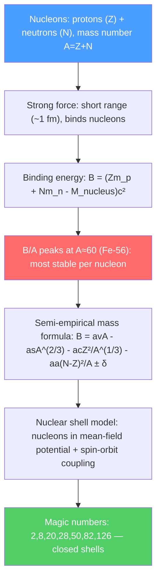

# 🔵 Nuclear Structure

> [!abstract] TL;DR
> Atomic nuclei are bound systems of protons and neutrons (nucleons) held together by the short-range strong nuclear force. The binding energy $B = (Zm_p + Nm_n - M)c^2$ quantifies nuclear stability; the semi-empirical Bethe-Weizsäcker formula captures its systematics. The nuclear shell model (with spin-orbit coupling) explains magic numbers 2, 8, 20, 28, 50, 82, 126 at which nuclei are exceptionally stable — analogous to the periodic table for electrons.

## Intuition — analogy FIRST

Think of nucleons (protons and neutrons) as marbles in a bag. The bag (strong force) tries to pull them all together; the protons also repel each other electrically. The most stable nuclei are those where these competing effects are perfectly balanced — like packing spheres as efficiently as possible. Just as certain numbers of electrons (2, 10, 18, 36 — noble gases) form especially stable electron configurations, certain numbers of nucleons (magic numbers: 2, 8, 20, 28, 50, 82, 126) form exceptionally stable nuclei.

The total "glue" holding a nucleus together — the binding energy — can be released in nuclear reactions. Splitting heavy nuclei (fission) or fusing light nuclei (fusion) both release energy, because the products are more tightly bound per nucleon than the starting materials.

---

## How It Works

---

## Key Concepts / Details

### Secondary Level

**Nuclear notation:** $^A_Z X_N$ where $A = Z + N$ is mass number, $Z$ is proton number (atomic number), $N$ is neutron number. Example: $^{235}_{92}\text{U}_{143}$.

**Strong nuclear force:** Attractive, very short range ($\sim 1$ fm = $10^{-15}$ m), approximately charge-independent (proton-proton, proton-neutron, neutron-neutron forces are similar). Much stronger than electrostatic repulsion at nuclear distances but negligible beyond $\sim 3$ fm.

**Binding energy:** The energy required to completely separate all nucleons:
$$B = \left(Zm_p + Nm_n - M_{nucleus}\right)c^2$$

Values: $B/A$ rises from $\sim 1$ MeV (deuterium) to $\sim 8.8$ MeV (iron-56), then gradually decreases for heavier nuclei. This peak explains why iron is the most stable nucleus and why both fission and fusion can release energy.

**Nuclear radius:** $R \approx R_0 A^{1/3}$ with $R_0 \approx 1.2$ fm. Nuclear density is roughly constant: $\rho_{nuc} \approx 2.3 \times 10^{17}$ kg/m³ — about $10^{14}$ times denser than water.

### Undergraduate Level

**Semi-empirical mass formula (Bethe-Weizsäcker):**
$$B(Z,A) = a_v A - a_s A^{2/3} - a_c\frac{Z^2}{A^{1/3}} - a_a\frac{(N-Z)^2}{A} \pm \delta$$

| Term | Formula | Physical Origin |
|------|---------|----------------|
| Volume | $a_v A$, $a_v \approx 15.85$ MeV | Each nucleon bonds with neighbors (constant density) |
| Surface | $-a_s A^{2/3}$, $a_s \approx 18.34$ MeV | Surface nucleons have fewer bonds |
| Coulomb | $-a_c Z^2/A^{1/3}$, $a_c \approx 0.71$ MeV | Proton-proton electrostatic repulsion |
| Asymmetry | $-a_a(N-Z)^2/A$, $a_a \approx 23.2$ MeV | Pauli exclusion: equal N,Z preferred |
| Pairing | $\pm\delta$, $\delta = 12/\sqrt{A}$ MeV | Even-even nuclei more stable |

This formula predicts nuclear masses to $\sim 1\%$ and captures gross stability trends.

**Nuclear models:** Three main approaches with different regimes:

| Model | Concept | Strength |
|-------|---------|----------|
| Liquid drop | Nucleus as incompressible nuclear fluid | Mass formula, fission |
| Shell model | Nucleons in mean-field potential | Magic numbers, spin/parity |
| Collective model | Vibrations and rotations of deformed nucleus | Heavy nuclei, rotational bands |

**Isospin:** Protons and neutrons are nearly identical under the strong force — treated as two states of a nucleon with isospin $T = 1/2$: $T_z = +1/2$ (proton), $T_z = -1/2$ (neutron). Isospin conservation is an approximate symmetry of the strong interaction.

**Nuclear deformation:** Away from magic numbers, nuclei deviate from spherical shape. Quadrupole deformation parameter $\beta$: prolate ($\beta > 0$, football shape), oblate ($\beta < 0$, disk shape). Deformed nuclei show rotational energy bands $E_J = \hbar^2 J(J+1)/2\mathcal{I}$ — measurable by gamma-ray spectroscopy.

### Graduate Level

**Nuclear shell model with spin-orbit coupling:** The single-particle states of the nuclear potential are labeled by quantum numbers $nlj$. The crucial addition over atomic physics: a strong spin-orbit term $-C\vec{l}\cdot\vec{s}$ that splits $j = l \pm 1/2$ levels. With this, the energy level ordering reproduces magic numbers 2, 8, 20, 28, 50, 82, 126.

Magic number shells (protons or neutrons separately):
- $2$: 1s$_{1/2}$
- $8$: 1s$_{1/2}$ + 1p$_{3/2}$ + 1p$_{1/2}$
- $20$: ..+ 1d$_{5/2}$ + 2s$_{1/2}$ + 1d$_{3/2}$
- $28$: ..+ 1f$_{7/2}$ (spin-orbit splits 1f: $j=7/2$ pulled down)
- $50$: ..+ 2p$_{3/2}$ + 1f$_{5/2}$ + 2p$_{1/2}$ + 1g$_{9/2}$
- $82, 126$: similar pattern of high-$j$ orbitals pulled below gap

**Nuclear density functional theory (DFT):** The nuclear analogue of electronic DFT: a self-consistent mean-field calculation using an energy density functional $E[\rho_n, \rho_p]$. Skyrme and Gogny functionals are calibrated to nuclear matter properties. DFT predicts nuclear ground-state properties (masses, radii, deformation) across the entire nuclear chart.

**Collective models:** The Interacting Boson Model (IBM) maps pairs of nucleons onto bosons, treating the nucleus as a collection of $s$ and $d$ bosons. Dynamical symmetries $U(5)$, $SU(3)$, $O(6)$ correspond to vibrational, rotational, and $\gamma$-soft nuclei respectively.

**Nuclear chart features:**
- Island of stability: predicted superheavy nuclei near $Z = 114$, $N = 184$ (doubly magic)
- Drip lines: proton and neutron drip lines bound the region of bound nuclei
- r-process path: neutron-rich nuclei far from stability, synthesized in neutron star mergers

---

## Real-World Notes

- **Nuclear medicine:** PET uses positron emitters ($^{18}$F, $T_{1/2} = 110$ min); SPECT uses gamma emitters ($^{99m}$Tc, $T_{1/2} = 6$ h). Nuclear properties (half-life, decay mode) determine clinical utility.
- **Nuclear power:** The stability curve guides fissile material choice ($^{235}$U, $^{239}$Pu — far from stability valley, release $\sim 200$ MeV per fission).
- **Superheavy elements:** Elements $Z = 113$–$118$ (nihonium through oganesson) synthesized at RIKEN (Japan), GSI (Germany), JINR (Russia). Properties consistent with shell model predictions for large $Z$.
- **Neutron stars:** Densities $\gtrsim \rho_{nuc}$; neutron star structure requires the nuclear equation of state at $2$–$3\times\rho_0$, the frontier of nuclear physics.

---

## Common Pitfalls

- **Binding energy is always positive.** $B > 0$ means the nucleus is more stable than free nucleons. A negative $B$ would mean the nucleus is unbound (doesn't exist).
- **Mass number $A \neq$ atomic mass.** $A$ is the integer nucleon count; atomic mass (in amu) differs by the binding energy: $M = Zm_p + Nm_n - B/c^2$.
- **Magic numbers for protons and neutrons are independent.** Doubly magic nuclei (magic $Z$ AND magic $N$) — like $^{208}_{82}\text{Pb}_{126}$ — are especially stable.
- **The liquid-drop model is not quantum.** It correctly captures gross trends but misses the quantum shell effects. The semi-empirical formula has $\sim 0.3\%$ rms error; shell corrections (Nilsson-Strutinsky method) improve it to $\sim 0.05\%$.

---

## Related Concepts
- [[Radioactive_Decay]] — Stability determined by nuclear structure; decay modes follow from binding energy differences
- [[Nuclear_Reactions_Fission_Fusion]] — Q-values from semi-empirical formula; fission and fusion on the B/A curve
- [[Standard_Model_Overview]] — Protons and neutrons are not fundamental: they are made of quarks
- [[Astrophysics_and_Cosmology]] — Neutron stars: nuclear matter at extreme density; r-process nucleosynthesis
- [[_MOC_Nuclear_Particle_Physics|↑ Section MOC]]

---

## Review Questions

1. **(Secondary)** Sketch the binding energy per nucleon $B/A$ as a function of mass number $A$. Mark the positions of iron, uranium, and hydrogen. Explain why both fission of $^{235}$U and fusion of deuterium release energy.
2. **(Undergraduate)** Using the semi-empirical mass formula, find the value of $Z$ that minimizes the nuclear mass for fixed $A$ (the valley of beta stability). Show that $Z_{min}(A) \approx A/(2 + 0.015 A^{2/3})$.
3. **(Graduate)** Explain qualitatively why the strong spin-orbit coupling $-C\vec{l}\cdot\vec{s}$ in the nuclear shell model produces magic number 28 (but atomic spin-orbit does not). What energy ordering does the $1f$ orbital splitting produce?

---

## Sources
- Krane, *Introductory Nuclear Physics* (standard undergraduate text)
- Bohr & Mottelson, *Nuclear Structure*, Vol. 1–2 (comprehensive classic)
- Ring & Schuck, *The Nuclear Many-Body Problem* (DFT and beyond)
- Casten, *Nuclear Structure from a Simple Perspective* (Interacting Boson Model)
- Blaum, "High-Accuracy Atomic Mass Spectrometry," *Phys. Rep.* 425, 1 (2006)

#physics #nuclear-physics #binding-energy #semi-empirical-mass-formula #shell-model #magic-numbers
