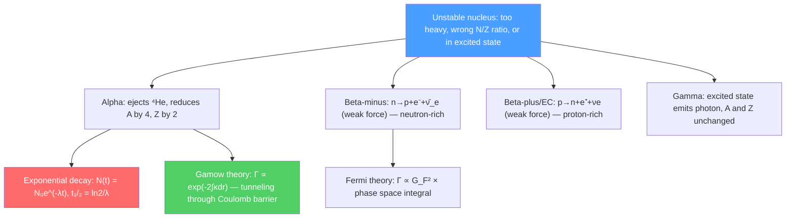

# ☢️ Radioactive Decay

> [!abstract] TL;DR
> Unstable nuclei spontaneously emit particles to reach a more stable configuration. Alpha decay emits a helium-4 nucleus; beta decay converts a neutron to a proton (or vice versa) via the weak interaction; gamma decay emits a photon from an excited nuclear state. All follow $N(t) = N_0 e^{-\lambda t}$ with half-life $t_{1/2} = \ln 2/\lambda$. At PhD level, Gamow's quantum tunneling theory explains alpha decay rates spanning 20 orders of magnitude, Fermi's theory explains beta decay, and neutrinoless double beta decay would prove neutrinos are Majorana particles.

## Intuition — analogy FIRST

Imagine a large crowd of unstable atoms as popcorn kernels in a popper. Each kernel has the same probability of popping per second — it doesn't matter how long it has been in the popper. The result is that the number of unpopped kernels decreases exponentially: half pop in the first minute, half of the remainder in the next minute, and so on. This memoryless property — the half-life is always the same, regardless of the age of the nucleus — is a pure quantum mechanical effect. Classically, things wear out; quantum mechanically, identical states are truly identical.

Alpha decay is the most dramatic: a tightly-bound helium-4 nucleus tunnels through the Coulomb barrier like a quantum ghost walking through a wall. The exponential sensitivity of tunneling to the barrier width explains why uranium-238 has a half-life of 4.5 billion years while polonium-212 has a half-life of 0.3 microseconds.

---

## How It Works

---

## Key Concepts / Details

### Secondary Level

**Three types of radiation:**

| Type | Particle | Penetration | Stopped by |
|------|---------|-------------|-----------|
| Alpha ($\alpha$) | $^4_2$He nucleus | Low ($\sim$cm in air) | Paper, skin |
| Beta ($\beta^-$) | Electron $e^-$ | Medium ($\sim$m in air) | Aluminum sheet |
| Gamma ($\gamma$) | Photon | High | Lead, thick concrete |

**Exponential decay law:**
$$N(t) = N_0\,e^{-\lambda t}$$

where $\lambda$ is the decay constant (probability of decay per unit time per nucleus). Related quantities:
- Half-life: $t_{1/2} = \frac{\ln 2}{\lambda} \approx \frac{0.693}{\lambda}$
- Mean lifetime: $\tau = 1/\lambda$
- Activity: $A = \lambda N = A_0 e^{-\lambda t}$ (decays per second; 1 Bq = 1 decay/s; 1 Ci = $3.7\times10^{10}$ Bq)

**Carbon dating:** $^{14}$C (produced by cosmic rays in the atmosphere, $t_{1/2} = 5730$ years) is incorporated into all living organisms. After death, no new $^{14}$C is absorbed, so the ratio $^{14}$C/$^{12}$C decreases exponentially. Measuring this ratio dates organic material up to $\sim 50,000$ years.

**Decay series:** Heavy nuclides like $^{238}$U undergo a chain of $\alpha$ and $\beta$ decays before reaching stable $^{206}$Pb. The series also produces radon ($^{222}$Rn, $t_{1/2} = 3.8$ days), a naturally occurring radiological hazard.

### Undergraduate Level

**Alpha decay:** Nucleus $^A_Z X \to ^{A-4}_{Z-2}Y + ^4_2$He. The $Q$-value (energy released):
$$Q_\alpha = [M(^A_Z X) - M(^{A-4}_{Z-2}Y) - M(^4_2\text{He})]c^2 > 0$$

Alpha particles are pre-formed $^4$He nuclei (tight cluster) that tunnel through the Coulomb barrier. Alpha energies range from 4–9 MeV; observed half-lives span 20 orders of magnitude.

**Gamow theory of alpha decay:** The alpha particle inside the nucleus sees potential $V < E$; outside $r > R_{nuc}$, it sees the Coulomb barrier $V(r) = 2Ze^2/4\pi\epsilon_0 r > E_\alpha$ until $r = r_c = 2Ze^2/4\pi\epsilon_0 E_\alpha$. The tunneling probability (WKB):
$$P_{tunnel} \propto \exp\!\left(-2\int_{R}^{r_c}\sqrt{\frac{2m_\alpha(V(r)-E_\alpha)}{\hbar^2}}\,dr\right) = e^{-2G}$$

Gamow factor: $G = \pi Z_d e^2/\hbar v_\alpha - 2\sqrt{2Z_d e^2 R/\hbar^2/m_\alpha}$ where $Z_d$ is the daughter charge. The Geiger-Nuttall law $\log t_{1/2} \approx a/\sqrt{E_\alpha} + b$ (empirical 1911, explained by Gamow 1928) follows directly.

**Beta-minus decay:** $n \to p + e^- + \bar\nu_e$. Weak interaction process; the electron and antineutrino share the $Q$-value, producing a continuous electron energy spectrum (explanation of this continuous spectrum — rather than discrete lines — required postulating the neutrino, Pauli 1930).

**Beta-plus decay and electron capture:**
- $\beta^+$: $p \to n + e^+ + \nu_e$ (if $Q > 2m_ec^2$)
- Electron capture (EC): $p + e^- \to n + \nu_e$ (always possible if $Q > 0$)

**Gamma decay:** A nucleus in an excited state $^A_Z X^*$ emits a photon and reaches the ground state: $^A_Z X^* \to ^A_Z X + \gamma$. Energy conservation: $E_\gamma = E^* - E_{ground} - E_{recoil}$. The Mössbauer effect (1958) eliminates recoil in crystals, enabling extremely precise energy measurements (Nobel Prize 1961).

**Selection rules for gamma decay:** Electric multipole $El$ or magnetic multipole $Ml$ radiation. The transition rate scales as $(\omega R/c)^{2l}$, strongly favoring lowest multipole. Selection rules: $|J_i - J_f| \leq l \leq J_i + J_f$ and parity change $\pi_i\pi_f = (-1)^l$ (E) or $(-1)^{l+1}$ (M).

### Graduate Level

**Fermi theory of beta decay:** The beta decay interaction Hamiltonian:
$$\hat{H}' = \frac{G_F}{\sqrt{2}}\bar\psi_p\gamma^\mu(1-g_A\gamma^5)\psi_n\,\bar\psi_e\gamma_\mu(1-\gamma^5)\psi_\nu + h.c.$$

(V-A coupling). The total decay rate from Fermi's golden rule:
$$\lambda = \frac{G_F^2}{2\pi^3\hbar^7}\,|\mathcal{M}|^2\,f(Z,Q)$$

where $f(Z,Q)$ is the Fermi integral over phase space. The $ft$ value (comparative half-life) is a universal measure of nuclear matrix element: $ft = K/|G_V\mathcal{M}_F|^2 + |G_A\mathcal{M}_{GT}|^2$ for Fermi and Gamow-Teller matrix elements.

**Parity violation in weak decay:** Lee and Yang (1956) proposed, Wu (1957) confirmed: beta decay violates parity. The emitted electron in $^{60}$Co beta decay preferentially moves antiparallel to the nuclear spin — impossible if parity were conserved. The V-A structure of the weak interaction fully explains this.

**Double beta decay and Majorana neutrinos:** Some nuclei cannot undergo single beta decay (forbidden by energy-momentum conservation) but can undergo double beta decay ($2\nu\beta\beta$): $(Z,A) \to (Z+2,A) + 2e^- + 2\bar\nu_e$. If the neutrino is its own antiparticle (Majorana), neutrinoless double beta decay ($0\nu\beta\beta$) is possible with no neutrinos emitted. Detection would prove Majorana nature and allow determination of the absolute neutrino mass scale.

**Nuclear astrophysics — r-process and s-process:**
- **s-process** (slow): neutron captures slower than beta decay, following the valley of stability. Occurs in AGB stars; produces $^{56}$Fe through $^{209}$Bi.
- **r-process** (rapid): neutron captures faster than beta decay, creating extremely neutron-rich nuclei far from stability. Requires extreme neutron flux — neutron star mergers (confirmed by GW170817 + kilonova) and possibly core-collapse supernovae. Produces gold, platinum, uranium, and other heavy elements.

---

## Real-World Notes

- **Radiotherapy:** $^{60}$Co gamma source and medical linacs deliver 6–25 MeV photons; proton therapy exploits Bragg peak (most dose deposited at end of range).
- **Nuclear forensics:** Isotope ratios in spent nuclear fuel identify reactor type and reprocessing history. $^{240}$Pu/$^{239}$Pu ratio determines weapon-grade vs reactor-grade plutonium.
- **Radon mitigation:** $^{222}$Rn (from $^{238}$U decay in soil) enters buildings; accounts for $\sim 50\%$ of natural background radiation dose in the US. Second-leading cause of lung cancer.
- **Geological dating:** U-Pb, Rb-Sr, K-Ar decay series date rocks; $^{40}$Ar/$^{39}$Ar dating gave Moon rocks' age as $\sim 4.5$ Gyr, confirming the age of the solar system.

---

## Common Pitfalls

- **Half-life is not the time until all atoms decay.** After $10t_{1/2}$, $1/2^{10} \approx 0.1\%$ remain; after $100t_{1/2}$, $10^{-30}$ fraction. Radioactivity never reaches zero.
- **Beta decay spectrum is continuous, not discrete.** The neutrino carries away variable energy. The endpoint energy $Q$ is the maximum electron kinetic energy.
- **Gamma radiation is not a "third particle."** It is electromagnetic radiation from a nuclear state transition, not a separate type of nucleus change.
- **Gamow tunneling is exponentially sensitive.** A factor of 2 change in $E_\alpha$ changes $t_{1/2}$ by orders of magnitude. This makes alpha decay half-lives span 20 decades for small $Q$-value changes.

---

## Related Concepts
- [[Nuclear_Structure]] — Nuclear stability determines which decays are energetically possible
- [[Nuclear_Reactions_Fission_Fusion]] — Fission as "extreme alpha decay"; similar Gamow barrier penetration physics
- [[Schrodinger_Equation]] — WKB approximation for Gamow tunneling derivation
- [[Standard_Model_Overview]] — Beta decay is mediated by $W^-$ boson (weak interaction)
- [[Fundamental_Forces_and_Feynman_Diagrams]] — Feynman diagram for neutron beta decay: $n \to p + W^{-*} \to p + e^- + \bar\nu_e$
- [[_MOC_Nuclear_Particle_Physics|↑ Section MOC]]

---

## Review Questions

1. **(Secondary)** A sample of $^{131}$I ($t_{1/2} = 8$ days) has initial activity $3.7 \times 10^{10}$ Bq (1 Curie). What is the activity after 32 days? After how many days does the activity drop below 1 Bq (essentially gone)?
2. **(Undergraduate)** Using the Geiger-Nuttall law (Gamow theory), explain why $^{212}$Po ($E_\alpha = 8.95$ MeV, $t_{1/2} = 0.3\,\mu$s) decays $10^{20}$ times faster than $^{232}$Th ($E_\alpha = 4.01$ MeV, $t_{1/2} = 1.4 \times 10^{10}$ yr). Estimate the ratio of Gamow factors.
3. **(Graduate)** Describe what signature in the electron energy spectrum distinguishes $2\nu\beta\beta$ from $0\nu\beta\beta$ decay. Why does $0\nu\beta\beta$ require the neutrino to be a Majorana particle, and what does its observation imply about the Standard Model lepton number conservation?

---

## Sources
- Krane, *Introductory Nuclear Physics*, Ch. 6–9 (radioactive decay, alpha, beta, gamma)
- Gamow, "Zur Quantentheorie des Atomkernes," *Z. Phys.* 51, 204 (1928) (tunneling theory of alpha decay)
- Fermi, "Versuch einer Theorie der β-Strahlen," *Z. Phys.* 88, 161 (1934) (Fermi theory of beta decay)
- Schechter & Valle, "Neutrinoless double-beta decay," *Phys. Rev. D* 25, 2951 (1982)
- Abbott et al. (LIGO+Fermi), "Multi-messenger observations of a binary neutron star merger," *ApJL* 848, L12 (2017)

#physics #nuclear-physics #radioactive-decay #alpha-decay #beta-decay #Gamow-tunneling #half-life #carbon-dating
