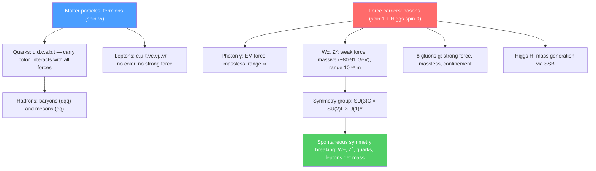

# 🔮 Standard Model Overview

> [!abstract] TL;DR
> The Standard Model (SM) is the quantum field theory describing all known fundamental particles and three of the four fundamental forces (electromagnetic, weak, strong). It has 17 fundamental particles: 6 quarks, 6 leptons, 4 gauge bosons (photon, $W^\pm$, $Z^0$, 8 gluons), and the Higgs boson. The SM is based on the gauge symmetry $\text{SU}(3)_C \times \text{SU}(2)_L \times \text{U}(1)_Y$, spontaneously broken to $\text{SU}(3)_C \times \text{U}(1)_{EM}$ by the Higgs mechanism.

## Intuition — analogy FIRST

The Standard Model is the "periodic table of the universe" — but instead of listing chemical elements, it lists all fundamental building blocks of matter and the particles that carry forces between them. Just as the periodic table organizes elements by electron configuration, the SM organizes particles by their quantum numbers (charge, spin, color charge).

The deepest insight: forces are not "action at a distance" — they are mediated by particles being exchanged. When two electrons repel each other, they exchange a photon. When a neutron decays, it exchanges a $W^-$ boson. The range of a force is inversely proportional to the mass of the mediating boson: the photon (massless) gives infinite-range electromagnetism; the massive $W$ and $Z$ bosons give the very short-range weak force.

---

## How It Works

---

## Key Concepts / Details

### Secondary Level

**The particle zoo — fundamental fermions:**

**Quarks** (6 flavors, all carry color charge):
| Generation | Up-type | Down-type |
|-----------|---------|-----------|
| 1st | up $u$ (+2/3) | down $d$ (-1/3) |
| 2nd | charm $c$ (+2/3) | strange $s$ (-1/3) |
| 3rd | top $t$ (+2/3) | bottom $b$ (-1/3) |

**Leptons** (6 flavors, no color charge):
| Generation | Charged | Neutrino |
|-----------|---------|----------|
| 1st | electron $e^-$ | $\nu_e$ |
| 2nd | muon $\mu^-$ | $\nu_\mu$ |
| 3rd | tau $\tau^-$ | $\nu_\tau$ |

Each fermion has an antiparticle with opposite charge.

**Force carriers (gauge bosons):**
- **Photon $\gamma$:** Carrier of electromagnetism. Massless, spin-1, range infinite.
- **$W^+$, $W^-$, $Z^0$:** Carriers of the weak force. Mass $\sim 80$–$91$ GeV/$c^2$, spin-1, range $\sim 10^{-18}$ m.
- **8 Gluons:** Carriers of the strong force. Massless, spin-1, but self-interacting (carry color charge). Quarks are confined — never seen alone.
- **Higgs boson $H$:** Spin-0 (scalar). Mass $\sim 125$ GeV/$c^2$. Discovered 2012 at the LHC.

**Quark confinement:** Quarks are bound inside hadrons by the strong force (QCD). Proton = $uud$, neutron = $udd$, pion $\pi^+ = u\bar{d}$. The QCD potential grows linearly with separation: $V(r) \approx kr$ for large $r$ — pulling quarks apart requires enough energy to create new quark-antiquark pairs before they separate.

### Undergraduate Level

**Hadron classification:**
- **Baryons:** 3 quarks ($qqq$). Proton $p = uud$, neutron $n = udd$, lambda $\Lambda = uds$.
- **Mesons:** quark-antiquark ($q\bar q$). $\pi^+ = u\bar d$, $K^+ = u\bar s$, $J/\psi = c\bar c$.
- **Exotic hadrons:** Tetraquarks ($qq\bar q\bar q$) and pentaquarks ($qqqq\bar q$) — confirmed experimentally (LHCb, 2015+).

**Conservation laws in strong/EM/weak interactions:**

| Quantity | Strong | EM | Weak |
|---------|-------|-----|------|
| Baryon number $B$ | Yes | Yes | Yes |
| Lepton number $L$ | Yes | Yes | Yes |
| Isospin | Yes | No | No |
| Strangeness $S$ | Yes | Yes | No |
| Parity $P$ | Yes | Yes | No |
| Charge conjugation $C$ | Yes | Yes | No |
| $CP$ | Yes | Yes | Mostly |

**CKM matrix:** Quark flavor eigenstates differ from mass eigenstates. The Cabibbo-Kobayashi-Maskawa (CKM) matrix $V_{CKM}$ rotates between them:
$$\begin{pmatrix}d'\\s'\\b'\end{pmatrix} = V_{CKM}\begin{pmatrix}d\\s\\b\end{pmatrix}$$

The off-diagonal elements give transition rates: $|V_{ud}|^2 \approx 0.97$ (dominant), $|V_{us}|^2 \approx 0.05$ (Cabibbo mixing), $|V_{ub}|^2 \approx 0.004$ (rare). A complex phase in $V_{CKM}$ allows CP violation in the quark sector — necessary for the matter-antimatter asymmetry of the universe.

**Electroweak unification:** The weak and electromagnetic forces are unified at energies above the $W/Z$ mass $\sim 100$ GeV. Below this scale, the $\text{SU}(2)_L \times \text{U}(1)_Y$ symmetry is spontaneously broken to $\text{U}(1)_{EM}$ by the Higgs mechanism. The photon remains massless; $W^\pm$ and $Z^0$ acquire masses $M_W \approx 80.4$ GeV/$c^2$ and $M_Z \approx 91.2$ GeV/$c^2$.

### Graduate Level

**Gauge symmetry group:** The SM Lagrangian is invariant under:
$$\text{SU}(3)_C \times \text{SU}(2)_L \times \text{U}(1)_Y$$

- $\text{SU}(3)_C$: QCD, 8 gluons ($A^a_\mu$, $a=1\ldots8$), generators = Gell-Mann matrices $\lambda^a/2$
- $\text{SU}(2)_L$: Weak isospin (left-handed fermions in doublets), 3 gauge bosons ($W^a_\mu$, $a=1,2,3$)
- $\text{U}(1)_Y$: Weak hypercharge, 1 gauge boson $B_\mu$

Physical $W^\pm = (W^1 \mp iW^2)/\sqrt{2}$, $Z^0 = W^3\cos\theta_W - B\sin\theta_W$, $\gamma = W^3\sin\theta_W + B\cos\theta_W$, where $\theta_W = 28.17°$ is the Weinberg angle.

**Higgs mechanism:** The Higgs field $\phi = \binom{\phi^+}{\phi^0}$ is an $\text{SU}(2)_L$ doublet with $\text{U}(1)_Y$ hypercharge. Its potential $V(\phi) = -\mu^2|\phi|^2 + \lambda|\phi|^4$ has a "Mexican hat" shape with minimum at $|\phi| = v/\sqrt{2}$ where $v = 246$ GeV (vacuum expectation value). The $\text{SU}(2)_L\times\text{U}(1)_Y$ symmetry is spontaneously broken; 3 of the 4 Goldstone bosons are "eaten" by $W^\pm$ and $Z$ (longitudinal polarizations), giving them mass. The remaining scalar is the Higgs boson.

Masses: $M_W = gv/2 \approx 80$ GeV, $M_Z = gv/(2\cos\theta_W) \approx 91$ GeV, fermion masses $m_f = y_f v/\sqrt{2}$ (Yukawa couplings $y_f$).

**The SM Lagrangian (schematic):**
$$\mathcal{L}_{SM} = -\frac{1}{4}F^a_{\mu\nu}F^{a\mu\nu} + i\bar\psi\slashed{D}\psi + |D_\mu\phi|^2 - V(\phi) + y\bar\psi_L\phi\psi_R + h.c.$$

Kinetic terms for gauge bosons, kinetic terms for fermions (with covariant derivatives encoding minimal coupling), Higgs kinetic + potential, and Yukawa couplings (fermion masses). The SM has $\sim 20$ free parameters (coupling constants, fermion masses, mixing angles).

---

## Real-World Notes

- **LHC Higgs discovery (2012):** ATLAS and CMS experiments at CERN confirmed the Higgs boson at $m_H = 125.1 \pm 0.1$ GeV. Nobel Prize to Higgs and Englert, 2013.
- **Quark gluon plasma:** At $T > 10^{12}$ K (above QCD deconfinement transition), quark confinement breaks down. Heavy-ion collisions at RHIC and LHC produce this QGP, recreating conditions $\sim 10^{-6}$ s after the Big Bang.
- **Precision electroweak tests:** The $W$ mass has been measured to $0.01\%$ precision (CDF 2022 result at $80.4335 \pm 0.0094$ GeV deviates from SM by $7\sigma$ — unresolved).
- **Neutrino flavors and the SM:** The original SM had massless neutrinos. Neutrino oscillations (Nobel 2015 to Kajita & McDonald) prove neutrinos have mass — the first confirmed deviation from the SM.

---

## Common Pitfalls

- **Gluons carry color, unlike photons.** This means gluons interact with each other — QCD is non-Abelian. Gluon self-interactions cause asymptotic freedom (running coupling decreases at high energy) and confinement.
- **"The weak force" is not weak because of a small coupling.** At $Q = M_W$, the weak coupling is comparable to EM. It appears weak at low energies because of the large $W/Z$ mass suppression: $G_F \sim g^2/M_W^2$.
- **Quarks never appear free.** Attempting to separate a quark-antiquark pair creates new pairs from the vacuum (string breaking) — you get more mesons, not free quarks. Only at extreme temperatures/densities does deconfinement occur.
- **There are 8 gluons, not 9.** $\text{SU}(3)$ has $3^2 - 1 = 8$ generators. The ninth would be colorless and would not mediate QCD.

---

## Related Concepts
- [[Fundamental_Forces_and_Feynman_Diagrams]] — Feynman rules of QED and QCD; renormalization group
- [[Beyond_Standard_Model]] — SM's limitations and current BSM searches
- [[Radioactive_Decay]] — Beta decay mediated by $W^-$ boson
- [[Angular_Momentum_and_Spin]] — Gauge bosons have spin 1; Higgs has spin 0; quarks and leptons have spin 1/2
- [[Intro_to_Quantum_Field_Theory]] — The SM is a QFT; Lagrangian density, gauge invariance, canonical quantization
- [[_MOC_Nuclear_Particle_Physics|↑ Section MOC]]

---

## Review Questions

1. **(Secondary)** List the six quarks and six leptons of the Standard Model in their three generations. What is the charge of each up-type and down-type quark? Why do we never observe free quarks?
2. **(Undergraduate)** Using conservation laws, determine which of the following decays are allowed: (a) $\mu^- \to e^- + \gamma$; (b) $\mu^- \to e^- + \bar\nu_e + \nu_\mu$; (c) $p \to \pi^0 + e^+$; (d) $K^0 \to \pi^+ + \pi^-$.
3. **(Graduate)** Describe the Higgs mechanism. Why does the photon remain massless while $W^\pm$ and $Z^0$ acquire mass? How many degrees of freedom does the Higgs doublet start with, and where do they go?

---

## Sources
- Griffiths, *Introduction to Elementary Particles*, 2nd ed. (excellent undergraduate introduction)
- Halzen & Martin, *Quarks and Leptons* (graduate-level particle physics)
- Peskin & Schroeder, *An Introduction to Quantum Field Theory*, Ch. 15–20 (gauge theories, SM)
- Weinberg, *The Quantum Theory of Fields*, Vol. 2 (electroweak theory)
- CERN: *The Standard Model* — https://home.cern/science/physics/standard-model

#physics #particle-physics #standard-model #quarks #leptons #gauge-bosons #Higgs-mechanism #CKM-matrix #QCD
