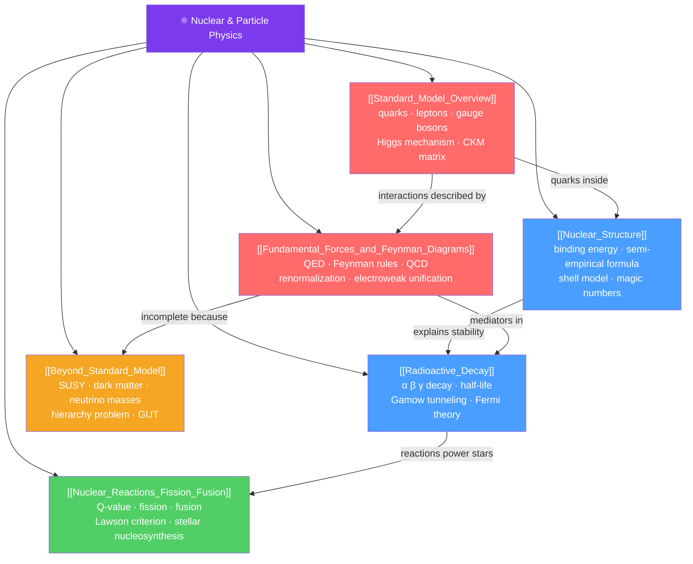

# ⚛️ Nuclear and Particle Physics — Map of Content

> [!abstract] What This Section Covers
> Nuclear physics probes the structure and reactions of atomic nuclei — from binding energy and the shell model to radioactive decay and fission/fusion. Particle physics extends further, revealing that protons and neutrons are built from quarks and gluons, and that all fundamental interactions (except gravity) are described by the Standard Model of particle physics — a quantum field theory of leptons, quarks, and gauge bosons. This section spans A-level nuclear physics through the Higgs mechanism, Feynman diagrams, and beyond-Standard-Model physics including supersymmetry and neutrino masses.

## Concept Map

## Learning Path
1. [[Nuclear_Structure]] — Protons, neutrons, binding energy, the semi-empirical mass formula, and the nuclear shell model.
2. [[Radioactive_Decay]] — Alpha, beta, and gamma decay; half-lives; carbon dating; Gamow tunneling theory.
3. [[Nuclear_Reactions_Fission_Fusion]] — Q-values, fission chain reactions, fusion in reactors and stars, nucleosynthesis.
4. [[Standard_Model_Overview]] — The particle zoo: quarks, leptons, gauge bosons, Higgs; the symmetry group and forces.
5. [[Fundamental_Forces_and_Feynman_Diagrams]] — QED, QCD, Feynman diagram rules, renormalization, electroweak unification.
6. [[Beyond_Standard_Model]] — What the Standard Model cannot explain and current frontiers: SUSY, dark matter, neutrino masses.

## All Notes at a Glance
| Note | Difficulty | What You'll Learn |
|------|------------|-------------------|
| [[Nuclear_Structure]] | Secondary → PhD | Binding energy, Bethe-Weizsäcker formula, shell model, magic numbers, collective nuclear models |
| [[Radioactive_Decay]] | Secondary → PhD | α/β/γ decay physics, Gamow theory, Fermi beta-decay theory, neutrino masses, r/s-process |
| [[Nuclear_Reactions_Fission_Fusion]] | Secondary → PhD | Q-values, fission reactors, Lawson criterion, pp chain, stellar nucleosynthesis |
| [[Standard_Model_Overview]] | Secondary → PhD | Particle content, gauge symmetry $\text{SU}(3)\times\text{SU}(2)\times\text{U}(1)$, spontaneous symmetry breaking, Higgs |
| [[Fundamental_Forces_and_Feynman_Diagrams]] | Undergraduate → PhD | Feynman rules for QED, propagators, vertices, renormalization, asymptotic freedom, electroweak unification |
| [[Beyond_Standard_Model]] | Graduate | SUSY, GUT, hierarchy problem, dark matter candidates, neutrino oscillations, string theory basics |

## Key Questions This Section Answers
- Why are some nuclei stable and others radioactive?
- How does quantum tunneling enable nuclear fusion in stars?
- What are quarks, and why are they never seen alone?
- How does the Higgs field give particles mass?
- What is wrong with the Standard Model, and where is new physics expected?
- Why do neutrinos oscillate between flavors?

## Related Sections
- [[_MOC_Physics_Master|↑ Physics Master MOC]]
- [[_MOC_Quantum_Mechanics|← Quantum Mechanics]]
- [[_MOC_Relativity|← Special and General Relativity]]
- [[_MOC_Condensed_Matter|→ Condensed Matter and Advanced]]

#MOC #physics #nuclear-physics #particle-physics #standard-model
