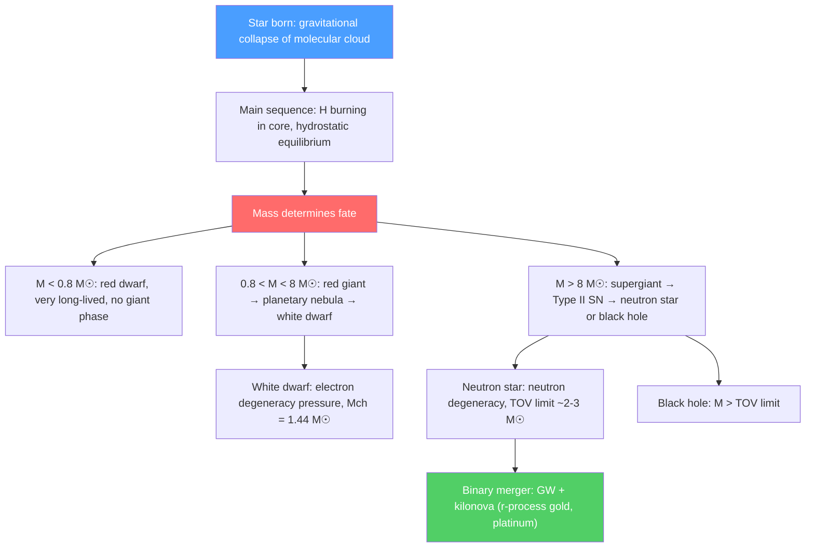

# ⭐ Astrophysics and Cosmology

> [!abstract] TL;DR
> Stars are gravitationally confined nuclear furnaces: hydrostatic equilibrium balances gravity against radiation and gas pressure while nuclear burning sustains the pressure. Stellar evolution is determined primarily by mass: low-mass stars end as white dwarfs (supported by electron degeneracy pressure, Chandrasekhar limit $1.44 M_\odot$); massive stars become neutron stars (nuclear density matter, Tolman-Oppenheimer-Volkoff limit) or black holes. Gravitational wave detection (LIGO) opened a new observational window; neutron star mergers synthesize r-process elements; active galactic nuclei are powered by accretion onto supermassive black holes.

## Intuition — analogy FIRST

A star is like a nuclear bomb in slow motion, held together by its own gravity. The bomb wants to explode outward; gravity wants to collapse it inward. For billions of years, these forces are precisely balanced — hydrostatic equilibrium. When the nuclear fuel runs out, the balance is broken and the star's fate is determined entirely by its mass: light stars gently shed their outer layers and leave a cooling white dwarf; massive stars implode catastrophically in a supernova, leaving either a neutron star or a black hole.

Neutron stars are the most extreme laboratories in the universe. A teaspoon of neutron star material weighs a billion tons; their magnetic fields are $10^{12}$ times Earth's; their rotation rates can reach 716 Hz. These are cosmic particle accelerators, the sites of r-process nucleosynthesis, and the sources of gravitational waves strong enough to ripple spacetime across the universe.

---

## How It Works

---

## Key Concepts / Details

### Secondary Level

**Hertzsprung-Russell (HR) diagram:** A plot of stellar luminosity vs temperature (or spectral class). Most stars lie on the "main sequence" (a diagonal band from hot-bright to cool-dim), powered by hydrogen burning. Other regions: red giants (cool, bright), white dwarfs (hot, dim), supergiants.

**Stellar classification (OBAFGKM spectral types):**
- O: $>30,000$ K (blue-white, Rigel-like)
- B: 10,000–30,000 K (blue-white, Spica)
- A: 7,500–10,000 K (white, Sirius, Vega)
- F: 6,000–7,500 K (yellow-white, Procyon)
- G: 5,200–6,000 K (yellow, Sun, $T_\odot = 5778$ K)
- K: 3,700–5,200 K (orange, Arcturus)
- M: $<3,700$ K (red, Betelgeuse, most numerous)

**Stellar energy source:** Hydrogen fusion (pp chain for Sun; CNO cycle for massive stars) converts 4 protons to $^4$He + $2e^+ + 2\nu_e + 26.7$ MeV. Sun's luminosity $L_\odot = 3.85 \times 10^{26}$ W requires burning $\sim 4 \times 10^9$ kg/s of mass into energy.

**Main sequence lifetime:** $t_{MS} \sim E_{nuc}/L \sim 0.007 M c^2 / L \sim 10^{10}(M/M_\odot)^{-2.5}$ years (from $L \propto M^{3.5}$ scaling). Sun: $\sim 10$ Gyr; $10 M_\odot$ star: $\sim 30$ Myr; $0.1 M_\odot$ star: $\sim 3$ Tyr.

### Undergraduate Level

**Stellar structure equations:** Four equations governing stellar interior:
1. **Hydrostatic equilibrium:** $dP/dr = -G M_r\rho/r^2$
2. **Mass continuity:** $dM_r/dr = 4\pi r^2\rho$
3. **Energy transport (radiation):** $dT/dr = -3\kappa\rho L_r/(16\pi acT^3r^2)$
4. **Energy generation:** $dL_r/dr = 4\pi r^2\rho\epsilon$ ($\epsilon$ = energy generation rate)

These coupled ODEs, with an equation of state and opacity $\kappa$, completely determine stellar structure.

**Stellar evolution — low-mass ($\leq 8 M_\odot$):**
- Main sequence: H burning, $\sim 10$ Gyr
- Red giant: H shell burning, He core contracts, $L$ increases, $R$ increases to $\sim 100 R_\odot$
- He flash / He burning: He → C, O (triple-alpha process)
- Asymptotic giant branch (AGB): He shell burning, thermal pulses, s-process nucleosynthesis
- Planetary nebula: outer envelope expelled
- **White dwarf:** $M \lesssim 1.44 M_\odot$, $R \sim R_{Earth}$, supported by electron degeneracy pressure. Slowly cools over Gyr.

**Stellar evolution — massive ($> 8 M_\odot$):**
- Main sequence: H burning (pp + CNO), $\sim 10$ Myr
- Successive burning stages: He, C, Ne, O, Si burning (each shorter: Si burning lasts only days)
- Iron core collapse: core exceeds $\sim 1.4 M_\odot$ (Chandrasekhar), electron degeneracy fails, core implodes at $0.25c$ in $< 1$ second
- **Core-collapse supernova (Type II):** Bounce at nuclear density, shock wave, $\sim 99\%$ of energy carried by neutrinos ($3\times10^{53}$ J)
- Remnant: **neutron star** ($M \lesssim 2$–$3 M_\odot$) or **black hole** if core $\gtrsim 2.5 M_\odot$

**Chandrasekhar limit:** Maximum mass of a white dwarf supported by electron degeneracy:
$$M_{Ch} = \frac{5.76}{\mu_e^2}M_\odot \approx 1.44 M_\odot$$

where $\mu_e \approx 2$ for C/O white dwarf. Derived from balancing gravitational energy against electron degeneracy (ultrarelativistic Fermi pressure). Exceeding $M_{Ch}$ triggers thermonuclear explosion (Type Ia supernova) or collapse.

**Type Ia supernovae as standard candles:** White dwarfs accreting mass near $M_{Ch}$ detonate uniformly → standard luminosity ($L_{peak} \approx -19.3$ mag). Used to measure distances up to $z \sim 1.5$; led to discovery of accelerating expansion (dark energy, Nobel 1998).

### Graduate Level

**Tolman-Oppenheimer-Volkoff (TOV) equation:** GR generalization of hydrostatic equilibrium for relativistic (nuclear density) matter:
$$\frac{dP}{dr} = -\frac{(P + \rho c^2)(M_r + 4\pi r^3 P/c^2)}{r^2(1 - 2GM_r/rc^2)}\cdot G$$

The TOV mass limit depends on the nuclear equation of state (EOS) at $2$–$3\rho_0$ (nuclear saturation density $\rho_0 = 2.3 \times 10^{17}$ kg/m³) — still highly uncertain. Observed neutron stars up to $M \approx 2.35 M_\odot$ (PSR J0952-0607) constrain the EOS above the limit.

**Neutron star properties:**
- $R \approx 10$–$13$ km, $M \approx 1.2$–$2.3 M_\odot$
- Central density: $\sim 5$–$10\rho_0$; possible quark matter core
- Surface: crystalline neutron-rich crust (nuclear pasta)
- Magnetic field: $B \sim 10^8$–$10^{15}$ G
- Rotation: up to $716$ Hz (PSR J1748-2446ad — fastest pulsar)

**Pulsars:** Rotating neutron stars with beamed radio emission (lighthouse model). Spin-down rate $\dot P$ gives magnetic dipole luminosity $L = -I\Omega\dot\Omega$. Pulsar timing provides:
- Tests of GR (Hulse-Taylor binary: orbital decay from GW emission — Nobel 1993)
- Neutron star masses (Shapiro delay gives $M_{companion}$; mass function gives $M_{pulsar}$)
- Pulsar timing arrays (PTA): searching for the stochastic GW background from supermassive binary BHs — NANOGrav (2023) detected candidate GWB signal

**Gravitational wave emission from binary neutron stars:**
Merger of two $\sim 1.4 M_\odot$ neutron stars (GW170817, 2017):
- GW signal: inspiral chirp ($\sim 100$ s), merger, ringdown
- Tidal deformability $\Lambda$ measured from GW signal → constrains EOS
- Kilonova: optical/IR transient from r-process nucleosynthesis ($\sim 0.05 M_\odot$ of heavy elements: Sr, Ba, La, Au, Pt confirmed)
- Gamma-ray burst (short GRB): jet launched by black hole remnant

**Active galactic nuclei (AGN):** Powered by accretion onto supermassive black holes ($M_{SMBH} \sim 10^6$–$10^{10} M_\odot$). Accretion disk radiates up to $\eta \sim 10\%$ of $Mc^2$ (vs $0.1\%$ for nuclear fusion). Varieties: quasars ($L \sim 10^{46}$ erg/s, highest luminosity objects), Seyfert galaxies, BL Lacs, radio galaxies. AGN jets accelerate particles to $\sim 10^{20}$ eV (ultra-high-energy cosmic rays).

**Cosmic ray physics:** The cosmic ray spectrum spans $10^9$–$10^{21}$ eV, a 12-decade energy range, following a power law $dN/dE \propto E^{-2.7}$ with features:
- Knee at $\sim 3 \times 10^{15}$ eV: galactic CR confinement limit
- Ankle at $\sim 3 \times 10^{18}$ eV: transition to extragalactic sources
- GZK cutoff at $\sim 5 \times 10^{19}$ eV: $p + \gamma_{CMB} \to \Delta^+ \to p + \pi^0$ (predicted 1966, confirmed by Auger 2007)

---

## Real-World Notes

- **Multi-messenger astronomy:** GW170817 was detected simultaneously by LIGO (GW), Fermi (gamma-rays), and 70 ground observatories (optical to radio). The delay $\Delta t \approx 1.7$ s between GW and GRB constrains GW speed to $|v_{GW}/c - 1| < 10^{-15}$ — killing most modified gravity theories.
- **Event Horizon Telescope (EHT):** 2019 image of M87* and 2022 image of Sgr A* at $\sim 20\,\mu$as resolution. Confirms Kerr metric at the photon ring scale; measures shadow diameter consistent with GR prediction to $<10\%$.
- **Square Kilometre Array (SKA):** Radio observatory with $10^6$ m² collecting area under construction in South Africa and Australia. Will detect thousands of pulsars, map HI at $z \sim 1$, and test GR in strong-field regime.
- **Neutrino astronomy:** IceCube (South Pole) detected astrophysical neutrinos at $\sim 100$ TeV–PeV, establishing neutrino astronomy. NGC 1068 (Seyfert galaxy) confirmed as a neutrino source. Supernova 1987A: 24 neutrinos in three detectors — confirmed core-collapse mechanism.

---

## Common Pitfalls

- **White dwarfs do not explode because they reach $M_{Ch}$.**  Mass TRANSFER to the WD from a companion brings it near $M_{Ch}$; thermonuclear runaway in the C/O interior is the explosion mechanism (Type Ia SN). The WD itself doesn't collapse — it explodes.
- **All neutron stars are not pulsars.** A pulsar is a neutron star whose beam happens to sweep past Earth. Most neutron stars are not pulsars from our perspective.
- **"Black holes suck everything in."** A stellar-mass BH at the center of the solar system would have the same gravitational pull on the outer planets as the Sun — no more, no less. Only objects that come within $r \sim$ a few $r_s$ are strongly affected.
- **Gravitational waves are not electromagnetic waves.** They are ripples in spacetime geometry, not in any field; they pass through matter almost without interaction (LIGO strain $h \sim 10^{-21}$) and carry no charge.

---

## Related Concepts
- [[Schwarzschild_Solution_and_Black_Holes]] — Black holes as stellar endpoints; GW from mergers; Hawking radiation
- [[Cosmology_and_Expanding_Universe]] — Stellar populations, galaxy formation, CMB, dark matter structure
- [[Nuclear_Reactions_Fission_Fusion]] — Stellar nucleosynthesis powered by nuclear reactions; r-process in neutron star mergers
- [[Superconductivity]] — Neutron star interiors may contain superfluid neutrons and superconducting protons; glitches as superfluidity signatures
- [[Introduction_to_General_Relativity]] — TOV equation, Schwarzschild interior solution, gravitational wave emission
- [[_MOC_Condensed_Matter|↑ Section MOC]]

---

## Review Questions

1. **(Secondary/Undergraduate)** Sketch the HR diagram and indicate the positions of: (a) the Sun, (b) a $15 M_\odot$ main-sequence star, (c) a red giant, (d) a white dwarf, (e) Betelgeuse. Explain qualitatively what drives the Sun off the main sequence in $\sim 5$ Gyr.
2. **(Undergraduate)** Derive the Chandrasekhar limit by balancing gravitational energy against the ultrarelativistic Fermi pressure $P_F \propto n_e^{4/3}$ of electrons. Show that $M_{Ch} \propto (\hbar c/G)^{3/2} m_p^{-2}$ — only fundamental constants.
3. **(Graduate)** Write the TOV equation and explain qualitatively how it modifies the Newtonian hydrostatic equilibrium. What three factors make the GR pressure gradient steeper than the Newtonian one? How does the observed maximum neutron star mass $\sim 2.35 M_\odot$ constrain the nuclear equation of state?

---

## Sources
- Carroll & Ostlie, *Introduction to Modern Astrophysics* (standard undergraduate text)
- Shapiro & Teukolsky, *Black Holes, White Dwarfs, and Neutron Stars* (graduate-level)
- Özel & Freire, "Masses, Radii, and the EOS of Neutron Stars," *Annu. Rev. Astron. Astrophys.* 54, 401 (2016)
- Abbott et al. (LIGO-Virgo), "GW170817: Observation of Gravitational Waves from a Binary Neutron Star Inspiral," *Phys. Rev. Lett.* 119, 161101 (2017)
- IceCube Collaboration, "Evidence for high-energy extraterrestrial neutrinos," *Science* 342, 1242856 (2013)

#physics #astrophysics #cosmology #stellar-evolution #neutron-stars #white-dwarfs #gravitational-waves #pulsars #supernovae #HR-diagram
