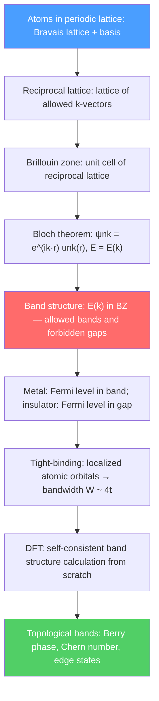

# 💎 Crystal Structure and Band Theory

> [!abstract] TL;DR
> Crystalline solids have atoms arranged in periodic lattices. Bloch's theorem states that in any periodic potential, electron wave functions take the form $\psi_{n\vec{k}}(\vec{r}) = e^{i\vec{k}\cdot\vec{r}}u_{n\vec{k}}(\vec{r})$ — a plane wave modulated by a lattice-periodic function. This leads to energy bands separated by gaps, explaining why metals conduct (partially filled band), insulators don't (large gap), and semiconductors have intermediate behavior. At PhD level, DFT band calculations, topological band invariants, and Wannier functions connect crystal structure to modern quantum materials.

## Intuition — analogy FIRST

Think of standing waves on a string. Alone, an electron is a free wave. In a crystal, it's like a wave bouncing through a perfectly regular corridor of pillars (atoms). Depending on the wave's wavelength, it either passes through almost unimpeded (like a wave between pillars — allowed band) or it bounces back and forth, creating a standing wave — the condition for a band gap. A metal has electrons in a partially filled "corridor" (they can flow freely); an insulator has electrons exactly filling corridors that are closed off on both ends (no room to move).

The periodic arrangement of atoms is not just geometric neatness — it is the fundamental reason why materials have sharply different electrical properties.

---

## How It Works

---

## Key Concepts / Details

### Secondary Level

**Crystal structure:** Atoms arranged in a regular, repeating 3D pattern. Most metals (Cu, Fe, Al) have face-centered cubic (FCC) or body-centered cubic (BCC) structures. Semiconductors (Si, Ge) have diamond cubic; table salt (NaCl) is rock-salt structure.

**Unit cell:** The smallest repeating unit. Multiply it in all directions to fill space.

**Why bands?** Isolated atoms have discrete energy levels ($1s, 2s, 2p, \ldots$). Bring $N \sim 10^{23}$ atoms close together in a crystal: each level splits into $N$ closely-spaced levels — a band. The width of the band and the size of the gap between bands determine electrical properties.

**Conductors, insulators, semiconductors:**
- **Metal:** Highest occupied band partially filled → electrons free to move → conducts
- **Insulator:** Bands either completely filled or empty, large gap $>3$ eV → no electrons available to conduct
- **Semiconductor:** Like insulator but small gap ($\lesssim 2$ eV) → thermal excitation or doping populates conduction band

### Undergraduate Level

**Bravais lattices:** The 14 fundamental lattice types in 3D (7 crystal systems × 2-3 centering modes). Key examples:
- Simple cubic (SC): $a = b = c$, all 90°
- FCC: SC with additional atoms at face centers — Al, Cu, Ni
- BCC: SC with body-center atom — Fe, W, Cr

**Miller indices:** Integer notation $(hkl)$ for crystal planes. $(100)$ = face of cube; $(110)$ = diagonal face; $(111)$ = body diagonal. Bragg's law for X-ray diffraction: $2d_{hkl}\sin\theta = n\lambda$.

**Reciprocal lattice:** For direct lattice vectors $\vec{a}_1, \vec{a}_2, \vec{a}_3$, reciprocal lattice vectors:
$$\vec{b}_1 = 2\pi\frac{\vec{a}_2\times\vec{a}_3}{\vec{a}_1\cdot(\vec{a}_2\times\vec{a}_3)}, \quad \text{etc.}$$

Bragg scattering occurs when momentum transfer $\vec{G} = h\vec{b}_1 + k\vec{b}_2 + l\vec{b}_3$ (reciprocal lattice vector).

**First Brillouin zone (BZ):** The Wigner-Seitz cell of the reciprocal lattice. All unique $\vec{k}$ values are in the first BZ (due to periodicity $E(\vec{k}+\vec{G}) = E(\vec{k})$). For FCC: BZ is a truncated octahedron. High-symmetry points: $\Gamma$ (center), $X$ (face center of BZ), $L$ (corner), $K$ (edge center).

**Bloch's theorem:** In a periodic potential $V(\vec{r}+\vec{R}) = V(\vec{r})$ (where $\vec{R}$ is any lattice vector), solutions of the Schrödinger equation take the form:
$$\psi_{n\vec{k}}(\vec{r}) = e^{i\vec{k}\cdot\vec{r}}u_{n\vec{k}}(\vec{r})$$

where $u_{n\vec{k}}(\vec{r}+\vec{R}) = u_{n\vec{k}}(\vec{r})$ is lattice-periodic, $n$ is the band index, and $\vec{k}$ is the crystal momentum in the BZ.

**Free electron model:** Ignore atomic potential: $E = \hbar^2k^2/2m$. Periodic zone boundary conditions open gaps when $k = G/2$ (Bragg condition). This "nearly-free electron model" correctly captures band gaps as second-order perturbations in $V_G$ (Fourier component of lattice potential).

**Tight-binding model (nearest-neighbor):** Start from atomic orbitals $\phi_n(\vec{r})$; build Bloch sums:
$$\psi_{\vec{k}}(\vec{r}) = \frac{1}{\sqrt{N}}\sum_{\vec{R}}e^{i\vec{k}\cdot\vec{R}}\phi_n(\vec{r}-\vec{R})$$

For a 1D chain with nearest-neighbor hopping $t$ and on-site energy $\epsilon_0$:
$$E(k) = \epsilon_0 - 2t\cos(ka)$$

Bandwidth $W = 4t$, centered at $\epsilon_0$. In 3D (simple cubic with 6 neighbors): $E(\vec{k}) = \epsilon_0 - 2t(\cos k_xa + \cos k_ya + \cos k_za)$.

**Effective mass:** Near a band extremum at $\vec{k}_0$, $E(\vec{k}) \approx E(\vec{k}_0) + \hbar^2|\vec{k}-\vec{k}_0|^2/2m^*$, defining the effective mass $m^*$. For a concave band top (valence band), $m^* < 0$ — hole picture is more natural.

**Density of states (DOS):** $g(E) = \sum_n \int_{BZ} \delta(E - E_n(\vec{k}))\,d^3k/(2\pi)^3$. Van Hove singularities occur at critical points where $\nabla_k E_n = 0$.

### Graduate Level

**DFT band structure calculations:** Kohn-Sham DFT gives a self-consistent set of single-particle equations with an exchange-correlation functional. The resulting $E_n(\vec{k})$ plots — compared to ARPES measurements — show electronic structure of real materials. LDA systematically underestimates band gaps (by $30$–$50\%$); hybrid functionals (HSE06) and $GW$ many-body methods correct this.

**Wannier functions:** Fourier transforms of Bloch functions $|w_{n\vec{R}}\rangle = \frac{V}{(2\pi)^3}\int e^{-i\vec{k}\cdot\vec{R}}|\psi_{n\vec{k}}\rangle\,d^3k$. Maximally localized Wannier functions (MLWF, Marzari-Vanderbilt) provide a compact basis connecting band structure to real-space tight-binding models, surface Green's functions, and topological invariants.

**Berry phase and topological insulators:** The Berry phase accumulated by a Bloch state as $\vec{k}$ traverses a loop in the BZ:
$$\gamma_n = i\oint \langle u_{n\vec{k}}|\nabla_{\vec{k}}|u_{n\vec{k}}\rangle \cdot d\vec{k}$$

For a 2D system, the Chern number $C = \frac{1}{2\pi}\int_{BZ}\Omega(\vec{k})\,d^2k$ (integral of Berry curvature $\Omega = \nabla_k\times\langle u|\nabla_k u\rangle$) is a topological invariant. $C \neq 0$: quantum Hall state. The bulk-edge correspondence: a non-zero $C$ implies gapless edge states. **Topological insulators** (Z$_2$ classification, time-reversal symmetry) have $C = 0$ in the bulk but protected metallic surface states (e.g., Bi$_2$Se$_3$, HgTe quantum wells) — confirmed experimentally in 2007–2009.

---

## Real-World Notes

- **Silicon technology:** Si is a semiconductor ($E_g = 1.12$ eV at 300 K, indirect gap). The entire semiconductor industry — CPUs, memory, solar cells — is built on band theory applied to Si and III-V compounds.
- **ARPES:** Angle-resolved photoemission spectroscopy directly maps $E_n(\vec{k})$ by measuring photoemitted electrons. It has revealed the Dirac cones in graphene, Fermi surface of cuprate superconductors, and topological surface states.
- **Graphene:** 2D honeycomb lattice of carbon. Two inequivalent BZ corners ($K$ and $K'$) give linear band crossing (Dirac cones) at the Fermi level — massless Dirac fermions. Nobel Prize 2010 (Geim & Novoselov).
- **Topological quantum computing:** Non-Abelian anyons in topological superconductors (Majorana zero modes at vortex cores) could implement fault-tolerant quantum gates — Microsoft's quantum computing strategy.

---

## Common Pitfalls

- **Crystal momentum $\hbar\vec{k}$ is not true momentum.** It differs from mechanical momentum by the lattice potential term; momentum is not conserved in a crystal, but crystal momentum $\hbar\vec{k}$ is (up to $\hbar\vec{G}$).
- **Band gaps vs energy gaps:** A "band gap" is a gap in the spectrum; an "energy gap" can also refer to superconducting gap. The context determines which.
- **Direct vs indirect band gap matters for optical applications.** A direct gap (Si: indirect; GaAs: direct) allows efficient photon absorption/emission; indirect gap materials require phonon assistance and are poor light emitters.
- **Bloch theorem assumes perfect periodicity.** Defects, disorder, and surfaces break periodicity; Anderson localization (disorder-induced localization) and surface states require going beyond pure Bloch theory.

---

## Related Concepts
- [[Semiconductors_and_Devices]] — Band theory applied: carrier statistics, p-n junctions, transistors
- [[Superconductivity]] — Fermi surface instability → Cooper pairing; BCS gap in the spectrum
- [[Many_Body_Quantum_Systems]] — DFT and Hartree-Fock as band-structure methods; Wannier functions
- [[Perturbation_Theory]] — Nearly-free electron model: band gaps from second-order perturbation theory in $V_G$
- [[Phase_Transitions_and_Critical_Phenomena]] — Topological phase transitions (TKNN, Z$_2$) as a new type of quantum phase transition
- [[_MOC_Condensed_Matter|↑ Section MOC]]

---

## Review Questions

1. **(Secondary/Undergraduate)** Explain in terms of band theory why silicon is a semiconductor while copper is a metal. Why does silicon's conductivity increase with temperature while copper's decreases?
2. **(Undergraduate)** For a 1D monatomic chain with lattice constant $a$ and nearest-neighbor hopping $t$, find and plot $E(k)$ in the first Brillouin zone. What is the bandwidth? At half-filling, is the system a metal or insulator?
3. **(Graduate)** Define the Berry curvature $\Omega_n(\vec{k})$ and Chern number $C_n$ for a 2D band. Show that the Hall conductivity is $\sigma_{xy} = e^2/h \sum_n C_n$ (sum over filled bands). What does this imply about the quantization of the quantum Hall effect?

---

## Sources
- Kittel, *Introduction to Solid State Physics*, 8th ed. (standard undergraduate text)
- Ashcroft & Mermin, *Solid State Physics* (comprehensive graduate reference)
- Bloch, "Über die Quantenmechanik der Elektronen in Kristallgittern," *Z. Phys.* 52, 555 (1929) (Bloch theorem)
- Hasan & Kane, "Colloquium: Topological insulators," *Rev. Mod. Phys.* 82, 3045 (2010)
- Marzari & Vanderbilt, "Maximally localized generalized Wannier functions," *Phys. Rev. B* 56, 12847 (1997)

#physics #condensed-matter #crystal-structure #band-theory #Bloch-theorem #Brillouin-zone #tight-binding #topological-insulators
