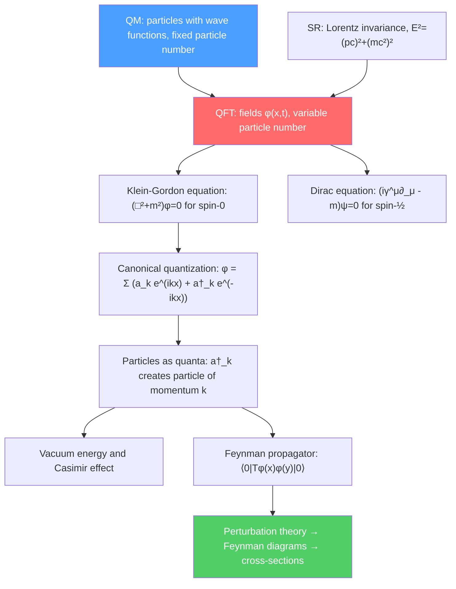

# 🌀 Introduction to Quantum Field Theory

> [!abstract] TL;DR
> Quantum field theory (QFT) is the synthesis of quantum mechanics and special relativity. Instead of particles, the fundamental objects are fields $\phi(x,t)$ that permeate all of space — particles are quantized excitations of these fields (like ripples on a pond). The Klein-Gordon equation describes spin-0 fields; the Dirac equation describes spin-1/2 fermions. Canonical quantization or the Feynman path integral provides the framework; renormalization handles the divergences that inevitably arise. QFT predicts the Casimir effect, electron anomalous magnetic moment, and underlies the entire Standard Model.

## Intuition — analogy FIRST

Think of a pond. The water is a classical field filling all of space. A stone thrown in creates a wave — a ripple propagating outward. Now quantize the pond: the wave comes in discrete packets (quanta). Each quantum is a "particle." The particle does not exist in a fixed location until you observe it; it is a vibration of the underlying field.

In QFT, the electromagnetic field is the "pond"; photons are the quanta of that field. The electron field fills all of space; each electron is a quantized excitation. This means there are not "particles moving through space" but rather "excitations in a field that fills all of space" — which explains why electrons in distant parts of the universe are perfectly identical: they are all excitations of the same electron field.

---

## How It Works

---

## Key Concepts / Details

### Undergraduate Level

**Why QFT is necessary:**
1. **Particle creation/annihilation:** In relativistic collisions, particles can be created and destroyed ($e^+e^- \to 2\gamma$). Quantum mechanics with fixed particle number cannot handle this.
2. **Relativistic causality:** Propagation of single-particle wave functions can be superluminal; QFT automatically enforces causality through anticommuting fields.
3. **Spin-statistics theorem:** Bosons (integer spin) must use symmetric wave functions; fermions (half-integer) antisymmetric. In QFT, this follows from Lorentz invariance and locality — a deep result.
4. **Antiparticles:** The Dirac equation's negative-energy solutions are naturally reinterpreted as antiparticles (positrons) in QFT.

**Klein-Gordon equation:** Relativistic wave equation for a spin-0 field (Higgs boson, pions approximately):
$$\left(\Box^2 + \frac{m^2c^2}{\hbar^2}\right)\phi = 0, \qquad \Box^2 = \frac{1}{c^2}\frac{\partial^2}{\partial t^2} - \nabla^2$$

or in natural units ($\hbar = c = 1$): $(\partial_\mu\partial^\mu + m^2)\phi = 0$. Obtained by replacing $E^2 = p^2c^2 + m^2c^4$ with quantum operators $\hat E = i\hbar\partial_t$, $\hat p = -i\hbar\nabla$.

**Dirac equation:** Relativistic wave equation for spin-1/2 particles:
$$(i\gamma^\mu\partial_\mu - m)\psi = 0$$

where $\gamma^\mu$ are $4\times4$ matrices satisfying $\{\gamma^\mu,\gamma^\nu\} = 2\eta^{\mu\nu}\mathbb{1}$. The $\psi$ is a 4-component Dirac spinor. This equation predicted:
- **Antiparticles** (positron, 1932 — discovered by Anderson, Nobel 1936)
- **Electron $g$-factor:** $g = 2$ exactly at tree level (QED corrections give $g - 2 \approx 0.00232$)
- **Hydrogen fine structure:** Reproduces the exact fine structure (same as Pauli equation + relativistic correction) without approximation

**Spin-statistics theorem:** Fermion fields must anticommute ($\{\psi(x),\psi^\dagger(y)\} = \delta^3(x-y)$) to ensure positive-definite Hamiltonian and causality. Boson fields commute ($[\phi(x),\phi^\dagger(y)] = \delta^3(x-y)$). This is the rigorous QFT derivation of Pauli exclusion.

### Graduate Level

**Canonical quantization of scalar field:** The scalar field $\phi(x)$ and its conjugate momentum $\pi = \partial\mathcal{L}/\partial\dot\phi = \dot\phi$ satisfy $[\phi(\vec{x},t), \pi(\vec{y},t)] = i\delta^3(\vec{x}-\vec{y})$. Mode expansion:
$$\phi(\vec{x},t) = \int\frac{d^3k}{(2\pi)^3}\frac{1}{\sqrt{2\omega_k}}\left(\hat a_{\vec{k}}\,e^{i\vec{k}\cdot\vec{x}-i\omega_k t} + \hat a^\dagger_{\vec{k}}\,e^{-i\vec{k}\cdot\vec{x}+i\omega_k t}\right)$$

where $\omega_k = \sqrt{k^2+m^2}$ and $[\hat a_{\vec{k}}, \hat a^\dagger_{\vec{k}'}] = (2\pi)^3\delta^3(\vec{k}-\vec{k}')$. Exactly the harmonic oscillator algebra — every field mode is a QHO!

**Vacuum energy and the Casimir effect:** The vacuum energy:
$$E_0 = \sum_{\vec{k}}\frac{\hbar\omega_k}{2} \to \frac{V}{2}\int\frac{d^3k}{(2\pi)^3}\hbar\omega_k \to \infty$$

This diverges, but differences in vacuum energies between different geometries are finite. Between two parallel conducting plates separated by $d$:
$$\frac{F_{Casimir}}{A} = -\frac{\pi^2\hbar c}{240 d^4} \approx -1.3\frac{\text{mN}}{d^4[\mu\text{m}]}$$

Measured to $<1\%$ precision (Lamoreaux 1997). A direct laboratory manifestation of quantum vacuum fluctuations.

**Feynman propagator for scalar field:**
$$\Delta_F(x-y) = \langle 0|T\phi(x)\phi(y)|0\rangle = \int\frac{d^4k}{(2\pi)^4}\frac{i}{k^2-m^2+i\epsilon}\,e^{-ik(x-y)}$$

The $T$ denotes time-ordering; the $i\epsilon$ prescription selects the correct causal propagator. This is the building block of all Feynman diagram calculations.

**$\phi^4$ theory:** The simplest interacting scalar field theory:
$$\mathcal{L} = \frac{1}{2}(\partial_\mu\phi)^2 - \frac{m^2}{2}\phi^2 - \frac{\lambda}{4!}\phi^4$$

The $\phi^4$ vertex contributes at order $\lambda$ in perturbation theory. Renormalization of $\phi^4$ requires introducing three counterterms (mass, field, and coupling renormalization) — a model system for understanding renormalization before tackling gauge theories.

**Path integral formulation:** The vacuum-to-vacuum transition amplitude:
$$Z[J] = \langle 0|0\rangle_J = \int\mathcal{D}\phi\,\exp\!\left(i\int d^4x[\mathcal{L}(\phi,\partial\phi) + J(x)\phi(x)]\right)$$

Generating functional for all correlation functions: $\langle\phi(x_1)\cdots\phi(x_n)\rangle = (-i)^n\delta^n Z[J]/\delta J(x_1)\cdots\delta J(x_n)|_{J=0}$. Feynman diagrams arise as the perturbative expansion of $Z[J]$ in $\lambda$.

**Renormalization basics:** Loop integrals diverge (UV divergences). Renormalization procedure:
1. Regularize: dim-reg gives $1/\epsilon$ poles in $d = 4-2\epsilon$
2. Renormalize: redefine bare parameters $\phi_0 = \sqrt{Z_\phi}\phi_R$, $m_0^2 = m_R^2 + \delta m^2$, $\lambda_0 = \mu^{2\epsilon}(\lambda_R + \delta\lambda)$
3. Fix renormalization conditions: e.g., $\overline{MS}$ scheme — subtract $1/\epsilon + \ln 4\pi - \gamma_E$
4. Physical predictions depend only on renormalized parameters at scale $\mu$

The renormalization group (RG) equation $\mu\frac{d}{d\mu}\mathcal{A} = 0$ (observable $\mathcal{A}$ is $\mu$-independent) determines how couplings run with scale — reproducing all of the RG analysis from a different angle.

**CPT theorem:** Any local, Lorentz-invariant quantum field theory is invariant under the combined CPT transformation (charge conjugation × parity × time reversal). This is a rigorous consequence of QFT, not an extra assumption. It implies particles and antiparticles have identical masses and lifetimes.

---

## Real-World Notes

- **Lamb shift:** The $2s_{1/2}$–$2p_{1/2}$ energy difference in hydrogen (1058 MHz, measured by Lamb 1947) cannot be explained by the Dirac equation alone — it requires QED one-loop vacuum polarization and electron self-energy corrections. Triggered the development of modern QFT renormalization.
- **Standard Model as QFT:** The SM is a renormalizable QFT with gauge symmetry $\text{SU}(3)\times\text{SU}(2)\times\text{U}(1)$. All particles and interactions are described by the SM Lagrangian — a density $\mathcal{L}(x)$ in 4D spacetime.
- **Condensed matter QFT:** The same field-theoretic language describes phonons (bosons), magnons (spin waves), and emergent fermions in graphene. The QFT of a 2D Ising model near the critical point is a conformal field theory.
- **AdS/CFT:** String theory predicts that a QFT in $d$ dimensions is equivalent (dual) to a gravitational theory in $d+1$-dimensional Anti-de Sitter space. This connects quantum gravity to gauge theories and is a major tool for studying strongly coupled QFTs.

---

## Common Pitfalls

- **Fields are not wave functions.** A wave function $\psi(\vec{r},t)$ is a probability amplitude for one particle; a field $\phi(\vec{r},t)$ is an operator at each spacetime point. They live in different mathematical spaces.
- **Vacuum is not empty.** The QFT vacuum has $E_0 \neq 0$, constant fluctuations, and non-trivial structure (e.g., chiral condensate in QCD). The Casimir effect directly probes this.
- **Negative-frequency modes are not negative-energy particles.** In the mode expansion, $e^{-i\omega_k t}$ corresponds to $\hat a_{\vec{k}}$ (annihilation), and $e^{+i\omega_k t}$ to $\hat a^\dagger_{\vec{k}}$ (creation) — both have positive energy $\omega_k > 0$.
- **Renormalization does not change the theory.** It is a procedure for extracting finite predictions from the formally infinite perturbation series. The renormalized coupling at scale $\mu$ is just the coupling as measured in experiments at energy $\mu$.

---

## Related Concepts
- [[Schrodinger_Equation]] — QFT generalizes the Schrödinger equation to variable particle number and Lorentz covariance
- [[Quantum_Harmonic_Oscillator]] — Every field mode is a QHO; creation/annihilation operators generalize $\hat a^\dagger, \hat a$
- [[Relativistic_Dynamics]] — Klein-Gordon and Dirac equations are the relativistic wave equations; 4-vector notation essential
- [[Standard_Model_Overview]] — The SM is a specific QFT; its Lagrangian specifies all interactions
- [[Fundamental_Forces_and_Feynman_Diagrams]] — Feynman rules derived from the QFT Lagrangian via path integrals
- [[Phase_Transitions_and_Critical_Phenomena]] — Near critical point, statistical mechanics maps to a Euclidean QFT
- [[_MOC_Condensed_Matter|↑ Section MOC]]

---

## Review Questions

1. **(Undergraduate)** Starting from the free Klein-Gordon Lagrangian $\mathcal{L} = \frac{1}{2}(\partial_\mu\phi)^2 - m^2\phi^2/2$, derive the Klein-Gordon equation using the Euler-Lagrange equations. Write the corresponding energy-momentum tensor $T^{\mu\nu}$ and show $T^{00}$ equals the energy density.
2. **(Graduate)** The Dirac equation $(i\gamma^\mu\partial_\mu - m)\psi = 0$ is said to "take the square root" of the Klein-Gordon equation. Show explicitly that if $\psi$ satisfies the Dirac equation, then each component of $\psi$ satisfies the KG equation $(\Box + m^2)\psi = 0$.
3. **(Graduate)** Derive the Feynman propagator $\Delta_F(x-y)$ for a free scalar field from the canonical quantization. Show it satisfies $(\Box_x + m^2)\Delta_F(x-y) = -i\delta^4(x-y)$ — confirming it is the Green's function of the Klein-Gordon operator.

---

## Sources
- Peskin & Schroeder, *An Introduction to Quantum Field Theory* (standard graduate QFT text, comprehensive)
- Zee, *Quantum Field Theory in a Nutshell* (accessible, intuitive introduction)
- Tong, *Lectures on Quantum Field Theory* (excellent free online notes, Cambridge)
- Srednicki, *Quantum Field Theory* (different pedagogical approach, available free)
- Casimir, "On the attraction between two perfectly conducting plates," *Proc. Kon. Ned. Akad. Wetensch.* B51, 793 (1948)

#physics #quantum-field-theory #Klein-Gordon #Dirac-equation #canonical-quantization #path-integral #renormalization #Casimir-effect
