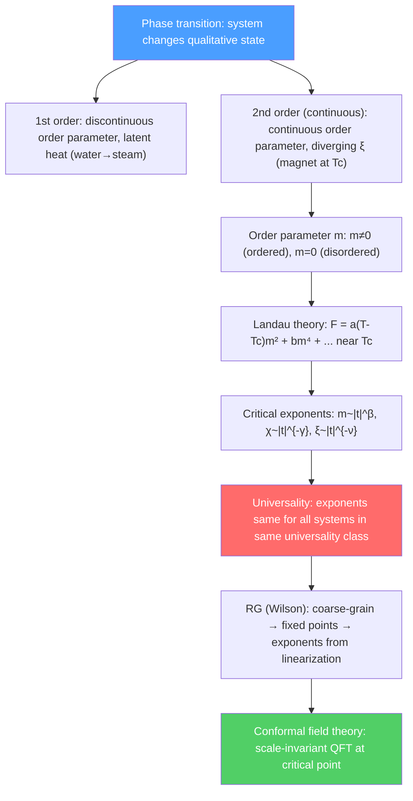

# 🌡️ Phase Transitions and Critical Phenomena

> [!abstract] TL;DR
> Phase transitions occur when a system changes abruptly (first order) or continuously (second order/continuous) between qualitatively different states. Near a continuous transition, fluctuations diverge and all details become irrelevant — only a few features (dimension, symmetry of order parameter) determine universal critical exponents ($\alpha, \beta, \gamma, \delta, \nu, \eta$). Landau's mean-field theory provides the conceptual framework; Wilson's renormalization group (Nobel 1982) explains universality and computes exponents via the $\epsilon$-expansion. At the critical point, scale invariance is enhanced to conformal symmetry — the realm of conformal field theory.

## Intuition — analogy FIRST

Approach the critical point of water ($T_c = 374°C$, $P_c = 218$ atm) and something remarkable happens: the distinction between liquid and gas disappears. Large density fluctuations occur on all length scales simultaneously — this is critical opalescence (the fluid appears milky because it scatters light on all scales). Near the critical point, a magnet approaching its Curie temperature shows similar behavior: domains of all sizes appear, fluctuating wildly.

The profound discovery: water near its critical point and a magnet near its Curie temperature have exactly the same critical exponents — despite being completely different systems at the microscopic level. This universality is what the renormalization group explains: near the critical point, the microscopic details "wash out" under repeated coarse-graining, and only the symmetry and dimensionality survive to determine the universal behavior.

---

## How It Works

---

## Key Concepts / Details

### Undergraduate Level

**First vs second order transitions:**
- **First order:** Order parameter jumps discontinuously at $T_c$. Latent heat. Example: water-steam, ice-water. Co-existence of phases at $T_c$.
- **Second order (continuous):** Order parameter goes to zero continuously. No latent heat. Correlation length $\xi \to \infty$. Examples: ferromagnet at Curie temperature, liquid-gas at critical point, superconductor at $T_c$ (in zero field).

**Order parameter:** A quantity that is nonzero in the ordered phase and zero in the disordered phase:
| System | Order parameter |
|--------|----------------|
| Ferromagnet | Magnetization $\vec{m}$ |
| Liquid-gas | Density difference $\rho_l - \rho_g$ |
| Superconductor | Condensate $\langle\psi\rangle = |\psi|e^{i\theta}$ |
| Nematic LC | Orientational tensor $Q_{ij}$ |

**Spontaneous symmetry breaking:** In the ordered phase, the system chooses a particular ground state (a particular direction of $\vec{m}$) that does not respect the full symmetry of the Hamiltonian. The symmetry is broken spontaneously.

**Correlation length:** $\xi$ = length scale over which fluctuations are correlated. $\xi \to \infty$ at $T_c$ (second order). This divergence is the reason for universal behavior — all length scales contribute equally, washing out microscopic details.

**Landau theory (phenomenological mean-field theory):** Expand the free energy in powers of the order parameter $m$ near $T_c$:
$$F(T,m) = F_0 + a(T-T_c)m^2 + bm^4 + cm^6 + \ldots \quad (b > 0)$$

Minimizing $\partial F/\partial m = 0$:
- For $T > T_c$: $m = 0$ (disordered)
- For $T < T_c$: $m = \pm\sqrt{a(T_c-T)/2b} \propto |t|^{1/2}$ where $t = (T-T_c)/T_c$

This gives mean-field critical exponent $\beta = 1/2$.

**Critical exponents:** Define reduced temperature $t = (T-T_c)/T_c$. Near $T_c$:

| Exponent | Definition | Mean-field | 3D Ising | 3D XY |
|----------|-----------|-----------|---------|------|
| $\alpha$ | $C \sim |t|^{-\alpha}$ (specific heat) | $0$ (jump) | $0.110$ | $-0.013$ |
| $\beta$ | $m \sim |t|^\beta$ (order param., $t<0$) | $1/2$ | $0.326$ | $0.348$ |
| $\gamma$ | $\chi \sim |t|^{-\gamma}$ (susceptibility) | $1$ | $1.237$ | $1.317$ |
| $\delta$ | $m \sim h^{1/\delta}$ (at $T_c$, $t=0$) | $3$ | $4.79$ | $4.78$ |
| $\nu$ | $\xi \sim |t|^{-\nu}$ (correlation length) | $1/2$ | $0.630$ | $0.672$ |
| $\eta$ | $G(r) \sim r^{-(d-2+\eta)}$ (at $T_c$) | $0$ | $0.036$ | $0.038$ |

**Scaling laws:** Only two exponents are independent; the others follow from scaling relations:
$$\alpha + 2\beta + \gamma = 2 \quad \text{(Rushbrooke)}$$
$$\gamma = \beta(\delta - 1) \quad \text{(Widom)}$$
$$\nu(2-\eta) = \gamma \quad \text{(Fisher)}$$
$$d\nu = 2 - \alpha \quad \text{(hyperscaling, where }d\text{ is dimension)}$$

**Universality classes:** All systems with the same ($d$, order parameter symmetry) have the same critical exponents:
- Ising universality class: scalar order parameter ($\mathbb{Z}_2$ symmetry) in $d=3$ — magnets, liquid-gas
- XY universality class: 2D vector order parameter — superfluid He-4, easy-plane magnets
- Heisenberg: 3D vector — isotropic magnets

### Graduate Level

**Ising model:** Spins $s_i = \pm 1$ on a lattice with nearest-neighbor coupling:
$$H = -J\sum_{\langle ij\rangle}s_is_j - h\sum_i s_i$$

Exact solution exists in 2D (Onsager, 1944): $T_c = 2J/k_B\ln(1+\sqrt{2})$ for square lattice; $\beta = 1/8$, $\gamma = 7/4$, $\eta = 1/4$. No exact solution in 3D; exact exponents known from conformal bootstrap (2016).

**Mean-field theory validity:** Landau mean-field breaks down when fluctuations are important. The Ginzburg criterion says MFT is valid above $d_c^{upper} = 4$ dimensions. For $d < 4$, fluctuations are relevant; critical exponents differ from MF values.

**Renormalization group (Wilson, 1971):** Idea — repeatedly coarse-grain the system by a factor $b$ (integrate out short-wavelength fluctuations), rescale to original lattice spacing, and track how couplings change. The RG transformation $T_R = R_b(T)$ maps couplings to couplings.

**Fixed points:** A fixed point $T^* = R_b(T^*)$ describes a scale-invariant theory. Linearizing near $T^*$:
$$T - T^* = \sum_i c_i\vec{e}_i, \qquad R_b(T) - T^* = \sum_i c_i b^{y_i}\vec{e}_i$$

- $y_i > 0$: relevant perturbation (flows away from $T^*$) → controls phase transition
- $y_i < 0$: irrelevant (flows to $T^*$) → universality (doesn't affect critical exponents)
- $y_i = 0$: marginal (logarithmic corrections)

Critical exponents: $\nu = 1/y_T$, $\eta$ from anomalous dimension.

**$\epsilon$-expansion:** Work in $d = 4 - \epsilon$ dimensions. At $d = 4$, coupling $\lambda$ is marginal. For small $\epsilon$, the Wilson-Fisher fixed point is at $\lambda^* \sim \epsilon$, perturbatively accessible:
$$\nu = \frac{1}{2} + \frac{\epsilon}{12} + \frac{11\epsilon^2}{288} + \ldots$$

Setting $\epsilon = 1$ gives $\nu \approx 0.625$ for $d = 3$ — close to the 3D Ising value $0.630$.

**Conformal field theory (CFT):** At the critical point (scale invariant theory), the symmetry is enhanced from scale invariance to full conformal invariance (angle-preserving maps). In 2D, the conformal group is infinite-dimensional (Virasoro algebra). This enables exact determination of all critical exponents and correlation functions via the operator product expansion (OPE). In 3D, CFTs are constrained by the "conformal bootstrap" — imposing consistency of the OPE — giving precise values of critical exponents without any small parameter.

**Quantum phase transitions:** At $T=0$, phase transitions are driven by quantum fluctuations (not thermal) as a function of a non-thermal control parameter (pressure, magnetic field, doping). Near a quantum critical point (QCP), quantum and thermal fluctuations compete, producing a rich phase diagram with "quantum critical fan" and non-Fermi liquid behavior.

---

## Real-World Notes

- **Liquid helium:** He-4 undergoes a $\lambda$-transition to a superfluid at $T_\lambda = 2.17$ K. The specific heat has a characteristic $\lambda$-shape; this is a 3D XY transition (the XY model describes the phase of the superfluid order parameter). The exponent $\alpha = -0.013$ (weakly diverging specific heat) is confirmed to high precision by space shuttle experiment (Lipa et al. 2003).
- **Polymers and liquid crystals:** Isotropic-nematic transition in liquid crystals; coil-globule transition in polymers. Both described by field-theoretic RG.
- **High-energy physics:** The electroweak symmetry breaking ($\text{SU}(2)\times\text{U}(1) \to \text{U}(1)_{EM}$) is a phase transition of the Higgs field in the early universe. If first order, it could generate the matter-antimatter asymmetry (baryogenesis).
- **Machine learning:** The loss landscape of neural networks near the "jamming" transition or at the boundary between overparameterized and underparameterized regimes shows critical phenomena — power-law spectra, diverging susceptibility. Statistical physics concepts are increasingly applied to deep learning.

---

## Common Pitfalls

- **Mean-field theory is qualitatively right but quantitatively wrong** in $d < 4$. It correctly predicts a phase transition but gives wrong exponents. Do not use MFT exponents for real 3D systems without checking.
- **"Second order" ≠ "continuous."** The latter is the modern preferred term. "Second order" refers to the classification by which derivative of the free energy is discontinuous — can be confusing.
- **Universality classes are determined by symmetry, not microscopic details.** A magnet and a binary liquid mixture have the same exponents if they have the same ($d$, order parameter symmetry). The specific Hamiltonian does not matter for critical exponents.
- **$\xi \to \infty$ at $T_c$ means the correlation length, not the system size.** In a finite system, $\xi$ is bounded by the system size; finite-size scaling must be used to extract $T_c$ and exponents from simulations.

---

## Related Concepts
- [[Superconductivity]] — GL theory is Landau theory with complex order parameter; $T_c$ is a continuous phase transition
- [[Crystal_Structure_and_Band_Theory]] — Topological phase transitions as a new type (no local order parameter; classified by topological invariants)
- [[Intro_to_Quantum_Field_Theory]] — CFT is a scale-invariant QFT; Euclidean QFT = classical stat mech partition function
- [[Many_Body_Quantum_Systems]] — Quantum phase transitions (Hubbard model, quantum Ising model)
- [[_MOC_Condensed_Matter|↑ Section MOC]]

---

## Review Questions

1. **(Undergraduate)** Using Landau theory for a ferromagnet, find the magnetization $m(T)$ just below $T_c$ (show $m \propto |T-T_c|^{1/2}$), the susceptibility $\chi = \partial m/\partial h|_{h=0}$ (show $\chi \propto |T-T_c|^{-1}$), and identify the mean-field critical exponents $\beta$ and $\gamma$.
2. **(Undergraduate)** State the scaling hypothesis for the free energy $F(t,h) = b^{-d}F(b^{y_t}t, b^{y_h}h)$. Derive the scaling relations $\alpha + 2\beta + \gamma = 2$ (Rushbrooke) and $\gamma = \nu(2-\eta)$ (Fisher).
3. **(Graduate)** Outline Wilson's RG for the $\phi^4$ theory near $d = 4$. Write the beta function $\beta(\lambda) = -\epsilon\lambda + \frac{3\lambda^2}{16\pi^2}$. Find the Wilson-Fisher fixed point $\lambda^*$ and the critical exponent $\nu$ to order $\epsilon$.

---

## Sources
- Goldenfeld, *Lectures on Phase Transitions and the Renormalization Group* (best introductory RG text)
- Cardy, *Scaling and Renormalization in Statistical Physics* (compact, rigorous)
- Wilson & Kogut, "The renormalization group and the ε expansion," *Phys. Rep.* 12, 75 (1974) (original RG paper)
- Sachdev, *Quantum Phase Transitions* (quantum criticality, comprehensive)
- Poland, Rychkov & Vichi, "The conformal bootstrap," *Rev. Mod. Phys.* 91, 015002 (2019)

#physics #condensed-matter #phase-transitions #critical-phenomena #Landau-theory #universality #renormalization-group #Ising-model #CFT
