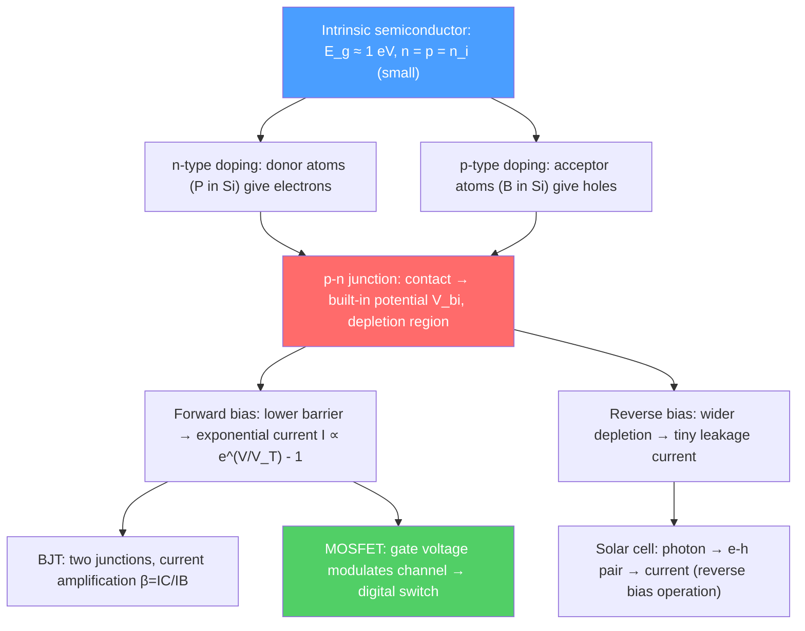

# 💡 Semiconductors and Devices

> [!abstract] TL;DR
> Semiconductors — materials with a small band gap ($0.1$–$3$ eV) — can be tuned from insulating to conducting by doping, temperature, or electric fields. The p-n junction (a donor-acceptor interface) is the fundamental building block of all modern electronics: it rectifies current, amplifies signals (transistors), converts light to electricity (solar cells), and generates light (LEDs). At PhD level, heterostructures, 2D electron gases, quantum wells, and spintronics push semiconductor physics to quantum extremes that underpin the next generation of computing.

## Intuition — analogy FIRST

Imagine a water tank divided by a membrane that can pump water one way but not the other — a valve. The p-n junction is the electronic valve: electrons flow easily in one direction (forward bias) but are blocked in the other (reverse bias). Stack two such junctions and you have a transistor — a valve controlled by a third input. Billions of these transistors on a chip the size of a fingernail, switching at gigahertz frequencies — that is modern electronics, all built on this one quantum mechanical insight.

---

## How It Works

---

## Key Concepts / Details

### Secondary Level

**Intrinsic semiconductor:** Pure material (e.g., Si, Ge) with equal numbers of electrons ($n$) and holes ($p$): $n = p = n_i$. At 300 K, $n_i(Si) \approx 1.5\times10^{10}$ cm$^{-3}$ — very few compared to copper ($n \approx 8\times10^{22}$ cm$^{-3}$).

**Doping:** Adding small amounts of impurities to control carrier concentration:
- **n-type (donor):** Phosphorus (P, group V) in Si donates one extra electron. $n \gg p$.
- **p-type (acceptor):** Boron (B, group III) in Si needs one electron — creates a hole. $p \gg n$.

**p-n junction:** Bring n-type and p-type Si into contact. Electrons diffuse from n to p, holes from p to n — creating a **depletion region** with no free carriers and a **built-in electric field** $V_{bi} \approx 0.6$–$0.7$ V for Si.

**Diode I-V curve (Shockley equation):**
$$I = I_0\!\left(e^{V/V_T} - 1\right), \qquad V_T = k_BT/e \approx 26\text{ mV at 300 K}$$

Forward bias ($V > 0$): current grows exponentially. Reverse bias ($V < 0$): current saturates at $-I_0$ (very small).

### Undergraduate Level

**Carrier concentration:** At temperature $T$ with Fermi level $E_F$:
$$n = N_C\,e^{-(E_C-E_F)/k_BT}, \quad p = N_V\,e^{-(E_F-E_V)/k_BT}$$

Mass action law: $np = n_i^2 = N_C N_V e^{-E_g/k_BT}$. Effective densities of states: $N_C = 2(2\pi m_e^* k_BT/h^2)^{3/2}$, similarly $N_V$.

**Depletion approximation:** In the depletion region, assume no mobile carriers. Poisson equation $d^2V/dx^2 = eN_D/\epsilon$ (n-side) gives parabolic potential profile. Depletion widths:
$$x_n = \sqrt{\frac{2\epsilon V_{bi}}{e}\frac{N_A}{N_D(N_A+N_D)}}, \quad x_p = \sqrt{\frac{2\epsilon V_{bi}}{e}\frac{N_D}{N_A(N_A+N_D)}}$$

**Bipolar junction transistor (BJT):** Two back-to-back p-n junctions (NPN or PNP). Emitter-base forward biased; collector-base reverse biased. A small base current $I_B$ controls a large collector current $I_C = \beta I_B$ ($\beta \sim 100$–$300$). BJTs are analog amplifiers and are still used in RF applications and power electronics.

**MOSFET (Metal-Oxide-Semiconductor Field-Effect Transistor):** A gate voltage $V_G$ across a thin oxide layer ($\sim$nm) controls the carrier density in a channel. Above the threshold voltage $V_T$: channel forms, source-to-drain current flows. The dominant transistor type in digital ICs.

NMOS transistor:
- Off ($V_{GS} < V_T$): no channel, $I_{DS} \approx 0$ (logic "0")
- On ($V_{GS} > V_T$): channel forms, $I_{DS}$ flows (logic "1")
- Current: $I_{DS} = \mu_n C_{ox}(W/L)(V_{GS}-V_T-V_{DS}/2)V_{DS}$ (linear) → $= \mu_n C_{ox}(W/2L)(V_{GS}-V_T)^2$ (saturation)

**Photodetectors and LEDs:** In reverse-biased p-n junction, photons with $h\nu > E_g$ create electron-hole pairs that are swept apart by the depletion field — photocurrent. In forward bias (LED), electrons and holes recombine radiatively, emitting photons of energy $\approx E_g$.

**Solar cells and Shockley-Queisser limit:** A solar cell is a p-n junction illuminated by sunlight. The photocurrent $I_{ph}$ is subtracted from the dark diode current. Theoretical maximum efficiency (single junction, AM1.5 spectrum):
$$\eta_{SQ} \approx 33\%\quad \text{(at } E_g \approx 1.1\text{ eV, close to Si at 1.12 eV)}$$

This Shockley-Queisser (SQ) limit arises from thermalization losses (photons with $h\nu > E_g$ lose excess energy as heat) and below-gap losses (photons with $h\nu < E_g$ not absorbed).

### Graduate Level

**Heterostructures and 2D electron gas (2DEG):** At a GaAs/AlGaAs interface, conduction band alignment creates a triangular quantum well in which electrons are spatially confined to 2D. The 2DEG has high mobility ($\mu > 10^7$ cm²/Vs at low $T$) due to spatial separation from ionized donors. The integer and fractional quantum Hall effects (IQHE, FQHE) were both discovered in 2DEGs.

**Quantum wells:** A thin layer of small-gap material (e.g., GaAs, $E_g = 1.42$ eV) between large-gap barriers (AlGaAs, $E_g = 2.16$ eV). The electron is confined in 1D; energy levels are quantized: $E_n = E_{c,well} + \hbar^2\pi^2n^2/(2m^*L^2)$. Quantum well lasers (edge-emitting, VCSEL) exploit sharp DOS at each subband edge for low-threshold lasing.

**Quantum dots:** 3D confinement → fully discrete energy levels ("artificial atoms"). Tunable emission wavelength via size control. Applications: QLED displays, biological labeling, single-photon sources for quantum cryptography.

**Spintronics:** Exploiting electron spin (in addition to charge) for information processing. Key effects:
- **Giant magnetoresistance (GMR):** Resistance of magnetic multilayer (Fe/Cr/Fe) depends strongly on relative magnetic orientation — Nobel 2007 (Fert, Grünberg). Basis of hard drive read heads.
- **Tunnel magnetoresistance (TMR):** Spin-polarized tunneling through an insulating barrier between ferromagnets; ratio $>600\%$ at room temperature.
- **Spin-orbit torque (SOT):** Current in heavy metal (Pt, Ta) generates spin current via spin Hall effect; torques adjacent magnetic layer — key mechanism for next-gen magnetic memory (SOT-MRAM).

**Moore's law limits:** Transistor gate lengths have scaled to $\sim 3$ nm (TSMC 3nm process, 2022). Below $\sim 5$ nm, quantum effects (tunneling leakage, quantum confinement) dominate. Physical limitations: gate oxide tunneling, source-drain tunneling, power density. Alternative directions: gate-all-around (GAA) nanowire transistors, 2D material (MoS$_2$) channels, carbon nanotube transistors.

---

## Real-World Notes

- **Global semiconductor market:** $\sim \$600$ billion/year. The smartphone in your pocket contains $\sim 15$ billion transistors (A15 Bionic, 5 nm node) and dozens of different semiconductor devices.
- **III-V semiconductors:** GaAs, InP, GaN used in high-frequency electronics (RF amplifiers, 5G), high-brightness LEDs, and laser diodes (InGaAs at 1550 nm for fiber optics).
- **Silicon carbide (SiC) and gallium nitride (GaN) power devices:** Wide-gap semiconductors for high-voltage, high-temperature applications. SiC MOSFETs in electric vehicle inverters.
- **Photovoltaics:** Multi-junction solar cells (GaInP/GaAs/Ge) achieve $\eta > 40\%$ by stacking cells optimized for different spectral bands. Perovskite-Si tandems are approaching SQ efficiency with low-cost materials.

---

## Common Pitfalls

- **Holes are not protons.** Holes are the absence of an electron in the valence band — a positively charged quasi-particle with positive effective mass $m_h^*$. Their properties (effective mass, mobility) differ from electrons.
- **Depletion region has no free carriers — not no carriers.** Ionized donors/acceptors remain as fixed charges; the depletion approximation treats mobile carriers as zero.
- **MOSFET threshold voltage depends on doping and oxide.** $V_T$ shifts with oxide charges, interface states, and body bias — central to device reliability.
- **Shockley-Queisser is a thermodynamic limit, not an engineering constraint.** Multiple exciton generation, hot carrier extraction, and tandem cells can approach or exceed SQ for a given junction.

---

## Related Concepts
- [[Crystal_Structure_and_Band_Theory]] — Band gap, effective mass, and Fermi level placement determine semiconductor physics
- [[Superconductivity]] — Superconductor-semiconductor heterostructures for Majorana qubits
- [[Many_Body_Quantum_Systems]] — DFT band calculations underlie device simulations; 2DEG many-body effects (FQHE)
- [[Phase_Transitions_and_Critical_Phenomena]] — Metal-insulator transitions (Mott) in strongly correlated semiconductor heterostructures
- [[_MOC_Condensed_Matter|↑ Section MOC]]

---

## Review Questions

1. **(Secondary/Undergraduate)** A silicon p-n junction has $N_D = 10^{16}$ cm$^{-3}$ (n-side) and $N_A = 10^{17}$ cm$^{-3}$ (p-side). Calculate the built-in potential $V_{bi}$ at 300 K, given $n_i = 1.5\times10^{10}$ cm$^{-3}$. Draw the band diagram under (a) zero bias, (b) 0.5 V forward bias, (c) $-5$ V reverse bias.
2. **(Undergraduate)** Derive the Shockley ideal diode equation from minority carrier diffusion equations. What are the assumptions, and at what forward voltage does the assumption of low injection fail?
3. **(Graduate)** Explain the origin of the 2DEG at the GaAs/AlGaAs interface. Why does modulation doping give higher carrier mobility than bulk doping at the same carrier density? How does this enable observation of the integer quantum Hall effect?

---

## Sources
- Sze & Ng, *Physics of Semiconductor Devices*, 3rd ed. (comprehensive device physics reference)
- Kittel, *Introduction to Solid State Physics*, Ch. 8 (semiconductor crystals)
- Datta, *Electronic Transport in Mesoscopic Systems* (quantum transport, 2DEG)
- Marder, *Condensed Matter Physics*, Ch. 16–17 (semiconductor devices, heterostructures)
- Shockley & Queisser, "Detailed Balance Limit of Efficiency of p-n Junction Solar Cells," *J. Appl. Phys.* 32, 510 (1961)

#physics #condensed-matter #semiconductors #p-n-junction #MOSFET #transistor #heterostructures #spintronics #solar-cells
