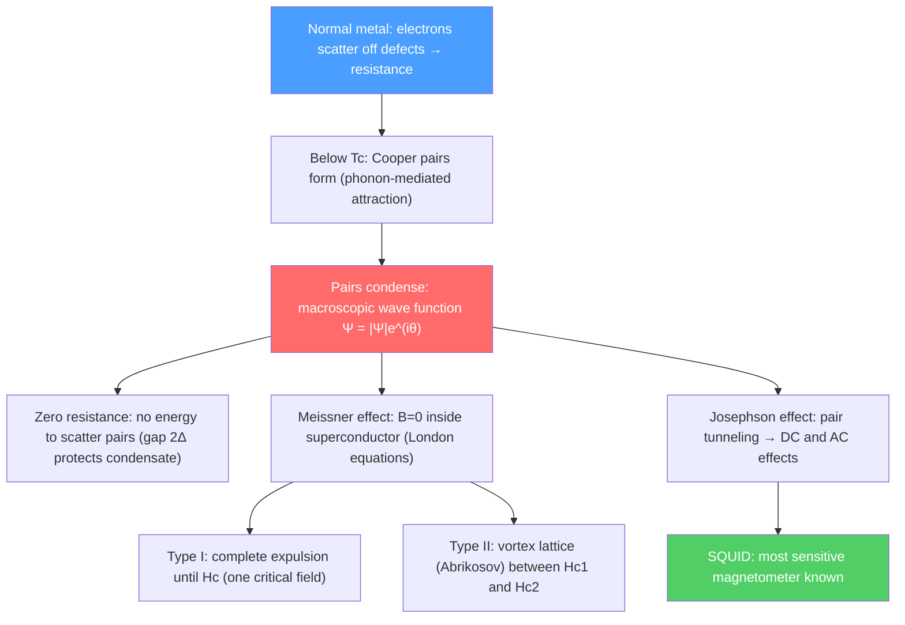

# 🌡️ Superconductivity

> [!abstract] TL;DR
> Below a critical temperature $T_c$, certain materials exhibit zero electrical resistance and perfect diamagnetism (Meissner effect). BCS theory (1957) explains this through phonon-mediated Cooper pairing of electrons: pairs condense into a macroscopic quantum state with an energy gap $2\Delta$ in the quasiparticle spectrum. The Josephson effect (tunneling of Cooper pairs between superconductors) enables sensitive quantum instruments. At PhD level, Ginzburg-Landau theory describes Type I vs II phenomenology; high-$T_c$ cuprates (undescribed by BCS) and topological superconductors are frontier research.

## Intuition — analogy FIRST

Imagine soldiers marching in lockstep: individually, each might stumble on obstacles (lattice defects), but when synchronized, the wave of marching passes through undisturbed. Cooper pairs are like two soldiers synchronized by sound waves (phonons) — moving in perfect concert, they are immune to the scattering that causes resistance in normal metals. Below $T_c$, all pairs "march in lockstep" through a macroscopic quantum wave function — the superconducting condensate.

The Meissner effect is even stranger: a superconductor actively expels magnetic fields, making a magnet float above it. This is not just zero resistance (which would also trap a field); it is perfect diamagnetism, requiring the superconductor to set up currents that precisely cancel any applied field.

---

## How It Works

---

## Key Concepts / Details

### Secondary Level

**Zero resistance:** Below $T_c$, resistance drops suddenly to zero — persistent currents flow without any driving voltage. Measured in rings as currents lasting years without measurable decay.

| Material | $T_c$ (K) |
|---------|---------|
| Mercury (Hg) | 4.2 |
| Niobium (Nb) | 9.3 |
| MgB$_2$ | 39 |
| YBCO (cuprate) | 92 |
| HgBaCaCuO | 138 |
| H$_3$S at 200 GPa | 203 |

**Meissner effect:** A superconductor below $T_c$ expels all magnetic flux from its interior: $\vec{B} = 0$ inside. This is not just zero resistance (which would trap flux) — it is active flux expulsion, the hallmark of the superconducting state.

**Critical temperature and fields:** Above $T_c$ (thermal fluctuations break pairs) or above critical field $H_c$ (field energy exceeds condensate energy), superconductivity is destroyed.

### Undergraduate Level

**London equations:** Two phenomenological equations (1935) describing the electromagnetic response:
$$\frac{d\vec{J}_s}{dt} = \frac{n_se^2}{m}\vec{E} \quad \text{(London 1)}$$
$$\nabla\times\vec{J}_s = -\frac{n_se^2}{m}\vec{B} \quad \text{(London 2)}$$

From London 2: $\nabla^2\vec{B} = \vec{B}/\lambda_L^2$ where the London penetration depth $\lambda_L = \sqrt{m/\mu_0 n_se^2} \approx 50$–$500$ nm. Magnetic fields penetrate only a distance $\lambda_L$ into the superconductor — exponentially screened for $x > \lambda_L$.

**Type I vs Type II:**
- **Type I:** Single critical field $H_c$. Meissner state for $H < H_c$; normal above. Thermodynamic critical field $H_c(T) = H_c(0)[1-(T/T_c)^2]$.
- **Type II:** Two critical fields $H_{c1}$ and $H_{c2}$. Meissner state ($B=0$) for $H < H_{c1}$; mixed (vortex) state $H_{c1} < H < H_{c2}$; normal above $H_{c2}$. High-field applications (MRI magnets, LHC dipoles) use Type II.

**Flux quantization:** In a superconducting ring, magnetic flux is quantized:
$$\Phi = n\Phi_0, \qquad \Phi_0 = \frac{h}{2e} \approx 2.07\times10^{-15}\text{ Wb}$$

The factor $2e$ (twice the electron charge) reveals that the charge carriers are pairs (Cooper pairs) — a direct confirmation of BCS theory's central prediction.

**BCS theory (1957):** Bardeen, Cooper, and Schrieffer (Nobel 1972). Key ideas:

1. **Phonon-mediated attraction:** Two electrons near the Fermi surface can attract each other via virtual phonon exchange: $e^- \to e^- + \text{phonon} \to e^- + e^-$. The net interaction is attractive for electrons with opposite momenta and spin: $(\vec{k}, \uparrow)$ and $(-\vec{k}, \downarrow)$.

2. **Cooper problem:** Even an arbitrarily weak attractive interaction creates a bound state (Cooper pair) below the Fermi surface — the Fermi sea makes all bound states possible.

3. **BCS condensate:** All Cooper pairs condense into the same quantum state. The BCS ground state (at $T=0$):
$$|\Psi_{BCS}\rangle = \prod_{\vec{k}}(u_k + v_k\hat c^\dagger_{\vec{k}\uparrow}\hat c^\dagger_{-\vec{k}\downarrow})|0\rangle$$

4. **Energy gap:** Elementary excitations (Bogoliubov quasiparticles) require energy $\geq \Delta$ to break a pair. Gap equation:
$$\Delta = V_0\sum_{\vec{k}'}\frac{\Delta}{2E_{k'}} = V_0\sum_{\vec{k}'}\frac{\Delta}{2\sqrt{\xi_{k'}^2+\Delta^2}}$$

Solution: $\Delta(0) \approx 1.764\,k_BT_c$. At $T_c$, $\Delta \to 0$.

5. **Critical temperature:** $k_BT_c \approx 1.13\,\hbar\omega_D e^{-1/N(0)V_0}$ where $\omega_D$ is the Debye frequency, $N(0)$ is the DOS at Fermi level, and $V_0$ is the pairing interaction strength.

### Graduate Level

**Ginzburg-Landau theory:** Near $T_c$, write the free energy as a functional of the complex order parameter $\Psi = |\Psi|e^{i\theta}$:
$$F = F_n + \alpha|\Psi|^2 + \frac{\beta}{2}|\Psi|^4 + \frac{1}{2m^*}\left|\left(-i\hbar\nabla - 2e\vec{A}\right)\Psi\right|^2 + \frac{B^2}{2\mu_0}$$

where $\alpha \propto (T-T_c)$ changes sign at $T_c$. Minimizing gives GL equations. Two characteristic lengths emerge:
- **Coherence length:** $\xi(T) = \hbar/\sqrt{2m^*|\alpha|}$ — length over which $|\Psi|$ varies
- **Penetration depth:** $\lambda(T) = \sqrt{m^*/2\mu_0 e^{*2}|\Psi|^2}$ — length over which $\vec{B}$ penetrates

**GL parameter:** $\kappa = \lambda/\xi$. Type I: $\kappa < 1/\sqrt{2}$; Type II: $\kappa > 1/\sqrt{2}$ (Abrikosov, 1957).

**Abrikosov vortex lattice:** In Type II, quantized flux tubes (vortices, each carrying $\Phi_0 = h/2e$) arrange in a triangular lattice. Vortex core of radius $\xi$ is normal; circulating supercurrents decay over $\lambda$. Pinning vortices (at defects) allows high-current applications (MRI magnets carry 1000 A in NbTi wire with $H \sim 5$–$8$ T).

**Josephson effect:** Two superconductors separated by a thin insulator (tunnel junction). Cooper pairs tunnel coherently:
- **DC Josephson effect:** $I = I_c\sin\phi$ (no voltage across junction; $\phi$ = phase difference)
- **AC Josephson effect:** With voltage $V$, phase evolves: $d\phi/dt = 2eV/\hbar$, giving AC current at frequency $f = 2eV/h = V\times484$ MHz/µV
- **Voltage standard:** AC Josephson effect gives voltage-frequency relation with fundamental constants only: $V = nhf/2e$ (Josephson voltage standard, adopted in 1990).

**SQUID (Superconducting Quantum Interference Device):** Two Josephson junctions in parallel (DC SQUID). Interference between Cooper pair paths gives periodic $I_c(\Phi)$ with period $\Phi_0$. Sensitivity: $\delta\Phi \sim 10^{-6}\Phi_0/\sqrt{\text{Hz}}$ — sensitive to $\delta B \sim 10^{-15}$ T. Used in brain magnetoencephalography (MEG), LIGO magnetometer arrays, and dark matter searches.

**High-$T_c$ cuprates:** La$_2$CuO$_4$, YBa$_2$Cu$_3$O$_{7-\delta}$ (YBCO), BiSrCaCuO (Bi-2212): $T_c$ up to 138 K. Mechanism NOT explained by standard phonon-BCS theory. Key features: CuO$_2$ planes, $d_{x^2-y^2}$ gap symmetry (nodes in the gap), pseudogap phase above $T_c$, strange metal (linear-in-$T$ resistivity), competing orders. Leading candidates: spin fluctuation-mediated pairing, resonating valence bond (RVB) state. Still an open problem after 35 years.

**Topological superconductors:** Non-trivial topological invariant ($p$-wave pairing, time-reversal breaking, or proximity effect). Vortex cores host Majorana zero modes (non-Abelian anyons). Candidate systems: proximitized topological insulator surface, semiconductor-superconductor nanowires (InAs/Al). Building blocks for topological quantum computing.

---

## Real-World Notes

- **MRI scanners:** Superconducting NbTi or Nb$_3$Sn coils maintained at $4$ K with liquid helium generate $1.5$–$7$ T fields. The persistent current is set once and maintained indefinitely.
- **Particle accelerators (LHC):** 1232 NbTi dipole magnets at $1.9$ K generate $8.3$ T to bend 7 TeV protons around the 27 km ring.
- **Superconducting qubits:** Josephson junctions form the anharmonic oscillator at the heart of IBM, Google, and other superconducting quantum computers. The Josephson energy sets the qubit frequency ($\sim 5$–$8$ GHz); operating at $\sim 15$ mK (dilution refrigerator).
- **Room-temperature superconductivity:** Hydrogen-rich compounds (H$_3$S, LaH$_{10}$, carbonaceous sulfur hydride) show $T_c$ up to $287$ K under extreme pressure ($\sim 200$ GPa). Ambient-pressure room-temperature SC is the "holy grail" — several disputed claims remain unverified.

---

## Common Pitfalls

- **Meissner effect is not just zero resistance.** A perfect conductor would trap flux; a superconductor actively expels it. They are different states. Zero resistance $\subset$ superconductor; Meissner effect is what makes superconductors unique.
- **BCS energy gap $\Delta$ is in the quasiparticle spectrum, not at the Fermi level.** The DOS has a gap of $2\Delta$ centered at $E_F$; pairing occurs within $\hbar\omega_D$ of $E_F$ (only phonon-coupled electrons pair).
- **Flux quantization unit is $\Phi_0 = h/2e$, not $h/e$.** The $2e$ appears because Cooper pairs carry charge $2e$. Any measurement of flux quantization directly measures the charge of the charge carrier.
- **Type II is NOT "dirty Type I."** The classification is topological (related to $\kappa$) and is an intrinsic property of the material, not a result of impurities.

---

## Related Concepts
- [[Crystal_Structure_and_Band_Theory]] — Fermi surface structure determines pairing possibilities; phonon dispersion sets Debye frequency
- [[Many_Body_Quantum_Systems]] — Cooper pairs via second quantization; BCS ground state as a many-body variational state
- [[Phase_Transitions_and_Critical_Phenomena]] — GL theory is a Landau theory with complex order parameter; $T_c$ is a second-order phase transition
- [[Quantum_Harmonic_Oscillator]] — Josephson junction as quantum oscillator; qubit as anharmonic QHO
- [[Perturbation_Theory]] — BCS gap equation from variational mean-field theory; GL coefficients from microscopic BCS
- [[_MOC_Condensed_Matter|↑ Section MOC]]

---

## Review Questions

1. **(Secondary/Undergraduate)** Explain the Meissner effect and why it proves that the superconducting state is a distinct thermodynamic phase, not just a "perfect metal." What is the London penetration depth physically?
2. **(Undergraduate)** From the BCS gap equation, show that the critical temperature satisfies $k_BT_c \approx 1.13\hbar\omega_D e^{-1/N(0)V_0}$ in the weak-coupling limit. Why does $T_c$ depend exponentially on $-1/N(0)V_0$?
3. **(Graduate)** Describe the Ginzburg-Landau theory near $T_c$. Derive the two GL equations from the free energy functional. Show that the ratio $\kappa = \lambda/\xi$ determines the Type I/II crossover, and calculate the domain wall energy sign.

---

## Sources
- Tinkham, *Introduction to Superconductivity*, 2nd ed. (definitive graduate text)
- BCS, "Theory of Superconductivity," *Phys. Rev.* 108, 1175 (1957)
- Josephson, "Possible new effects in superconductive tunnelling," *Phys. Lett.* 1, 251 (1962)
- Anderson & Bednorz (Nobel lectures, 1987) — discovery of high-$T_c$ superconductivity
- Qi & Zhang, "Topological insulators and superconductors," *Rev. Mod. Phys.* 83, 1057 (2011)

#physics #condensed-matter #superconductivity #BCS-theory #Cooper-pairs #Meissner-effect #Josephson-effect #SQUID #high-Tc
